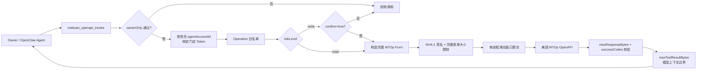
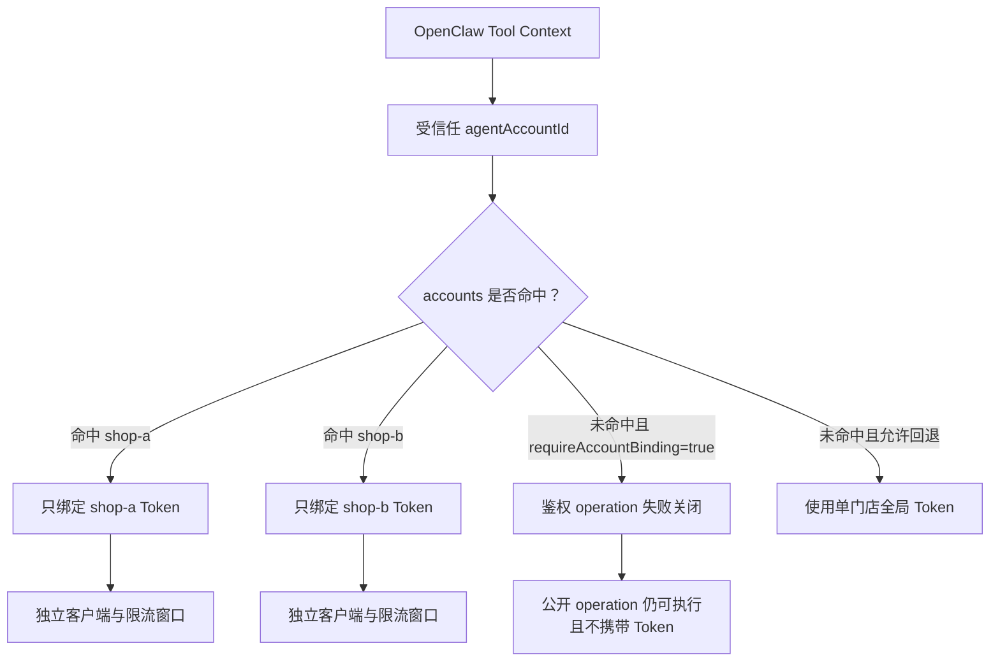
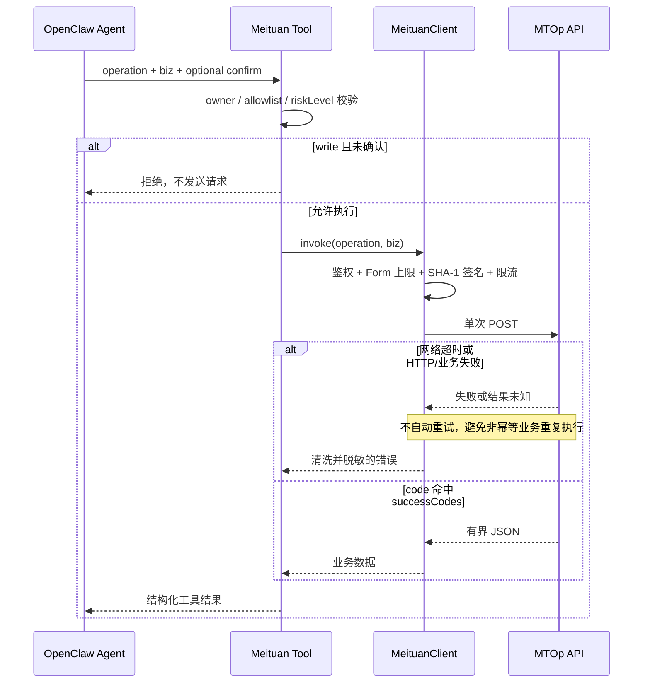

# @partme.ai/openclaw-meituan

OpenClaw 2026.7.1 的美团技术服务合作中心 MTOp OpenAPI capability。它不是聊天渠道，也不虚构订单、评价或核销接口；实际 API 路径和 `businessId` 必须来自你的美团应用后台与对应业务文档，并通过配置白名单开放给 Agent。

## 能力边界

- 按官方 `MtOpJavaSDK` 通用请求协议发送 `application/x-www-form-urlencoded` POST。
- 自动构造 `biz`、`businessId`、`developerId`、`timestamp`、`charset`、`version`、`appAuthToken` 和 SHA-1 `sign`。
- 只允许调用 `operations` 中显式配置的路径，不接受 Agent 自由输入 URL。
- 默认只允许消息 owner 调用，带本地每分钟限流、请求超时、请求/响应体上限。
- operation 必须区分 `read` / `write`；缺省按 `write` 处理，写操作每次都要求 `confirm=true`。
- MTOp 通用协议全部使用 POST，因此不自动重试，避免查询之外的核销、退款等操作被重复执行。
- 响应必须包含当前 operation 允许的标准成功码，默认只接受 `OP_SUCCESS`。
- 多门店凭据按 OpenClaw 运行时受信任的 `agentAccountId` 绑定，Agent Tool 参数不能选择或覆盖账号。
- `requiresAuth=false` 的 operation 永远不携带 `appAuthToken`；响应还要经过独立 Tool Result 上限后才进入模型上下文。
- 配置根必须是对象，所有安全布尔字段严格拒绝字符串/数字真值；响应超限会立即取消读取流。

## 运行架构



Agent 只能选择管理员预先配置的 operation 并提交 `biz`，不能控制 URL、`businessId`、
`developerId`、Token 或签名密钥。默认只允许官方 Origin；可信 HTTPS 代理必须通过
`allowCustomApiBaseUrl=true` 明确授权。

## 多门店凭据绑定



账号选择来自 OpenClaw 运行时，而不是模型生成的 `biz` 或 Tool 参数。多门店生产环境建议通过 `appAuthTokenEnv` 引用环境变量，并保持 `requireAccountBinding=true`；单门店兼容模式仍可使用顶层 `appAuthToken`。

## 调用与失败语义



## 安装

```bash
openclaw plugins install @partme.ai/openclaw-meituan
```

## 配置

```json
{
  "plugins": {
    "entries": {
      "meituan": {
        "enabled": true,
        "config": {
          "enabled": true,
          "developerId": "你的开发者ID",
          "signKey": "你的签名密钥",
          "appAuthToken": "门店授权令牌",
          "maxToolResultBytes": 262144,
          "operations": [
            {
              "name": "receipt_query",
              "description": "按日期查询验券记录",
              "apiPath": "/从美团开发者中心复制的真实路径",
              "businessId": 真实业务ID,
              "requiresAuth": true,
              "riskLevel": "read",
              "successCodes": ["OP_SUCCESS"]
            }
          ]
        }
      }
    }
  }
}
```

多门店配置示例：

```json
{
  "accounts": [
    { "accountId": "shop-a", "appAuthTokenEnv": "MEITUAN_SHOP_A_TOKEN" },
    { "accountId": "shop-b", "appAuthTokenEnv": "MEITUAN_SHOP_B_TOKEN" }
  ],
  "requireAccountBinding": true
}
```

凭据也可通过 `MEITUAN_DEVELOPER_ID`、`MEITUAN_SIGN_KEY`、`MEITUAN_APP_AUTH_TOKEN` 注入。配置中的值优先。

默认网关是 `https://api-open-cater.meituan.com`，网关版本为 `2`。除本机回环测试外，`apiBaseUrl` 必须使用 HTTPS。

### 关键配置

| 字段                    |    默认值 | 说明                                                |
| ----------------------- | --------: | --------------------------------------------------- |
| `ownerOnly`             |    `true` | 仅允许消息 Owner 使用工具                           |
| `maxRequestsPerMinute`  |      `60` | 单 Gateway 的真实 POST 请求上限                     |
| `requestTimeoutMs`      |   `10000` | 单次 POST 超时；失败不自动重试                      |
| `maxRequestBytes`       |   `65536` | `biz` JSON 和最终 URL-encoded Form 的硬上限         |
| `maxResponseBytes`      | `1048576` | 流式读取响应的硬上限                                |
| `maxToolResultBytes`    |  `262144` | 进入模型上下文与会话存储的 Tool Result 上限         |
| `allowCustomApiBaseUrl` |   `false` | 是否明确允许把签名请求发送到可信自定义 HTTPS Origin |
| `requireAccountBinding` |  自动判断 | 配置 `accounts` 后默认 true，未绑定账号失败关闭      |

operation 配置：

| 字段           |           默认值 | 说明                                                       |
| -------------- | ---------------: | ---------------------------------------------------------- |
| `requiresAuth` |           `true` | 调用前必须存在 `appAuthToken`                              |
| `riskLevel`    |          `write` | `write` 每次要求 `confirm=true`；只读接口应显式标为 `read` |
| `successCodes` | `["OP_SUCCESS"]` | 该业务文档声明的标准成功码白名单                           |

## Agent 工具

插件注册一个工具 `meituan_openapi_invoke`：

```json
{
  "operation": "receipt_query",
  "biz": {
    "date": "2026-07-16",
    "offset": 0
  }
}
```

写操作示例必须增加确认字段：

```json
{
  "operation": "refund",
  "biz": { "orderId": "真实订单号" },
  "confirm": true
}
```

`biz` 的字段必须以该 API 的官方文档为准。工具返回通过 `successCodes` 校验的美团 JSON 响应，但不会返回 `signKey` 或 `appAuthToken`。平台和网络错误会移除控制字符、替换真实凭据并限制长度。

## 上线前验证

1. 在美团合作中心确认应用已开通目标业务和接口权限。
2. 从后台/官方文档复制每个 API 的路径、`businessId` 和业务参数，不要猜测。
3. 完成门店授权并配置有效 `appAuthToken`；需要鉴权的接口缺少令牌会直接拒绝。
4. 先用只读接口验证 `OP_SUCCESS`、traceId、限流和超时，再开放核销/退款等写操作。
5. 多 Gateway 部署时在上游网关增加集中限流；插件内限流仅约束单进程。

本地安装态闭环：

```bash
pnpm --filter @partme.ai/openclaw-meituan test
pnpm --filter @partme.ai/openclaw-meituan test:coverage
pnpm --filter @partme.ai/openclaw-meituan typecheck
pnpm --filter @partme.ai/openclaw-meituan build
OPENCLAW_E2E_HOST_GATEWAY=1 pnpm test:e2e -- --plugins meituan --skip-browser
```

独立 E2E 从正式 tarball 安装插件，由真实 Agent 发起 `meituan_openapi_invoke`，本地 MTOp 夹具独立重算 SHA-1 并校验完整 Form、Header、白名单路径和单次 POST，最后确认门店 Tool Result 回到模型 transcript。

配置解析会拒绝顶层和 operation 中的未知字段，避免安全配置拼写错误后静默回退。
自定义远程 Origin 默认拒绝；回环地址仅用于本地 HTTP 表单契约测试。

公开的美团生态开放平台入口：<https://openapi.meituan.com/>。
