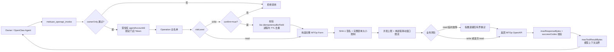
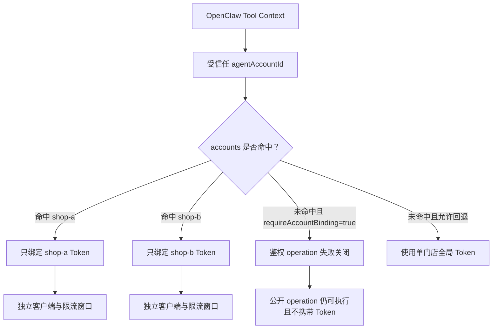
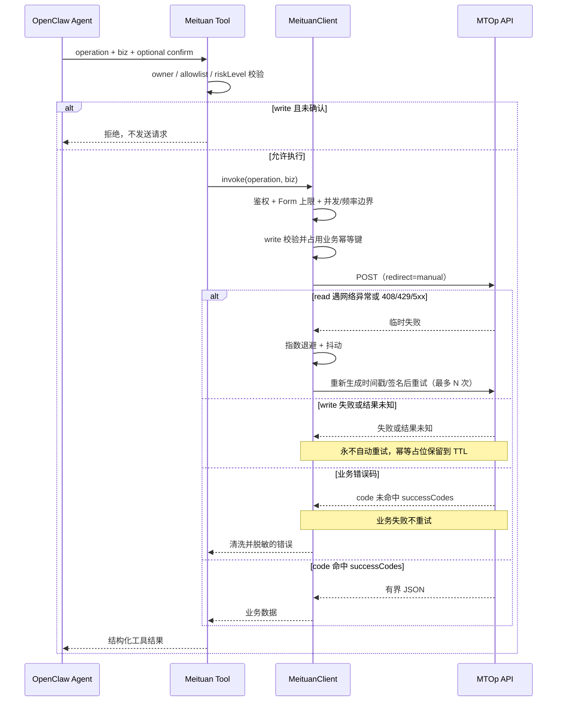

# @partme.ai/openclaw-meituan

<!-- README_STANDARD_START -->

> 统一阅读顺序：组件定位 → 架构 → 流程 → 边界 → 安装 → 配置 → 运维 → 深入阅读。
> 本区块以 npm 可稳定渲染的 text 图为主；适用时，更深入的 Mermaid 图保留在仓库 `doc/` 设计资料中。

[简体中文](./README.zh-CN.md) | [English](./README.md)

## 1. 组件定位

封装明确批准的美团技术服务接口。组件类型：**业务能力 Tool**。

| 项目 | 内容 |
|---|---|
| npm 包 | `@partme.ai/openclaw-meituan` |
| 当前版本 | `2026.7.1` |
| 插件 ID | `meituan` |
| Channel ID | — |
| OpenClaw | `>=2026.7.1` |
| 源码目录 | `extensions/meituan` |

## 2. 一眼看懂

```text
[Agent 美团业务请求]
          │
          ▼
┌──────────────────────────────────────────────────────────────┐
│ OpenClaw Gateway 内: meituan
│ 1. 校验操作白名单、确认与参数
│ 2. 签名并调用 MTOp OpenAPI
│ 3. 执行重试边界并清洗响应
└──────────────────────────────────────────────────────────────┘
          │
          ▼
[受控业务 API 结果]
```

## 3. 架构与核心流程

该组件把“协议/平台差异”限制在自身边界内，对 OpenClaw 暴露稳定的插件、Channel、Hook、Tool 或 Service 契约。

```text
Agent 美团业务请求
  │
  ▼
校验操作白名单、确认与参数
  │
  ▼
签名并调用 MTOp OpenAPI
  │
  ▼
执行重试边界并清洗响应
  │
  ▼
受控业务 API 结果

异常路径: 任一步失败：记录可诊断错误并按组件策略重试、拒绝或降级
```

## 4. 能力与边界

| 能力 | 说明 |
|---|---|
| 负责 | 封装明确批准的美团技术服务接口 |
| 不负责 | 不提供任意 MTOp 透传或业务授权替代 |
| 输入 | Agent 美团业务请求 |
| 输出 | 受控业务 API 结果 |
| 失败原则 | 默认失败应可观测；鉴权、边界校验和持久化失败不得伪装成功 |

## 5. 快速开始

```bash
openclaw plugins install "@partme.ai/openclaw-meituan@2026.7.1"
```

安装后先按最小权限配置，再启动 Gateway；生产环境应在隔离配置目录中完成连通性、权限和失败恢复验证。

## 6. 配置入口

| 配置层 | 路径 |
|---|---|
| 插件配置 | `plugins.entries.meituan.config` |
| Channel 配置 | 不适用 |
| 配置 Schema | `extensions/meituan/openclaw.plugin.json` |

配置字段、环境变量与完整示例继续保留在下方原有详细说明中。

## 7. 运维、安全与故障定位

- 先确认 OpenClaw 版本、插件版本、manifest ID 与配置键一致。
- 凭据使用环境变量或 SecretRef，不写入日志、仓库和示例明文。
- 通过 Gateway 日志、插件健康状态及外部依赖状态分层定位问题。
- 升级前备份状态数据；涉及游标、队列或索引时，必须验证重启恢复与重复投递语义。

## 8. 验证与深入阅读

```bash
pnpm --filter "@partme.ai/openclaw-meituan" typecheck
pnpm --filter "@partme.ai/openclaw-meituan" test
pnpm --filter "@partme.ai/openclaw-meituan" build
```

- [插件总体架构](../../doc/OpenClaw-Plugins-Architecture_CN.md)
- [统一插件结构规范](../../doc/OpenClaw-Plugins-Structure-Standard.md)

## 9. 原有详细说明

以下内容保留该组件原有的配置表、协议细节、示例和故障排查资料。

<!-- README_STANDARD_END -->


OpenClaw 2026.7.1 的美团技术服务合作中心 MTOp OpenAPI capability。它不是聊天渠道，也不虚构订单、评价或核销接口；实际 API 路径和 `businessId` 必须来自你的美团应用后台与对应业务文档，并通过配置白名单开放给 Agent。

## 能力边界

- 按官方 `MtOpJavaSDK` 通用请求协议发送 `application/x-www-form-urlencoded` POST。
- 自动构造 `biz`、`businessId`、`developerId`、`timestamp`、`charset`、`version`、`appAuthToken` 和 SHA-1 `sign`。
- 只允许调用 `operations` 中显式配置的路径，不接受 Agent 自由输入 URL。
- 默认只允许消息 owner 调用，带本地并发/每分钟限流、请求超时、请求/响应体上限。
- operation 必须区分 `read` / `write`；缺省按 `write` 处理，写操作每次都要求 `confirm=true`。
- MTOp 传输虽然全部使用 POST，但按业务风险处理：`read` 只对网络异常和 HTTP 408/429/5xx 有界重试；`write` 始终只发送一次。
- 写 operation 默认必须声明 `idempotencyBizField`；客户端按该顶层 `biz` 字段做有界 TTL 去重，结果未知时也保留占位。
- 响应必须包含当前 operation 允许的标准成功码，默认只接受 `OP_SUCCESS`。
- 多门店凭据按 OpenClaw 运行时受信任的 `agentAccountId` 绑定，Agent Tool 参数不能选择或覆盖账号。
- `requiresAuth=false` 的 operation 永远不携带 `appAuthToken`；响应还要经过独立 Tool Result 上限后才进入模型上下文。
- 配置根必须是对象，所有安全布尔字段严格拒绝字符串/数字真值；响应超限会立即取消读取流。
- 3xx 自动跳转关闭，签名表单和门店 Token 不会被 Fetch 自动转发到另一个 Origin。

## 运行架构

```text
Owner / OpenClaw Agent
          │ operation + biz + confirm?
          ▼
meituan_openapi_invoke
          │
          ├─ ownerOnly / Operation 白名单 / read-write 风险门
          ├─ 受信任 agentAccountId → 单一门店 Token
          └─ write 必须 confirm=true + 有效业务幂等值
                         │
                         ▼
             biz JSON + MTOp Form 大小上限
                         │
                         ▼
       并发槽 → SHA-1 签名 → 单账号限流/幂等窗口
                         │
              ┌──────────┴──────────┐
              │ read 临时故障重试   │ write 单次发送
              │ 最多 N 次、退避抖动 │ 结果未知仍占位
              └──────────┬──────────┘
                         ▼
               美团 MTOp OpenAPI
                         │
                         ▼
       响应流上限 → successCodes → 凭据/控制字符脱敏
                         │
                         ▼
              Tool Result 上限 → Agent
```



Agent 只能选择管理员预先配置的 operation 并提交 `biz`，不能控制 URL、`businessId`、
`developerId`、Token 或签名密钥。默认只允许官方 Origin；可信 HTTPS 代理必须通过
`allowCustomApiBaseUrl=true` 明确授权。

`confirm=true` 只是阻止模型误触写操作的技术门槛，不等同于业务审批、资金风控或人工复核。
退款、核销、发货等高风险 operation 仍应由上层审批工作流生成一次性授权，或根本不向通用 Agent 开放。

进程内幂等账本只解决同一 Gateway 进程、同一门店客户端的短期重复调用，不是分布式事务。
多 Gateway 或财务写入场景仍必须在业务服务/共享存储中使用唯一请求号、唯一索引或服务端幂等接口。

## 多门店凭据绑定



账号选择来自 OpenClaw 运行时，而不是模型生成的 `biz` 或 Tool 参数。多门店生产环境建议通过 `appAuthTokenEnv` 引用环境变量，并保持 `requireAccountBinding=true`；单门店兼容模式仍可使用顶层 `appAuthToken`。

## 调用与失败语义



## 安装

```bash
openclaw plugins install @partme.ai/openclaw-meituan
```

## 配置

```json
{
  "plugins": {
    "entries": {
      "meituan": {
        "enabled": true,
        "config": {
          "enabled": true,
          "developerId": "你的开发者ID",
          "signKey": "你的签名密钥",
          "appAuthToken": "门店授权令牌",
          "maxToolResultBytes": 262144,
          "operations": [
            {
              "name": "receipt_query",
              "description": "按日期查询验券记录",
              "apiPath": "/从美团开发者中心复制的真实路径",
              "businessId": 真实业务ID,
              "requiresAuth": true,
              "riskLevel": "read",
              "successCodes": ["OP_SUCCESS"]
            }
          ]
        }
      }
    }
  }
}
```

多门店配置示例：

```json
{
  "accounts": [
    { "accountId": "shop-a", "appAuthTokenEnv": "MEITUAN_SHOP_A_TOKEN" },
    { "accountId": "shop-b", "appAuthTokenEnv": "MEITUAN_SHOP_B_TOKEN" }
  ],
  "requireAccountBinding": true
}
```

凭据也可通过 `MEITUAN_DEVELOPER_ID`、`MEITUAN_SIGN_KEY`、`MEITUAN_APP_AUTH_TOKEN` 注入。配置中的值优先。

默认网关是 `https://api-open-cater.meituan.com`，网关版本为 `2`。除本机回环测试外，`apiBaseUrl` 必须使用 HTTPS。

### 关键配置

| 字段                    |    默认值 | 说明                                                |
| ----------------------- | --------: | --------------------------------------------------- |
| `ownerOnly`             |    `true` | 仅允许消息 Owner 使用工具                           |
| `maxRequestsPerMinute`  |      `60` | 单 Gateway 的真实 POST 请求上限                     |
| `maxConcurrentRequests` |       `8` | 单账号客户端同时占用 HTTP 连接的上限，超限快速失败  |
| `requestTimeoutMs`      |   `10000` | 每次真实 POST 尝试的超时                            |
| `readRetryMaxAttempts`  |       `2` | read 的总尝试次数；write 固定为 1                   |
| `retryInitialDelayMs`   |     `250` | read 重试初始退避                                   |
| `retryMaxDelayMs`       |    `2000` | read 重试最大退避                                   |
| `retryJitterRatio`      |     `0.2` | 退避双向抖动比例                                    |
| `idempotencyTtlMs`      | `86400000` | 写请求进程内幂等占位时长                            |
| `maxIdempotencyEntries` |   `10000` | 单账号客户端幂等占位容量，满时失败关闭              |
| `maxRequestBytes`       |   `65536` | `biz` JSON 和最终 URL-encoded Form 的硬上限         |
| `maxResponseBytes`      | `1048576` | 流式读取响应的硬上限                                |
| `maxToolResultBytes`    |  `262144` | 进入模型上下文与会话存储的 Tool Result 上限         |
| `allowCustomApiBaseUrl` |   `false` | 是否明确允许把签名请求发送到可信自定义 HTTPS Origin |
| `requireAccountBinding` |  自动判断 | 配置 `accounts` 后默认 true，未绑定账号失败关闭      |

operation 配置：

| 字段           |           默认值 | 说明                                                       |
| -------------- | ---------------: | ---------------------------------------------------------- |
| `requiresAuth` |           `true` | 调用前必须存在 `appAuthToken`                              |
| `riskLevel`    |          `write` | `write` 每次要求 `confirm=true`；只读接口应显式标为 `read` |
| `successCodes` | `["OP_SUCCESS"]` | 该业务文档声明的标准成功码白名单                           |
| `idempotencyBizField` | 无 | write 默认必填，例如 `orderId`；必须指向顶层 biz 字段 |

## Agent 工具

插件注册一个工具 `meituan_openapi_invoke`：

```json
{
  "operation": "receipt_query",
  "biz": {
    "date": "2026-07-16",
    "offset": 0
  }
}
```

写操作示例必须增加确认字段：

```json
{
  "operation": "refund",
  "biz": { "orderId": "真实订单号" },
  "confirm": true
}
```

对应 operation 配置还必须包含 `"idempotencyBizField": "orderId"`。若遗留接口确实没有稳定业务请求号，只有显式设置 `requireWriteIdempotency=false` 才能加载；这会降低防重复保护，不建议用于退款、核销等生产写操作。

`biz` 的字段必须以该 API 的官方文档为准。工具返回通过 `successCodes` 校验的美团 JSON 响应，但不会返回 `signKey` 或 `appAuthToken`。平台、代理和 Tool 异常会统一遮蔽 URL 用户信息、Authorization、DeveloperId、真实 Token/SignKey 及控制字符，并限制长度。

## 上线前验证

1. 在美团合作中心确认应用已开通目标业务和接口权限。
2. 从后台/官方文档复制每个 API 的路径、`businessId` 和业务参数，不要猜测。
3. 完成门店授权并配置有效 `appAuthToken`；需要鉴权的接口缺少令牌会直接拒绝。
4. 先用只读接口验证 `OP_SUCCESS`、traceId、限流和超时，再开放核销/退款等写操作。
5. 多 Gateway 部署时增加共享限流与共享幂等账本；插件内限流、状态和幂等占位都仅约束单进程。

本地安装态闭环：

```bash
pnpm --filter @partme.ai/openclaw-meituan test
pnpm --filter @partme.ai/openclaw-meituan test:coverage
pnpm --filter @partme.ai/openclaw-meituan typecheck
pnpm --filter @partme.ai/openclaw-meituan build
OPENCLAW_E2E_HOST_GATEWAY=1 pnpm test:e2e -- --plugins meituan --skip-browser
```

独立 E2E 从正式 tarball 安装插件，由真实 Agent 发起只读 `meituan_openapi_invoke`，本地 MTOp 夹具独立重算 SHA-1 并校验完整 Form、Header、白名单路径和成功路径单次 POST，最后确认门店 Tool Result 回到模型 transcript。只读故障重试、写操作不重试和幂等去重由单元契约测试覆盖。

配置解析会拒绝顶层和 operation 中的未知字段，避免安全配置拼写错误后静默回退。
自定义远程 Origin 默认拒绝；回环地址仅用于本地 HTTP 表单契约测试。

公开的美团生态开放平台入口：<https://openapi.meituan.com/>。
