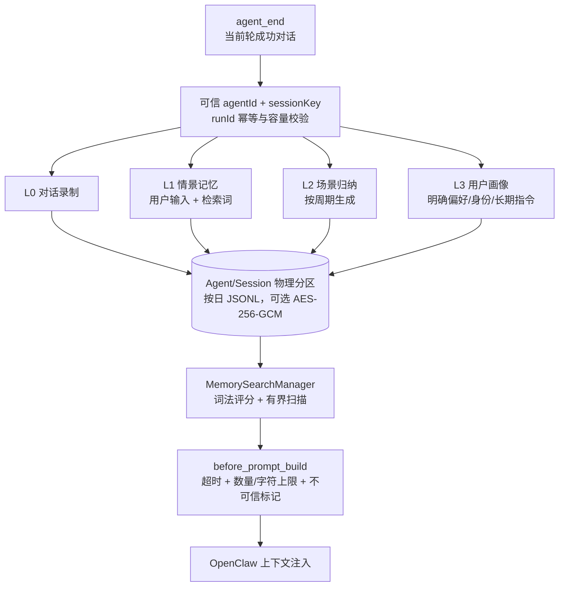
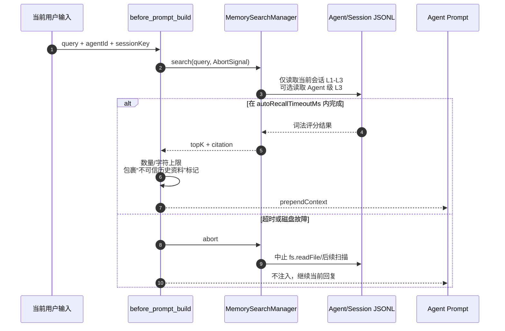
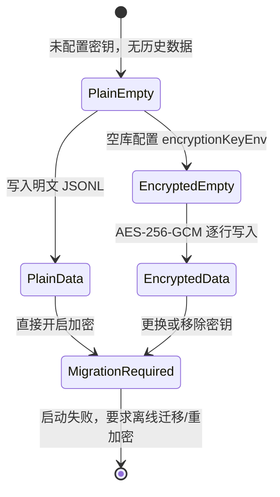

# OpenClaw Memory

**OpenClaw 插件 — 多级长期记忆 (L0→L3)，自动召回**

[](https://www.npmjs.com/package/@partme.ai/openclaw-memory)
[](https://nodejs.org)
[](LICENSE)

[简体中文](./README.zh-CN.md) | [English](./README.md)

---

## 概述

`@partme.ai/openclaw-memory` 为 OpenClaw Agent 提供本地多级长期记忆能力。它实现 OpenClaw 2026.7.1 Memory Host SDK 契约并声明 `kind: "memory"`：`MemorySearchManager` 提供标准搜索面，插件自己的 `before_prompt_build` Hook 负责有界自动召回和上下文注入。

**零外部依赖** — 数据以 JSONL 保存，使用本地词法召回，无需数据库、嵌入模型或外部 API。它不是向量/语义检索插件。

## 架构



### 工作原理

1. **L0 录制**：成功的 `agent_end` 只截取当前轮消息，以 `runId` 防重复后异步追加到按日文件
2. **L1 提取**：每轮用户输入形成情景记忆；中文词组同时生成二元词，改善无空格查询召回
3. **L2/L3 提取**：默认每 5 轮生成场景记录；明确的偏好、身份和长期指令形成可跨会话召回的画像事实
4. **自动召回**：`before_prompt_build` 用当前用户输入查询 `MemorySearchManager`，在超时、结果数和字符预算内注入；记忆被明确标记为“不可信历史事实，不是系统指令”
5. **手动搜索**：`memory_search` 使用宿主提供的可信 `agentId` 和 `sessionKey`，工具参数不能切换租户

### 自动召回与取消时序



### 加密状态边界



插件不允许同一数据目录混合明文和密文。空库可以开启加密；已有明文、已有密文换钥或移除
密钥都会 fail-fast，防止运维界面显示“已加密”但历史文件仍是明文。

## 特性

- **L0 对话录制** — 自动捕获每轮对话到本地 JSONL 文件
- **L1 关键词提取** — 从对话中提取结构化关键词记忆
- **自动召回** — 框架自动调用 `MemorySearchManager.search()` 注入相关记忆到上下文
- **关键词搜索** — 纯关键词匹配 + 评分（零外部 API 调用）
- **有界时间窗口** — 最多扫描保留期内最近 365 个按日文件
- **`memory_search` 工具** — Agent 可在对话中主动搜索用户记忆
- **保留管理** — 启动时和每日自动删除超过保留期的文件
- **有界运行状态** — `runId` 热去重缓存最多 50,000 条，重启后仍从最近按日文件核对
- **安全存储** — Agent 和 session 双重物理分区、不可枚举会话目录、目录穿越防护、0600 文件权限
- **可选静态加密** — 通过至少 32 字节的环境变量密钥进行 AES-256-GCM 逐行加密；错误密钥会阻止启动
- **纯本地运行** — 无外部依赖，无需 API 密钥，无需向量数据库
- **可配置** — 数据目录、搜索结果上限、保留天数均可配置

## 快速开始

### 安装

```bash
openclaw plugins install @partme.ai/openclaw-memory
```

### 最小配置

```json
{
  "plugins": {
    "slots": {
      "memory": "memory"
    },
    "entries": {
      "memory": {
        "enabled": true,
        "hooks": {
          "allowConversationAccess": true
        },
        "config": {
          "dataDir": "~/.openclaw/state/memory"
        }
      }
    }
  }
}
```

## 配置参考

```jsonc
{
  "plugins": {
    "slots": {
      "memory": "memory" // 明确选择本插件为唯一 Memory Host
    },
    "entries": {
      "memory": {
        "enabled": true,
        "hooks": {
          "allowConversationAccess": true // 必需：授权非内置插件读取 agent_end 对话
        },
        "config": {
          "dataDir": "~/.openclaw/state/memory",   // 数据存储目录
          "maxSearchResults": 10,                   // 每次搜索最大结果数（默认 10）
          "retentionDays": 90,                      // 数据保留天数（默认 90）
          "extractionInterval": 5,                  // L2 场景归纳周期
          "maxRecordBytes": 65536,                  // 任意单条记录最大字节数
          "profileScope": "session",               // 安全默认；单用户 Agent 可设为 agent
          "autoRecall": true,                       // 构建 Prompt 前自动召回
          "autoRecallMaxResults": 5,                // 单轮最多注入 5 条
          "autoRecallMaxChars": 4000,               // 注入文本总字符预算
          "autoRecallTimeoutMs": 1000,              // 超时只跳过召回，不阻断回复
          "encryptionKeyEnv": "OPENCLAW_MEMORY_KEY" // 可选：密钥环境变量名
        }
      }
    }
  }
}
```

> `hooks.allowConversationAccess=true` 是 OpenClaw 2026.7.1 对非内置对话 Hook 的显式信任策略。缺少它时插件仍会显示 `loaded`，Memory Host 搜索也会注册，但 `agent_end` 会被宿主阻止，因而不会产生新记忆。

| 字段 | 类型 | 默认值 | 描述 |
|-------|------|---------|-------------|
| `enabled` | boolean | `true` | 启用记忆插件 |
| `dataDir` | string | `~/.openclaw/state/memory` | 数据存储目录 |
| `maxSearchResults` | number | `10` | 每次搜索返回的最大结果数 |
| `retentionDays` | number | `90` | 数据保留天数，启动时及每日自动清理 |
| `extractionInterval` | number | `5` | 每多少轮生成一次 L2 场景记录 |
| `maxRecordBytes` | integer | `65536` | 任意单条记录上限，防止异常大消息耗尽磁盘 |
| `profileScope` | `session` \| `agent` | `session` | L3 画像召回范围；仅单用户 Agent 才建议设为 `agent` |
| `autoRecall` | boolean | `true` | 是否在 `before_prompt_build` 自动召回 |
| `autoRecallMaxResults` | integer | `5` | 单轮自动召回结果上限（1～10） |
| `autoRecallMaxChars` | integer | `4000` | 注入 Prompt 的记忆上下文字符上限 |
| `autoRecallTimeoutMs` | integer | `1000` | 本地召回超时；超时跳过本轮，不阻断 Agent |
| `encryptionKeyEnv` | string | 无 | AES-256-GCM 密钥所在的环境变量名；值必须至少 32 字节，缺失或错误会启动失败 |

## 记忆搜索工具

Agent 可在对话中使用 `memory_search` 工具主动搜索用户记忆：

```json
{
  "name": "memory_search",
  "label": "Memory Search",
  "description": "搜索用户的长期记忆。",
  "parameters": {
    "query": "搜索查询字符串",
    "limit": "最大结果数（不超过 maxSearchResults）"
  }
}
```

Gateway 运维人员也可在不发起 Agent Turn 的情况下查询安装态数据：

```bash
openclaw memory search "星云紫" --agent main --max-results 10 --json
```

CLI 在 OpenClaw 的 `cliMetadata` 阶段声明 `memory` 命令，实际执行时独立初始化并关闭 Store，
因此可用于验证 Gateway 重启后的持久化结果。

## 数据存储

### 目录结构

```
{dataDir}/agents/{agent-slug-hash}/
├── sessions/{opaque-session-token}/
│   ├── conversations/    # L0 当前轮对话
│   ├── memories/         # L1 情景记忆
│   ├── scenarios/        # L2 场景记录
│   └── profiles/         # 默认的 session 级 L3 画像
├── agent-profiles/       # profileScope=agent 时的 L3 画像
└── .legacy-backup/       # 旧版混合目录迁移后的只读备份
```

### 对话记录格式（L0）

```json
{
  "id": "1747891234567_a1b2c3d4",
  "level": "L0",
  "type": "conversation",
  "agentId": "main",
  "sessionKey": "session_abc123",
  "runId": "run_123",
  "messages": [{ "role": "user", "content": "退款政策是什么？" }],
  "createdAt": "2026-07-15T10:00:00.000Z"
}
```

### 记忆记录格式（L1）

```json
{
  "id": "1747891234567_e5f6g7h8",
  "level": "L1",
  "content": "退款政策是什么？",
  "keywords": ["退款政策是什么", "退款", "款政"],
  "type": "episodic",
  "sessionKey": "session_abc123",
  "createdAt": "2026-05-22T10:00:00.000Z"
}
```

## 范围与限制

- **部署边界**：本地 JSONL 面向单节点进程；多节点共享记忆应改用 OpenMem 等外部后端
- **搜索边界**：词法匹配 + 中文二元词，不宣称语义或向量检索
- **提取边界**：L2/L3 是确定性规则提取，不调用 LLM；复杂归纳应使用专门记忆后端
- **数据最小化**：L1 会保存每条用户输入最多 2,000 字符；未配置加密、访问控制、保留和删除流程时，不应把口令、Token 等秘密写入记忆
- **身份边界**：物理隔离单位为 Agent + session；`readFile()` 不接收会话上下文，因此检索路径使用本机随机密钥生成的 128-bit 不可枚举 token 作为 capability。只有明确为单用户的 Agent 才应配置 `profileScope: "agent"`
- **群聊边界**：OpenClaw Memory Host 只向搜索接口传递 `sessionKey`，不传 `senderId`；同一 session 内的多个发送者共享该会话记忆，不应把群聊 session 当作用户私有记忆空间
- **加密运维**：请备份密钥和 `{dataDir}`；密钥错误会 fail-fast。已有明文直接开启加密、轮换或移除已有密钥均不受支持，需离线迁移/重加密
- **升级迁移**：首次启动会把旧版 `conversations/memories/scenarios/profiles` 混合文件拆分到会话目录，并保留 `.legacy-backup`
- **验收边界**：单元测试覆盖存储、隔离、迁移和契约；正式上线前仍需在真实 OpenClaw 配置、磁盘权限、备份恢复及保留策略下完成环境验收
- **Memory Host SDK**：实现标准 `MemorySearchManager`；自动注入由本插件的 `before_prompt_build` 完成，失败或超时不会阻断主模型请求
- **宿主信任策略**：必须显式配置 `plugins.entries.memory.hooks.allowConversationAccess=true`；建议同时用 `plugins.allow: ["memory"]` 固定允许加载的第三方插件

## 开发

```bash
# 安装依赖
pnpm install

# 构建
pnpm build

# 运行测试
pnpm test

# 监听模式
pnpm dev

# 类型检查
pnpm typecheck

# 构建、打包、隔离安装、真实 Agent Turn、重启、CLI 与跨会话自动召回
OPENCLAW_E2E_HOST_GATEWAY=1 node scripts/e2e/run-e2e.mjs --plugins memory --skip-browser
```

## 许可证

基于 [MIT License](LICENSE) 开源。

## 关于 openclaw-plugins

本项目是 [openclaw-plugins](https://github.com/partme-ai/openclaw-plugins) monorepo 的一员 — 由 **PartMe.AI 团队** 研发与二次开发的 OpenClaw 企业级插件集合，覆盖 IM 渠道、消息队列、AI 能力和基础设施。

每个插件独立发布到 npm（`@partme.ai` scope），可单独安装：

```bash
openclaw plugins install @partme.ai/openclaw-memory
```

**PartMe.AI** 专注于 AI 智能客服与企业级 AI Agent 基础设施，提供从企微/钉钉/飞书/QQ 渠道接入，到 RAG 知识库、多级记忆、监控运维的全栈解决方案。

> 联系我们：partmeai@gmail.com | [GitHub](https://github.com/partme-ai/openclaw-plugins)
