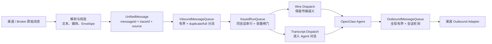
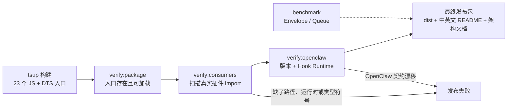
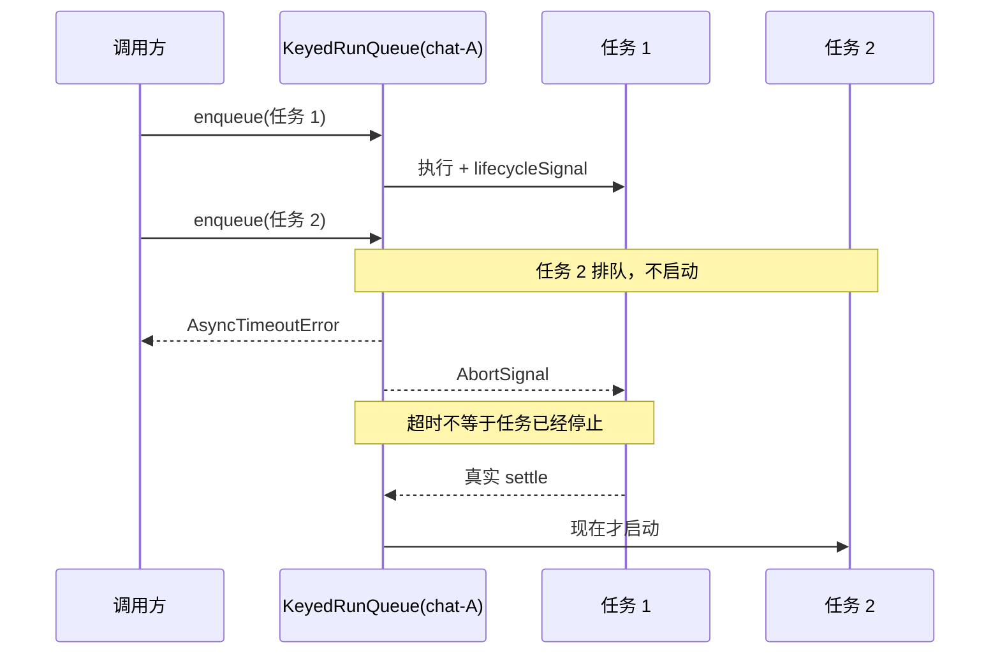

# OpenClaw Message SDK

<!-- README_STANDARD_START -->

> 统一阅读顺序：组件定位 → 架构 → 流程 → 边界 → 安装 → 配置 → 运维 → 深入阅读。
> 本区块以 npm 可稳定渲染的 text 图为主；适用时，更深入的 Mermaid 图保留在仓库 `doc/` 设计资料中。

[简体中文](./README.zh-CN.md) | [English](./README.md)

## 1. 组件定位

为 Wire 与 Transcript Channel 提供共享原语。组件类型：**共享消息 SDK**。

| 项目 | 内容 |
|---|---|
| npm 包 | `@partme.ai/openclaw-message-sdk` |
| 当前版本 | `2026.7.1` |
| 插件 ID | `message-sdk` |
| Channel ID | — |
| OpenClaw | `>=2026.7.1` |
| 源码目录 | `extensions/message-sdk` |

## 2. 一眼看懂

```text
[各 Channel 的原始消息与媒体]
          │
          ▼
┌──────────────────────────────────────────────────────────────┐
│ OpenClaw Gateway 内: message-sdk
│ 1. 转换为 UnifiedMessage / Envelope
│ 2. 应用队列、幂等与媒体边界
│ 3. 桥接 OpenClaw 入站和回复管线
└──────────────────────────────────────────────────────────────┘
          │
          ▼
[跨插件稳定消息契约]
```

## 3. 架构与核心流程

该组件把“协议/平台差异”限制在自身边界内，对 OpenClaw 暴露稳定的插件、Channel、Hook、Tool 或 Service 契约。

```text
各 Channel 的原始消息与媒体
  │
  ▼
转换为 UnifiedMessage / Envelope
  │
  ▼
应用队列、幂等与媒体边界
  │
  ▼
桥接 OpenClaw 入站和回复管线
  │
  ▼
跨插件稳定消息契约

异常路径: 任一步失败：记录可诊断错误并按组件策略重试、拒绝或降级
```

## 4. 能力与边界

| 能力 | 说明 |
|---|---|
| 负责 | 为 Wire 与 Transcript Channel 提供共享原语 |
| 不负责 | 不是可独立启用的运行时 Channel |
| 输入 | 各 Channel 的原始消息与媒体 |
| 输出 | 跨插件稳定消息契约 |
| 失败原则 | 默认失败应可观测；鉴权、边界校验和持久化失败不得伪装成功 |

## 5. 快速开始

```bash
npm install "@partme.ai/openclaw-message-sdk@2026.7.1"
```

安装后先按最小权限配置，再启动 Gateway；生产环境应在隔离配置目录中完成连通性、权限和失败恢复验证。

## 6. 配置入口

| 配置层 | 路径 |
|---|---|
| 插件配置 | 无运行时插件配置；由消费方作为 SDK 依赖引入 |
| Channel 配置 | 不适用 |
| 配置 Schema | `extensions/message-sdk/openclaw.plugin.json` |

配置字段、环境变量与完整示例继续保留在下方原有详细说明中。

## 7. 运维、安全与故障定位

- 先确认 OpenClaw 版本、插件版本、manifest ID 与配置键一致。
- 凭据使用环境变量或 SecretRef，不写入日志、仓库和示例明文。
- 通过 Gateway 日志、插件健康状态及外部依赖状态分层定位问题。
- 升级前备份状态数据；涉及游标、队列或索引时，必须验证重启恢复与重复投递语义。

## 8. 验证与深入阅读

```bash
pnpm --filter "@partme.ai/openclaw-message-sdk" typecheck
pnpm --filter "@partme.ai/openclaw-message-sdk" test
pnpm --filter "@partme.ai/openclaw-message-sdk" build
```

- [插件总体架构](../../doc/OpenClaw-Plugins-Architecture_CN.md)
- [统一插件结构规范](../../doc/OpenClaw-Plugins-Structure-Standard.md)

## 9. 原有详细说明

以下内容保留该组件原有的配置表、协议细节、示例和故障排查资料。

<!-- README_STANDARD_END -->


**统一消息格式 SDK — openclaw-plugins 全渠道互通的消息标准与公共工具库**

简体中文 | [English](./README.md)

## 简介

`@partme.ai/openclaw-message-sdk` 是 openclaw-plugins 生态中的基础设施库，提供：

- **统一消息体（UnifiedMessage）** — 所有 IM 渠道插件共用的消息结构，支持跨渠道路由
- **媒体解析引擎** — 从 Markdown/HTML/MEDIA 指令/裸露路径中提取图片和文件
- **HTTP 客户端** — 带超时和指数退避重试的轻量 HTTP 封装
- **文件工具** — MIME/扩展名映射、文件分类
- **AI 能力模块** — ASR 语音识别、OCR 文字识别、TTS 语音合成（按需引入）

SDK 的直接运行时依赖只有 `undici`；它作为 OpenClaw 插件运行时共享库，要求 `openclaw >= 2026.7.1` peer，`prom-client` 仅在指标能力启用时可选。纯设备端或异构系统应使用仓库顶层 `sdk/typescript`，不要把插件运行时包当成无 OpenClaw 依赖的通用协议包。TypeScript 消费者使用编译后的声明文件，并显式获取 Node 类型 peer。

### 核心设计原则

- **消息体不含二进制数据**，只包含文件 URL/路径引用
- **图片可选 base64** 内联（小图场景，<1MB）
- 内容类型支持 `text` / `markdown` / `mixed` 三种
- `traceId` 全链路追踪，贯穿消息生成 → 传输 → 投递
- 所有类型从主入口统一导入，也可按子路径按需导入
- 23 个公开运行时入口全部指向编译后的 `dist/*.js`，发布包不会携带或直接执行 `src/*.ts`

### 队列可靠性边界

- `InboundMessageQueue` 有界；`pushDetailed` 明确区分 `duplicate` 与 `full`，队列满不会提前占用幂等键。Wire 派发遇到满载会抛出容量错误，交给上游重试/反压，不会伪装成重复消息确认。
- 即时 `onPush` 处理失败时会同时回滚队列项和幂等预占，使相同消息可以重试。
- `OutboundMessageQueue` 按全部会话合计限制容量，通过 `onOverflow` 暴露溢出；无指定会话的 `pop()` 采用跨会话轮询，同时保持会话内 FIFO。
- `createKeyedRunQueue` 同 key 严格串行、跨 key 并行，并限制待处理任务总数和活跃 key 数。任务超时会触发取消信号，但只有底层任务真实结束后，同 key 下一项才会启动。
- 两种队列都是进程内缓冲，不替代持久化 Broker。

## 组件与消息流

字符图用于快速看清 SDK 与传输插件、OpenClaw 的职责边界；下方 Mermaid 保留完整可渲染消息流：

```text
┌────────────── 渠道插件 / Broker ──────────────┐
│ 连接 · 订阅 · 发布 · ACK/NACK · TLS/鉴权      │
└──────────────────────┬────────────────────────┘
                       ▼
┌────────────── openclaw-message-sdk ────────────┐
│ parse → UnifiedMessage → dedupe → keyed queue  │
│                 │                              │
│                 ├─ Wire Dispatch ──────────┐   │
│                 └─ Transcript Dispatch ────┤   │
│                                            ▼   │
│ reply → serialize / media guard → deliver 回调 │
└──────────────────────┬────────────────────────┘
                       ▼
              OpenClaw 2026.7.1 Agent

边界：SDK 不拥有 Broker 持久化、跨进程 exactly-once 或渠道凭据生命周期
```



SDK 统一消息结构和可复用的进程内机制，但不拥有 Broker ACK、持久化、跨进程幂等或渠道鉴权；这些可靠性边界仍由具体插件实现。

### 发布契约门禁

```text
23 个 package exports
        │
        ├─ verify:package ───→ JS/DTS 均存在且可 import
        ├─ verify:consumers ─→ 82 个生产源码 / 15 子路径 / 138 命名符号
        ├─ verify:openclaw ──→ OpenClaw >= 2026.7.1 + 5 个 Hook Runtime 符号
        └─ benchmark ────────→ Envelope / Queue 数量级退化保护
                                │
                                ▼
                     prepack / prepublishOnly
```



`verify:consumers` 不使用手工维护的符号清单，而是从其他插件的生产 TypeScript 源码提取实际 import；因此新增消费者或改用新子路径后，下一次打包会自动把它纳入契约。`benchmark` 是保守的本机/CI 微基准，不替代真实 Broker、媒体和 Agent 压测。

### 同会话超时为什么不能立即放行下一项



如果任务忽略 `AbortSignal` 并永久悬挂，该 key 会保持阻塞，但不会破坏会话内串行；监控可通过 `snapshot()`、`onWaitWarn`、`onError` 和 `onOverflow` 识别积压。插件任务应始终响应取消信号。

## 安装

```bash
npm install @partme.ai/openclaw-message-sdk
# or
pnpm add @partme.ai/openclaw-message-sdk
```

## 快速开始

```typescript
import {
  buildMessage,
  createImageRef,
  createMediaRef,
  serializeMessage,
  parseMessage,
  type UnifiedMessage,
} from "@partme.ai/openclaw-message-sdk";

// 1. 构造统一消息
const msg = buildMessage({
  channel: "wecom",
  accountId: "default",
  userId: "user_zhangsan",
  text: "请查看这张图片",
  media: [
    createImageRef("https://cdn.example.com/img.png", undefined, "report.png"),
    createMediaRef("https://cdn.example.com/data.pdf", "季度报告.pdf", 2048000),
  ],
});

// 2. 序列化为 JSON（MQ 跨渠道路由）
const json = serializeMessage(msg);

// 3. 反序列化（带校验）
const parsed = parseMessage(json);
if (parsed) {
  console.log(parsed.source.channel); // "wecom"
  console.log(parsed.traceId); // "lj8xk-abc12345"
}
```

---

## 双路径 Dispatch（Wire vs Transcript）

| 路径           | SDK 入口                                         | 适用插件                        |
| -------------- | ------------------------------------------------ | ------------------------------- |
| **Wire**       | `dispatchWireMessage` / `bridge.dispatchInbound` | mqtt, rabbitmq, redis-stream, … |
| **Transcript** | `dispatchTranscriptTurn`                         | gotify, wecom, feishu           |

```typescript
import {
  dispatchWireMessage,
  dispatchTranscriptTurn,
  createIdempotencyCache,
  normalizeWireIngress,
} from "@partme.ai/openclaw-message-sdk";

// MQ：Wire 路径（入站推荐 normalizeWireIngress + dispatchWireMessage）
const ingress = normalizeWireIngress({
  rawPayload,
  mode: "jsonTextOrPlain",
  channel: "mqtt",
});
if (!ingress.accepted) return;
await dispatchWireMessage({
  runtime,
  channel: "mqtt",
  text: ingress.text,
  unified: ingress.unified,
  /* ... */ reply: { deliver },
});

// IM：渠道插件先在本地解析平台事件，再走 Transcript 路径（保证 Control UI transcript）
await dispatchTranscriptTurn({
  channelRuntime,
  cfg,
  channel: "gotify",
  /* ... */ delivery: { deliver },
});
```

### deferred-delivery-ack（MQ 延迟 ACK）

RabbitMQ 等通道使用 `createDeferredDeliveryAck`：**reply publish 成功后再 ACK**，失败 nack/requeue。详见 [队列可靠性指南](../../doc/OpenClaw-Queue-Reliability-Guide.md)。

```typescript
import { createDeferredDeliveryAck } from "@partme.ai/openclaw-message-sdk/bridge";

const deferredAck = createDeferredDeliveryAck({
  delivery: brokerDelivery,
  requireReply: true,
  requeueOnMissingReply: true,
});
await dispatchChannelMessage({
  reply: { deliver: deferredAck.wrapReplyDeliver(publishReply) },
});
deferredAck.finalizeAfterDispatch();
```

### 幂等去重（createIdempotencyCache）

推荐所有通道插件使用 SDK 导出的 `createIdempotencyCache`，勿自建 `Map`：

```typescript
import { createIdempotencyCache } from "@partme.ai/openclaw-message-sdk";

const dedup = createIdempotencyCache({ ttlMs: 60_000, maxEntries: 5000 });
const key = `${accountId}:${messageId}`;
if (dedup.has(key)) return;
// ... 成功处理后再 dedup.remember(key)
```

Gotify reference 实现见 `@partme.ai/openclaw-gotify` 的 `channel.ts`。

---

## API 参考

### 1. 统一消息体（UnifiedMessage）

```typescript
interface UnifiedMessage {
  messageId: string; // 消息唯一 ID，格式: {channel}-{ts36}-{random6}
  traceId: string; // 全链路追踪 ID，格式: {ts36}-{random8}
  timestamp: number; // Unix 毫秒时间戳
  source: {
    channel: string; // 来源渠道 (wecom, dingtalk, feishu...)
    accountId: string; // 账号标识
    userId: string; // 用户标识
    chatType: "direct" | "group";
  };
  target?: {
    channels: string[]; // 目标渠道列表
    routingRule?: string; // 路由规则名
  };
  contentType: "text" | "markdown" | "mixed";
  text: string; // 纯文本内容（所有渠道通用）
  markdown?: string; // Markdown 内容（Markdown 渠道优先取用）
  media: MediaReference[]; // 媒体引用列表
  replyToMessageId?: string; // 被回复消息的 ID
  metadata?: Record<string, unknown>; // 扩展元数据
  direction: "inbound" | "outbound";
}
```

**消息构造器**

| 函数                                                                    | 说明                               |
| ----------------------------------------------------------------------- | ---------------------------------- |
| `buildMessage(params)`                                                  | 通用构造器，自动判定 `contentType` |
| `buildTextMessage(channel, accountId, userId, text, chatType?)`         | 快捷纯文本消息                     |
| `buildMediaMessage(channel, accountId, userId, text, media, chatType?)` | 快捷媒体消息                       |

**序列化**

| 函数                       | 说明                                                    |
| -------------------------- | ------------------------------------------------------- |
| `serializeMessage(msg)`    | 序列化为 JSON 字符串                                    |
| `deserializeMessage(json)` | 反序列化（无校验）                                      |
| `parseMessage(input)`      | 安全反序列化，含基本字段校验，失败返回 `null`           |
| `parseMessageAny(input)`   | 从 `string/Buffer/Uint8Array/object` 解析，自动检测格式 |

**文本提取** — 从 UnifiedMessage 提取文本供不同能力等级的渠道使用：

| 函数                       | 说明                                                          |
| -------------------------- | ------------------------------------------------------------- |
| `extractPlainText(msg)`    | 纯文本提取，Markdown 降级为纯文本，媒体替换为 `[图片]` 占位符 |
| `extractMarkdown(msg)`     | Markdown 提取，媒体替换为 `` 或 📎 链接           |
| `parseMediaFromText(text)` | 从文本中解析媒体引用（Markdown 图片 / MEDIA: / 裸露 URL）     |

**ID 生成**

```typescript
const traceId = generateTraceId(); // "lj8xk-abc12345"
const msgId = generateMessageId("wecom"); // "wecom-lj8xk-x7y9z1"
```

---

### 2. 媒体引用（MediaReference）

```typescript
interface MediaReference {
  url: string;
  kind: "image" | "video" | "audio" | "document" | "archive" | "other";
  mimeType: string;
  fileName?: string;
  sizeBytes?: number; // 文件大小（字节）
  base64?: string; // 小图可内联 base64
  thumbnailUrl?: string;
  durationSeconds?: number; // 音视频时长
  width?: number;
  height?: number;
}
```

**构造器**

```typescript
// 通用媒体引用，自动检测 kind
const ref = createMediaRef(
  "https://cdn.example.com/data.pdf",
  "report.pdf",
  2048000,
);

// 图片专用（允许 base64 内联）
const img = createImageRef(
  "https://cdn.example.com/img.png",
  undefined,
  "photo.png",
);
```

**类型检测**

```typescript
detectMediaKind("report.pdf"); // "document"
detectMediaKind("photo.jpg"); // "image"
detectMediaKind("song.mp3"); // "audio"
detectMediaKind("archive.zip"); // "archive"
detectMediaKindFromMime("image/webp"); // "image"
```

**预定义扩展名集合**

```typescript
IMAGE_EXTENSIONS; // Set: png, jpg, jpeg, gif, webp, bmp, svg, ico, tiff, heic, heif
VIDEO_EXTENSIONS; // Set: mp4, mov, avi, mkv, webm, flv, wmv, m4v
AUDIO_EXTENSIONS; // Set: mp3, wav, ogg, m4a, amr, flac, aac, opus, wma
DOCUMENT_EXTENSIONS; // Set: pdf, doc, docx, xls, xlsx, ppt, pptx, txt, csv, md, rtf, odt, ods
ARCHIVE_EXTENSIONS; // Set: zip, rar, 7z, tar, gz, tgz, bz2
```

---

### 3. 媒体解析引擎（media-parser）

从 AI 回复文本中提取媒体引用，是渠道插件处理 `MEDIA:` 指令和 Markdown 图片的核心工具。

```typescript
import { extractMediaFromText } from "@partme.ai/openclaw-message-sdk";

const result = extractMediaFromText(
  "这是处理后的图片 \n\n另外这个 PDF: [下载报告](/tmp/report.pdf)",
  {
    removeFromText: true, // 提取后从文本中移除媒体引用
    checkExists: true, // 仅提取磁盘上确实存在的文件
    parseMediaLines: true, // 解析 MEDIA: 指令行
    parseMarkdownImages: true,
    parseHtmlImages: true,
    parseBarePaths: true, // 裸露路径: /tmp/abc.png
    parseMarkdownLinks: true, // Markdown 文件链接
  },
);

// result.images  → [{ source: "/tmp/photo.png", type: "image", ... }]
// result.files   → [{ source: "/tmp/report.pdf", type: "file", ... }]
// result.all     → [...images, ...files]
// result.text    → 移除媒体后的纯文本
```

**便捷函数**

```typescript
// 仅提取图片
const { text, images } = extractImagesFromText(text, options);

// 仅提取文件
const { text, files } = extractFilesFromText(text, options);
```

**导出的路径工具**

```typescript
import {
  isHttpUrl, // (value: string) => boolean
  isLocalReference, // 检测是否为本地路径引用
  normalizeLocalPath, // 标准化本地路径：MEDIA:/~/file:// → 绝对路径
  isImagePath, // (path: string) => boolean
  isNonImageFilePath, // (path: string) => boolean
  getExtension, // (path: string) => string  (no dot)
  detectMediaTypeFromPath, // → "image" | "audio" | "video" | "file"
  type ExtractedMedia,
  type MediaParseResult,
  type MediaParseOptions,
} from "@partme.ai/openclaw-message-sdk";
```

---

### 4. HTTP 客户端

```typescript
import {
  httpPost,
  httpGet,
  withRetry,
  HttpError,
  TimeoutError,
} from "@partme.ai/openclaw-message-sdk";

// POST JSON，默认 30s 超时
const data = await httpPost<{ token: string }>("https://api.example.com/auth", {
  appId: "xxx",
  secret: "yyy",
});

// GET JSON
const users = await httpGet<{ id: string; name: string }[]>(
  "https://api.example.com/users",
  { headers: { Authorization: "Bearer token" } },
);

// 带重试（指数退避）
const result = await withRetry(() => fetchUnstableApi(), {
  maxRetries: 5,
  initialDelay: 500, // 起始 500ms
  maxDelay: 10000, // 上限 10s
  backoffMultiplier: 2, // 每次翻倍: 500 → 1000 → 2000 → 4000 → 8000
  shouldRetry: (err, attempt) => {
    // 默认：网络错误 + 5xx 状态码
    return defaultShouldRetry(err) && attempt <= 3;
  },
});
```

---

### 5. 文件工具（file-utils）

```typescript
import {
  resolveFileCategory,
  resolveExtension,
} from "@partme.ai/openclaw-message-sdk";

// MIME + 文件名 → 分类
resolveFileCategory("image/png"); // "image"
resolveFileCategory("application/pdf", "report.pdf"); // "document"
resolveFileCategory("application/zip"); // "archive"

// MIME / 文件名 → 扩展名
resolveExtension("image/png"); // ".png"
resolveExtension("application/zip", "backup.zip"); // ".zip"
```

---

### 6. ASR — 语音识别

```typescript
import {
  transcribeTencentFlash, // 腾讯云 Flash ASR（极速版）
  ASRError,
  ASRTimeoutError,
  ASRAuthError,
  ASREmptyResultError,
  type TencentFlashASRConfig,
} from "@partme.ai/openclaw-message-sdk";

const config: TencentFlashASRConfig = {
  appId: "1300000000",
  secretId: "AKIDxxxx",
  secretKey: "xxxx",
};

const result = await transcribeTencentFlash(audioBuffer, "voice.amr", config);
// → { text: "今天天气真好", elapsedMs: 230 }
```

**错误层级**

```
ASRError (基类)
├── ASRAuthError        — 鉴权失败
├── ASRRequestError     — 请求失败
├── ASRResponseParseError — 响应解析失败
├── ASRServiceError     — 服务端错误
├── ASRTimeoutError     — 超时
└── ASREmptyResultError — 识别结果为空
```

---

### 7. OCR — 光学字符识别

支持两个有真实协议依据的提供商，统一接口：

```typescript
import {
  recognizeGLM, // 智谱 AI GLM-4.5V
  recognizePaddleOCR, // 百度 PP-OCRv4 (自部署)
  type OCRInput,
  type OCRConfig,
  type OCRResult,
} from "@partme.ai/openclaw-message-sdk";

const config: OCRConfig = {
  baseUrl: "https://open.bigmodel.cn/api/paas/v4",
  apiKey: process.env.ZHIPU_API_KEY!,
  model: "glm-4.5v",
};

const input: OCRInput = {
  url: "https://cdn.example.com/receipt.png",
};

const result: OCRResult = await recognizeGLM(input, config);
// result.text           → 完整识别文本
// result.blocks[].lines[].words[].text  → 逐词识别结果
// result.provider       → "glm"
// result.elapsedMs      → 1234
```

这里有意不再导出 DeepSeek OCR：DeepSeek 官方 Chat Completion 的用户正文是文本字符串，不支持旧实现发送的 `image_url` 数组。旧千帆实现也只是把 API Key 直接当作 access token，并依赖未验证的 ERNIE 图像消息契约，因此一并删除。对没有真实协议依据的 provider，宁可明确不支持，也不能保留“类型和 mock 能通过、真实环境必失败”的伪能力。

**OCR 类型**

```typescript
interface OCRResult {
  text: string; // 完整文本
  blocks: OCRBlock[]; // 块 → 行 → 词 层级
  provider: string;
  model: string;
  elapsedMs: number;
  imageSize?: { width: number; height: number };
}
```

---

### 8. TTS — 文本转语音

提供两个可执行实现：OpenAI 走官方 HTTP API；Edge TTS 调用本机安装的 Python CLI。

```typescript
import {
  synthesizeEdgeTTS,
  synthesizeOpenAI,
  EDGE_TTS_VOICES,
} from "@partme.ai/openclaw-message-sdk";

// Microsoft Edge TTS（需要先执行：pip install edge-tts）
const result = await synthesizeEdgeTTS("你好，我是AI助手", {
  voice: "zh-CN-XiaoxiaoNeural",
  outputFormat: "mp3",
  rate: "+10%",
});
// result.audio   → Buffer (MP3)
// result.elapsedMs → 850

// OpenAI TTS
const result2 = await synthesizeOpenAI("Welcome to OpenClaw", {
  apiKey: process.env.OPENAI_API_KEY!,
  model: "gpt-4o-mini-tts",
  voice: "coral",
  outputFormat: "wav",
  maxAudioBytes: 25 * 1024 * 1024,
});
```

以下导出只是 provider 元数据，不包含可执行的合成函数：

| 提供商               | 特点                             |
| -------------------- | -------------------------------- |
| `CHAT_TTS_PROVIDER`  | 2noise/ChatTTS，自然对话风格     |
| `MARS5_TTS_PROVIDER` | CAMB.AI，语音克隆（5s 参考音频） |
| `QWEN_TTS_PROVIDER`  | 阿里 Qwen3-TTS，声音设计         |
| `PYTTSX3_PROVIDER`   | 完全离线，系统语音引擎           |

OpenAI 输入受官方 4096 字符硬上限约束，音频响应以有界流读取；未知 voice/format 和非法 speed 会明确报错，不再静默回退。Edge TTS 使用 `execFile` 参数边界，读取前检查输出大小，并在所有结果下删除整个临时目录。

---

### 9. 错误类型

```typescript
import {
  MessageParseError, // 消息解析失败（基类：Error）
  HttpError, // HTTP 请求错误（status + body）
  TimeoutError, // 请求超时（timeoutMs）
  // ASR 错误（见 §6）
  // OCR 错误（ocr/errors.ts）
  // TTS 错误（tts/errors.ts）
} from "@partme.ai/openclaw-message-sdk";
```

---

## 子路径导入

可按需导入，避免加载用不到的模块：

```typescript
// 仅媒体解析
import { extractMediaFromText } from "@partme.ai/openclaw-message-sdk/media";

// 仅 HTTP 客户端
import { httpPost, withRetry } from "@partme.ai/openclaw-message-sdk/http";

// 仅 ASR
import { transcribeTencentFlash } from "@partme.ai/openclaw-message-sdk/asr";

// 仅文件工具
import { resolveFileCategory } from "@partme.ai/openclaw-message-sdk/file";
```

---

## 在渠道插件中使用

各渠道插件（wecom, dingtalk, feishu, gotify, mqtt 等）使用 SDK 的标准模式：

```typescript
import {
  buildMessage,
  extractMediaFromText,
} from "@partme.ai/openclaw-message-sdk";

// 1. 入站：提取 AI 回复中的媒体指令
const { text, images, files } = extractMediaFromText(aiReply, {
  removeFromText: true,
  parseMediaLines: true,
  parseMarkdownImages: true,
  parseBarePaths: true,
});

// 2. 出站：构造统一消息体用于 MQ 路由
const outbound = buildMessage({
  channel: "wecom",
  accountId: account.accountId,
  userId: senderId,
  text: text,
  media: [
    ...images.map((img) => createImageRef(img.source, undefined, img.fileName)),
    ...files.map((f) => createMediaRef(f.source, f.fileName)),
  ],
});
```

---

## 扩展指南

### 添加新的 ASR 提供商

```
src/asr/
├── index.ts          ← export 新函数
├── errors.ts         ← 共用错误类型
└── my-provider.ts    ← 实现 transcribeMyProvider()
```

```typescript
// my-provider.ts
import { ASRError, ASRAuthError } from "./errors.js";

export async function transcribeMyProvider(
  audio: Buffer,
  fileName: string,
  config: MyConfig,
): Promise<{ text: string; elapsedMs: number }> {
  // 实现识别逻辑
}
```

### 添加新的 OCR 提供商

模式同上：实现 `recognizeXxx(input: OCRInput, config: OCRConfig): Promise<OCRResult>`。

### 添加新的 TTS 提供商

实现 `synthesizeXxx(text: string, config: TTSConfig): Promise<TTSResult>`。

## 队列消息格式指南

队列插件 wire 格式、适配器行为与多语言 SDK 指南见 [OpenClaw 队列消息格式指南](../../doc/OpenClaw-Queue-Message-Format-Guide.md)。
