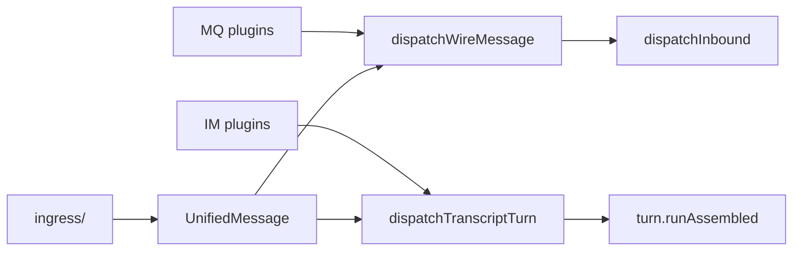

# message-sdk 架构

## 分层职责

| 层级 | 职责 | 位置 |
|------|------|------|
| **传输层** | 连接、订阅、发布、ACK、平台协议 | 各 `extensions/{mqtt,rabbitmq,...}` |
| **消息层** | 统一模型、解析/序列化、入栈/出栈、OpenClaw 桥接 | `@partme.ai/openclaw-message-sdk` |
| **智能体层** | 路由、会话、LLM（不变） | OpenClaw Gateway |

通道插件**只做**：连接生命周期、收到原始 payload 后交给 SDK、从 SDK 取出线载荷再 publish。

message-sdk**承担**：`UnifiedMessage`、`MessageEnvelope`、`parseTransportPayload` / `serializeForTransport`、幂等去重、可选入栈/出栈，以及 **Wire / Transcript 双路径 dispatch** 与 `bridge` 子路径中的 `dispatchInbound` / `createReplyHandler`。

## 双路径决策（Wire vs Transcript）

> **采用方案 A：Wire 与 Transcript 长期共存。**

| 维度 | Wire 路径 | Transcript 路径 |
|------|-----------|-----------------|
| **代表插件** | mqtt, rabbitmq, redis-stream, rocketmq, stomp, web-mqtt, web-stomp | gotify, wecom, feishu |
| **SDK 入口** | `dispatchWireMessage` → `dispatchInbound` | `dispatchTranscriptTurn` → `turn.runAssembled` |
| **入站** | `ingress/` + `parseTransportPayload` | `ingress/normalize` + 渠道 adapter |
| **出站** | `serializeForTransport` → JSON 信封 | 渠道 deliver 回调（人类可读） |
| **Control UI** | 无 transcript 保证 | 必须有 user/agent 轮次 |

MQ 插件**不**迁移至 Transcript 路径；IM 插件**不**降级为 Wire。统一层为 `UnifiedMessage`、dedup、`reply/`、`ingress/`，而非单一 dispatch 入口。



## 线传输契约（v1）

入站/出站优先 JSON 信封：

```json
{
  "version": "1",
  "message": { },
  "headers": {
    "correlationId": "...",
    "idempotencyKey": "...",
    "replyRoute": { "topic": "..." }
  }
}
```

`parseTransportPayload` 向后兼容 `{ "text": "..." }` 与纯文本。

出站默认 `serializeForTransport` 的 `envelope` 格式；可配置 `legacyJsonText` 或 `plainText`。

## OpenClaw 桥接

子路径：`@partme.ai/openclaw-message-sdk/bridge`

- **`dispatchInbound`**：`finalizeInboundContext` + `createReplyHandler` + `dispatchReplyFromConfig`（Wire 路径底层）
- **`dispatchWireMessage`**：thin wrapper，行为等同 `dispatchInbound`（MQ reply-pipeline 模式）
- **`dispatchEmbeddedAgentMessage`**：当前进程 `runEmbeddedAgent` → `serializeForTransport` → `deliver`
- **`dispatchSubagentMessage`**：`subagent.run` + `waitForRun` → `serializeForTransport` → `deliver`
- **`dispatchChannelMessage`**：按 `mode` 路由上述三种 Wire 实现（MQ 插件统一入口）
- Dispatch API 统一使用 `dispatch*` 动词命名，研发阶段不保留 `create*Dispatch` 旧别名。
- **`createReplyHandler`**：Agent `deliver` 回调内统一 `serializeForTransport`，再交给插件 `deliver({ text, wire })`

### Dispatch Mode 矩阵（Wire MQ）

| mode | SDK 入口 | OpenClaw 调用 | 典型插件 |
|------|----------|---------------|----------|
| `reply-pipeline` | `dispatchWireMessage` | `dispatchInbound` + reply pipeline | mqtt, redis-stream, stomp |
| `embedded-agent` | `dispatchEmbeddedAgentMessage` | `agent.runEmbeddedAgent` | rabbitmq, rocketmq（默认） |
| `subagent` | `dispatchSubagentMessage` | `subagent.run` + `waitForRun` | rabbitmq, rocketmq |

MQ 类插件标准路径应使用 **`dispatchChannelMessage`**（或按 mode 直接调用子 facade），避免各插件复制 dispatch 逻辑。

## Gotify（Transcript reference）

Gotify 入站仍使用渠道专用的 `finalizeInboundContext`（Body/SessionKey 等字段），且 Gotify
协议字段解析留在 gotify 插件内；SDK 不保留渠道专属 adapter。

- 入站归一化：gotify 插件本地 mapper → `UnifiedMessage`
- 派发：`dispatchTranscriptTurn`（`turn.runAssembled` + fallback record）
- 去重：`createIdempotencyCache`（60 秒窗口，按 `accountId:messageId`）
- 出站 REST 仍为人类可读文本（非 JSON 信封）
- **不** 使用 `dispatchInbound`（保持 Transcript 路径）

## 目录结构

```
src/
├── core/              # UnifiedMessage, Envelope, ChannelClass
├── pipeline/          # parseTransportPayload, serializeForTransport, reply-parts
├── ingress/           # normalizeIngress, wire parse helpers
├── dispatch/          # dispatchWireMessage, dispatchTranscriptTurn, dispatchChannelMessage
├── reply/             # createReplyDispatcherBundle, reply-parts re-export
├── lifecycle/         # typing lifecycle hooks
├── openclaw/          # importOpenClawPluginSdk compat
├── queue/             # InboundMessageQueue, OutboundMessageQueue, keyed queue, debounce buffer
├── dedup/             # createIdempotencyCache, persistent dedupe, claimable dedupe
├── metadata/          # extras.openclaw 共享元数据、回环防护、peer/correlation/replyRoute 解析
├── bridge/            # dispatchInbound, createReplyHandler (legacy + re-export)
└── media|http|asr|... # 横切工具
```

## 插件接入检查清单

### 入站运行时基础设施

1. `createClaimableDedupe`：`claim -> commit/release`，适合 webhook replay guard、in-flight 入站锁、可重试错误释放。
2. `createKeyedRunQueue`：同一 conversation/chat/thread key 串行，不同 key 并行，适合 per-chat 顺序处理。
3. `createInboundDebounceBuffer`：按 key debounce/coalesce，适合短时间文本合并、群聊 pending history 聚合。

### Wire（MQ）

1. 入站：`normalizeWireIngress` → `dispatchChannelMessage({ mode, reply: { deliver } })`
2. `mode=reply-pipeline`：完整 OpenClaw reply pipeline + wire envelope
3. `mode=embedded-agent` / `subagent`：轻量 Agent 调用，仍经 SDK 序列化
4. 出站：在 `deliver` 中使用 `wire`（已序列化）
5. 幂等：使用 `createIdempotencyCache`，勿自建 Map

### Transcript（IM）

1. 入站：渠道事件 → `normalizeIngress` / 渠道 adapter → `UnifiedMessage`
2. 派发：`dispatchTranscriptTurn`（保证 Control UI transcript）
3. 出站：渠道 REST / webhook deliver（人类可读）
4. 企业联动元数据：使用 `metadata` 读写 `extras.openclaw.peerId/correlationId/traceId/replyRoute/outbound`
5. **禁止** 引入 `dispatchInbound`（会丢失 Control UI 用户轮次）
