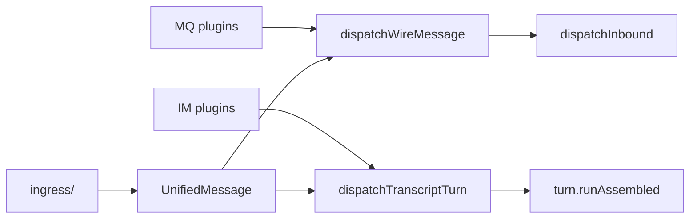
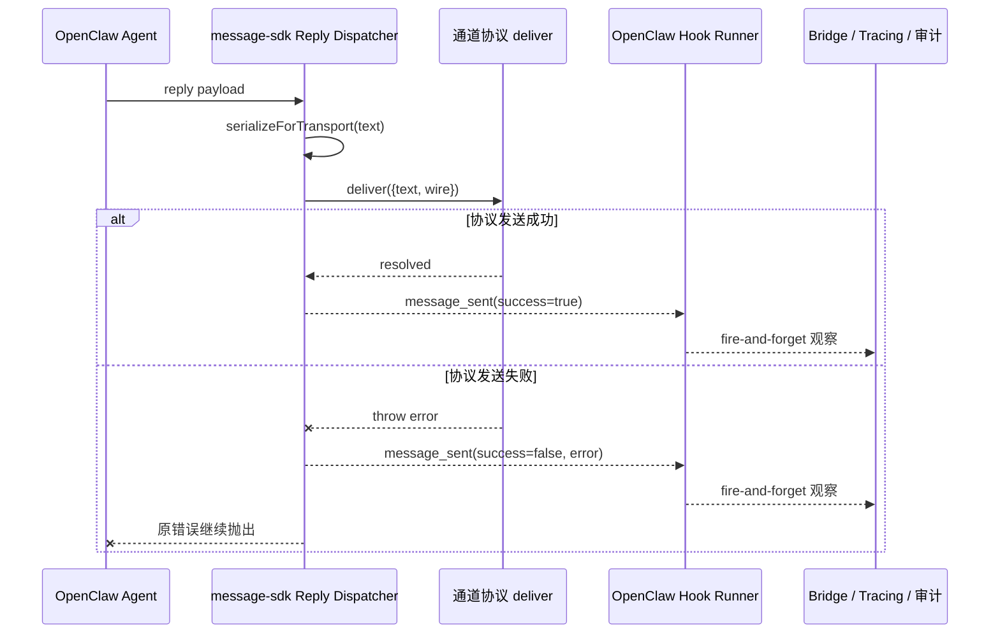
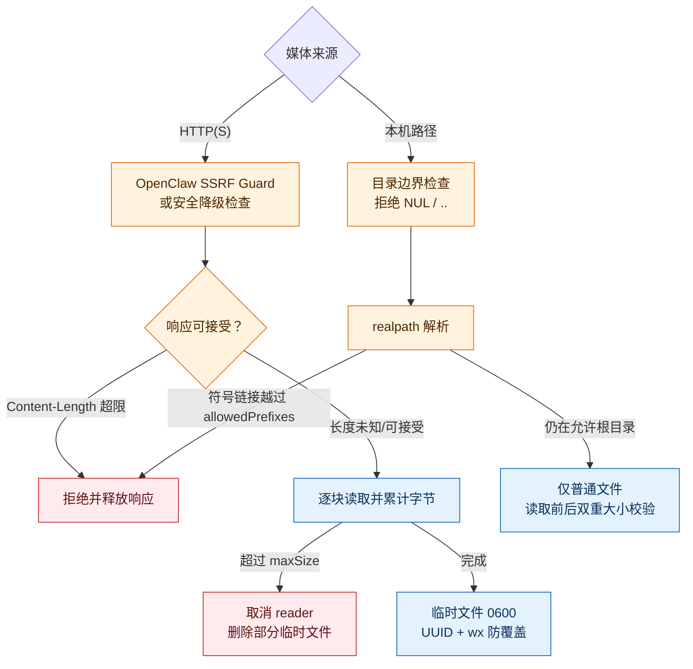
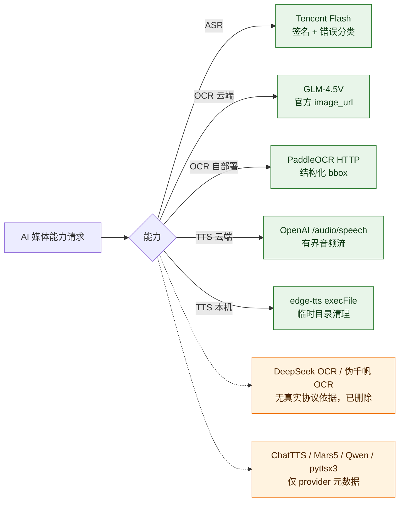
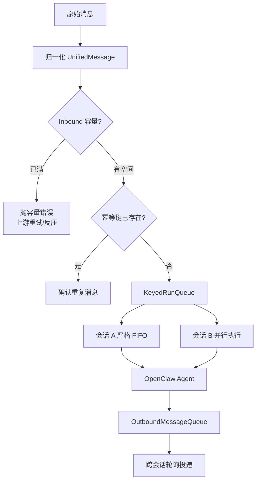

# message-sdk 架构

## 分层职责

| 层级 | 职责 | 位置 |
|------|------|------|
| **传输层** | 连接、订阅、发布、ACK、平台协议 | 各 `extensions/{mqtt,rabbitmq,...}` |
| **消息层** | 统一模型、解析/序列化、入栈/出栈、OpenClaw 桥接 | `@partme.ai/openclaw-message-sdk` |
| **智能体层** | 路由、会话、LLM（不变） | OpenClaw Gateway |

通道插件**只做**：连接生命周期、收到原始 payload 后交给 SDK、从 SDK 取出线载荷再 publish。

message-sdk**承担**：`UnifiedMessage`、`MessageEnvelope`、`parseTransportPayload` / `serializeForTransport`、幂等去重、可选入栈/出栈，以及 **Wire / Transcript 双路径 dispatch** 与 `bridge` 子路径中的 `dispatchInbound` / `createReplyHandler`。

## 双路径决策（Wire vs Transcript）

> **采用方案 A：Wire 与 Transcript 长期共存。**

| 维度 | Wire 路径 | Transcript 路径 |
|------|-----------|-----------------|
| **代表插件** | mqtt, rabbitmq, redis-stream, rocketmq, stomp, web-mqtt, web-stomp | gotify, wecom, feishu |
| **SDK 入口** | `dispatchWireMessage` → `dispatchInbound` | `dispatchTranscriptTurn` → `turn.runAssembled` |
| **入站** | `ingress/` + `parseTransportPayload` | `ingress/normalize` + 渠道 adapter |
| **出站** | `serializeForTransport` → JSON 信封 | 渠道 deliver 回调（人类可读） |
| **Control UI** | 无 transcript 保证 | 必须有 user/agent 轮次 |

MQ 插件**不**迁移至 Transcript 路径；IM 插件**不**降级为 Wire。统一层为 `UnifiedMessage`、dedup、`reply/`、`ingress/`，而非单一 dispatch 入口。


```mermaid
flowchart LR
  MQ[MQ plugins] --> WireDisp[dispatchWireMessage]
  IM[IM plugins] --> TxDisp[dispatchTranscriptTurn]
  WireDisp --> Bridge[dispatchInbound]
  TxDisp --> RunAsm[turn.runAssembled]
  Ingress[ingress/] --> UM[UnifiedMessage]
  UM --> WireDisp
  UM --> TxDisp
```

## 线传输契约（v1）

入站/出站优先 JSON 信封：

```json
{
  "version": "1",
  "message": { },
  "headers": {
    "correlationId": "...",
    "idempotencyKey": "...",
    "replyRoute": { "topic": "..." }
  }
}
```

`parseTransportPayload` 向后兼容 `{ "text": "..." }` 与纯文本。

出站默认 `serializeForTransport` 的 `envelope` 格式；可配置 `legacyJsonText` 或 `plainText`。

## OpenClaw 桥接

子路径：`@partme.ai/openclaw-message-sdk/bridge`

- **`dispatchInbound`**：`finalizeInboundContext` + `createReplyHandler` + `dispatchReplyFromConfig`（Wire 路径底层）
- **`dispatchWireMessage`**：thin wrapper，行为等同 `dispatchInbound`（MQ reply-pipeline 模式）
- **`dispatchEmbeddedAgentMessage`**：当前进程 `runEmbeddedAgent` → `serializeForTransport` → `deliver`
- **`dispatchSubagentMessage`**：`subagent.run` + `waitForRun` → `serializeForTransport` → `deliver`
- **`dispatchChannelMessage`**：按 `mode` 路由上述三种 Wire 实现（MQ 插件统一入口）
- Dispatch API 统一使用 `dispatch*` 动词命名，研发阶段不保留 `create*Dispatch` 旧别名。
- **`createReplyHandler`**：Agent `deliver` 回调内统一 `serializeForTransport`，再交给插件 `deliver({ text, wire })`；协议结果确定后广播官方 `message_sent`

### Wire 回复与观测 Hook 的真实顺序


```mermaid
sequenceDiagram
    participant A as OpenClaw Agent
    participant D as message-sdk Reply Dispatcher
    participant T as 通道协议 deliver
    participant H as OpenClaw Hook Runner
    participant O as Bridge / Tracing / 审计

    A->>D: reply payload
    D->>D: serializeForTransport(text)
    D->>T: deliver({text, wire})
    alt 协议发送成功
        T-->>D: resolved
        D-->>H: message_sent(success=true)
        H-->>O: fire-and-forget 观察
    else 协议发送失败
        T--xD: throw error
        D-->>H: message_sent(success=false, error)
        H-->>O: fire-and-forget 观察
        D--xA: 原错误继续抛出
    end
```

`createReplyDispatcherWithTyping` 驱动的自定义 Wire 回复不会再进入宿主公共 outbound delivery，因而不能假设宿主会自动发出 `message_sent`。SDK 在真实 `deliver` 之后补齐该事件：观察者故障不能改变协议发送结果，但传输错误必须继续抛出，让上游 ACK、重试或死信策略作出正确决定。发送前的 `reply_payload_sending` 不具备“平台已接受”的语义，不能用于出站成功审计。

### Dispatch Mode 矩阵（Wire MQ）

| mode | SDK 入口 | OpenClaw 调用 | 典型插件 |
|------|----------|---------------|----------|
| `reply-pipeline` | `dispatchWireMessage` | `dispatchInbound` + reply pipeline | mqtt, redis-stream, stomp |
| `embedded-agent` | `dispatchEmbeddedAgentMessage` | `agent.runEmbeddedAgent` | rabbitmq, rocketmq（默认） |
| `subagent` | `dispatchSubagentMessage` | `subagent.run` + `waitForRun` | rabbitmq, rocketmq |

MQ 类插件标准路径应使用 **`dispatchChannelMessage`**（或按 mode 直接调用子 facade），避免各插件复制 dispatch 逻辑。

## 媒体 IO 安全边界


```mermaid
flowchart TD
    SOURCE{"媒体来源"}
    SOURCE -->|"HTTP(S)"| SSRF["OpenClaw SSRF Guard<br/>或安全降级检查"]
    SSRF --> RESP{"响应可接受？"}
    RESP -->|"Content-Length 超限"| REJECT["拒绝并释放响应"]
    RESP -->|"长度未知/可接受"| STREAM["逐块读取并累计字节"]
    STREAM -->|"超过 maxSize"| CLEAN["取消 reader<br/>删除部分临时文件"]
    STREAM -->|"完成"| PRIVATE["临时文件 0600<br/>UUID + wx 防覆盖"]

    SOURCE -->|"本机路径"| LEXICAL["目录边界检查<br/>拒绝 NUL / .."]
    LEXICAL --> REAL["realpath 解析"]
    REAL -->|"符号链接越过 allowedPrefixes"| REJECT
    REAL -->|"仍在允许根目录"| REGULAR["仅普通文件<br/>读取前后双重大小校验"]

    classDef guard fill:#fff3e0,stroke:#ef6c00,color:#4e2600
    classDef io fill:#e3f2fd,stroke:#1565c0,color:#0d315c
    classDef fail fill:#ffebee,stroke:#c62828,color:#5f1111
    class SSRF,RESP,LEXICAL,REAL guard
    class STREAM,PRIVATE,REGULAR io
    class REJECT,CLEAN fail
```

- 默认远程读取不直接调用裸 `fetch`，而是优先经过 OpenClaw `ssrf-runtime`；测试或明确受信环境可注入自定义 fetch。
- 内存读取和临时文件下载都在流式读取过程中执行 `maxSize`，不能先 `arrayBuffer()` 完整分配后再检查。
- 下载失败会关闭文件句柄并删除部分文件；成功文件使用 `0600`、UUID 文件名和独占创建，避免共享临时目录泄露或碰撞覆盖。
- `allowedPrefixes` 使用目录相对关系而不是 `startsWith`；读取前解析 `realpath`，防止允许目录内的符号链接跳到目录外。

## ASR / OCR / TTS Provider 真实性边界


```mermaid
flowchart LR
    INPUT["AI 媒体能力请求"] --> TYPE{"能力"}
    TYPE -->|"ASR"| ASR["Tencent Flash<br/>签名 + 错误分类"]
    TYPE -->|"OCR 云端"| GLM["GLM-4.5V<br/>官方 image_url"]
    TYPE -->|"OCR 自部署"| PADDLE["PaddleOCR HTTP<br/>结构化 bbox"]
    TYPE -->|"TTS 云端"| OPENAI["OpenAI /audio/speech<br/>有界音频流"]
    TYPE -->|"TTS 本机"| EDGE["edge-tts execFile<br/>临时目录清理"]
    TYPE -.-> REMOVED["DeepSeek OCR / 伪千帆 OCR<br/>无真实协议依据，已删除"]
    TYPE -.-> META["ChatTTS / Mars5 / Qwen / pyttsx3<br/>仅 provider 元数据"]

    classDef live fill:#e8f5e9,stroke:#2e7d32,color:#123d17
    classDef boundary fill:#fff3e0,stroke:#ef6c00,color:#4e2600
    class ASR,GLM,PADDLE,OPENAI,EDGE live
    class REMOVED,META boundary
```

公共导出只承诺有真实协议或真实本机执行路径的能力。DeepSeek Chat 官方 schema 不接受旧代码构造的图像内容数组；旧千帆实现又把 API Key 直接冒充 access token，因此两者从 2026.7.1 公共 OCR API 删除。`local.ts` 中四个 TTS 常量只用于 UI/选型描述，不代表 SDK 已包含相应 Python 模型的执行器。

## 进程内队列与反压


```mermaid
flowchart TB
  Payload[原始消息] --> Normalize[归一化 UnifiedMessage]
  Normalize --> Capacity{Inbound 容量?}
  Capacity -->|已满| Retry[抛容量错误<br/>上游重试/反压]
  Capacity -->|有空间| Dedupe{幂等键已存在?}
  Dedupe -->|是| AckDuplicate[确认重复消息]
  Dedupe -->|否| Keyed[KeyedRunQueue]
  Keyed --> SessionA[会话 A 严格 FIFO]
  Keyed --> SessionB[会话 B 并行执行]
  SessionA --> Agent[OpenClaw Agent]
  SessionB --> Agent
  Agent --> Outbound[OutboundMessageQueue]
  Outbound --> RoundRobin[跨会话轮询投递]
```

| 机制 | 有界资源 | 失败语义 |
|------|----------|----------|
| `InboundMessageQueue` | `maxSize` | `duplicate` 可确认；`full` 必须重试或反压；`onPush` 失败回滚条目与幂等键 |
| `createKeyedRunQueue` | `maxPendingTasks`、`maxKeys` | 超时通知调用方并触发 AbortSignal，但同 key 等待底层任务真实 settle 后才继续 |
| `OutboundMessageQueue` | `maxSize` | 新消息拒绝并触发 `onOverflow`；默认 pop 跨 session 轮询、session 内 FIFO |

这些结构只保证单进程内的顺序与容量边界。进程崩溃恢复、Broker ACK、DLQ 和跨实例 exactly-once 不属于 SDK 内存队列职责，应由渠道插件和外部 Broker 提供。

## Gotify（Transcript reference）

Gotify 入站仍使用渠道专用的 `finalizeInboundContext`（Body/SessionKey 等字段），且 Gotify
协议字段解析留在 gotify 插件内；SDK 不保留渠道专属 adapter。

- 入站归一化：gotify 插件本地 mapper → `UnifiedMessage`
- 派发：`dispatchTranscriptTurn`（`turn.runAssembled` + fallback record）
- 去重：`createIdempotencyCache`（60 秒窗口，按 `accountId:messageId`）
- 出站 REST 仍为人类可读文本（非 JSON 信封）
- **不** 使用 `dispatchInbound`（保持 Transcript 路径）

## 目录结构

```
src/
├── core/              # UnifiedMessage, Envelope, ChannelClass
├── pipeline/          # parseTransportPayload, serializeForTransport, reply-parts
├── ingress/           # normalizeIngress, wire parse, dm/group policy
├── dispatch/          # dispatchWireMessage, dispatchTranscriptTurn, dispatchChannelMessage
├── reply/             # createReplyDispatcherBundle, reply-parts re-export
├── lifecycle/         # typing lifecycle hooks
├── openclaw/          # importOpenClawPluginSdk, resolveOpenClawStateDir
├── queue/             # InboundMessageQueue, OutboundMessageQueue, keyed queue, debounce buffer, stream-session-store
├── dedup/             # createIdempotencyCache, persistent dedupe, claimable dedupe
├── metadata/          # extras.openclaw 共享元数据、回环防护、peer/correlation/replyRoute 解析
├── bridge/            # dispatchInbound, createReplyHandler (legacy + re-export)
├── util/              # withTimeout, truncateUtf8Bytes, formatTemplate, globalSingleton, ttl-map-store
├── text/              # stripMarkdown（IM 纯文本降级）
├── transcript/        # IM 流式：streaming-config, templates, finish-stream, reply-dispatcher-factory
├── routing/           # dynamic-peer-agent, session-peer-cache
├── config/            # mergeChannelAccountConfig, resolve-channel-limits
└── media|http|asr|... # 横切工具
```

## Transcript Streaming Kit（IM 优先）

子路径：`@partme.ai/openclaw-message-sdk/transcript`

| 模块 | 说明 | WeCom 使用 |
|------|------|-----------|
| `streaming-config` | Feishu 式 `streaming` / `footer` 解析、`buildStreamBubbleText` | `streaming-config.ts` 薄封装 |
| `templates` | `resolveChannelTemplates`、错误/超时摘要 | `templates.ts` 薄封装 + 中文默认值 |
| `finish-stream` | `resolveStreamFinishText` 关流非空兜底 | `finish-thinking.ts` |
| `reply-dispatcher-factory` | `createTranscriptReplyDispatcherHooks` | `webhook/reply-pipeline.ts` |

WeCom 已对齐 `createKeyedRunQueue`（`chat-queue.ts` 薄封装，替代自研 Map），以及 `StreamSessionStore` / `ActiveReplyStore`（`webhook/state.ts` 薄封装）。

### WeCom P1 下沉（ingress / util / routing / config / text）

| WeCom 模块 | SDK 目标 | 插件形态 |
|------------|----------|----------|
| `dm-policy.ts` | `ingress/dm-policy.ts` | 薄封装 + `sendPairingReply` 注入 |
| `group-policy.ts` | `ingress/group-policy.ts` | 薄封装（`channelId=wecom`） |
| `state-manager` MessageState TTL | `util/ttl-map-store.ts` | `createTtlMapStore` |
| `reqid-store.ts` | `util/ttl-map-store.ts` | `createReqIdStore` re-export |
| `state-manager` SessionChatInfo | `routing/session-peer-cache.ts` | `createSessionPeerCache` |
| `utils` media/timeout/proxy | `config/resolve-channel-limits.ts` | 参数化 `channelId` 薄封装 |
| `state-dir-resolve.ts` | `openclaw/state-dir.ts` | Gotify 同步 |
| `agent/markdown-strip.ts` | `text/strip-markdown.ts` | re-export |

## 插件接入检查清单

### 入站运行时基础设施

1. `createClaimableDedupe`：`claim -> commit/release`，适合 webhook replay guard、in-flight 入站锁、可重试错误释放。
2. `createKeyedRunQueue`：同一 conversation/chat/thread key 串行，不同 key 并行，适合 per-chat 顺序处理。
3. `createInboundDebounceBuffer`：按 key debounce/coalesce，适合短时间文本合并、群聊 pending history 聚合。
4. `StreamSessionStore` + `ActiveReplyStore` + `StreamSessionMonitor`：IM 流式回调的 stream 生命周期、response_url 存储、per-conversation 批次 debounce/排队（WeCom / wecom-kf 薄封装）。

### Wire（MQ）

1. 入站：`normalizeWireIngress` → `dispatchChannelMessage({ mode, reply: { deliver } })`
2. `mode=reply-pipeline`：完整 OpenClaw reply pipeline + wire envelope
3. `mode=embedded-agent` / `subagent`：轻量 Agent 调用，仍经 SDK 序列化
4. 出站：在 `deliver` 中使用 `wire`（已序列化）；真实结果由 SDK 广播为 `message_sent(success=true/false)`
5. 失败边界：Hook 观察 fire-and-forget；协议 deliver 错误继续抛出，不能被观测层吞掉
6. 幂等：使用 `createIdempotencyCache`，勿自建 Map

### Transcript（IM）

1. 入站：渠道事件 → `normalizeIngress` / 渠道 adapter → `UnifiedMessage`
2. 派发：`dispatchTranscriptTurn`（保证 Control UI transcript）
3. 出站：渠道 REST / webhook deliver（人类可读）
4. 企业联动元数据：使用 `metadata` 读写 `extras.openclaw.peerId/correlationId/traceId/replyRoute/outbound`
5. **禁止** 引入 `dispatchInbound`（会丢失 Control UI 用户轮次）
