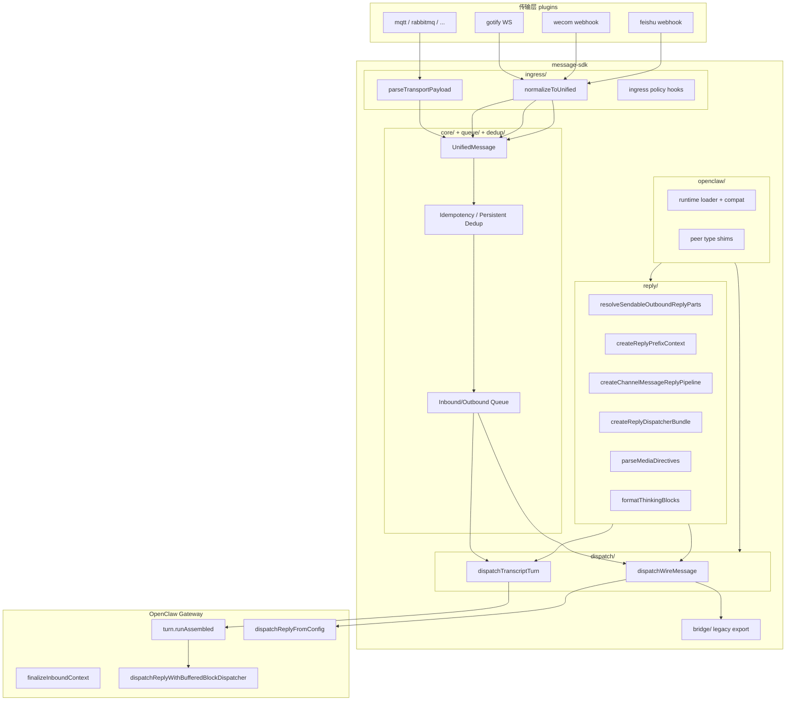

# message-sdk 整合 PRD

> **版本**: 0.1  
> **日期**: 2026-05-22  
> **范围**: `openclaw-plugins/extensions/message-sdk` 与各 IM/MQ 通道插件  
> **工作流**: Ralph phased delivery

---

## 1. Executive Summary（执行摘要）

OpenClaw 通道插件当前存在两条并行的消息处理路径：**Wire 路径**（MQ 插件经 `bridge.dispatchInbound` + JSON 信封）与 **Transcript 路径**（Gotify / WeCom / Feishu 经 `turn.runAssembled` + `dispatchReplyWithBufferedBlockDispatcher`，保证 Control UI 会话 transcript）。

本 PRD 决策：**两条路径长期共存**，不在 Phase 3 将 MQ 插件整体迁移至 Transcript 路径；而是在 message-sdk 内统一 **入站归一化（UnifiedMessage）**、**去重**、**回复管线钩子** 与 **OpenClaw 兼容层**，出站序列化按通道类别分流（机器消费者 → wire envelope；人类 IM → 人类可读 + 渠道 deliver 适配器）。

迁移顺序（用户确认）：**Gotify → WeCom hook 化 → MQ 统一 ingress/queue → Feishu 高级 hooks**。传输层插件仅负责 connect / publish / subscribe；OpenClaw 前后逻辑下沉 message-sdk。WeCom 企业 API（`@wecom/aibot-node-sdk`、`response_url`、Agent API）保留在 wecom 插件。

目标：`reply-pipeline.ts`（389 行）经 hook 化后约 **60% 通用逻辑迁入 message-sdk**，**40% 企微协议与 stream 状态** 留插件。

---

## 2. Goals / Non-Goals

### 2.1 Goals

| ID | 目标 |
|----|------|
| G1 | 建立 message-sdk 分层模块：`openclaw/`、`ingress/`、`dispatch/`、`reply/`、`lifecycle/` |
| G2 | Wire 与 Transcript 路径共享 UnifiedMessage、dedup、reply-parts、media 解析 |
| G3 | Gotify 成为 Transcript 路径的 reference 实现（已部分完成） |
| G4 | WeCom `webhook/reply-pipeline.ts` hook 化，复用 SDK reply bundle，不减少现有能力 |
| G5 | 8 个 MQ 插件统一 ingress + queue 接入模式，消除重复 dispatch 代码 |
| G6 | Feishu 高级 hooks（persistent dedup、ingress-runtime、reply-dispatcher 模式）对齐到 SDK |

### 2.2 Non-Goals

| ID | 非目标 |
|----|--------|
| NG1 | 不将 MQ 插件强制迁移到 Transcript / Control UI 路径 |
| NG2 | 不迁移 WeCom 模板卡片、Agent 私信、`response_url` 流式帧到 SDK |
| NG3 | 不迁移飞书 Doc/Wiki/Bitable 工具链 |
| NG4 | 不在本 PRD 内重构 OpenClaw Gateway 核心 |
| NG5 | 不降低任一插件现有功能或测试覆盖 |
| NG6 | 不在 message-sdk 中保留渠道专属 adapter；Gotify/Feishu/WeCom 协议解析留在对应插件 |

---

## 3. Decision Record：Wire vs Transcript

### 3.1 路径定义

| 维度 | Wire 路径 | Transcript 路径 |
|------|-----------|-----------------|
| **代表插件** | mqtt, rabbitmq, redis-stream, rocketmq, stomp, web-mqtt, web-stomp | gotify, wecom, feishu |
| **入站** | `parseTransportPayload` → UnifiedMessage（可选） | 渠道插件本地 mapper / webhook parse → UnifiedMessage |
| **OpenClaw 派发** | `bridge.dispatchInbound` | `turn.runAssembled` + `dispatchReplyWithBufferedBlockDispatcher` |
| **出站** | `serializeForTransport` → `{ version, message, headers.replyRoute }` | 渠道 deliver 回调（REST / response_url / 流式 store） |
| **Control UI** | 无 transcript 保证 | 必须有 user/agent 轮次 |
| **性能** | 低开销 JSON 信封，适合高频 IoT/MQ | 额外 session record + block buffer，适合 IM UX |
| **兼容性** | 向后兼容 `{ text }` / plainText | 依赖 OpenClaw channel.turn API |

### 3.2 备选方案

**方案 A — 长期双路径（推荐）**

- MQ 保持 Wire；IM 保持 Transcript。
- SDK 提供 `dispatchTranscriptTurn()` 与 `dispatchWireMessage()` 两个 facade，共享底层 `ingress/` + `reply/`；研发阶段统一改为 `dispatch*` 命名，不保留旧 `create*Dispatch` 别名。
- **优点**：不破坏 MQ replyRoute 契约；Control UI 行为不变；渐进迁移。
- **缺点**：SDK 需维护两套 dispatch 入口文档。

**方案 B — MQ 全量迁移 Transcript**

- 所有插件走 `runAssembled`，MQ 出站仍可在 deliver 内序列化 wire。
- **优点**：单一 dispatch 代码路径。
- **缺点**：MQ 场景无 Control UI 需求却承担 transcript 开销；破坏现有 `dispatchInbound` 集成测试与设备侧 JSON 契约预期；8 插件同步变更大。

**方案 C — IM 降级为 Wire**

- Gotify/WeCom 改用 `dispatchInbound`。
- **优点**：代码最少。
- **缺点**：已知 gap（`OpenClaw-Gotify-Known-Gaps.md` ARC-2）— Control UI transcript 丢失；不可接受。

### 3.3 **Decision（明确决策）**

> **采用方案 A：Wire 与 Transcript 长期共存。**  
> MQ 插件 **不** 迁移至 Transcript 路径；在 Phase 3 统一的是 **ingress 归一化 + queue + dedup + 文档化桥接**，而非替换 `dispatchInbound`。  
> IM 插件在 Phase 1–2–4 逐步接入 SDK `reply/` 与 `ingress/`，保留 `runAssembled` 语义。

**Rationale 摘要**

1. Control UI 是 IM 通道的产品契约，Transcript 路径不可妥协（Gotify 架构文档已验证）。
2. MQ wire envelope 含 `replyRoute.topic`，是机器到机器路由的核心，与 transcript 正交。
3. 性能：MQ 高频场景应避免 `recordInboundSession` 额外 I/O。
4. 兼容性：现有 8 个 MQ `inbound.ts` 已稳定使用 `parseTransportPayload` + `dispatchInbound`。
5. 统一性仍可通过 **UnifiedMessage 作为 canonical 模型** 达成，无需统一 dispatch 入口。

---

## 4. Target Architecture

---

## 5. Module Map（message-sdk 新目录）

| 目录 | 职责 | 自现有模块迁移 / 新增 |
|------|------|------------------------|
| **`openclaw/`** | OpenClaw peer 加载、compat 类型、`resolveHumanDelay` 等薄封装 | 自各插件 `openclaw-compat` 抽取共用部分 |
| **`ingress/`** | 入站归一化、policy hook、body-limit 组合 | 扩展 `pipeline/parse-payload`；对齐 Feishu `channel-ingress-runtime` |
| **`dispatch/`** | `dispatchWireMessage`（wrap `dispatchInbound`）、`dispatchTranscriptTurn`（runAssembled 编排） | 新增；`bridge/` re-export 保持兼容 |
| **`reply/`** | prefix、pipeline、reply-parts、thinking 占位、media directive、dispatcher bundle | 自 `pipeline/reply-parts` + WeCom reply-pipeline 抽取 |
| **`lifecycle/`** | typing 生命周期、idle/error/cleanup 标准钩子 | 新增 |
| **`core/`** | UnifiedMessage, Envelope | 保持 |
| **`queue/`** | Inbound/Outbound queue、keyed queue、debounce buffer | Phase 3 MQ 启用 |
| **`dedup/`** | idempotency + persistent | 保持 |
| **`bridge/`** | 向后兼容 `dispatchInbound` / `createReplyHandler` | 保持 |
| **`media/`**, **`http/`**, **`asr/`** | 横切 | 保持；WeCom 媒体解析迁入 `media/` |

---

## 6. Phased Scope

### Phase 0 — Foundation（基础）

**范围**

- 创建 `openclaw/`、`ingress/`、`dispatch/`、`reply/`、`lifecycle/` 目录骨架与 barrel export
- 定义 `ChannelClass`: `"wire" | "transcript"` 配置
- 文档：`ARCHITECTURE.md` 增补双路径决策
- CI：`message-sdk` vitest + typecheck 门禁

**验收标准**

- [ ] 新目录存在且 `pnpm --filter @partme.ai/openclaw-message-sdk test` 通过
- [ ] `dispatch/` 导出 `dispatchWireMessage`（thin wrapper，行为等同现有 bridge）
- [ ] `reply/` 导出 `createReplyDispatcherBundle` 空壳 + 类型，无插件行为变更

---

### Phase 1 — Gotify（Transcript reference）

**范围**

- Gotify 入站：Gotify 插件本地 mapper 产出 `UnifiedMessage`
- 出站：继续使用 REST 人类文本；接入 `reply/createReplyDispatcherBundle`（若适用）
- Dedup：已用 `createIdempotencyCache` — 文档化为 Phase 1 完成项
- `dispatchTranscriptTurn` 封装现有 `turn.runAssembled` + fallback 逻辑（自 `gotify/src/channel.ts` 抽取）

**验收标准**

- [ ] Gotify Control UI transcript 回归测试通过
- [ ] `gotify/src/channel.ts` 入站/派发代码行数减少 ≥15%
- [ ] 无 `dispatchInbound` 引入（保持 Transcript）

---

### Phase 2 — WeCom Hook 化

**范围**

- 将 `webhook/reply-pipeline.ts` 通用块迁入 `message-sdk/reply/` + `media/`
- 插件保留：template_card、`response_url`、streamStore、Agent DM、bot window fallback
- WeCom deliver-stream 等协议细节保留在 WeCom 插件内，通过 SDK `reply/` 与 `media/` 通用工具组合
- `createWecomReplyDispatcher` 变为薄 wrapper（目标 ≤150 行）

**验收标准**

- [ ] `reply-pipeline.test.ts` 全绿
- [ ] WeCom webhook 集成测试（monitor / reply-pipeline）无回归
- [ ] 功能对照表：template_card、MEDIA:、timeout fallback、Agent DM 媒体均保留

---

### Phase 3 — MQ Unified Ingress / Queue

**范围**

- 8 个 MQ 插件：`ingress/` 统一 `parseTransportPayload` 调用模式
- 可选启用 `InboundMessageQueue` / `OutboundMessageQueue`（配置开关，默认 off 保兼容）
- **不** 切换至 Transcript；继续 `dispatchWireMessage` → `dispatchInbound`
- 统一 dedup 文档与 `createIdempotencyCache` 推荐用法

**验收标准**

- [ ] 8 插件 `inbound.ts` 使用 SDK `ingress/` helper
- [ ] MQTT 集成测试 + 各插件 unit test 通过
- [ ] wire envelope 格式与 Phase 0 基线 byte-level 兼容（snapshot test）

---

### Phase 4 — Feishu Advanced Hooks

**范围**

- 参考 `research/openclaw/extensions/feishu`：`createFeishuReplyDispatcher`、`persistent-dedupe`、`ingress-runtime`
- SDK 提供 Feishu 可选 hooks（非强制替换 research 树）
- 对齐 inventory 表中 🔶 / 📝 项至 SDK 通用模块或 Feishu 插件本地 adapter

**验收标准**

- [ ] Feishu 适配层文档 + 示例 hook 实现
- [ ] persistent dedup 与 ingress policy 可复用于 WeCom（配置化）
- [ ] 不破坏现有 openclaw-plugins feishu 扩展（若存在）

---

## 7. WeCom `reply-pipeline.ts` Extraction Table

> 源文件：`extensions/wecom/src/webhook/reply-pipeline.ts`（389 行）  
> 目标比例：**~60% message-sdk / ~40% wecom plugin**（按 deliver 回调体 + setup 合计约 235 行可迁 SDK）

| 块 / 函数 | 行号 | 归属 | SDK 目标模块 | 说明 |
|-----------|------|------|--------------|------|
| 文件头注释 + imports | 1–45 | 混合 | WeCom 插件本地 types | 类型留插件；通用 import 走 SDK |
| `CreateWecomReplyDispatcherParams` 等类型 | 47–60 | **Plugin** | — | 含 `WecomWebhookTarget`、`streamId` |
| `createWecomReplyDispatcher` 入口 | 65–70 | 混合 | `reply/create-dispatcher.ts` | 薄 orchestrator |
| `createReplyPrefixContext` | 72 | **SDK** | `reply/prefix.ts` | 已有 compat 调用 |
| `createChannelMessageReplyPipeline` | 73–78 | **SDK** | `reply/pipeline.ts` | typing callbacks |
| `resolveHumanDelayConfig` | 83 | **SDK** | `openclaw/human-delay.ts` | OpenClaw compat |
| `formatReasoningMessage` + `resolveSendableOutboundReplyParts` | 88–92 | **SDK** | `reply/parts.ts` | 已有 `pipeline/reply-parts` |
| `<think>` 占位/还原 | 95–100, 154–156 | **SDK** | `reply/format-thinking-blocks.ts` | 通用 LLM 输出 sanitize |
| `template_card` JSON 检测与 `response_url` POST | 103–151 | **Plugin** | WeCom 插件本地 template-card | 企微协议；群聊降级文案 |
| `convertMarkdownTables` | 153 | **SDK** | `openclaw/markdown-tables.ts` | peer 委托 |
| stream 存在性 guard | 158–159 | **Plugin** | — | `streamStore.getStream` |
| `extractLocalImagePathsFromText` + 读盘 base64 | 164–192 | **混合** | `media/local-path-inference.ts` + plugin stream append | 路径推断通用；写入 stream 企微 |
| `appendDmContent` 文本段 | 194–198 | **Plugin** | — | stream 累积 |
| Bot window timeout + `buildFallbackPrompt` | 200–224 | **Plugin** | WeCom 插件本地 bot-window | `BOT_WINDOW_MS` 企微策略 |
| `MEDIA:` directive 解析与 strip | 226–239 | **SDK** | `media/parse-directives.ts` | 通用 directive |
| 媒体 URL/本地加载 loop | 241–262 | **SDK** | `media/resolve-outbound.ts` | 复用 `fetchRemoteMedia` |
| 图片 → stream.images | 264–267 | **Plugin** | — | streamStore 结构 |
| 非图片 + `agentDmMedia` | 268–307 | **Plugin** | `webhook/agent-dm.ts` | Agent API |
| 媒体错误 fallback prompt | 308–350 | **Plugin** | WeCom 插件本地 fallback-prompts | 企微 UX 文案 |
| stream content 合并 + `truncateUtf8Bytes` | 353–360 | **Plugin** | — | `STREAM_MAX_BYTES` 企微流式 |
| `onError` / `onIdle` / `onCleanup` | 366–375 | **SDK** | `lifecycle/typing-lifecycle.ts` | 标准钩子 |
| `replyOptions` bundle | 378–384 | **SDK** | `reply/bundle-types.ts` | `onModelSelected` 等 |
| `createWecomReplyPipeline` alias | 387–388 | **Plugin** | — | deprecated export |

**行数估算（deliver 回调 + setup）**

| 分类 | 约行数 | 占比 |
|------|--------|------|
| **SDK（纯 + 混合之 SDK 侧）** | ~140 | **~60%** |
| **Plugin（纯企微）** | ~95 | **~40%** |

混合块（媒体 loop、local image）按「解析/加载 → SDK、stream/Agent 交付 → Plugin」拆分。

---

## 8. Acceptance Criteria Summary（按阶段）

| Phase | 关键验收 |
|-------|----------|
| P0 | SDK 模块骨架 + 测试绿 + 无插件行为变更 |
| P1 | Gotify transcript 回归 + 代码抽取 |
| P2 | WeCom reply-pipeline ≤150 行 + 全测试绿 + 零功能删减 | ✅（95 行 orchestrator + `adapters/reply-deliver.ts` + 291 tests） |
| P3 | 8 MQ ingress 统一 + wire 兼容 snapshot | ✅ |
| P4 | Feishu hooks 文档 + dedup/ingress 可复用 | ✅ |

---

## 9. Risks and Rollback

| 风险 | 影响 | 缓解 | 回滚 |
|------|------|------|------|
| OpenClaw peer API 变更 | SDK compat 断裂 | `openclaw/` 集中探测 + fallback | pin openclaw 版本；revert SDK minor |
| WeCom stream 行为回归 | 生产消息丢失/截断 | 保留 `reply-pipeline.test.ts` + monitor 集成测试 | 插件侧恢复 monolithic `reply-pipeline.ts` |
| MQ wire 格式破坏 | IoT 消费者解析失败 | envelope snapshot 测试 | `ingress/` feature flag off；回退 `inbound.ts` |
| Transcript 丢失 | Control UI 空白 | Phase 1/2 禁止 MQ 走 Transcript | Gotify 保留原 `channel.ts` dispatch 分支 |
| 范围蔓延 | 延期 | 严格 Non-Goals；Feishu 仅 hooks 不对等迁移 | Phase 4 可独立 ship |

**Rollback 原则**：每 Phase 独立 PR；插件保留 adapter 薄层；SDK 新增 API 先 `@experimental` export，稳定后再让插件切换。

---

## 10. References

- `extensions/message-sdk/docs/ARCHITECTURE.md`
- `doc/wecom/OpenClaw-WeCom-Feishu-SDK-Inventory.md`
- `doc/gotify/OpenClaw-Gotify-Architecture_CN.md`
- `extensions/wecom/src/webhook/reply-pipeline.ts`
