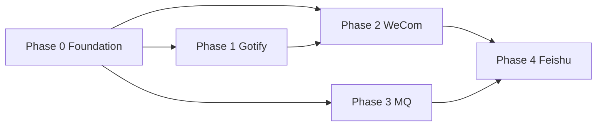

# message-sdk 整合 Tasks

> **对应 PRD**: [PRD-message-sdk-consolidation.md](./PRD-message-sdk-consolidation.md)  
> **迁移顺序**: Phase 0 → 1 Gotify → 2 WeCom → 3 MQ → 4 Feishu  
> **Decision**: Wire + Transcript 双路径长期共存

---

## 依赖关系概览



---

## Phase 0 — Foundation

- [x] **T0-01** 创建 SDK 目录骨架与 barrel exports  
  - **Phase**: P0  
  - **复杂度**: S  
  - **Files**: `message-sdk/src/openclaw/index.ts`, `ingress/index.ts`, `dispatch/index.ts`, `reply/index.ts`, `lifecycle/index.ts`, `src/index.ts`, `tsup.config.ts`  
  - **Verify**: `cd openclaw-plugins/extensions/message-sdk && pnpm test && pnpm exec tsc --noEmit`

- [x] **T0-02** 定义 `ChannelClass` 与 dispatch 配置类型  
  - **Phase**: P0  
  - **复杂度**: S  
  - **Files**: `message-sdk/src/core/channel-class.ts`, `dispatch/types.ts`  
  - **Verify**: `cd openclaw-plugins/extensions/message-sdk && pnpm test`

- [x] **T0-03** 实现 `dispatchWireMessage`（thin wrapper over `dispatchInbound`）  
  - **Phase**: P0  
  - **复杂度**: M  
  - **Files**: `message-sdk/src/dispatch/wire-dispatch.ts`, `bridge/inbound-bridge.ts`, `dispatch/wire-dispatch.test.ts`  
  - **Verify**: `cd openclaw-plugins/extensions/message-sdk && pnpm test`

- [x] **T0-04** 实现 `createReplyDispatcherBundle` 类型壳与 lifecycle 钩子  
  - **Phase**: P0  
  - **复杂度**: M  
  - **Files**: `message-sdk/src/reply/bundle.ts`, `lifecycle/typing-lifecycle.ts`, `reply/bundle.test.ts`  
  - **Verify**: `cd openclaw-plugins/extensions/message-sdk && pnpm test`

- [x] **T0-05** 更新 `ARCHITECTURE.md` 双路径决策与模块图  
  - **Phase**: P0  
  - **复杂度**: S  
  - **Files**: `message-sdk/docs/ARCHITECTURE.md`  
  - **Verify**: 文档 review（无命令）

- [x] **T0-06** `bridge/` 向后兼容 re-export  
  - **Phase**: P0  
  - **复杂度**: S  
  - **Files**: `message-sdk/src/bridge/index.ts`, `message-sdk/package.json` exports  
  - **Verify**: `cd openclaw-plugins/extensions/mqtt && pnpm exec tsc --noEmit`

---

## Phase 1 — Gotify

- [x] **T1-01** 抽取 `dispatchTranscriptTurn`（runAssembled 编排）  
  - **Phase**: P1  
  - **复杂度**: L  
  - **Files**: `message-sdk/src/dispatch/transcript-dispatch.ts`, `dispatch/transcript-dispatch.test.ts`, `gotify/src/channel.ts`  
  - **Verify**: `cd openclaw-plugins/extensions/message-sdk && pnpm test && cd ../gotify && pnpm test`

- [x] **T1-02** Gotify 入站改为插件本地 mapper，SDK 仅保留通用 `normalizeIngress`  
  - **Phase**: P1  
  - **复杂度**: M  
  - **Files**: `message-sdk/src/ingress/normalize.ts`, `gotify/src/routing/message-mapper.ts`, `gotify/src/channel.ts`  
  - **Verify**: `cd openclaw-plugins/extensions/gotify && pnpm test`

- [x] **T1-03** Gotify dedup 文档化 + 统一 export 路径  
  - **Phase**: P1  
  - **复杂度**: S  
  - **Files**: `gotify/README.zh-CN.md`, `message-sdk/README.zh-CN.md`  
  - **Verify**: `cd openclaw-plugins/extensions/gotify && pnpm test`

- [x] **T1-04** Control UI transcript 回归测试  
  - **Phase**: P1  
  - **复杂度**: M  
  - **Files**: `gotify/src/channel.test.ts`  
  - **Verify**: `cd openclaw-plugins/extensions/gotify && pnpm test -- channel.test`

- [x] **T1-05** 确认 Gotify **不** 引入 `dispatchInbound`（负向测试）  
  - **Phase**: P1  
  - **复杂度**: S  
  - **Files**: `gotify/src/channel.test.ts`  
  - **Verify**: `cd openclaw-plugins/extensions/gotify && pnpm test`

---

## Phase 2 — WeCom Hook 化

- [x] **T2-01** SDK：`reply/format-thinking-blocks.ts`  
  - **Phase**: P2  
  - **复杂度**: S  
  - **Files**: `message-sdk/src/reply/format-thinking-blocks.ts`, `reply/format-thinking-blocks.test.ts`  
  - **Verify**: `cd openclaw-plugins/extensions/message-sdk && pnpm test`

- [x] **T2-02** SDK：`media/parse-directives.ts`（MEDIA: 行）  
  - **Phase**: P2  
  - **复杂度**: S  
  - **Files**: `message-sdk/src/media/parse-directives.ts`, `media/parse-directives.test.ts`  
  - **Verify**: `cd openclaw-plugins/extensions/message-sdk && pnpm test`

- [x] **T2-03** SDK：`media/local-path-inference.ts` + `media/resolve-outbound.ts`  
  - **Phase**: P2  
  - **复杂度**: M  
  - **Files**: `message-sdk/src/media/local-path-inference.ts`, `media/resolve-outbound.ts`, `media/*.test.ts`  
  - **Verify**: `cd openclaw-plugins/extensions/message-sdk && pnpm test`

- [x] **T2-04** SDK：`reply/create-dispatcher.ts` 通用 deliver 前处理  
  - **Phase**: P2  
  - **复杂度**: L  
  - **Files**: `message-sdk/src/reply/create-dispatcher.ts`, `reply/create-dispatcher.test.ts`  
  - **Verify**: `cd openclaw-plugins/extensions/message-sdk && pnpm test`

- [x] **T2-05** Plugin：`adapters/wecom/` 保留 template_card、fallback、stream  
  - **Phase**: P2  
  - **复杂度**: L  
  - **Files**: `wecom/src/adapters/template-card.ts`, `wecom/src/adapters/bot-window.ts`, `wecom/src/adapters/fallback-prompts.ts`, `wecom/src/webhook/reply-pipeline.ts`  
  - **Verify**: `cd openclaw-plugins/extensions/wecom && pnpm test`

- [x] **T2-06** 重构 `reply-pipeline.ts` 为薄 wrapper（目标 ≤150 行）  
  - **Phase**: P2  
  - **复杂度**: L  
  - **Files**: `wecom/src/webhook/reply-pipeline.ts`, `wecom/src/webhook/reply-pipeline.test.ts`  
  - **Verify**: `cd openclaw-plugins/extensions/wecom && pnpm test`

- [x] **T2-07** WeCom monitor 集成回归  
  - **Phase**: P2  
  - **复杂度**: M  
  - **Files**: `wecom/src/webhook/monitor.ts`（仅 import 路径变更）  
  - **Verify**: `cd openclaw-plugins/extensions/wecom && pnpm test && pnpm exec tsc --noEmit`

- [x] **T2-08** 功能清单对照测试（template_card / MEDIA / timeout / Agent DM）  
  - **Phase**: P2  
  - **复杂度**: M  
  - **Files**: `wecom/src/webhook/reply-pipeline.test.ts`  
  - **Verify**: `cd openclaw-plugins/extensions/wecom && pnpm test -- reply-pipeline`

---

## Phase 3 — MQ Unified Ingress / Queue

- [x] **T3-01** SDK：`ingress/wire-ingress.ts` helper（parse + dedup hook）  
  - **Phase**: P3  
  - **复杂度**: M  
  - **Files**: `message-sdk/src/ingress/wire-ingress.ts`, `ingress/wire-ingress.test.ts`  
  - **Verify**: `cd openclaw-plugins/extensions/message-sdk && pnpm test`

- [x] **T3-02** Wire envelope snapshot 测试（v1 兼容）  
  - **Phase**: P3  
  - **复杂度**: S  
  - **Files**: `message-sdk/src/pipeline/pipeline.test.ts`, `pipeline/__snapshots__/`  
  - **Verify**: `cd openclaw-plugins/extensions/message-sdk && pnpm test`

- [x] **T3-03** MQTT 试点接入 `ingress/wire-ingress`  
  - **Phase**: P3  
  - **复杂度**: M  
  - **Files**: `mqtt/src/inbound.ts`  
  - **Verify**: `cd openclaw-plugins/extensions/mqtt && pnpm exec tsc --noEmit && pnpm test`

- [x] **T3-04** _rollout_ 其余 7 MQ 插件 inbound 统一  
  - **Phase**: P3  
  - **复杂度**: L  
  - **Files**: `rabbitmq/src/inbound.ts`, `redis-stream/src/inbound.ts`, `rocketmq/src/inbound.ts`, `stomp/src/inbound.ts`, `web-mqtt/src/inbound.ts`, `web-stomp/src/inbound.ts`  
  - **Verify**: `cd openclaw-plugins/extensions/rabbitmq && pnpm test; cd ../redis-stream && pnpm test; cd ../rocketmq && pnpm test; cd ../stomp && pnpm test; cd ../web-mqtt && pnpm test; cd ../web-stomp && pnpm test`

- [x] **T3-05** 可选 queue 开关（默认 off）  
  - **Phase**: P3  
  - **复杂度**: M  
  - **Files**: `message-sdk/src/queue/inbound-message-queue.ts`, `dispatch/wire-dispatch.ts`, `mqtt/src/inbound.ts`  
  - **Verify**: `cd openclaw-plugins/extensions/message-sdk && pnpm test && cd ../mqtt && pnpm test`

- [x] **T3-06** MQ dedup 用法统一文档  
  - **Phase**: P3  
  - **复杂度**: S  
  - **Files**: `message-sdk/README.md`（MQTT 等 MQ 插件文档见 `doc/` 索引）  
  - **Verify**: 文档 review

- [x] **T3-07** 负向验证：MQ **仍** 使用 `dispatchWireMessage` / `dispatchChannelMessage`，无 `runAssembled`  
  - **Phase**: P3  
  - **复杂度**: S  
  - **Files**: `mqtt/src/inbound.ts`, `mqtt/src/inbound.test.ts`  
  - **Verify**: `cd openclaw-plugins/extensions/mqtt && pnpm test`

---

## Phase 4 — Feishu Advanced Hooks

- [x] **T4-01** 调研 Feishu reply-dispatcher + ingress-runtime 对照 inventory  
  - **Phase**: P4  
  - **复杂度**: M  
  - **Files**: `message-sdk/docs/feishu-hooks-mapping.md`, `doc/wecom/OpenClaw-WeCom-Feishu-SDK-Inventory.md`  
  - **Verify**: 文档 review

- [x] **T4-02** Feishu hooks 边界确认：渠道专属 reply hooks 留 Feishu 插件本地  
  - **Phase**: P4  
  - **复杂度**: L  
  - **Files**: `message-sdk/docs/feishu-hooks-mapping.md`  
  - **Verify**: `cd openclaw-plugins/extensions/message-sdk && pnpm test`

- [x] **T4-03** SDK：ingress policy hooks 对齐 Feishu `channel-ingress-runtime`  
  - **Phase**: P4  
  - **复杂度**: L  
  - **Files**: `message-sdk/src/ingress/policy.ts`, `ingress/policy.test.ts`  
  - **Verify**: `cd openclaw-plugins/extensions/message-sdk && pnpm test`

- [x] **T4-04** persistent dedup 配置化（WeCom webhook 可选复用）  
  - **Phase**: P4  
  - **复杂度**: M  
  - **Files**: `message-sdk/src/dedup/persistent-dedupe.ts`, `wecom/src/webhook/dedup.ts`  
  - **Verify**: `cd openclaw-plugins/extensions/message-sdk && pnpm test && cd ../wecom && pnpm test`

- [x] **T4-05** WeCom 接入 ingress policy（可选 feature flag）  
  - **Phase**: P4  
  - **复杂度**: M  
  - **Files**: `wecom/src/webhook/monitor.ts`, `wecom/src/webhook/dedup.ts`  
  - **Verify**: `cd openclaw-plugins/extensions/wecom && pnpm test`

- [x] **T4-06** 端到端架构文档更新与 PRD 验收勾选  
  - **Phase**: P4  
  - **复杂度**: S  
  - **Files**: `message-sdk/docs/ARCHITECTURE.md`, `PRD-message-sdk-consolidation.md`  
  - **Verify**: PRD §8 acceptance checklist 全 ✅

---

## 任务统计

| Phase | 任务数 | S | M | L |
|-------|--------|---|---|---|
| P0 | 6 | 4 | 2 | 0 |
| P1 | 5 | 2 | 2 | 1 |
| P2 | 8 | 2 | 3 | 3 |
| P3 | 7 | 3 | 3 | 1 |
| P4 | 6 | 1 | 3 | 2 |
| **合计** | **32** | **12** | **13** | **7** |

---

## Ralph 收尾（2026-05-22）

- [x] **R1** 全量回归：message-sdk / gotify / wecom / mqtt / rabbitmq / stomp / web-mqtt / web-stomp（redis-stream、rocketmq 集成测需本地 Redis/RocketMQ，见下方）
- [x] **R2** mqtt：`resolveOpenClawDmScope` 缺省回退 `main`；E2E-4 改断言 broker 入站回调；`broker.ts` tsc（`createBroker` + `Redis` 命名导入）
- [x] **R3** web-mqtt：`session-mapper` 补全 `buildDmScopedSessionKey`；移除误用 `async` 导致 `sessionKey` 为 undefined
- [x] **R4** wecom：`reply-pipeline.ts` ≤150 行（95 行），投递逻辑迁至 `adapters/reply-deliver.ts`
- [x] **R5** rabbitmq：`payload.outboundFormat` 类型与 config 解析

## 全局验证命令（发布前）

```bash
# message-sdk
cd openclaw-plugins/extensions/message-sdk && pnpm test && pnpm exec tsc --noEmit

# 关键插件 spot check
cd ../gotify && pnpm test && pnpm exec tsc --noEmit
cd ../wecom && pnpm test && pnpm exec tsc --noEmit
cd ../mqtt && pnpm test && pnpm exec tsc --noEmit
cd ../rabbitmq && pnpm test && pnpm exec tsc --noEmit
cd ../stomp && pnpm test
cd ../web-mqtt && pnpm test && pnpm exec tsc --noEmit
cd ../web-stomp && pnpm test
```

---

## Rollback 检查点

> 统一结构与 dispatch 改造见 [plugin-integration-remediation.md](./plugin-integration-remediation.md)、[plugin-structure-standard.md](./plugin-structure-standard.md)。

| 完成 Phase 后 | 回滚动作 |
|---------------|----------|
| P1 | Revert gotify `channel.ts` + SDK `transcript-dispatch` |
| P2 | Restore monolithic `wecom/.../reply-pipeline.ts` |
| P3 | Revert各 MQ `inbound.ts` 至 direct `dispatchInbound` |
| P4 | Feature flag off ingress policy / feishu hooks |
