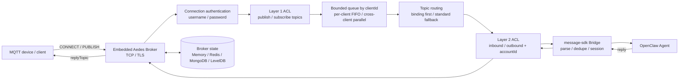
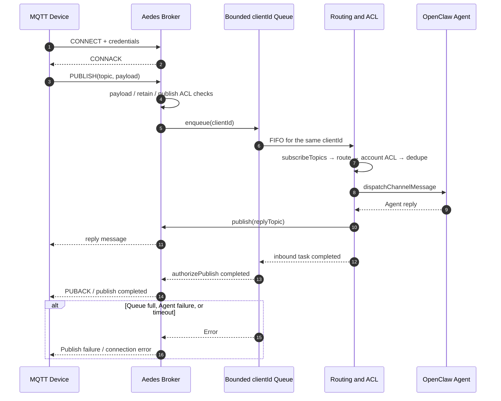
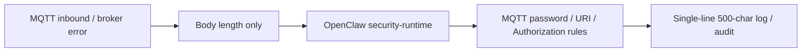

<div align="center">

# OpenClaw MQTT

**OpenClaw plugin — MQTT channel bridge with multi-topic routing and explicit topic bindings**


</div>

[English](./README.md) | [简体中文](./README.zh-CN.md)

## Introduction

`@partme.ai/openclaw-mqtt` is an OpenClaw channel plugin for [OpenClaw](https://github.com/openclaw/openclaw) that embeds an MQTT broker ([Aedes](https://github.com/moscajs/aedes)) and bridges MQTT devices to OpenClaw agents. The plugin uses [`defineChannelPluginEntry`](https://docs.openclaw.ai/plugins/sdk-entrypoints#definechannelpluginentry) + `ChannelPlugin` per the official channel plugin guide (not `definePluginEntry`, which is for non-channel plugins).

### Core Capabilities

- **Embedded Broker**: no external MQTT broker required, works out of the box
- **Explicit Binding First**: `topicBindings` has the highest routing priority
- **Standard Topic Fallback**: falls back to `openclaw/agent/<agentId>/in` when no binding matches
- **Controllable Reply Topic**: supports binding-level `replyTopic`, otherwise auto-derives `/out`
- **Session Context Mapping**: saves agent/account/replyTopic info per session
- **Enterprise Security**: MQTT over TLS, user-level topic ACL, anonymous access control, payload size limits
- **Bounded Reliability**: strict FIFO per clientId, parallel clients, queue limits, and hard Agent-task timeouts

## Architecture



The plugin does not acknowledge a Publish and then run the Agent in an unbounded background task. Aedes completes the publish authorization only after the bounded inbound task finishes; queue overflow, Agent failures, and task timeouts are reported as publish failures.

### Lifecycle

- Embedded broker starts when Gateway runs `startAccount` for MQTT channel (single account `default` in current release)
- HTTP `GET /mqtt/status` is registered in `registerFull`, exposing broker stats, a secret-free config summary, and policy metadata
- Session key granularity follows OpenClaw global `session.dmScope` configuration
- **`package.json` → `openclaw.setupEntry`** points to `dist/setup-entry.js`, exporting a lightweight entry via `defineSetupPluginEntry`

### Highlights

#### 1. Embedded Broker

Aedes starts in-process and supports MQTT 3.1 and MQTT 3.1.1. The current Aedes version does not support MQTT 5.0.

#### 2. Topic Routing

- **Explicit binding**: `topicBindings` array with `topicPattern` → `agentId` + optional `replyTopic`
- **Standard fallback**: `openclaw/agent/<agentId>/in` ↔ `openclaw/agent/<agentId>/out`
- **Wildcard support**: `+` (single segment) and `#` (multi-segment) matching on all topic filters

#### 3. Enterprise Controls

| Area | Feature |
|------|---------|
| Authentication | Username/password, per-user ACL, anonymous access toggle |
| Transport | TCP (1883) + TLS (8883) with configurable cert/key/CA |
| QoS | Native Aedes MQTT QoS 0/1/2; QoS 0 OpenClaw-dispatch mailbox soft limit |
| Persistence | memory, redis, mongodb, level (single-Gateway Broker) |
| Limits | Payload, connections, per-client pending tasks, Agent-task timeout |
| Sessions | Expiry-based cleanup, persistent across reconnect |
| Observability | Prometheus metrics (`prom-client`), structured JSON audit logs |
| Will / Retain | Configurable retain policy, will message allowlist |

### Scaling

The embedded Broker is intentionally a single-Gateway deployment. Redis provides session, offline-packet, and retained-packet persistence; it is not a cross-Gateway message bus:

```json
{
  "channels": {
    "mqtt": {
      "persistence": {
        "enabled": true,
        "backend": "redis",
        "redis": {
          "host": "redis.example.com",
          "port": 6379,
          "db": 0,
          "password": "replace-with-secret",
          "keyPrefix": "prod-openclaw-mqtt",
          "packetTTL": 86400
        }
      }
    }
  }
}
```

`keyPrefix` must be unique per Gateway/environment to prevent key-space collisions. `packetTTL` is the offline QoS packet TTL in seconds; `0` means unlimited. Do not point multiple Gateway processes at the same persistence prefix. For horizontal scaling, deploy a standalone production MQTT Broker instead of treating embedded Brokers as a cluster.

> Migration: the `nedb` backend was removed because its dependency uses `util.isDate`, which is unavailable on the Node.js baseline required by OpenClaw 2026.7.1. Old configurations now fail fast; migrate to local `level` or production `redis`.

## Message Sequence



### Two ACL Layers

1. Broker `publish` / `subscribe` ACLs restrict the topics a client may access.
2. OpenClaw `inbound` / `outbound` ACLs restrict messages entering or leaving an `accountId`.

An ACL rule with `accountId` matches only when the caller supplies that exact account. A missing account never degrades into global authorization. The internal direct-publish contract is for trusted Router/Bridge calls only and must not be exposed to external clients.

## Quick Start

### Prerequisites

- OpenClaw `>= 2026.7.1`
- Node.js `>=22.22.3 <23`, `>=24.15.0 <25`, or `>=25.9.0`

### Install

```bash
openclaw plugins install @partme.ai/openclaw-mqtt
```

Requires `@partme.ai/openclaw-message-sdk 2026.7.1`.

### Minimal Config

```json
{
  "channels": {
    "mqtt": {
      "port": 1883,
      "host": "127.0.0.1",
      "maxConnections": 1000,
      "subscribeTopics": [
        "devices/+/in",
        "openclaw/agent/+/in"
      ],
      "topicBindings": [
        {
          "topicPattern": "devices/+/in",
          "agentId": "iot-agent",
          "accountId": "default",
          "replyTopic": "devices/reply"
        }
      ],
      "payload": {
        "mode": "jsonTextOrPlain"
      }
    }
  },
  "session": {
    "dmScope": "per-channel-peer"
  }
}
```

## Topic Rules

| Type | Format |
|------|--------|
| Standard inbound | `openclaw/agent/<agentId>/in` |
| Standard outbound | `openclaw/agent/<agentId>/out` |
| Explicit routing | Defined by `topicBindings.topicPattern` |

Routing priority: `topicBindings` → Standard inbound parsing → Drop

## Configuration

### Required

| Field | Description |
|-------|-------------|
| `port` | MQTT TCP listener port (default: `1883`) |

### Channel

| Field | Default | Description |
|-------|---------|-------------|
| `port` | `1883` | MQTT TCP listener port |
| `host` | `127.0.0.1` | Listener address; unauthenticated mode is restricted to loopback |
| `maxConnections` | `1000` | Maximum concurrent connections |
| `subscribeTopics` | `[]` | Allowed inbound topic patterns |
| `topicBindings` | `[]` | Explicit topic → agent bindings |

### Auth

| Field | Default | Description |
|-------|---------|-------------|
| `auth.enabled` | `false` | Enable client authentication |
| `auth.allowAnonymous` | `false` | Allow anonymous connections |
| `auth.users` | `[]` | User list with per-user publish/subscribe ACL |

Binding beyond loopback requires authentication. Authenticated mode rejects an empty user list. Anonymous access requires an explicit `anonymous` user with ACL rules, and unmatched publish/subscribe operations are denied by default.

### TLS

| Field | Default | Description |
|-------|---------|-------------|
| `tls.enabled` | `false` | Enable TLS listener (port 8883) |
| `tls.certFile` | — | TLS certificate path (PEM) |
| `tls.keyFile` | — | TLS key path (PEM) |
| `tls.caFile` | — | Optional CA certificate path |
| `tls.requestCert` | `false` | Request client certificate |
| `tls.rejectUnauthorized` | `false` | Reject unauthorized certs |

### Limits & Session

| Field | Default | Description |
|-------|---------|-------------|
| `limits.maxPayloadBytes` | `1048576` | Max payload size in bytes |
| `limits.maxPendingMessagesPerClient` | `32` | Queued or active Agent tasks per clientId |
| `limits.inboundTaskTimeoutMs` | `120000` | Hard timeout for one MQTT-to-Agent task |
| `qos0.mailboxSoftLimit` | `200` | QoS 0 soft limit; the effective limit is the smaller queue limit |
| `session.maxExpirySeconds` | `86400` | Session expiry after disconnect |
| `session.persistentAcrossReconnect` | `true` | Allow sessions to survive reconnect |

### Persistence

| Field | Default | Description |
|-------|---------|-------------|
| `persistence.enabled` | `false` | Enable Broker-state persistence |
| `persistence.backend` | `"memory"` | Backend: `memory`, `redis`, `mongodb`, `level` |
| `persistence.redis.keyPrefix` | `"mqtt"` | Single-Gateway Redis persistence prefix; never share across instances |
| `persistence.redis.packetTTL` | `0` | Offline QoS packet TTL in seconds; 0 is unlimited |
| `persistence.mongodb.url` | `mongodb://localhost:27017` | MongoDB connection URL |
| `persistence.mongodb.dbName` | — | MongoDB database name |
| `persistence.mongodb.collectionPrefix` | — | Collection prefix |
| `persistence.level.path` | `./data/aedes-leveldb` | Single-node LevelDB directory |

Use `memory` for development, `level` for local persistence, and `mongodb` or `redis` where a single Gateway Broker already has that infrastructure. None of these backends provides a cross-Gateway MQTT message bus.

## Testing

```bash
# Unit tests
npm test

# Integration tests
npm run test:client
```

Integration test client environment variables: `MQTT_BROKER_URL`, `MQTT_CLIENT_ID`, `MQTT_TEST_TIMEOUT_MS`, etc.

## GitHub Actions

| Workflow | Trigger | Purpose |
|----------|---------|---------|
| `ci.yml` | Push / PR to `main` | Install, typecheck, build, test |
| `release.yml` | Tag `v*` | Build, test, publish npm package |

## Publishing

```bash
npm version patch
git push origin main --follow-tags
```

## Project Structure

```
openclaw-mqtt/
├── src/
│   ├── index.ts              # defineChannelPluginEntry + registerFull
│   ├── setup-entry.ts        # defineSetupPluginEntry lightweight entry
│   ├── runtime/mqtt-plugin.ts # ChannelPlugin definition
│   ├── transport/gateway-mqtt.ts # Gateway lifecycle management
│   ├── outbound.ts           # ChannelOutboundAdapter
│   ├── inbound.ts            # Inbound message handling
│   ├── transport/server.ts   # Aedes TCP/TLS, auth, ACL, inbound queue
│   ├── routing/topic-router.ts # Topic routing
│   ├── routing/session-mapper.ts # Session context mapping
│   ├── config.ts             # Config parsing and security validation
│   └── runtime.ts            # Runtime
├── scripts/
│   └── test-client.ts       # Integration test client
├── openclaw.plugin.json     # Plugin metadata
├── package.json
└── README.md / README.zh-CN.md
```

## Tech Stack

| Area | Details |
|------|---------|
| Runtime | OpenClaw-supported Node.js 22 / 24 / 25 lines, ESM |
| Broker | [Aedes](https://github.com/moscajs/aedes) |
| Persistence | aedes-persistence-redis, aedes-persistence-mongodb, aedes-persistence-level |
| Metrics | [prom-client](https://github.com/siimon/prom-client) |
| Host | OpenClaw plugin API (`defineChannelPluginEntry`, `registerService`) |

## Version

| Item | Version |
|------|---------|
| @partme.ai/openclaw-mqtt | 2026.7.1 |
| Recommended Node | 24.15.0+ (supported Node 22 / 25 ranges also work) |

## Security

- **Never store credentials in config**: use environment variables or secret managers for passwords and API keys
- **TLS verification**: enable `tls.rejectUnauthorized` in production to prevent MITM attacks
- **ACL scoping**: use `auth.users[].publishAllow` / `subscribeAllow` to restrict device topics
- **Account isolation**: use `aclRules[].accountId` for cross-account authorization; matching is exact
- **Audit logging**: enable `audit.enabled` for structured JSON logs compatible with ELK/SIEM
- **No message body in runtime logs**: inbound logs expose `textLength`, not the first payload bytes.
  Topic/client/session values and transport errors cross the OpenClaw 2026.7.1 security runtime plus
  MQTT-specific password, URI, and Authorization rules before logging.

```text
MQTT inbound / broker error
          │
          ▼
omit payload body (record textLength only)
          │
          ▼
OpenClaw redaction + configured secret/URI/Bearer rules
          │
          ▼
control cleanup + 500-char limit → Gateway log / audit
```



## FAQ

**Does this plugin require an external MQTT broker?**

No, the plugin embeds `aedes` broker.

**How is payload parsed?**

Default `jsonTextOrPlain` mode: parses `JSON.text` field first, falls back to raw text if not found.

**How do I bind a Topic to an Agent?**

Configure `topicPattern` and `agentId` via `topicBindings`, with optional `replyTopic`.

## Links

| Resource | URL |
|----------|-----|
| OpenClaw | [https://docs.openclaw.ai](https://docs.openclaw.ai) |
| OpenClaw (source) | [https://github.com/openclaw/openclaw](https://github.com/openclaw/openclaw) |
| Aedes MQTT Broker | [https://github.com/moscajs/aedes](https://github.com/moscajs/aedes) |
| RabbitMQ MQTT Reference | [https://www.rabbitmq.com/docs/mqtt](https://www.rabbitmq.com/docs/mqtt) |
| Chinese README | [README.zh-CN.md](./README.zh-CN.md) |

### OpenClaw Documentation

| Topic | URL |
|-------|-----|
| Channel plugins | [https://docs.openclaw.ai/plugins/sdk-channel-plugins](https://docs.openclaw.ai/plugins/sdk-channel-plugins) |
| SDK entry points | [https://docs.openclaw.ai/plugins/sdk-entrypoints](https://docs.openclaw.ai/plugins/sdk-entrypoints) |
| SDK runtime | [https://docs.openclaw.ai/plugins/sdk-runtime](https://docs.openclaw.ai/plugins/sdk-runtime) |
| SDK setup | [https://docs.openclaw.ai/plugins/sdk-setup](https://docs.openclaw.ai/plugins/sdk-setup) |

## License

This project is licensed under the [MIT License](LICENSE).

## Acknowledgements

- [Aedes](https://github.com/moscajs/aedes) — Embedded MQTT broker
- [RabbitMQ](https://www.rabbitmq.com/) — Enterprise MQTT feature reference
- [OpenClaw](https://docs.openclaw.ai) — Plugin host runtime

---

<div align="center">

**If this project helps you, consider giving it a star**

Made with love by PartMe

</div>

## Message Format Guide

MQTT uses the shared OpenClaw queue wire contract for inbound parsing and reply serialization. See [OpenClaw Queue Message Format Guide](../../doc/OpenClaw-Queue-Message-Format-Guide.en.md) for standard `MessageEnvelope` payloads, non-standard normalization, `payload.outboundFormat`, and cross-language SDK adapter guidance.
