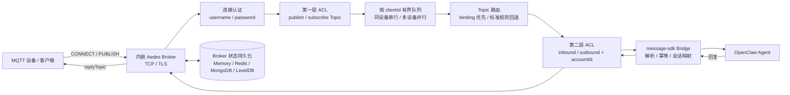
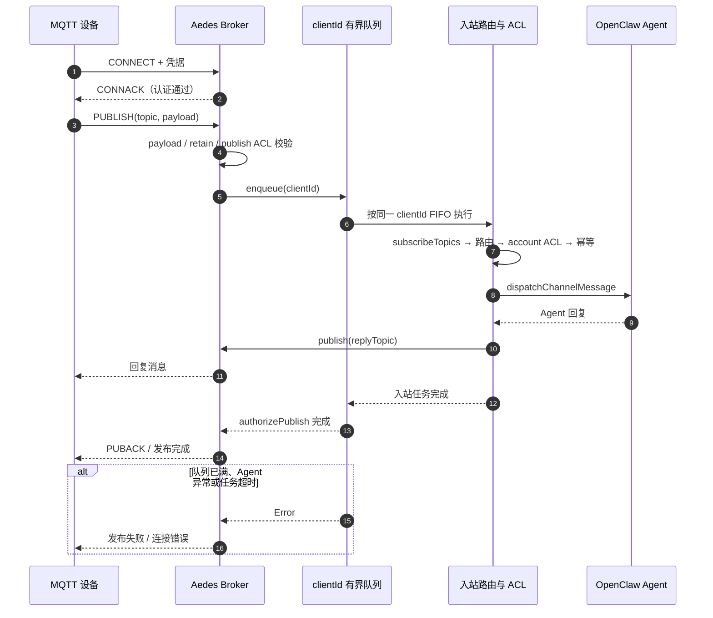
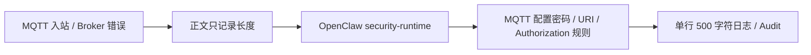

<div align="center">

# OpenClaw MQTT

**OpenClaw 插件：支持多 Topic 与显式绑定规则的 MQTT 渠道桥接**


</div>

<!-- README_STANDARD_START -->

> 统一阅读顺序：组件定位 → 架构 → 流程 → 边界 → 安装 → 配置 → 运维 → 深入阅读。
> 本区块以 npm 可稳定渲染的 text 图为主；适用时，更深入的 Mermaid 图保留在仓库 `doc/` 设计资料中。

[简体中文](./README.zh-CN.md) | [English](./README.md)

## 1. 组件定位

提供内嵌 Broker、Topic 绑定和可靠入站队列。组件类型：**MQTT Wire Channel**。

| 项目 | 内容 |
|---|---|
| npm 包 | `@partme.ai/openclaw-mqtt` |
| 当前版本 | `2026.7.1` |
| 插件 ID | `mqtt` |
| Channel ID | `mqtt` |
| OpenClaw | `>=2026.7.1` |
| 源码目录 | `extensions/mqtt` |

## 2. 一眼看懂

```text
[MQTT Client 发布与订阅]
          │
          ▼
┌──────────────────────────────────────────────────────────────┐
│ OpenClaw Gateway 内: mqtt
│ 1. Broker 鉴权、Topic 策略与限流
│ 2. 解码、去重并进入 Agent
│ 3. 编码回复并发布到绑定 Topic
└──────────────────────────────────────────────────────────────┘
          │
          ▼
[MQTT 消息与会话结果]
```

## 3. 架构与核心流程

该组件把“协议/平台差异”限制在自身边界内，对 OpenClaw 暴露稳定的插件、Channel、Hook、Tool 或 Service 契约。

```text
MQTT Client 发布与订阅
  │
  ▼
Broker 鉴权、Topic 策略与限流
  │
  ▼
解码、去重并进入 Agent
  │
  ▼
编码回复并发布到绑定 Topic
  │
  ▼
MQTT 消息与会话结果

异常路径: 任一步失败：记录可诊断错误并按组件策略重试、拒绝或降级
```

## 4. 能力与边界

| 能力 | 说明 |
|---|---|
| 负责 | 提供内嵌 Broker、Topic 绑定和可靠入站队列 |
| 不负责 | 不替代外部 MQTT 集群治理或设备 PKI |
| 输入 | MQTT Client 发布与订阅 |
| 输出 | MQTT 消息与会话结果 |
| 失败原则 | 默认失败应可观测；鉴权、边界校验和持久化失败不得伪装成功 |

## 5. 快速开始

```bash
openclaw plugins install "@partme.ai/openclaw-mqtt@2026.7.1"
```

安装后先按最小权限配置，再启动 Gateway；生产环境应在隔离配置目录中完成连通性、权限和失败恢复验证。

## 6. 配置入口

| 配置层 | 路径 |
|---|---|
| 插件配置 | `plugins.entries.mqtt.config` |
| Channel 配置 | `channels["mqtt"]` |
| 配置 Schema | `extensions/mqtt/openclaw.plugin.json` |

配置字段、环境变量与完整示例继续保留在下方原有详细说明中。

## 7. 运维、安全与故障定位

- 先确认 OpenClaw 版本、插件版本、manifest ID 与配置键一致。
- 凭据使用环境变量或 SecretRef，不写入日志、仓库和示例明文。
- 通过 Gateway 日志、插件健康状态及外部依赖状态分层定位问题。
- 升级前备份状态数据；涉及游标、队列或索引时，必须验证重启恢复与重复投递语义。

## 8. 验证与深入阅读

```bash
pnpm --filter "@partme.ai/openclaw-mqtt" typecheck
pnpm --filter "@partme.ai/openclaw-mqtt" test
pnpm --filter "@partme.ai/openclaw-mqtt" build
```

- [插件总体架构](../../doc/OpenClaw-Plugins-Architecture_CN.md)
- [统一插件结构规范](../../doc/OpenClaw-Plugins-Structure-Standard.md)

## 9. 原有详细说明

以下内容保留该组件原有的配置表、协议细节、示例和故障排查资料。

<!-- README_STANDARD_END -->


[English](./README.md) | [简体中文](./README.zh-CN.md)

## 简介

`@partme.ai/openclaw-mqtt` 是为 [OpenClaw](https://github.com/openclaw/openclaw) 提供的 MQTT 渠道插件，内置 [Aedes](https://github.com/moscajs/aedes) broker，将设备消息桥接到 Agent。插件按照官方文档使用 [`defineChannelPluginEntry`](https://docs.openclaw.ai/plugins/sdk-entrypoints#definechannelpluginentry) + `ChannelPlugin` 实现（渠道插件请勿使用仅适用于非渠道插件的 `definePluginEntry`）。

### 核心能力

- **内嵌 Broker**：无需额外部署 MQTT broker，开箱即用
- **显式绑定优先**：`topicBindings` 命中有最高路由优先级
- **标准 Topic 回退**：未命中绑定时自动回退到 `openclaw/agent/<agentId>/in`
- **回复 Topic 可控**：支持绑定级 `replyTopic`，否则自动推导 `/out`
- **会话上下文映射**：按 session 保存 agent/account/replyTopic 信息
- **企业级安全**：MQTT over TLS、用户级 topic ACL、匿名访问控制、消息大小限制
- **有界可靠性**：同一 clientId 严格 FIFO、跨客户端并行、队列上限、Agent 任务硬超时

## 架构总览

先用字符图看清运行边界与主数据流；下方 Mermaid 保留相同结构，便于渲染、维护和继续扩展：

```text
┌──────────────────────────── OpenClaw Gateway ────────────────────────────┐
│                                                                         │
│  openclaw-mqtt                                                         │
│                                                                         │
│  ┌───────────────┐   ┌────────────────┐   ┌─────────────────────────┐  │
│  │ Aedes Broker  │──▶│ 认证 + Topic ACL│──▶│ clientId 有界串行队列   │  │
│  │ TCP / TLS     │   │ 连接数/载荷/Retain│  │ 跨设备并行 + 停机排空   │  │
│  └───────┬───────┘   └────────────────┘   └────────────┬────────────┘  │
│          │                                             │               │
│          │             ┌───────────────────────────────▼────────────┐  │
│          │             │ Topic 路由 → account ACL → message-sdk    │  │
│          │             │ Packet 幂等 → Session 映射 → Agent Reply  │  │
│          │             └───────────────────────────────┬────────────┘  │
│          │                                             │               │
│          └──────────── replyTopic ◀────────────────────┘               │
│                                                                         │
│  状态持久化：Memory / Redis / MongoDB / LevelDB                         │
└──────────────────────────────────┬──────────────────────────────────────┘
                                   │ MQTT 3.1 / 3.1.1
                                   ▼
                         ┌─────────────────────┐
                         │ 设备、网关、IoT 客户端│
                         └─────────────────────┘
```



这不是“收到 MQTT 包就立即返回成功”的旁路桥接。客户端 Publish 进入有界队列后，只有 Agent 入站处理完成，Aedes 才完成本次发布确认；队列已满、处理失败或超时都会反馈为发布失败。

QoS Packet Identifier 的去重范围是 `clientId + topic + messageId + payload SHA-256`，不会让不同设备的相同编号互相冲突。`DUP=false` 的新发布会刷新已复用编号；Agent dispatch 失败会释放幂等预占，使客户端的 QoS 重投可以再次进入处理链。Gateway 停止时先拒绝新任务并断开 MQTT socket，再等待已经开始的任务链真实结束。

### 生命周期

- 内嵌 Broker 在 Gateway 对 MQTT 渠道执行 `startAccount` 时启动（当前版本为单账号 `default`）
- HTTP `GET /mqtt/status` 在入口的 `registerFull` 中注册，可查看 broker 统计、脱敏配置摘要及策略元数据
- 会话键粒度遵循 OpenClaw 全局 `session.dmScope` 配置
- **`package.json` → `openclaw.setupEntry`** 指向 `dist/setup-entry.js`，通过 `defineSetupPluginEntry` 导出轻量入口

### 主要特性

#### 1. 内嵌 Broker

Aedes MQTT broker 随进程启动，支持 MQTT 3.1 和 MQTT 3.1.1。当前 Aedes 版本不支持 MQTT 5.0。

#### 2. Topic 路由

- **显式绑定**：`topicBindings` 数组中配置 `topicPattern` → `agentId` + 可选 `replyTopic`
- **标准回退**：`openclaw/agent/<agentId>/in` ↔ `openclaw/agent/<agentId>/out`
- **通配符支持**：`+`（单段匹配）和 `#`（多段匹配）

#### 3. 企业级控制

| 领域 | 功能 |
|------|------|
| 认证 | 用户名/密码、每用户 ACL、匿名访问开关 |
| 传输 | TCP（1883）+ TLS（8883），可配置 cert/key/CA |
| QoS | Aedes 原生处理 MQTT QoS 0/1/2；QoS 0 的 OpenClaw 分发链路带 mailbox 软限制 |
| 持久化 | memory、redis、mongodb、level（均为单 Gateway Broker） |
| 限制 | 最大 payload、最大连接数、单客户端待处理任务数、Agent 任务超时 |
| 会话 | 基于过期时间的清理，支持跨重连保留 |
| 可观测性 | Prometheus 指标（`prom-client`）、结构化 JSON 审计日志 |
| Will / Retain | 可配置 retain 策略、will 消息白名单 |

### 部署边界

当前插件定位为单 Gateway 内嵌 Broker。Redis 后端只提供会话、离线消息和 retained packet 持久化，不再声明跨 Gateway 消息总线能力：

```json
{
  "channels": {
    "mqtt": {
      "persistence": {
        "enabled": true,
        "backend": "redis",
        "redis": {
          "host": "redis.example.com",
          "port": 6379,
          "db": 0,
          "password": "replace-with-secret",
          "keyPrefix": "prod-openclaw-mqtt",
          "packetTTL": 86400
        }
      }
    }
  }
}
```

`keyPrefix` 必须按环境唯一，避免共享 Redis 时键空间冲突。`packetTTL` 是离线 QoS 消息保留秒数，`0` 表示不限制。不要让多个 Gateway 同时使用同一 MQTT persistence keyPrefix；需要水平扩展时，应部署独立的生产 MQTT Broker，再由专门的外部 Broker client 渠道接入，而不是把多个内嵌 Broker 伪装成一个集群。

> 迁移说明：`nedb` 后端已移除。其依赖使用了 Node.js 新版本已删除的 `util.isDate`，与 OpenClaw 2026.7.1 的 Node 基线不兼容。旧配置会在启动时明确失败，请迁移到本地 `level` 或生产集群使用的 `redis`。

## 消息处理时序



### 两层 ACL 的边界

1. Broker 层 `publish` / `subscribe` ACL 控制客户端能操作哪些 Topic。
2. OpenClaw 层 `inbound` / `outbound` ACL 控制消息能否进入或离开指定 `accountId`。

带 `accountId` 的 ACL 规则只在调用方提供完全相同的账号时匹配；缺失账号不会退化成全局授权。内部直接发布接口仅供可信的 Router/Bridge 调用，不应暴露给外部客户端。

## 快速开始

### 前置条件

- OpenClaw `>= 2026.7.1`
- Node.js `>=22.22.3 <23`、`>=24.15.0 <25` 或 `>=25.9.0`

### 安装

```bash
openclaw plugins install @partme.ai/openclaw-mqtt
```

依赖：`@partme.ai/openclaw-message-sdk 2026.7.1`。

### message-sdk 复用

| message-sdk 模块 | mqtt 挂载点 | 用途 |
|------------------|-------------|------|
| `bridge`（`normalizeWireIngress`、`dispatchChannelMessage`、`resolveChannelDispatchIdentity`） | `src/inbound.ts` | Wire 入站解析与 reply 管线派发 |
| `dedup`（`createIdempotencyCache`） | `src/shared/wire-helpers.ts` | 入站 messageId 幂等（`getGlobalSingleton` 单例） |
| `config`（`resolveChannelAgentReplyTimeoutMs`、`resolveChannelMediaMaxBytes`） | `src/config/resolvers.ts` | Agent 超时与媒体上限薄封装 |
| `openclaw/plugin-sdk`（`chunkText`、`sanitizeForPlainText`） | `src/outbound.ts` | 出站文本分块与纯文本清理 |

### 最小配置

```json
{
  "channels": {
    "mqtt": {
      "port": 1883,
      "host": "127.0.0.1",
      "maxConnections": 1000,
      "subscribeTopics": [
        "devices/+/in",
        "openclaw/agent/+/in"
      ],
      "topicBindings": [
        {
          "topicPattern": "devices/+/in",
          "agentId": "iot-agent",
          "accountId": "default",
          "replyTopic": "devices/reply"
        }
      ],
      "payload": {
        "mode": "jsonTextOrPlain"
      },
      "auth": {
        "enabled": true,
        "allowAnonymous": false,
        "users": [
          {
            "username": "iot-device",
            "passwordHash": "replace-with-sha256-or-sha512-hash",
            "hashAlgorithm": "sha256",
            "publishAllow": ["devices/+/in"],
            "subscribeAllow": ["devices/+/out"]
          }
        ]
      }
    }
  },
  "session": {
    "dmScope": "per-channel-peer"
  }
}
```

## Topic 规则

| 类型 | 格式 |
|------|------|
| 标准入站 | `openclaw/agent/<agentId>/in` |
| 标准出站 | `openclaw/agent/<agentId>/out` |
| 显式路由 | 由 `topicBindings.topicPattern` 定义 |

路由优先级：`topicBindings` → 标准入站解析 → 丢弃

## 配置说明

### 必填

| 字段 | 说明 |
|------|------|
| `port` | MQTT TCP 监听端口（默认：`1883`） |

### Channel

| 字段 | 默认值 | 说明 |
|------|--------|------|
| `port` | `1883` | MQTT TCP 监听端口 |
| `host` | `127.0.0.1` | 监听地址；未启用认证时只允许 loopback |
| `maxConnections` | `1000` | 最大并发连接数 |
| `subscribeTopics` | `[]` | 允许接收的入站 topic 模式 |
| `topicBindings` | `[]` | 显式 topic → agent 绑定规则 |

### Auth

| 字段 | 默认值 | 说明 |
|------|--------|------|
| `auth.enabled` | `false` | 启用客户端认证 |
| `auth.allowAnonymous` | `false` | 允许匿名连接 |
| `auth.users` | `[]` | 用户列表，支持每用户 publish/subscribe ACL |

安全规则：绑定到非 loopback 地址时必须开启认证；认证模式不得使用空用户列表；`allowAnonymous: true` 时必须显式配置名为 `anonymous` 且带 ACL 的用户。没有匹配 ACL 的 publish/subscribe 默认拒绝。

### TLS

| 字段 | 默认值 | 说明 |
|------|--------|------|
| `tls.enabled` | `false` | 启用 TLS 监听（端口 8883） |
| `tls.certFile` | — | TLS 证书路径（PEM） |
| `tls.keyFile` | — | TLS 私钥路径（PEM） |
| `tls.caFile` | — | 可选 CA 证书路径 |
| `tls.requestCert` | `false` | 请求客户端证书 |
| `tls.rejectUnauthorized` | `false` | 拒绝未授权证书 |

### 限制与会话

| 字段 | 默认值 | 说明 |
|------|--------|------|
| `limits.maxPayloadBytes` | `1048576` | 单条消息最大字节数 |
| `limits.maxPendingMessagesPerClient` | `32` | 单个 clientId 等待或执行中的 Agent 任务上限 |
| `limits.inboundTaskTimeoutMs` | `120000` | 单次 MQTT → Agent 任务硬超时 |
| `qos0.mailboxSoftLimit` | `200` | QoS 0 软上限；实际取该值与通用队列上限的较小值 |
| `session.maxExpirySeconds` | `86400` | 断线后会话过期时间 |
| `session.persistentAcrossReconnect` | `true` | 允许会话跨重连保留 |

### 持久化

| 字段 | 默认值 | 说明 |
|------|--------|------|
| `persistence.enabled` | `false` | 启用 Broker 状态持久化 |
| `persistence.backend` | `"memory"` | 后端类型：`memory`、`redis`、`mongodb`、`level` |
| `persistence.redis.keyPrefix` | `"mqtt"` | 单 Gateway Redis 持久化键前缀；不同实例不得共享 |
| `persistence.redis.packetTTL` | `0` | 离线 QoS 包 TTL（秒，0 为不限制） |
| `persistence.mongodb.url` | `mongodb://localhost:27017` | MongoDB 地址 |
| `persistence.mongodb.dbName` | — | MongoDB 数据库名 |
| `persistence.mongodb.collectionPrefix` | — | collection 前缀 |
| `persistence.level.path` | `./data/aedes-leveldb` | 单节点 LevelDB 数据目录 |

后端选择原则：`memory` 用于开发；`level` 用于本地持久化；`mongodb`/`redis` 用于已有基础设施的单 Gateway Broker。所有后端都不提供跨 Gateway MQTT 消息总线。

## 测试

```bash
# 单元测试
npm test

# 集成测试
npm run test:client
```

集成测试客户端环境变量：`MQTT_BROKER_URL`、`MQTT_CLIENT_ID`、`MQTT_TEST_TIMEOUT_MS` 等。

## GitHub Actions

| 工作流 | 触发方式 | 作用 |
|--------|----------|------|
| `ci.yml` | push / PR 到 `main` | 安装、类型检查、构建、测试 |
| `release.yml` | `v*` 标签 | 构建、测试并发布 npm 包 |

## 发版

```bash
npm version patch
git push origin main --follow-tags
```

## 项目结构

```
openclaw-mqtt/
├── src/
│   ├── index.ts              # defineChannelPluginEntry + registerFull
│   ├── setup-entry.ts        # defineSetupPluginEntry 轻量入口
│   ├── runtime/mqtt-plugin.ts # ChannelPlugin 定义
│   ├── transport/gateway-mqtt.ts # Gateway 生命周期管理
│   ├── outbound.ts           # ChannelOutboundAdapter
│   ├── inbound.ts            # 入站消息处理
│   ├── transport/server.ts   # Aedes TCP/TLS、认证、ACL、入站队列
│   ├── routing/topic-router.ts # Topic 路由解析
│   ├── routing/session-mapper.ts # 会话上下文映射
│   ├── config.ts             # 配置解析与安全校验
│   └── runtime.ts            # 运行时
├── scripts/
│   └── test-client.ts       # 集成测试客户端
├── openclaw.plugin.json     # 插件元数据
├── package.json
└── README.md / README.zh-CN.md
```

## 技术栈

| 类别 | 详情 |
|------|------|
| 运行时 | OpenClaw 支持的 Node.js 22 / 24 / 25 版本线、ESM |
| Broker | [Aedes](https://github.com/moscajs/aedes) |
| 持久化 | aedes-persistence-redis、aedes-persistence-mongodb、aedes-persistence-level |
| 指标 | [prom-client](https://github.com/siimon/prom-client) |
| 宿主 | OpenClaw 插件 API（`defineChannelPluginEntry`、`registerService`） |

## 版本信息

| 项目 | 版本 |
|------|------|
| @partme.ai/openclaw-mqtt | 2026.7.1 |
| 推荐 Node | 24.15.0+（同时支持规定范围内的 Node 22 / 25） |

## 安全

- **不要在配置中存储凭据**：使用环境变量或密钥管理器存放密码和 API 密钥
- **TLS 校验**：生产环境建议启用 `tls.rejectUnauthorized` 防止中间人攻击
- **ACL 范围控制**：使用 `auth.users[].publishAllow` / `subscribeAllow` 限制设备 topic
- **账号隔离**：需要跨账号授权时使用 `aclRules[].accountId`，规则只精确匹配指定账号
- **审计日志**：启用 `audit.enabled` 输出结构化 JSON 日志，兼容 ELK/SIEM
- **业务正文不进运行日志**：入站日志仅记录 `textLength`，不再打印前 100 字符；Topic、Client、
  Session 与底层异常先经过 OpenClaw 2026.7.1 `security-runtime` 和插件凭据规则。

```text
MQTT 入站 / Broker 错误
          │
          ▼
不记录 payload 正文（仅 textLength）
          │
          ▼
OpenClaw 官方脱敏 + 配置密码/URI/Bearer 规则
          │
          ▼
控制字符清理 + 500 字符上限 → Gateway 日志 / Audit
```



## 常见问题

**是否必须依赖外部 MQTT broker？**

不需要，插件内嵌 `aedes` broker。

**Payload 如何解析？**

默认 `jsonTextOrPlain` 模式：优先解析 `JSON.text` 字段，未命中则回退原始文本。

**如何绑定 Topic 到 Agent？**

通过 `topicBindings` 配置 `topicPattern` 与 `agentId`，可选配置 `replyTopic`。

## 企业级可靠性

> 完整说明：[队列可靠性指南](../../doc/OpenClaw-Queue-Reliability-Guide.md)

| 项 | 行为 |
|----|------|
| **分级** | 可企业试点 |
| **入站 ACK** | QoS 1/2 仅在 OpenClaw dispatch 成功后允许 Aedes 完成协议确认；失败释放幂等预占并拒绝确认，交由客户端重投 |
| **出站 reply** | `publishMessage` await Aedes 回调 |
| **自消费** | broker 侧 publish（`client==null`）不触发入站 |
| **背压** | QoS0 OpenClaw 分发 mailbox 软限制；QoS 1/2 的协议确认与重投由 Aedes/MQTT 客户端负责 |
| **幂等** | messageId 60s 内存 dedup |
| **生产** | 开启 `auth`、TLS；每个内嵌 Broker 使用独立 persistence 命名空间，多实例共享消息请改用外部 MQTT Broker |

## 相关链接

| 资源 | 链接 |
|------|------|
| OpenClaw | [https://docs.openclaw.ai](https://docs.openclaw.ai) |
| OpenClaw 源码 | [https://github.com/openclaw/openclaw](https://github.com/openclaw/openclaw) |
| Aedes MQTT Broker | [https://github.com/moscajs/aedes](https://github.com/moscajs/aedes) |
| RabbitMQ MQTT 参考 | [https://www.rabbitmq.com/docs/mqtt](https://www.rabbitmq.com/docs/mqtt) |
| English | [README.md](./README.md) |

### OpenClaw 官方文档

| 说明 | 链接 |
|------|------|
| Channel plugins | [https://docs.openclaw.ai/plugins/sdk-channel-plugins](https://docs.openclaw.ai/plugins/sdk-channel-plugins) |
| SDK entry points | [https://docs.openclaw.ai/plugins/sdk-entrypoints](https://docs.openclaw.ai/plugins/sdk-entrypoints) |
| SDK runtime | [https://docs.openclaw.ai/plugins/sdk-runtime](https://docs.openclaw.ai/plugins/sdk-runtime) |
| SDK setup | [https://docs.openclaw.ai/plugins/sdk-setup](https://docs.openclaw.ai/plugins/sdk-setup) |

## 开源协议

本项目采用 [MIT License](LICENSE) 协议。

## 致谢

- [Aedes](https://github.com/moscajs/aedes) — 内嵌 MQTT broker
- [RabbitMQ](https://www.rabbitmq.com/) — 企业级 MQTT 功能参考
- [OpenClaw](https://docs.openclaw.ai) — 插件宿主运行时

---

<div align="center">

**如果这个项目对你有帮助，请给我们一个星星**

Made with love by PartMe

</div>

## 消息格式指南

MQTT 使用共享的 OpenClaw 队列 wire 契约完成入站解析与回复序列化。标准 `MessageEnvelope`、非标准消息归一化、`payload.outboundFormat` 与多语言 SDK 适配说明见 [OpenClaw 队列消息格式指南](../../doc/OpenClaw-Queue-Message-Format-Guide.md)。
