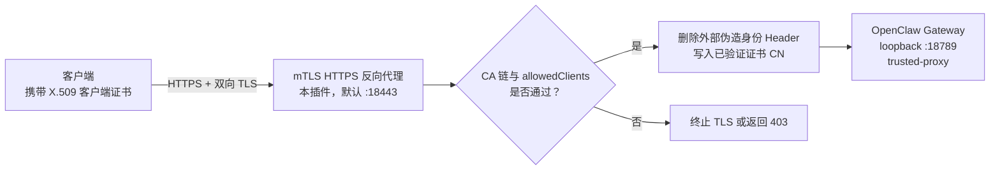

# OpenClaw mTLS

<!-- README_STANDARD_START -->

> 统一阅读顺序：组件定位 → 架构 → 流程 → 边界 → 安装 → 配置 → 运维 → 深入阅读。
> 本区块以 npm 可稳定渲染的 text 图为主；适用时，更深入的 Mermaid 图保留在仓库 `doc/` 设计资料中。

[简体中文](./README.zh-CN.md) | [English](./README.md)

## 1. 组件定位

在 Gateway 前提供双向 TLS 身份边界。组件类型：**安全反向代理**。

| 项目 | 内容 |
|---|---|
| npm 包 | `@partme.ai/openclaw-mtls` |
| 当前版本 | `2026.7.1` |
| 插件 ID | `mtls` |
| Channel ID | — |
| OpenClaw | `>=2026.7.1` |
| 源码目录 | `extensions/mtls` |

## 2. 一眼看懂

```text
[TLS 客户端连接]
          │
          ▼
┌──────────────────────────────────────────────────────────────┐
│ OpenClaw Gateway 内: mtls
│ 1. 校验证书链与客户端身份
│ 2. 覆盖可信身份头并移除伪造值
│ 3. 代理 HTTP / WebSocket 到 Gateway
└──────────────────────────────────────────────────────────────┘
          │
          ▼
[经认证的 Gateway 请求]
```

## 3. 架构与核心流程

该组件把“协议/平台差异”限制在自身边界内，对 OpenClaw 暴露稳定的插件、Channel、Hook、Tool 或 Service 契约。

```text
TLS 客户端连接
  │
  ▼
校验证书链与客户端身份
  │
  ▼
覆盖可信身份头并移除伪造值
  │
  ▼
代理 HTTP / WebSocket 到 Gateway
  │
  ▼
经认证的 Gateway 请求

异常路径: 任一步失败：记录可诊断错误并按组件策略重试、拒绝或降级
```

## 4. 能力与边界

| 能力 | 说明 |
|---|---|
| 负责 | 在 Gateway 前提供双向 TLS 身份边界 |
| 不负责 | 不签发证书，也不替代 Gateway 内部授权 |
| 输入 | TLS 客户端连接 |
| 输出 | 经认证的 Gateway 请求 |
| 失败原则 | 默认失败应可观测；鉴权、边界校验和持久化失败不得伪装成功 |

## 5. 快速开始

```bash
openclaw plugins install "@partme.ai/openclaw-mtls@2026.7.1"
```

安装后先按最小权限配置，再启动 Gateway；生产环境应在隔离配置目录中完成连通性、权限和失败恢复验证。

## 6. 配置入口

| 配置层 | 路径 |
|---|---|
| 插件配置 | `plugins.entries.mtls.config` |
| Channel 配置 | 不适用 |
| 配置 Schema | `extensions/mtls/openclaw.plugin.json` |

配置字段、环境变量与完整示例继续保留在下方原有详细说明中。

## 7. 运维、安全与故障定位

- 先确认 OpenClaw 版本、插件版本、manifest ID 与配置键一致。
- 凭据使用环境变量或 SecretRef，不写入日志、仓库和示例明文。
- 通过 Gateway 日志、插件健康状态及外部依赖状态分层定位问题。
- 升级前备份状态数据；涉及游标、队列或索引时，必须验证重启恢复与重复投递语义。

## 8. 验证与深入阅读

```bash
pnpm --filter "@partme.ai/openclaw-mtls" typecheck
pnpm --filter "@partme.ai/openclaw-mtls" test
pnpm --filter "@partme.ai/openclaw-mtls" build
```

- [插件总体架构](../../doc/OpenClaw-Plugins-Architecture_CN.md)
- [统一插件结构规范](../../doc/OpenClaw-Plugins-Structure-Standard.md)

## 9. 原有详细说明

以下内容保留该组件原有的配置表、协议细节、示例和故障排查资料。

<!-- README_STANDARD_END -->


**OpenClaw 插件 — mTLS (Mutual TLS) 双向证书认证**


[English](./README.md) | [简体中文](./README.zh-CN.md)

## 📖 简介

`@partme.ai/openclaw-mtls` 是 OpenClaw 的安全鉴权插件，提供 **mTLS (Mutual TLS)** 双向证书认证功能，用于保护 OpenClaw Gateway 的安全访问。

### 什么是 mTLS？

mTLS（Mutual TLS）是一种安全机制，在这种机制下，客户端和服务端都需要通过 X.509 证书进行身份验证。与标准 TLS 不同（只有服务端向客户端展示证书），mTLS 要求客户端也必须展示由可信 Certificate Authority (CA) 签发的有效证书。

### 核心能力

- **双向认证**：服务端和客户端均需提供证书进行双向验证
- **客户端证书验证**：提取并验证客户端证书的 CN、issuer、fingerprint
- **白名单控制**：通过 `allowedClients`（CN/issuer/fingerprint）细粒度控制访问权限
- **基于路径的保护**：通过 `protectedPaths` 配置哪些路径需要 mTLS 认证
- **失败关闭**：受保护路径绝不接受缺失或未通过 CA 验证的客户端证书；公开路径必须显式声明
- **证书信息传递**：通过 HTTP Header 将客户端证书信息传递给下游服务
- **OpenClaw 集成**：遵循 OpenClaw 安全插件架构

### 架构

```text
外部客户端
    │ HTTPS / WSS + 客户端证书
    ▼
mTLS 代理 ──▶ CA 链 / 指纹 / Subject / 路径策略
    │                    │
    │                    └── 拒绝 ──▶ 4xx / TLS 失败
    ▼ 仅注入代理生成的可信身份 Header
loopback OpenClaw Gateway（trusted-proxy）
```



### 生命周期

- 插件通过 `registerService` 启动独立 HTTPS 代理
- 代理同时转发普通 HTTP 与 WebSocket Upgrade
- 从代理 TLS socket 中提取客户端证书
- 根据 `allowedClients` 白名单验证证书（如已配置）
- 删除客户端伪造的身份 Header，再写入证书 CN
- OpenClaw 使用官方 `gateway.auth.mode: "trusted-proxy"` 完成最终鉴权
- 状态端点：`GET https://<host>:18443/mtls/status` 会转发到 OpenClaw 的 `auth: "gateway"` 路由，不在代理层匿名暴露运行信息

## 🚀 快速开始

### 前置条件

- OpenClaw `>= 2026.7.1`
- Node.js `20+`
- TLS 证书（服务器证书/私钥和用于验证客户端证书的 CA）

### 安装

```bash
openclaw plugins install @partme.ai/openclaw-mtls
```

### 最小配置

```json
{
  "gateway": {
    "bind": "loopback",
    "port": 18789,
    "trustedProxies": ["127.0.0.1", "::1"],
    "auth": {
      "mode": "trusted-proxy",
      "trustedProxy": {
        "allowLoopback": true,
        "userHeader": "x-forwarded-user",
        "allowUsers": ["trusted-client-1", "trusted-client-2"]
      }
    }
  },
  "plugins": {
    "entries": {
      "mtls": {
        "enabled": true,
        "config": {
          "enabled": true,
          "tls": {
            "certFile": "/path/to/server-cert.pem",
            "keyFile": "/path/to/server-key.pem",
            "caFile": "/path/to/ca-cert.pem"
          },
          "proxy": {
            "listenHost": "0.0.0.0",
            "listenPort": 18443,
            "upstreamHost": "127.0.0.1",
            "upstreamPort": 18789,
            "userHeader": "x-forwarded-user"
          },
          "allowedClients": [
            { "cn": "trusted-client-1" },
            { "cn": "trusted-client-2", "issuer": "My CA" }
          ]
        }
      }
    }
  }
}
```

## 🔐 配置说明

### 顶层字段

| 字段 | 默认值 | 说明 |
|------|--------|------|
| `enabled` | `false` | 启用/禁用 mTLS 代理；启用后证书缺失会启动失败 |
| `tls` | — | TLS 服务器配置 |
| `proxy` | `:18443 → 127.0.0.1:18789` | mTLS 监听地址与 Gateway 上游 |
| `protectedPaths` | `[{path:"/",match:"prefix"}]` | 需要 mTLS 认证的路径 |
| `allowedClients` | `[]` | 允许的客户端证书白名单 |
| `skipPaths` | `/health`、`/auth/status` | 跳过 mTLS 身份要求的公开路径；`/mtls/status` 默认受保护 |
| `passthrough` | 固定为 `false` | 兼容字段；不能把受保护路径整体降级为透传 |
| `headerName` | `X-Client-Cert` | 向下游传递证书信息的 Header |
| `headerCertField` | `subject` | 用于 Header 值的证书字段 |

### TLS 配置

| 字段 | 默认值 | 说明 |
|------|--------|------|
| `tls.enabled` | `true` | 启用 TLS |
| `tls.certFile` | — | 服务器证书文件路径 |
| `tls.keyFile` | — | 服务器私钥文件路径 |
| `tls.caFile` | — | CA 证书文件路径（用于验证客户端证书） |
| `tls.requestCert` | 固定为 `true` | TLS 监听器必须请求客户端证书 |
| `tls.rejectUnauthorized` | 固定为 `true` | 证书只有通过 CA 校验后才能成为可信身份 |

### 路径规则

| 字段 | 说明 |
|------|------|
| `path` | 要保护的 URL 路径 |
| `match` | `exact`（精确匹配）或 `prefix`（前缀匹配） |
| `allowUnauthenticated` | 是否允许该路径的未认证访问 |

### 客户端白名单

`allowedClients` 中的每个条目可以指定：

| 字段 | 说明 |
|------|------|
| `cn` | 客户端证书 Common Name (CN) |
| `issuer` | 客户端证书签发者 |
| `fingerprint` | 客户端证书 SHA 指纹 |

## 🧪 测试

```bash
# 单元测试
npm test

# 构建
npm run build

# 类型检查
npm run typecheck
```

## 🤖 GitHub Actions

| 工作流 | 触发方式 | 作用 |
|--------|----------|------|
| `ci.yml` | push / PR 到 `main` | 安装、类型检查、构建、测试 |
| `release.yml` | `v*` 标签 | 构建、测试并发布 npm 包 |

## 📦 发版

```bash
npm version patch
git push origin main --follow-tags
```

## 📁 项目结构

```
openclaw-mtls/
├── src/
│   ├── index.ts              # 插件生命周期与状态路由
│   ├── config.ts             # Fail-closed 配置校验
│   ├── policy.ts             # 证书与路径策略
│   ├── proxy-server.ts       # HTTPS + WebSocket 反向代理
│   ├── shared/types.ts       # 类型定义
│   └── runtime/stats.ts      # 统计信息追踪
├── test/
│   └── mtls.test.ts         # 单元测试
├── .github/workflows/
│   ├── ci.yml              # CI 工作流
│   └── release.yml          # Release 工作流
├── openclaw.plugin.json     # 插件元数据和配置 schema
├── package.json
└── README.md / README.zh-CN.md
```

## 📚 OpenClaw 官方文档

- [Building Plugins](https://docs.openclaw.ai/plugins/building-plugins)
- [Plugin Architecture](https://docs.openclaw.ai/plugins/architecture)
- [SDK Overview](https://docs.openclaw.ai/plugins/sdk-overview)

## ❓ 常见问题（FAQ）

**TLS 和 mTLS 的区别是什么？**

标准 TLS 只验证服务端向客户端展示的证书。mTLS 添加了双向验证 — 客户端也必须展示由服务端验证的证书。

**Gateway 如何处理 mTLS？**

本插件自身终止 TLS，并把已验证证书的 CN 写入 `x-forwarded-user`。Gateway 必须绑定在受保护的上游地址，并启用官方 `trusted-proxy` 认证；不要把 Gateway 上游端口直接暴露到公网。

**如何只允许特定客户端？**

使用 `allowedClients` 配置 CN、issuer 或 fingerprint。单个条目内的多个匹配条件是 AND 关系。

**当客户端未提供证书时会发生什么？**

受保护路径会拒绝请求并返回 401。需要公开端点时，必须通过 `protectedPaths.allowUnauthenticated` 或 `skipPaths` 显式声明；插件不会把所有受保护路径整体降级为透传模式。

## 📄 许可证

MIT
