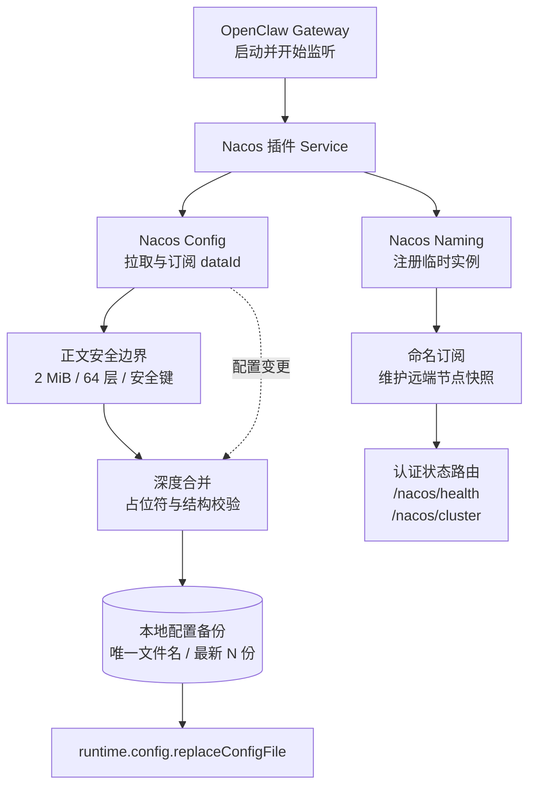
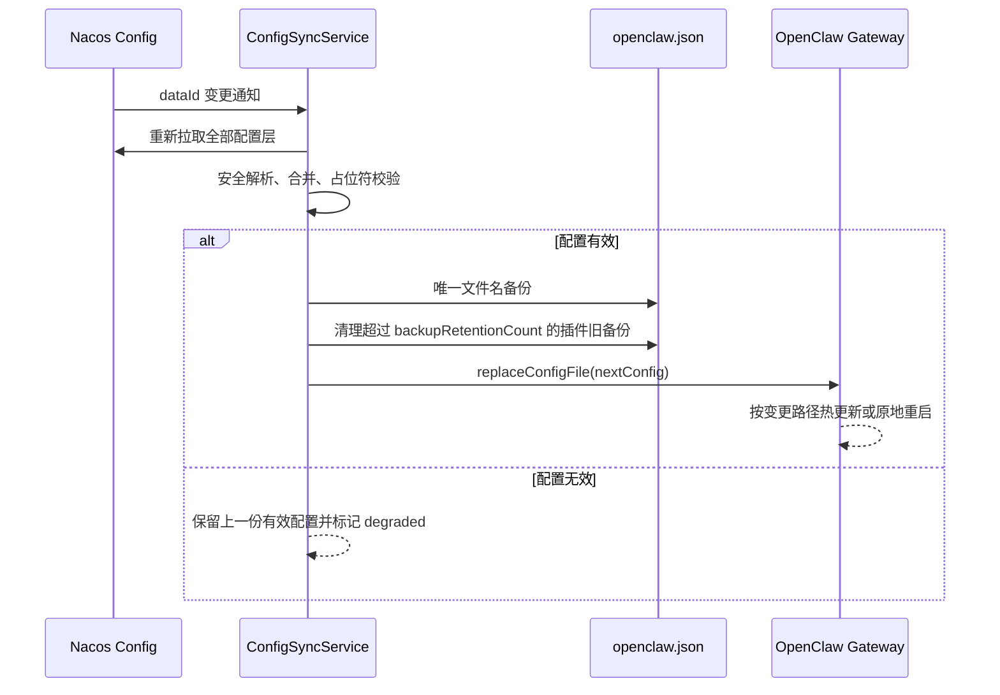

<div align="center">

# OpenClaw Nacos

**OpenClaw 插件：Nacos 配置中心合并与 Gateway / Hooks 命名注册**


</div>

<!-- README_STANDARD_START -->

> 统一阅读顺序：组件定位 → 架构 → 流程 → 边界 → 安装 → 配置 → 运维 → 深入阅读。
> 本区块以 npm 可稳定渲染的 text 图为主；适用时，更深入的 Mermaid 图保留在仓库 `doc/` 设计资料中。

[简体中文](./README.zh-CN.md) | [English](./README.md)

## 1. 组件定位

提供配置同步、回滚备份和 Gateway 注册。组件类型：**配置中心与服务发现**。

| 项目 | 内容 |
|---|---|
| npm 包 | `@partme.ai/openclaw-nacos` |
| 当前版本 | `2026.7.1` |
| 插件 ID | `nacos` |
| Channel ID | — |
| OpenClaw | `>=2026.7.1` |
| 源码目录 | `extensions/nacos` |

## 2. 一眼看懂

```text
[Nacos Config / Naming]
          │
          ▼
┌──────────────────────────────────────────────────────────────┐
│ OpenClaw Gateway 内: nacos
│ 1. 拉取并按层深度合并配置
│ 2. 展开环境变量、校验并备份写盘
│ 3. 注册 Gateway 并订阅节点变化
└──────────────────────────────────────────────────────────────┘
          │
          ▼
[OpenClaw 配置与节点视图]
```

## 3. 架构与核心流程

该组件把“协议/平台差异”限制在自身边界内，对 OpenClaw 暴露稳定的插件、Channel、Hook、Tool 或 Service 契约。

```text
Nacos Config / Naming
  │
  ▼
拉取并按层深度合并配置
  │
  ▼
展开环境变量、校验并备份写盘
  │
  ▼
注册 Gateway 并订阅节点变化
  │
  ▼
OpenClaw 配置与节点视图

异常路径: 任一步失败：记录可诊断错误并按组件策略重试、拒绝或降级
```

## 4. 能力与边界

| 能力 | 说明 |
|---|---|
| 负责 | 提供配置同步、回滚备份和 Gateway 注册 |
| 不负责 | 不替代 Nacos Server 的高可用与权限治理 |
| 输入 | Nacos Config / Naming |
| 输出 | OpenClaw 配置与节点视图 |
| 失败原则 | 默认失败应可观测；鉴权、边界校验和持久化失败不得伪装成功 |

## 5. 快速开始

```bash
openclaw plugins install "@partme.ai/openclaw-nacos@2026.7.1"
```

安装后先按最小权限配置，再启动 Gateway；生产环境应在隔离配置目录中完成连通性、权限和失败恢复验证。

## 6. 配置入口

| 配置层 | 路径 |
|---|---|
| 插件配置 | `plugins.entries.nacos.config` |
| Channel 配置 | 不适用 |
| 配置 Schema | `extensions/nacos/openclaw.plugin.json` |

配置字段、环境变量与完整示例继续保留在下方原有详细说明中。

## 7. 运维、安全与故障定位

- 先确认 OpenClaw 版本、插件版本、manifest ID 与配置键一致。
- 凭据使用环境变量或 SecretRef，不写入日志、仓库和示例明文。
- 通过 Gateway 日志、插件健康状态及外部依赖状态分层定位问题。
- 升级前备份状态数据；涉及游标、队列或索引时，必须验证重启恢复与重复投递语义。

## 8. 验证与深入阅读

```bash
pnpm --filter "@partme.ai/openclaw-nacos" typecheck
pnpm --filter "@partme.ai/openclaw-nacos" test
pnpm --filter "@partme.ai/openclaw-nacos" build
```

- [nacos 深度设计文档](../../doc/nacos/)
- [统一插件结构规范](../../doc/OpenClaw-Plugins-Structure-Standard.md)

## 9. 原有详细说明

以下内容保留该组件原有的配置表、协议细节、示例和故障排查资料。

<!-- README_STANDARD_END -->


[简体中文](https://github.com/partme-ai/openclaw-nacos/blob/main/README.zh-CN.md) | [English](https://github.com/partme-ai/openclaw-nacos/blob/main/README.md)

`@partme.ai/openclaw-nacos` 是为 [OpenClaw](https://github.com/openclaw/openclaw) 开发的 [Nacos](https://nacos.io/) 集成插件：提供 **命名注册**（Gateway / Hooks 服务发现）与可选的 **配置中心**（远程配置合并、写盘前备份、订阅变更）。推荐使用 OpenClaw CLI 安装到扩展目录；也可通过 npm 手动接入。

## 📖 简介

**OpenClaw Nacos**（`@partme.ai/openclaw-nacos`）基于 Node.js SDK [`nacos`](https://github.com/nacos-group/nacos-sdk-nodejs)，在 Gateway 已就绪后向 Nacos 注册 **临时实例**，并可选地从 Nacos **拉取配置**、与当前运行配置 **深度合并**、在调用 `runtime.config.replaceConfigFile` 前 **备份** 本地配置文件，且支持 **订阅** dataId 变更后重新合并写盘。

### 🎯 核心能力

#### **命名注册（Naming）**

- 使用 `NacosNamingClient` 将当前 OpenClaw 节点注册为 **临时实例**，便于其他服务按服务名发现 **IP + 端口**（与 Gateway 监听端口一致，含 [Hooks](https://docs.openclaw.ai) / Webhook 路径元数据）。
- 端口解析与 OpenClaw 一致：`OPENCLAW_GATEWAY_PORT` → `gateway.port` → 默认 `18789`。

#### **配置中心（Config Center，可选）**

- 使用 `NacosConfigClient` 从 Nacos 加载配置。支持两种模式：
  - **主配置模式** (`primaryConfigDataId`)：将 **完整的** `openclaw.json` 存储在单个 Nacos dataId 中作为单一数据源。`sharedConfigs` 和 `pluginConfigIds` 仍会在其上叠加。
  - **共享配置模式** (`sharedConfigs`)：拉取多个局部配置并与当前运行时配置深度合并。
- 支持可选的 `applicationDataId` 和按插件 ID 的 `<pluginId>-<profile>.json`（通过 `pluginConfigIds`）。
- 写盘前备份当前配置文件，备份命名规则：`openclaw-nacos-<yyyyMMddHHmmss>-<随机后缀>.json`；同一秒多次更新也不会互相覆盖。默认只保留最新 20 份，可用 `backupRetentionCount` 调整。
- 订阅 Nacos 配置变更并在每次变更时**重新应用**（拉取 → 合并 → 备份 → 写入）。
- 命名与配置共用 **`serverList` / `username` / `password` / 默认 `namespace`**；配置侧可用 **`configCenter.namespace`** 覆盖。

#### **Webhook 集群发现（新增）**

- 自动发现注册到同一 Nacos 服务名下的其他 Gateway 节点。
- 通过 Nacos 命名订阅维护**实时更新的**内存节点列表。
- 提供 `GET /nacos/cluster` HTTP 端点，返回节点 IP、端口、hooks 路径与健康状态；敏感 metadata 键会脱敏。
- `GET /nacos/health` 端点包含集群发现状态和节点数量。

### ✨ 主要特性

#### 1. 命名与元数据

- **IP / 端口**：`registerIp` → `OPENCLAW_NACOS_REGISTER_IP` → 本机首个非回环 IPv4 → `127.0.0.1`（并警告）。
- **元数据**：`hooksEnabled`、`hooksBasePath`、`gatewayPort`、`provider` 及自定义 `metadata`（**勿**写入 `hooks.token` 等密钥）。

#### 2. 配置合并与占位符

- Nacos 正文支持 **JSON** 或 **YAML**（`yaml` 包解析）。
- 合并完成后对字符串做 **`${VAR}`** / **`${VAR:默认值}`** 形式的环境变量展开。
- `${VAR}` 未设置且没有默认值时拒绝本次更新，保留上一份有效配置；正文同时限制为 2 MiB、64 层，并拒绝重复 YAML 键、循环别名和原型污染键。

#### 3. 备份与写盘

- 备份源：`OPENCLAW_CONFIG_PATH`（若设置）否则 `stateDir/openclaw.json`。
- 备份目标：`stateDir/openclaw-nacos-<yyyyMMddHHmmss>-<8位随机后缀>.json`。
- 保留策略：默认保留最新 20 份；只清理符合插件严格命名规则的历史备份，不删除 `openclaw.json`、手工备份或其他状态文件。

#### 4. 插件开关

| **开关**                          | **说明**                                                                                                                       |
| --------------------------------- | ------------------------------------------------------------------------------------------------------------------------------ |
| `enabled: false`                  | 禁用整个插件                                                                                                                   |
| `startupFailurePolicy: "fail"`    | 默认；组件启动失败时拒绝该 Service 启动并暴露健康错误。OpenClaw 2026.7.1 会隔离单个插件 Service 失败，不等同于终止整个 Gateway |
| `startupFailurePolicy: "degrade"` | 记录健康降级并允许该插件的其他独立组件继续启动                                                                                 |
| `naming.enabled: false`           | 仅跳过命名注册，配置中心仍可使用                                                                                               |
| `configCenter.enabled: true`      | 启用配置拉取、合并、订阅与写盘                                                                                                 |
| `clusterDiscovery.enabled: false` | 仅跳过集群节点发现，命名注册仍会运行                                                                                           |

#### 5. Webhook 集群

- **自动发现**：订阅 Nacos 命名变更 → 维护实时节点列表。
- **HTTP API**：`GET /nacos/cluster` 返回所有节点及 IP、端口、hooks 元数据。
- **健康检查**：`GET /nacos/health` 包含 `clusterDiscovery.running` 和节点数量。
- **自过滤**：本地节点自动从节点列表中排除。

### 🏗️ 插件内流程（概念）

下面的字符图用于快速扫清组件职责，随后 Mermaid 图用于表达可渲染的依赖与时序；两者共同维护，不互相替代。

```text
远程 Nacos 配置
        │
        ▼
NacosConfigClient.getConfig(dataId, group)
        │
        ▼
parseConfigBody() ── JSON / YAML 安全解析
        │
        ▼
deepMerge() ── primary → shared[] → application → plugins
        │
        ▼
expandEnvPlaceholdersInValue() ── ${VAR} / ${VAR:default}
        │
        ▼
validateMergedConfig() + OpenClaw 写入前完整 Schema 校验
        │
        ▼
backupOpenClawConfig() ── 唯一文件名 + 最新 N 份保留
        │
        ▼
runtime.config.replaceConfigFile({ afterWrite: { mode: "auto" } })
        │
        ▼
OpenClaw 按变更路径热重载或原地重启
```

```text
┌──────────────────────────────────────────────────────────────────┐
│                       OpenClaw Gateway                           │
├──────────────────────────────────────────────────────────────────┤
│ openclaw-nacos                                                   │
│                                                                  │
│ ┌──────────────────────┐  ┌───────────────────────────────────┐ │
│ │ NacosConfigSync      │  │ GatewayNacosRegistry              │ │
│ │ • 分层拉取与合并      │  │ • 注册临时实例                     │ │
│ │ • 单飞订阅刷新        │  │ • Gateway / Hooks 元数据          │ │
│ │ • 备份保留 → 写盘     │  │ • 停止时注销并关闭心跳             │ │
│ └──────────┬───────────┘  └──────────────┬────────────────────┘ │
│            │                             │                      │
│ ┌──────────┴─────────────────────────────┴────────────────────┐ │
│ │ WebhookClusterService                                      │ │
│ │ • 订阅 Naming，维护实时节点列表并过滤本机                   │ │
│ │ • GET /nacos/cluster  • GET /nacos/health                  │ │
│ └─────────────────────────────────────────────────────────────┘ │
└──────────────────────────────────────────────────────────────────┘
              │                              │
              ▼                              ▼
┌──────────────────────────────────────────────────────────────────┐
│ Nacos Server：Naming (Distro) + Config Center (Raft)             │
└──────────────────────────────────────────────────────────────────┘
```



配置变更不是“事件来一次就并发写一次”。同步器会合并并发通知：当前拉取期间到达的新事件只置位，当前轮完成后至少再拉取一轮，避免旧配置乱序覆盖新配置。



**启动顺序**：OpenClaw 先加载本地 `openclaw.json` 并启动 Gateway，本插件随后运行；首次从 Nacos 合并属于 **二次收敛**。若需进程启动前完全由 Nacos 引导，需要 OpenClaw 核心支持。

## 前置要求

- 已安装 [OpenClaw](https://github.com/openclaw/openclaw)（**2026.7.1+**，见 `package.json` 中 `peerDependencies` 与 `openclaw.compat` / `openclaw.build`）
- **Node.js 22+**（与官方 [Building plugins](https://docs.openclaw.ai/plugins/building-plugins) 前置要求一致；`engines` 亦声明 `>=22`）
- Gateway 所在机器能访问 **Nacos Server**（与 [nacos-sdk-nodejs](https://github.com/nacos-group/nacos-sdk-nodejs) 兼容的版本）

## 安装

### 1. 使用 OpenClaw CLI（推荐）

```bash
openclaw plugins install @partme.ai/openclaw-nacos
```

该命令通常会：

- 从 npm 下载插件包
- 安装到 OpenClaw 扩展目录（例如 `~/.openclaw/extensions/`）
- 按你使用的 OpenClaw 版本更新配置并注册插件

然后在 `plugins.entries` 中启用并填写插件配置（见下文）。具体行为以 [OpenClaw 文档](https://docs.openclaw.ai) 为准。

### 2. 使用 npm（手动 / 高级）

```bash
npm install @partme.ai/openclaw-nacos
```

再按你所用版本的规则，通过 `openclaw.plugin.json`、`plugins.entries` 等将包接入 OpenClaw。

## 配置

### Spring / Cloud 风格（可选）

除下方 **扁平 JSON** 外，可在 `plugins.entries.nacos.config` 中使用嵌套的 `nacos` 对象（与 Spring Boot `application.yml` 常见写法对齐），插件会在解析时 **扁平化** 为内部字段；**已存在的顶层键优先生效**。

支持字段示例：

- `nacos.server-addr` → `serverList`
- `nacos.discovery.server-addr` → `namingServerList`（可选），并可在无顶层 `serverList` 时作为地址回退
- `nacos.discovery.namespace` → `namespace`（命名）
- `nacos.config.server-addr` → `configServerList`（可选）
- `nacos.config.namespace` → `configCenter.namespace`
- `nacos.config.shared-configs`：与 `configCenter.sharedConfigs` 相同语义；项内可使用 `data-id` 或 `dataId`

### npm 依赖：`nacos` 2.x

本插件 **仅支持** npm 包 [`nacos`](https://www.npmjs.com/package/nacos) **2.x**（源码仓库 [nacos-group/nacos-sdk-nodejs](https://github.com/nacos-group/nacos-sdk-nodejs)）。**不与** npm 上的旧主版本线混用；升级 SDK 大版本需单独评估 API。

### OpenClaw 插件 API 约定

- `package.json` 中的 **`openclaw`** 字段声明生产入口 **`./dist/bootstrap.cjs`**、设置入口 `./dist/setup-entry.js`、兼容版本和构建版本；bootstrap 会在加载插件前安装旧版 `uuid/v4` 兼容垫片。
- 入口使用官方推荐的 [`definePluginEntry`](https://docs.openclaw.ai/plugins/sdk-entrypoints)（从 `openclaw/plugin-sdk/plugin-entry` 导入），而非已弃用的单体 `openclaw/plugin-sdk` 根导入。
- 仅在 [`registrationMode === "full"`](https://docs.openclaw.ai/plugins/sdk-entrypoints#registration-mode) 时启动 Nacos 长生命周期服务（与文档中「重服务放在 full」一致）。
- 配置合并使用 [`api.runtime.config.current` / `replaceConfigFile`](https://docs.openclaw.ai/plugins/sdk-runtime)，由 OpenClaw 决定热更新或原地重启。
- 热更新前缀通过插件定义的 **`reload`** 字段声明（与 [`OpenClawPluginReloadRegistration`](https://docs.openclaw.ai/plugins/sdk-overview) 一致），由 Gateway 做重载规划。

### 配置变更与热更新

插件在清单级声明 `reload`（`restartPrefixes` / `hotPrefixes`），与 OpenClaw Gateway 配置重载规划配合：对 `plugins`、`gateway`、`channels` 等前缀倾向 **重启 Gateway**，对 `hooks`、`cron`、`models` 等倾向 **热更新**。从 Nacos 合并写盘后，实际行为以 OpenClaw 核心对变更路径的判定为准。

在 OpenClaw 配置文件（常见为 `~/.openclaw/openclaw.json`，或由 `OPENCLAW_CONFIG_PATH` 指定）中增加插件入口，例如 **仅命名注册** 的最小示例：

```jsonc
{
  "plugins": {
    "entries": {
      "nacos": {
        "enabled": true,
        "config": {
          "serverList": "127.0.0.1:8848",
          "namespace": "public",
          "username": "nacos",
          "password": "YOUR_NACOS_PASSWORD_HERE",
          "serviceName": "openclaw-gateway",
          "groupName": "DEFAULT_GROUP",
          "registerIp": "10.0.0.12",
          "metadata": { "env": "prod" },
        },
      },
    },
  },
  "gateway": { "port": 18789 },
  "hooks": {
    "enabled": true,
    "token": "your-secret-token",
    "path": "/hooks",
  },
}
```

### 配置说明

#### 必填

| **字段**           | **说明**                                    |
| ------------------ | ------------------------------------------- |
| `serverList`       | Nacos 地址，如 `host:8848` 或多地址逗号分隔 |
| `namingServerList` | 仅用于 Naming 客户端；默认同 `serverList`   |
| `configServerList` | 仅用于 Config 客户端；默认同 `serverList`   |

#### 命名相关（可选）

| **字段**                | **默认值**         | **说明**                                                                                             |
| ----------------------- | ------------------ | ---------------------------------------------------------------------------------------------------- |
| `enabled`               | `true`             | `false` 时禁用整个插件                                                                               |
| `naming.enabled`        | `true`             | `false` 时仅跳过命名注册                                                                             |
| `namespace`             | `public`           | Naming 命名空间；Config 会把显示名 `public` 归一化为空 tenant id，这是 Nacos 默认空间的真实 API 语义 |
| `username` / `password` | —                  | Nacos 认证（命名与配置客户端共用）                                                                   |
| `serviceName`           | `openclaw-gateway` | 服务名                                                                                               |
| `groupName`             | `DEFAULT_GROUP`    | 分组                                                                                                 |
| `clusterName`           | —                  | 集群名                                                                                               |
| `weight`                | `1`                | 权重                                                                                                 |
| `ephemeral`             | `true`             | 是否临时实例                                                                                         |
| `registerIp`            | 环境 / 自动        | 注册到 Nacos 的 IP                                                                                   |
| `metadata`              | —                  | 额外元数据（字符串键值）                                                                             |

#### 配置中心 `configCenter`（可选）

| **字段**                            | **说明**                                                                                                      |
| ----------------------------------- | ------------------------------------------------------------------------------------------------------------- |
| `configCenter.enabled`              | `true` 时启用拉取、合并、订阅、写盘                                                                           |
| `startupFailurePolicy`              | `fail`（默认）或 `degrade`；控制插件组件启动失败的处理方式                                                    |
| `configCenter.namespace`            | 配置租户，覆盖顶层 `namespace`（仅 Config 客户端）                                                            |
| `configCenter.sharedConfigs`        | `{ dataId, group?, refresh? }` 有序列表，按序 deep merge（Spring：`shared-configs`，`data-id` 等价 `dataId`） |
| `configCenter.applicationDataId`    | 可选主配置 dataId（支持模板中的 `${profile}`）                                                                |
| `configCenter.profile`              | profile，用于 dataId 与 `<pluginId>-<profile>.json`                                                           |
| `configCenter.pluginConfigIds`      | 插件 ID 列表，合并到 `plugins.entries.<id>.config`                                                            |
| `configCenter.skipValidation`       | `true` 时跳过插件侧额外校验（仍以 JSON 可序列化等为底线）                                                     |
| `configCenter.backupRetentionCount` | 写盘前回滚备份保留数量，默认 `20`，范围 `1..1000`                                                             |

#### 环境变量

| **变量**                     | **用途**                                      |
| ---------------------------- | --------------------------------------------- |
| `OPENCLAW_GATEWAY_PORT`      | 覆盖 Gateway 端口解析                         |
| `OPENCLAW_NACOS_REGISTER_IP` | 未设置 `registerIp` 时的注册 IP               |
| `OPENCLAW_CONFIG_PATH`       | 若设置，备份时复制该路径对应文件              |
| `OPENCLAW_PROFILE`           | profile（可被 `configCenter.profile` 覆盖）   |
| `SPRING_PROFILES_ACTIVE`     | 未设置 `OPENCLAW_PROFILE` 时作为 profile 来源 |

## 🔒 安全与风险

- **`runtime.config.replaceConfigFile` 权限极高**，仅在可信环境启用配置中心；勿在 Nacos 配置正文或 metadata 中存放 `hooks.token` 等密钥。
- 其他服务发现实例后访问 Hooks 时，仍使用 OpenClaw 既有鉴权（如 `Authorization` / `X-OpenClaw-Token`），**不要**依赖 Nacos 元数据传递密钥。

## 🌐 消费方流程（其他服务）

1. 在 Nacos 中订阅对应 `serviceName`。
2. 选取实例 IP + 端口。
3. 拼接 Hooks URL：`http://<ip>:<port><hooksBasePath>/...`，并按 OpenClaw 文档携带鉴权头。

## ❓ 常见问题（FAQ）

### Q: Nacos 会在进程启动前完全替代本地 `openclaw.json` 吗？

**A:** 不会。OpenClaw 仍先加载本地配置并启动 Gateway，本插件在之后运行。配置中心做的是远程片段与运行中配置的合并并可写回磁盘，属于 **二次收敛**。若需要「启动前仅从 Nacos 引导」，需要 OpenClaw 核心支持。

### Q: Gateway 的 `gateway.auth.token` 要配进 Nacos 吗？

**A:** **不要。** 命名注册只发布 IP、端口与安全元数据；调用 Hooks 时仍使用你现有的 Gateway / Hooks 鉴权。不要把 `hooks.token` 或管理密钥写进 Nacos。

### Q: CI 构建产物在哪里查看？

**A:** 在仓库 [Actions](https://github.com/partme-ai/openclaw-nacos/actions) 中，每次执行 `ci.yml` 会上传 **`dist/`** 目录为工件（artifact 名 `openclaw-nacos-dist`）。

## 🤖 GitHub Actions

| **工作流**                                                       | **触发**                                               | **说明**                                                                                                                                                     |
| ---------------------------------------------------------------- | ------------------------------------------------------ | ------------------------------------------------------------------------------------------------------------------------------------------------------------ |
| [`.github/workflows/ci.yml`](.github/workflows/ci.yml)           | 推送到 `main` / `master` 或 PR                         | `pnpm install --frozen-lockfile`、类型检查、构建、测试、上传 `dist` 工件                                                                                     |
| [`.github/workflows/release.yml`](.github/workflows/release.yml) | 推送标签 `v*`（执行发布）；**Run workflow** 仅打包测试 | 构建、测试、npm 发布（版本已存在则跳过）、**GitHub Packages** 以 `@<GitHub owner>/openclaw-nacos`（如 `@partme-ai/...`）发布、**GitHub Release** 附带 `.tgz` |

**自动发布：** 在仓库 Secrets 中配置 **`NPM_TOKEN`**，详见 [RELEASING.md](./RELEASING.md)。**手动 Run workflow** 不会执行 npm 发布与 GitHub Release（需推送 `v*` 标签）。发布示例：

```bash
pnpm version patch
git push origin main --follow-tags
```

## 📁 项目结构

```
openclaw-nacos/
├── src/
│   ├── index.ts              # 插件入口（注册服务、HTTP 路由）
│   ├── runtime/              # 注册、发现、配置同步与连接参数
│   ├── config/               # 解析、Spring 归一化、深合并与安全边界
│   └── shared/               # 类型、常量、时间戳与 bootstrap 垫片
├── docs/
│   ├── ARCHITECTURE.md       # 系统架构与设计
│   ├── CONFIG.md             # 完整配置参考
│   ├── GUIDE.md              # 使用指南与场景
│   ├── API.md                # HTTP 端点与导出 API
│   ├── TECHNICAL.md          # 技术细节与设计决策
│   └── zh/                   # 中文文档
│       ├── ARCHITECTURE.md
│       ├── CONFIG.md
│       ├── GUIDE.md
│       ├── API.md
│       └── TECHNICAL.md
├── dist/                     # 构建产出（发布到 npm）
├── openclaw.plugin.json      # OpenClaw 插件清单
├── package.json
└── README.md / README.zh-CN.md
```

### 📚 文档

- [架构文档](docs/zh/ARCHITECTURE.md) — 系统设计、模块、数据流
- [配置参考](docs/zh/CONFIG.md) — 完整配置 schema 与字段说明
- [使用指南](docs/zh/GUIDE.md) — 快速开始、使用场景、故障排查
- [API 参考](docs/zh/API.md) — HTTP 端点、CLI、导出模块
- [技术细节](docs/zh/TECHNICAL.md) — 技术栈、SDK 集成、设计决策

## 🛠️ 技术栈

| **类别** | **说明**                                                                      |
| -------- | ----------------------------------------------------------------------------- |
| 运行时   | Node.js 22+、ESM                                                              |
| SDK      | [`nacos`](https://github.com/nacos-group/nacos-sdk-nodejs)（Naming + Config） |
| 解析     | `yaml`（YAML 配置正文）                                                       |
| 宿主     | OpenClaw 插件 API（`registerService`、`runtime.config`）                      |

## 📦 版本信息

| **项目**                  | **版本** |
| ------------------------- | -------- |
| @partme.ai/openclaw-nacos | 2026.7.1 |
| 推荐 Node                 | 22+      |

## 🔗 相关链接

| **资源**         | **链接**                                                                                           |
| ---------------- | -------------------------------------------------------------------------------------------------- |
| Nacos 官网       | [https://nacos.io](https://nacos.io)                                                               |
| nacos-sdk-nodejs | [https://github.com/nacos-group/nacos-sdk-nodejs](https://github.com/nacos-group/nacos-sdk-nodejs) |
| OpenClaw 文档    | [https://docs.openclaw.ai](https://docs.openclaw.ai)                                               |
| OpenClaw 源码    | [https://github.com/openclaw/openclaw](https://github.com/openclaw/openclaw)                       |
| English          | [README.md](./README.md)                                                                           |

### OpenClaw 官方插件文档（Plugins）

| **说明**   | **链接**                                                                                   |
| ---------- | ------------------------------------------------------------------------------------------ |
| 插件总览   | [https://docs.openclaw.ai/tools/plugin](https://docs.openclaw.ai/tools/plugin)             |
| 社区插件   | [https://docs.openclaw.ai/plugins/community](https://docs.openclaw.ai/plugins/community)   |
| 捆绑包     | [https://docs.openclaw.ai/plugins/bundles](https://docs.openclaw.ai/plugins/bundles)       |
| Voice call | [https://docs.openclaw.ai/plugins/voice-call](https://docs.openclaw.ai/plugins/voice-call) |

### 开发插件（Building plugins）

| **说明**           | **链接**                                                                                                       |
| ------------------ | -------------------------------------------------------------------------------------------------------------- |
| 开发插件           | [https://docs.openclaw.ai/plugins/building-plugins](https://docs.openclaw.ai/plugins/building-plugins)         |
| SDK 通道插件       | [https://docs.openclaw.ai/plugins/sdk-channel-plugins](https://docs.openclaw.ai/plugins/sdk-channel-plugins)   |
| SDK 模型提供方插件 | [https://docs.openclaw.ai/plugins/sdk-provider-plugins](https://docs.openclaw.ai/plugins/sdk-provider-plugins) |
| SDK 迁移           | [https://docs.openclaw.ai/plugins/sdk-migration](https://docs.openclaw.ai/plugins/sdk-migration)               |

### SDK 参考（SDK reference）

| **说明**          | **链接**                                                                                             |
| ----------------- | ---------------------------------------------------------------------------------------------------- |
| SDK 概览          | [https://docs.openclaw.ai/plugins/sdk-overview](https://docs.openclaw.ai/plugins/sdk-overview)       |
| SDK 入口          | [https://docs.openclaw.ai/plugins/sdk-entrypoints](https://docs.openclaw.ai/plugins/sdk-entrypoints) |
| SDK 运行时        | [https://docs.openclaw.ai/plugins/sdk-runtime](https://docs.openclaw.ai/plugins/sdk-runtime)         |
| SDK 安装与配置    | [https://docs.openclaw.ai/plugins/sdk-setup](https://docs.openclaw.ai/plugins/sdk-setup)             |
| SDK 测试          | [https://docs.openclaw.ai/plugins/sdk-testing](https://docs.openclaw.ai/plugins/sdk-testing)         |
| 清单 manifest     | [https://docs.openclaw.ai/plugins/manifest](https://docs.openclaw.ai/plugins/manifest)               |
| 架构 architecture | [https://docs.openclaw.ai/plugins/architecture](https://docs.openclaw.ai/plugins/architecture)       |

## 从源码构建（开发者）

```bash
pnpm install
pnpm run build
pnpm test
```

## 📄 开源协议

本项目采用 [MIT License](./LICENSE) 协议。

## 🙏 致谢

- [Nacos](https://nacos.io)
- [nacos-sdk-nodejs](https://github.com/nacos-group/nacos-sdk-nodejs)
- [OpenClaw](https://github.com/openclaw/openclaw)

---

<div align="center">

**如果这个项目对你有帮助，请给我们一个 ⭐️**

Made with ❤️ by PartMe

</div>
