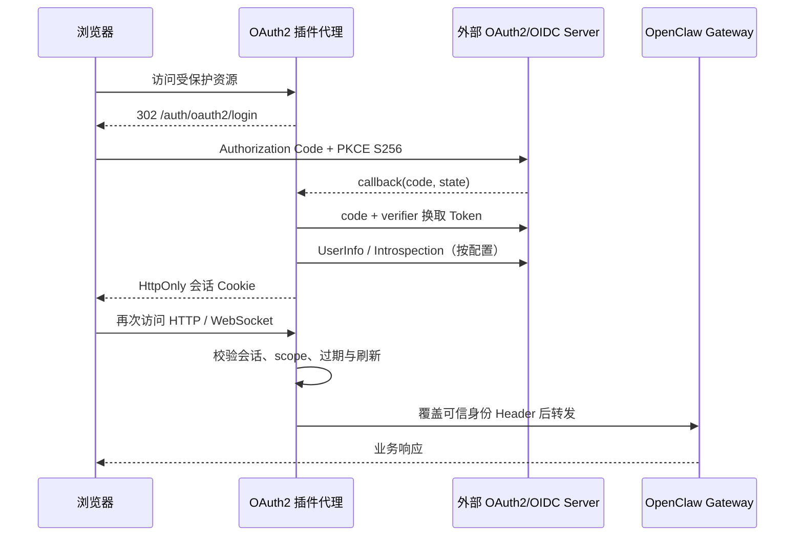

# OpenClaw OAuth2

<!-- README_STANDARD_START -->

> 统一阅读顺序：组件定位 → 架构 → 流程 → 边界 → 安装 → 配置 → 运维 → 深入阅读。
> 本区块以 npm 可稳定渲染的 text 图为主；适用时，更深入的 Mermaid 图保留在仓库 `doc/` 设计资料中。

[简体中文](./README.zh-CN.md) | [English](./README.md)

## 1. 组件定位

作为标准 OAuth2 Client 对接外部身份服务。组件类型：**OAuth2/OIDC 授权代理**。

| 项目 | 内容 |
|---|---|
| npm 包 | `@partme.ai/openclaw-oauth2` |
| 当前版本 | `2026.7.1` |
| 插件 ID | `oauth2` |
| Channel ID | — |
| OpenClaw | `>=2026.7.1` |
| 源码目录 | `extensions/oauth2` |

## 2. 一眼看懂

```text
[浏览器或 API 的 Gateway 请求]
          │
          ▼
┌──────────────────────────────────────────────────────────────┐
│ OpenClaw Gateway 内: oauth2
│ 1. 发现外部授权服务器并生成授权请求
│ 2. 校验回调、Token 与会话状态
│ 3. 注入受信身份并反向代理
└──────────────────────────────────────────────────────────────┘
          │
          ▼
[经外部 OAuth2/OIDC 授权的请求]
```

## 3. 架构与核心流程

该组件把“协议/平台差异”限制在自身边界内，对 OpenClaw 暴露稳定的插件、Channel、Hook、Tool 或 Service 契约。

```text
浏览器或 API 的 Gateway 请求
  │
  ▼
发现外部授权服务器并生成授权请求
  │
  ▼
校验回调、Token 与会话状态
  │
  ▼
注入受信身份并反向代理
  │
  ▼
经外部 OAuth2/OIDC 授权的请求

异常路径: 任一步失败：记录可诊断错误并按组件策略重试、拒绝或降级
```

## 4. 能力与边界

| 能力 | 说明 |
|---|---|
| 负责 | 作为标准 OAuth2 Client 对接外部身份服务 |
| 不负责 | 不是 OAuth2 Server，也不保存用户密码 |
| 输入 | 浏览器或 API 的 Gateway 请求 |
| 输出 | 经外部 OAuth2/OIDC 授权的请求 |
| 失败原则 | 默认失败应可观测；鉴权、边界校验和持久化失败不得伪装成功 |

## 5. 快速开始

```bash
openclaw plugins install "@partme.ai/openclaw-oauth2@2026.7.1"
```

安装后先按最小权限配置，再启动 Gateway；生产环境应在隔离配置目录中完成连通性、权限和失败恢复验证。

## 6. 配置入口

| 配置层 | 路径 |
|---|---|
| 插件配置 | `plugins.entries.oauth2.config` |
| Channel 配置 | 不适用 |
| 配置 Schema | `extensions/oauth2/openclaw.plugin.json` |

配置字段、环境变量与完整示例继续保留在下方原有详细说明中。

## 7. 运维、安全与故障定位

- 先确认 OpenClaw 版本、插件版本、manifest ID 与配置键一致。
- 凭据使用环境变量或 SecretRef，不写入日志、仓库和示例明文。
- 通过 Gateway 日志、插件健康状态及外部依赖状态分层定位问题。
- 升级前备份状态数据；涉及游标、队列或索引时，必须验证重启恢复与重复投递语义。

## 8. 验证与深入阅读

```bash
pnpm --filter "@partme.ai/openclaw-oauth2" typecheck
pnpm --filter "@partme.ai/openclaw-oauth2" test
pnpm --filter "@partme.ai/openclaw-oauth2" build
```

- [插件总体架构](../../doc/OpenClaw-Plugins-Architecture_CN.md)
- [统一插件结构规范](../../doc/OpenClaw-Plugins-Structure-Standard.md)

## 9. 原有详细说明

以下内容保留该组件原有的配置表、协议细节、示例和故障排查资料。

<!-- README_STANDARD_END -->


基于 [`openid-client`](https://github.com/panva/openid-client) 的标准 OAuth2/OIDC Client 鉴权代理。插件在 OpenClaw Gateway 前启动 HTTP/WebSocket 反向代理，完成外部授权、会话管理、Bearer Token 校验，并向 trusted-proxy 注入可信用户信息。

## 支持能力

- OAuth2/OIDC Discovery 或显式端点配置
- Authorization Code + PKCE S256
- Refresh Token、Token Revocation
- UserInfo 或 Token Introspection
- HttpOnly/SameSite/Secure Session Cookie
- Redis 共享 state/session，支持多实例
- HTTP 与 WebSocket trusted-proxy 转发
- 可通过 `requiredScopes` 要求外部 Access Token 必须包含指定 Scope

插件不包含任何厂商专用实现。Auth0、Keycloak、Azure AD 或其他标准服务都通过同一组配置接入。

## 授权与代理架构

```text
浏览器 ──▶ OAuth2 代理 ──302──▶ 外部 OAuth2/OIDC Server
  ▲             │                         │
  │             │ callback(code + state) ◀┘
  │             ▼
  │      PKCE 换 Token / UserInfo ──▶ HttpOnly Session
  │             │
  └── HTTP/WS ──┼──▶ Scope / 过期 / 刷新校验
                │
                ▼ 覆盖可信身份 Header
        loopback OpenClaw Gateway（trusted-proxy）
```



OAuth2 Server 负责登录、授权和 Token 签发；本插件是标准 Client 与授权拦截代理，不实现账号体系，也不充当 OAuth2 Server。

## Discovery 配置

```json
{
  "enabled": true,
  "issuerUrl": "https://auth.example.com/",
  "clientId": "openclaw-gateway",
  "clientSecret": "replace-with-secret",
  "client": {
    "discovery": true,
    "redirectUri": "https://gateway.example.com/auth/oauth2/callback",
    "scopes": ["openid", "profile", "openclaw:operator"],
    "requiredScopes": ["openclaw:operator"],
    "clientAuthMethod": "client_secret_post",
    "authorizationParameters": {
      "audience": "openclaw-api",
      "prompt": "login"
    },
    "sessionSecret": "replace-with-at-least-32-random-characters",
    "secureCookies": true,
    "userIdField": "sub",
    "tenantIdField": "tenantId",
    "sessionStore": {
      "type": "redis",
      "redisUrl": "redis://127.0.0.1:6379/0",
      "keyPrefix": "openclaw:oauth2",
      "maxEntries": 10000
    }
  },
  "proxy": {
    "listenHost": "0.0.0.0",
    "listenPort": 18080,
    "upstreamHost": "127.0.0.1",
    "upstreamPort": 18789,
    "forwardedProto": "https"
  }
}
```

## 显式端点配置

授权服务没有 Discovery 文档时，将 `discovery` 设为 `false`：

```json
{
  "enabled": true,
  "issuerUrl": "https://auth.example.com/",
  "clientId": "openclaw-gateway",
  "clientSecret": "replace-with-secret",
  "client": {
    "discovery": false,
    "redirectUri": "https://gateway.example.com/auth/oauth2/callback",
    "authorizationEndpoint": "https://auth.example.com/oauth2/authorize",
    "tokenEndpoint": "https://auth.example.com/oauth2/token",
    "userInfoEndpoint": "https://auth.example.com/oauth2/userinfo",
    "introspectionEndpoint": "https://auth.example.com/oauth2/introspect",
    "revokeEndpoint": "https://auth.example.com/oauth2/revoke",
    "scopes": ["openid", "profile"],
    "clientAuthMethod": "client_secret_basic",
    "authorizationParameters": {},
    "tokenParameters": {},
    "sessionSecret": "replace-with-at-least-32-random-characters"
  }
}
```

显式模式至少需要 `authorizationEndpoint` 与 `tokenEndpoint`。浏览器登录后的身份可来自 ID Token、UserInfo 或 Introspection；Bearer API 请求需要配置 UserInfo 或 Introspection。

## 本地端点

| 路径 | 用途 |
|---|---|
| `GET /auth/oauth2/login` | 创建 state/PKCE transaction 并跳转授权服务 |
| `GET /auth/oauth2/callback` | 校验 state、交换 token、创建 session |
| `POST /auth/oauth2/logout` | 删除 session 并尝试 revoke access token，避免 GET logout CSRF |
| `/auth/oauth2/status` | 转发给 OpenClaw `auth: "gateway"` 路由，不在代理层匿名暴露 |
| `GET/HEAD /health` | 代理存活与 OAuth2 Client 就绪检查 |

## 安全约束

- OpenClaw 必须保持 loopback 监听，并启用与插件一致的可信代理配置：

```json
{
  "gateway": {
    "port": 18789,
    "bind": "loopback",
    "trustedProxies": ["127.0.0.1"],
    "auth": {
      "mode": "trusted-proxy",
      "trustedProxy": {
        "userHeader": "x-forwarded-user",
        "allowLoopback": true,
        "allowUsers": ["allowed-user-id"]
      }
    }
  }
}
```

- 插件启动前会校验 `auth.mode`、`userHeader`、`allowLoopback`、`trustedProxies` 和 Gateway 端口；不匹配时直接拒绝启动。
- `proxy.upstreamHost` 只允许 `127.0.0.1` 或 `::1`，避免成为可访问任意目标的开放代理。
- 非 loopback 的 issuer 和端点必须使用 HTTPS。
- 生产环境必须启用 `secureCookies`。
- 先验证每个 transaction 的独立签名 Cookie，再一次性消费 state，避免无 Cookie 请求使合法登录失效。
- 默认禁止 URL query token。
- 外部请求携带的 forwarded/user/tenant/scope Header 会在代理前删除；只重建可信用户、租户和转发链。
- OAuth Scope 不会伪装成 OpenClaw operator scope；`requiredScopes` 只负责代理准入，Gateway 权限由 OpenClaw trusted-proxy 与 `allowUsers` 配置负责。
- 内存 session store 有 `maxEntries` 上限；多实例生产部署应使用 Redis session store。

## 验证

```bash
pnpm --dir extensions/oauth2 test
pnpm --dir extensions/oauth2 typecheck
pnpm --dir extensions/oauth2 build
OPENCLAW_E2E_HOST_GATEWAY=1 node scripts/e2e/run-e2e.mjs --plugins oauth2
```
