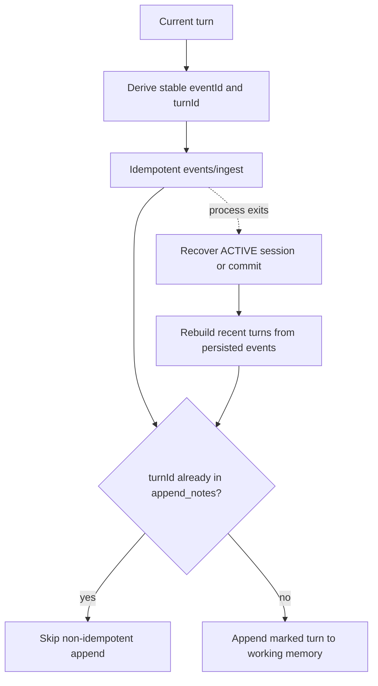

# OpenClaw OpenMem

Production-oriented OpenMem REST bridge for OpenClaw 2026.7.1.

[简体中文](./README.zh-CN.md) | [English](./README.md)

## What it implements

- OpenMem session start, append, and commit across OpenClaw session lifecycle hooks.
- Current-turn ingestion with deterministic event IDs for idempotent retries.
- Crash recovery that rebuilds missing working-memory projections from persisted events and deterministic turn markers.
- `MemorySearchManager` automatic recall and the `openmem_search` tool.
- Request timeouts, bounded retries, streaming response-size limits, JSON/schema validation, health checks, and shutdown cancellation.
- LRU source cache bounded by both entry count and `maxCacheBytes`.
- Optional environment-backed auth headers for a protecting reverse proxy.

OpenMem currently performs FTS5 plus character n-gram reranking. It does not currently expose embedding/vector recall, and this plugin reports that capability accurately.

## Write recovery model



OpenMem append has no idempotency key, so the plugin never blindly retries it. Operations for the same OpenClaw session are serialized, and recovery/commit reconciles the most recent 1,000 persisted events before archiving.

## Safe defaults

OpenMem hybrid search is sidecar-global and has no tenant filter. The plugin therefore defaults to one configured agent and session continuity recall:

- `agentId: "main"`
- `allowSharedRecall: false`
- non-loopback endpoints require HTTPS

Only enable `allowSharedRecall` when the sidecar belongs to one trusted user/domain.

## Configuration

```jsonc
{
  "plugins": {
    "entries": {
      "openmem": {
        "enabled": true,
        "config": {
          "baseUrl": "http://127.0.0.1:3317",
          "agentId": "main",
          "required": false,
          "maxSearchResults": 10,
          "timeoutMs": 5000,
          "maxAttempts": 3,
          "retryBaseDelayMs": 100,
          "maxResponseBytes": 2097152,
          "maxCacheBytes": 8388608,
          "allowSharedRecall": false,
          "apiKeyEnv": "OPENMEM_API_KEY",
          "authHeader": "Authorization",
          "authScheme": "Bearer"
        }
      }
    }
  }
}
```

`required: true` makes an unavailable sidecar fail Gateway startup. API keys are never accepted inline; `apiKeyEnv` names the environment variable to read.

## OpenMem server boundary

The current workspace OpenMem server has no built-in request authentication and does not explicitly bind its listener to loopback. Protect it with container/firewall isolation or an authenticated reverse proxy. The optional auth header is intended for that proxy; it is not presented as native OpenMem authentication.

## Verification

```bash
pnpm --filter @partme.ai/openclaw-openmem test
pnpm --filter @partme.ai/openclaw-openmem typecheck
pnpm --filter @partme.ai/openclaw-openmem build
OPENCLAW_E2E_HOST_GATEWAY=1 node scripts/e2e/run-e2e.mjs --plugins openmem --skip-browser
```

The 2026-07-17 gate passes 32 tests plus a tarball-installed OpenClaw 2026.7.1 E2E against the real workspace OpenMem Server: Agent Turn, ingest, working memory, shutdown-drain commit, archive, Gateway restart, continuity recall, and next-turn prompt injection.

`/events/ingest` and `/sessions/:id/append` remain separate Sidecar writes. The plugin now reconciles the normal crash window from persisted events, but strict atomicity beyond the 1,000-event recovery window still requires a transactional Sidecar API or native idempotent append. Protected-network and Sidecar failure-recovery acceptance tests also remain production gates.
