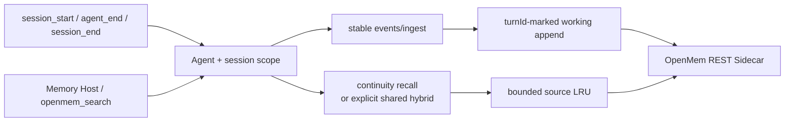
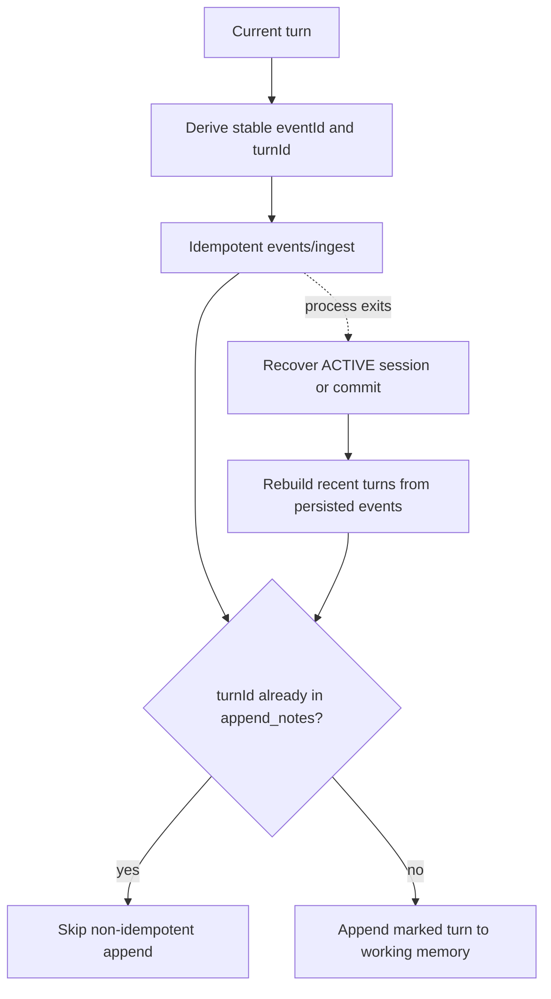
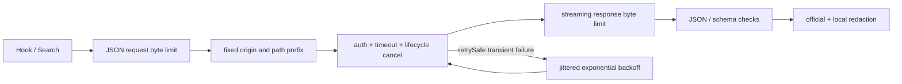

# OpenClaw OpenMem

<!-- README_STANDARD_START -->

> Standard reading order: positioning → architecture → flow → boundaries → installation → configuration → operations → deep dive.
> This block favors text diagrams that render reliably on npm; when applicable, deeper Mermaid diagrams remain in the repository's `doc/` design material.

[English](./README.md) | [简体中文](./README.zh-CN.md)

## 1. Component positioning

Connects OpenMem as a pluggable memory backend. Component type: **External memory bridge**.

| Item | Value |
|---|---|
| npm package | `@partme.ai/openclaw-openmem` |
| Version | `2026.7.1` |
| Plugin ID | `openmem` |
| Channel ID | — |
| OpenClaw | `>=2026.7.1` |
| Source | `extensions/openmem` |

## 2. At a glance

```text
[OpenClaw memory queries and lifecycle events]
          │
          ▼
┌──────────────────────────────────────────────────────────────┐
│ Inside OpenClaw Gateway: openmem
│ 1. Build tenant- and session-scoped requests
│ 2. Call OpenMem HTTP recall or ingest
│ 3. Bound, sanitize, and merge results
└──────────────────────────────────────────────────────────────┘
          │
          ▼
[External memory context and ingest status]
```

## 3. Architecture and core flow

The component keeps protocol and platform differences inside its own boundary and exposes stable plugin, channel, hook, tool, or service contracts to OpenClaw.

```text
OpenClaw memory queries and lifecycle events
  │
  ▼
Build tenant- and session-scoped requests
  │
  ▼
Call OpenMem HTTP recall or ingest
  │
  ▼
Bound, sanitize, and merge results
  │
  ▼
External memory context and ingest status

Failure path: Any failed stage: record a diagnosable error, then retry, reject, or degrade per component policy
```

## 4. Capabilities and boundaries

| Area | Contract |
|---|---|
| Owns | Connects OpenMem as a pluggable memory backend |
| Does not own | Does not deploy OpenMem or bypass its tenant isolation |
| Input | OpenClaw memory queries and lifecycle events |
| Output | External memory context and ingest status |
| Failure rule | Failures remain observable; authentication, boundary validation, and persistence failures must not be reported as success |

## 5. Quick start

```bash
openclaw plugins install "@partme.ai/openclaw-openmem@2026.7.1"
```

Start with least-privilege configuration, then launch the Gateway. Validate connectivity, authorization, and recovery in an isolated profile before production use.

## 6. Configuration entry points

| Layer | Path |
|---|---|
| Plugin configuration | `plugins.entries.openmem.config` |
| Channel configuration | Not applicable |
| Configuration schema | `extensions/openmem/openclaw.plugin.json` |

Field definitions, environment variables, and complete examples remain in the preserved detailed reference below.

## 7. Operations, security, and troubleshooting

- Confirm the OpenClaw version, package version, manifest ID, and configuration key first.
- Keep credentials in environment variables or SecretRef values, never in logs, source control, or plaintext examples.
- Diagnose by layer: Gateway logs, plugin health, then the external dependency.
- Back up state before upgrades; for cursors, queues, or indexes, verify restart recovery and duplicate-delivery semantics.

## 8. Verification and deep dives

```bash
pnpm --filter "@partme.ai/openclaw-openmem" typecheck
pnpm --filter "@partme.ai/openclaw-openmem" test
pnpm --filter "@partme.ai/openclaw-openmem" build
```

- [Plugin architecture overview](../../doc/OpenClaw-Plugins-Architecture.md)
- [Unified plugin structure standard](../../doc/OpenClaw-Plugins-Structure-Standard.md)

## 9. Preserved detailed reference

The original configuration tables, protocol details, examples, and troubleshooting material continue below.

<!-- README_STANDARD_END -->


Production-oriented OpenMem REST bridge for OpenClaw 2026.7.1.

[简体中文](./README.zh-CN.md) | [English](./README.md)

## What it implements

- OpenMem session start, append, and commit across OpenClaw session lifecycle hooks.
- Current-turn ingestion with deterministic event IDs for idempotent retries.
- Crash recovery that rebuilds missing working-memory projections from persisted events and deterministic turn markers.
- `MemorySearchManager` automatic recall and the `openmem_search` tool.
- Request-size limits, timeouts, jittered bounded retries, streaming response-size limits, JSON/schema validation, health checks, and shutdown cancellation.
- LRU source cache bounded by both entry count and `maxCacheBytes`.
- Optional environment-backed auth headers for a protecting reverse proxy.

OpenMem currently performs FTS5 plus character n-gram reranking. It does not currently expose embedding/vector recall, and this plugin reports that capability accurately.

## Runtime architecture

```text
OpenClaw hooks / Memory Host / openmem_search
                    │
                    ▼
        Agent + session continuity boundary
                    │
          ┌─────────┴──────────┐
          ▼                    ▼
 stable events/ingest     continuity search
          │                    │
          ▼                    ▼
 marked working append    bounded source LRU
          │                    │
          └─────────┬──────────┘
                    ▼
       OpenMem REST Sidecar (fixed endpoint)
```



## Write recovery model



OpenMem append has no idempotency key, so the plugin never blindly retries it. Operations for the same OpenClaw session are serialized, and recovery/commit reconciles the most recent 1,000 persisted events before archiving.

## Safe defaults

OpenMem hybrid search is sidecar-global and has no tenant filter. The plugin therefore defaults to one configured agent and session continuity recall:

- `agentId: "main"`
- `allowSharedRecall: false`
- non-loopback endpoints require HTTPS

Only enable `allowSharedRecall` when the sidecar belongs to one trusted user/domain.

## Configuration

```jsonc
{
  "plugins": {
    "entries": {
      "openmem": {
        "enabled": true,
        "config": {
          "baseUrl": "http://127.0.0.1:3317",
          "agentId": "main",
          "required": false,
          "maxSearchResults": 10,
          "timeoutMs": 5000,
          "maxAttempts": 3,
          "retryBaseDelayMs": 100,
          "maxRequestBytes": 2097152,
          "maxResponseBytes": 2097152,
          "maxCacheBytes": 8388608,
          "allowSharedRecall": false,
          "apiKeyEnv": "OPENMEM_API_KEY",
          "authHeader": "Authorization",
          "authScheme": "Bearer"
        }
      }
    }
  }
}
```

`required: true` makes an unavailable sidecar fail Gateway startup. API keys are never accepted inline; `apiKeyEnv` names the environment variable to read.

`maxRequestBytes` and `maxResponseBytes` default to 2 MiB. A turn is capped at 100 messages (16,000 characters each), a search query at 4,000 characters, and a missing trusted session key fails closed instead of writing into a shared fallback thread.

### HTTP safety boundary

```text
Hook / Search → bounded JSON body → fixed Sidecar URL → auth + timeout/cancel
                                                   │
                  jittered retry ◀── safe 408/425/429/5xx only
                                                   │
                                                   ▼
                         bounded response stream → JSON/schema → redaction
```



## OpenMem server boundary

The current workspace OpenMem server has no built-in request authentication and does not explicitly bind its listener to loopback. Protect it with container/firewall isolation or an authenticated reverse proxy. The optional auth header is intended for that proxy; it is not presented as native OpenMem authentication.

## Verification

```bash
pnpm --filter @partme.ai/openclaw-openmem test
pnpm --filter @partme.ai/openclaw-openmem typecheck
pnpm --filter @partme.ai/openclaw-openmem build
OPENCLAW_E2E_HOST_GATEWAY=1 node scripts/e2e/run-e2e.mjs --plugins openmem --skip-browser
```

The 2026-07-17 gate passes 32 tests plus a tarball-installed OpenClaw 2026.7.1 E2E against the real workspace OpenMem Server: Agent Turn, ingest, working memory, shutdown-drain commit, archive, Gateway restart, continuity recall, and next-turn prompt injection.

`/events/ingest` and `/sessions/:id/append` remain separate Sidecar writes. The plugin now reconciles the normal crash window from persisted events, but strict atomicity beyond the 1,000-event recovery window still requires a transactional Sidecar API or native idempotent append. Protected-network and Sidecar failure-recovery acceptance tests also remain production gates.
