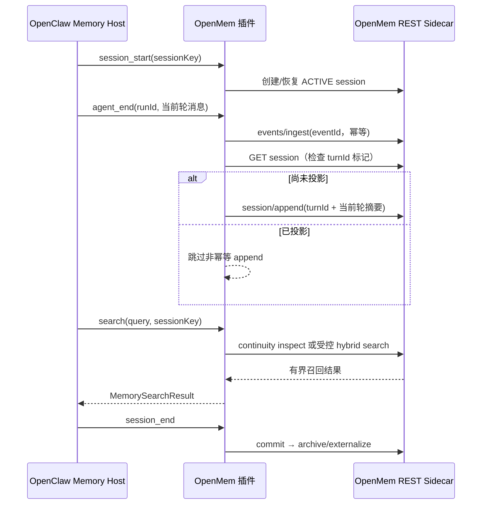
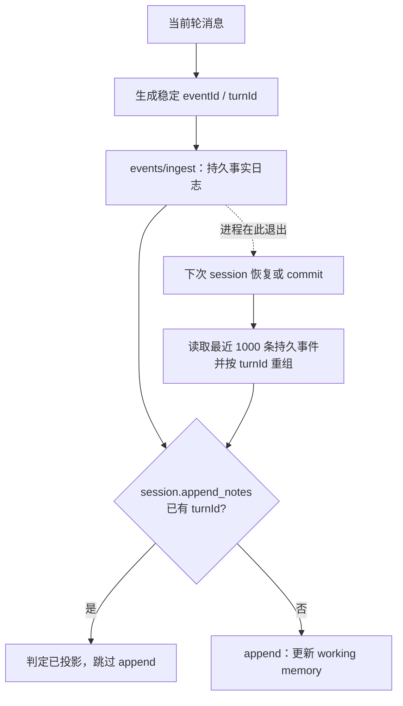
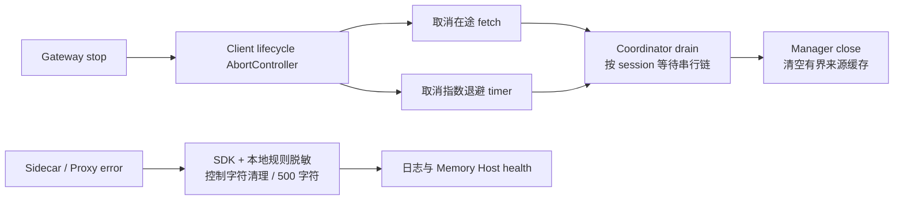
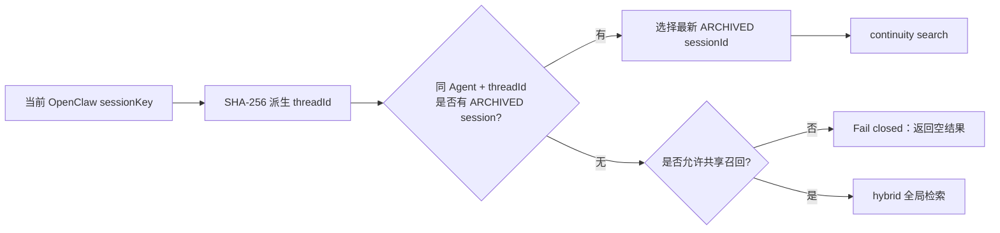

# OpenClaw OpenMem

OpenClaw 2026.7.1 的 OpenMem REST 记忆桥接插件。

[简体中文](./README.zh-CN.md) | [English](./README.md)

## 实际能力

- `session_start`：在 OpenMem 创建或恢复 ACTIVE session。
- `agent_end`：只上传当前轮消息；用 `runId + 消息序号` 生成稳定 `eventId`，可安全重试。
- 崩溃恢复：把事件日志作为事实源，用确定性 `turnId` 标记补齐尚未投影到 working memory 的轮次。
- `session_end`：提交 session，触发 OpenMem archive 和 externalized memory 生成。
- 自动/主动召回：实现 `MemorySearchManager` 和 `openmem_search`。
- 完整 HTTP 保护：请求超时、有限指数退避、流式响应体上限、JSON/Schema 校验、关闭时取消请求。
- 有界来源缓存：同时限制 1000 个条目和 `maxCacheBytes` 总字节数，按 LRU 淘汰。
- 可选鉴权 Header：密钥只从环境变量读取，适合接入鉴权反向代理。

当前 OpenMem 的 hybrid recall 是 FTS5 + 字符 n-gram 重排，不是 embedding/vector 检索。本插件的能力探测会如实返回 vector 不可用。

## 运行架构与记忆生命周期

```text
OpenClaw session_start
        │
        ▼
创建/恢复 ACTIVE session
        │
agent_end 当前轮
        ├──▶ events/ingest（稳定 eventId，可安全重试）
        │             │
        │             ▼
        └──▶ 检查 turnId ──未投影──▶ working-memory append（不盲目重试）
                              │
                              └─崩溃──▶ 下次恢复/commit 从事件日志重建

search ──▶ continuity（安全默认）/ hybrid（显式共享）──▶ 有界 LRU 来源缓存
session_end ──▶ 恢复未投影轮次 ──▶ commit ──▶ archive/externalize
```



插件只负责 Host 契约、租户边界和可靠 HTTP 调用；记忆生成与检索算法属于 OpenMem sidecar。默认 continuity 模式只读取当前 `sessionKey` 对应的上一条归档 session。不能优先选择当前 ACTIVE session，因为 OpenMem continuity 是按 `sessionId` 查找已经生成的 archive，ACTIVE session 通常还没有 archive。

### 为什么写入分成事件与工作记忆两层

OpenMem 的 `/events/ingest` 支持 `eventId` 去重，而 `/sessions/:id/append` 没有幂等键。插件不能把后者标成“可重试”，否则服务端已经写入但响应丢失时会重复追加。当前实现先持久化事件，再执行带标记的投影；恢复 ACTIVE session 和 commit 前都会进行对账。



同一个 `sessionKey` 的 start、ingest、commit 还会在插件内串行执行，避免 `agent_end` 与 `session_end` 交叉导致“先归档、后追加”；不同会话互不阻塞。

### 停止与错误安全边界

```text
Gateway stop
    │
    ├── client.close() ──▶ Abort fetch
    │                 └──▶ Abort retry backoff
    │
    ├── coordinator.drain() ──▶ 等待各 session 串行链释放
    └── manager.close() ──▶ 清空来源 LRU 缓存

Sidecar/Proxy Error ──▶ SDK 脱敏 + Bearer/sk-* 兜底 + 控制字符清理
                                      │
                                      └──▶ 最长 500 字符后进入日志/health
```





## 安全默认

OpenMem 当前 keyword/hybrid 搜索是 sidecar 全局范围，没有 tenant filter。为避免跨会话泄漏，本插件默认：

- 只服务 `agentId: "main"`；其他 Agent 不获得 manager 和工具。
- `allowSharedRecall: false`，只召回同一 OpenClaw sessionKey 对应的上一条已归档 OpenMem session（continuity）。
- `baseUrl` 为非 loopback 地址时必须使用 HTTPS。

只有 sidecar 确认属于单一信任域时，才可启用 `allowSharedRecall: true` 使用全局 hybrid recall。

## 配置

```jsonc
{
  "plugins": {
    "entries": {
      "openmem": {
        "enabled": true,
        "config": {
          "baseUrl": "http://127.0.0.1:3317",
          "agentId": "main",
          "required": false,
          "maxSearchResults": 10,
          "timeoutMs": 5000,
          "maxAttempts": 3,
          "retryBaseDelayMs": 100,
          "maxResponseBytes": 2097152,
          "maxCacheBytes": 8388608,
          "allowSharedRecall": false,
          "apiKeyEnv": "OPENMEM_API_KEY",
          "authHeader": "Authorization",
          "authScheme": "Bearer"
        }
      }
    }
  }
}
```

| 字段 | 默认值 | 说明 |
|---|---:|---|
| `enabled` | `true` | 是否启用插件 |
| `required` | `false` | `true` 时 sidecar 启动不可用会阻止 Gateway 启动 |
| `baseUrl` | `http://127.0.0.1:3317` | OpenMem REST 地址；远端必须 HTTPS |
| `agentId` | `main` | 此 sidecar 唯一服务的 OpenClaw Agent |
| `maxSearchResults` | `10` | 搜索结果硬上限，最大 100 |
| `timeoutMs` | `5000` | 单次 HTTP 请求超时 |
| `maxAttempts` | `3` | 幂等请求最大尝试次数 |
| `retryBaseDelayMs` | `100` | 指数退避基础延迟 |
| `maxResponseBytes` | `2097152` | 单个响应体上限 |
| `maxCacheBytes` | `8388608` | 搜索来源缓存总字节上限，最大 64 MiB |
| `allowSharedRecall` | `false` | 是否允许 sidecar 全局 hybrid recall |
| `apiKeyEnv` | 无 | API key 所在环境变量；插件不接受明文 key 配置 |
| `authHeader` | `Authorization` | 鉴权 Header 名 |
| `authScheme` | `Bearer` | Header scheme；空字符串表示直接发送 key |

## OpenMem 服务边界

当前工作区 OpenMem Server 没有内置请求鉴权，并且源码中的 `app.listen(PORT)` 没有显式限定监听地址。生产环境必须至少满足一项：

1. sidecar 仅在容器/主机 loopback 或私有网络可达，并由防火墙阻止外部访问；
2. 前置 mTLS/API-key 反向代理，并配置 `apiKeyEnv`；
3. 为 OpenMem Server 增加正式鉴权与明确的 bind host 后再开放网络。

插件不会把 `apiKeyEnv` 误描述成 OpenMem 原生鉴权；它只负责向前置保护层发送 Header。

## 验证

```bash
pnpm --filter @partme.ai/openclaw-openmem test
pnpm --filter @partme.ai/openclaw-openmem typecheck
pnpm --filter @partme.ai/openclaw-openmem build
OPENCLAW_E2E_HOST_GATEWAY=1 node scripts/e2e/run-e2e.mjs --plugins openmem --skip-browser
```

2026-07-17 本地门禁：3 个测试文件、34 个测试通过，typecheck/build 通过。统一 E2E 使用工作区真实 OpenMem Server，完成：

```text
tarball 安装 → Gateway Agent Turn → session/start → events/ingest → working-memory
→ Gateway shutdown drain → session/commit → archive → Gateway 重启
→ continuity search → 下一轮 Prompt 注入
```

写入仍不是 Sidecar 内部的单事务：插件通过持久事件、`turnId` 标记和恢复对账补偿最近 1000 条事件，已经覆盖 Gateway 在 ingest 与 append 之间退出的常见故障；极长 ACTIVE session 超出恢复窗口时，仍需要 OpenMem 提供事务批接口或原生幂等 append 才能给出严格原子性保证。完成鉴权隔离和 Sidecar 故障演练之前，不标记为完全生产就绪。
