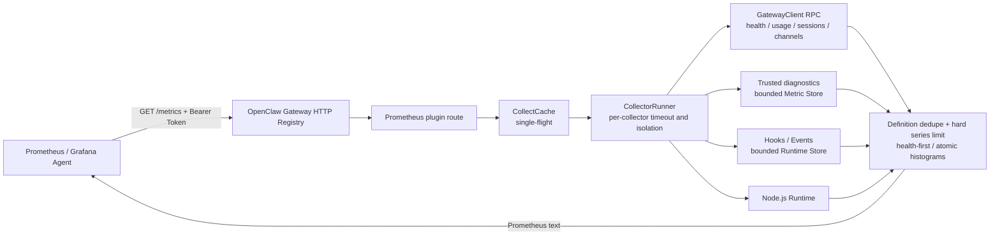

<div align="center">

# OpenClaw Prometheus

**OpenClaw plugin — Prometheus metrics and JSON diagnostics built on the official plugin SDK**


</div>

[English](./README.md) | [简体中文](./README.zh-CN.md)

## Introduction

`@partme.ai/openclaw-prometheus` is a **non-channel** plugin for [OpenClaw](https://github.com/openclaw/openclaw). It **fully replaces** the bundled [`diagnostics-prometheus`](https://github.com/openclaw/openclaw/tree/main/extensions/diagnostics-prometheus) exporter and adds RPC usage, hooks, SLI, and enterprise-style JSON endpoints.

Metrics come from two layers:

1. **Internal diagnostics (official parity)** — trusted Gateway diagnostic events (`model.usage`, `run.completed`, `tool.execution.*`, message delivery, harness, talk, session recovery, queue lanes, memory, …) → `openclaw_model_tokens_total`, `openclaw_run_duration_seconds`, etc.
2. **PartMe extensions** — Gateway RPC (`usage.cost`, `sessions.*`, `channels.status`, …), plugin hooks, runtime events, SLI, and exporter meta metrics.

> After enabling this plugin, **disable** bundled `diagnostics-prometheus` to avoid duplicate subscriptions and duplicate series.

## Core capabilities

- **diagnostics-prometheus drop-in**: `src/diagnostics/metric-store.ts` mirrors the official implementation (series cap, low-cardinality labels, histogram buckets).
- **Pure plugin architecture**: uses only documented SDK surfaces, no host source patching.
- **Multi-layer metrics**: diagnostics events, RPC snapshots, hook/event workload, exporter self metrics.
- **Endpoints**: Prometheus exposition on `{path}` (default `/metrics`) plus JSON drill-down, health, and debug endpoints. Every route is exact-match and GET-only.
- **Snapshot refresh**: `snapshotIntervalMs` controls model-auth and channel-activity probe refresh.
- **Collection cache**: `collectIntervalMs` reuses the last successful scrape bundle to reduce cost under frequent Prometheus scrapes (set `0` to disable).
- **Scrape guardrails**: concurrent cache misses are single-flight; `collectorTimeoutMs` bounds each collector wait and `maxScrapeSeries` bounds the final response.
- **Cardinality/privacy**: diagnostics and runtime stores have independent series caps; free-form channel display labels are not exported, and operator errors are redacted before JSON output.
- **Meta metrics**: `openclaw_exporter_build_info`, `openclaw_metrics_last_scrape_duration_seconds`.
- **Optional scrape auth**: Bearer token via `OPENCLAW_PROMETHEUS_BEARER_TOKEN` (recommended) or dev-only `scrapeAuth.bearerToken` in config.
- **Enterprise-style operations** (aligned with common Prometheus exporter practice and ideas from [RabbitMQ’s Prometheus guide](https://www.rabbitmq.com/docs/prometheus)): stable metric names, separate “full text” vs JSON drill-down, TLS termination at the Gateway/reverse proxy, and cardinality-aware use of `/detailed?family=`.

### Plugin lifecycle

- Loaded through `package.json` / `openclaw.plugin.json` discovery like any other OpenClaw plugin.
- `register()` wires `api.runtime`, installs hook/event observers, and registers plugin-owned routes with `api.registerHttpRoute`.
- Routes are mounted directly on the Gateway. The plugin does not open a separate listener; terminate TLS and enforce network policy at the Gateway or reverse proxy.

### Runtime architecture



The plugin only registers Gateway routes; it does not open another listener. The Gateway or reverse proxy owns TLS, network ACLs, and token rotation. The plugin owns request authentication, collector isolation, low-cardinality output, and response limits.

### Concurrent scrape and failure isolation

```mermaid
sequenceDiagram
    participant P1 as Prometheus replica A
    participant P2 as Prometheus replica B
    participant Cache as CollectCache
    participant Runner as CollectorRunner
    participant RPC as OpenClaw RPC

    P1->>Cache: scrape (cache miss)
    P2->>Cache: concurrent scrape (cache miss)
    Cache->>Runner: start one collectAll operation
    Runner->>RPC: parallel collector RPCs
    alt collector completes before timeout
        RPC-->>Runner: samples
    else collector times out or fails
        Runner-->>Runner: collector_success=0
        Note over Runner,RPC: Other collectors continue; do not duplicate the hung task
    end
    Runner-->>Cache: merged definitions and samples
    Cache-->>P1: series-limited response
    Cache-->>P2: shared result
```

`collectorTimeoutMs` bounds how long each scrape waits. The current OpenClaw GatewayClient does not expose a transferable `AbortSignal`, so the exporter cannot forcibly cancel an issued RPC. It reuses that pending operation to prevent subsequent scrapes from multiplying calls. `maxScrapeSeries` is the final guardrail across all sources, and `openclaw_metrics_scrape_series_dropped` reports truncation.

During overload, exporter health and collector-failure signals are retained first. Histogram
bucket/sum/count samples for one label set are retained or dropped atomically, so truncation does not
publish a misleading partial distribution. Provider-auth snapshots are also single-flight: concurrent
health requests share one real probe, and late results from an old plugin generation are discarded.

## Endpoints

| Method & path                 | Format          | Description                                               |
| ----------------------------- | --------------- | --------------------------------------------------------- |
| `GET {path}`                  | Prometheus text | Scrape target (`Content-Type: text/plain; version=0.0.4`) |
| `GET {path}/per-object`       | JSON            | Grouped metrics for tooling                               |
| `GET {path}/detailed?family=` | JSON            | Filter by metric-name prefix                              |
| `GET {path}/health`           | JSON            | Exporter health and latest snapshot status                |
| `GET {path}/debug?component=` | JSON            | Exporter diagnostics (`all/collectors/registry/config`)   |

Default `{path}` is `/metrics`.

## Metric families (prefixes)

| Prefix                                                                                                                                  | Source                                                                     |
| --------------------------------------------------------------------------------------------------------------------------------------- | -------------------------------------------------------------------------- |
| `openclaw_model_tokens_*`, `openclaw_gen_ai_client_token_usage`, `openclaw_run_*`, `openclaw_tool_execution_*`, `openclaw_message_*`, … | **Internal diagnostics** (same as bundled diagnostics-prometheus)          |
| `openclaw_usage_*`                                                                                                                      | Gateway RPC `usage.cost` / `sessions.usage` (window gauges)                |
| `openclaw_metrics_*`                                                                                                                    | Exporter-owned route/scrape metrics                                        |
| `openclaw_model_auth_*`                                                                                                                 | `api.runtime.modelAuth`                                                    |
| `openclaw_channel_*`                                                                                                                    | message hooks + `api.runtime.channel.activity.get(...)`                    |
| `openclaw_agent_*`                                                                                                                      | trusted internal diagnostics + runtime agent events                        |
| `openclaw_tool_*`                                                                                                                       | `before_tool_call` / `after_tool_call`                                     |
| `openclaw_messages_*`                                                                                                                   | `message_received` / `message_sent`                                        |
| `openclaw_session_transcript_*`                                                                                                         | `api.runtime.events.onSessionTranscriptUpdate(...)`                        |
| `openclaw_runtime_*`                                                                                                                    | runtime namespace availability + state/snapshot age                        |
| `openclaw_nodejs_*`                                                                                                                     | Local process (optional via `includeRuntime`)                              |
| `openclaw_ready`                                                                                                                        | Set only on `gateway_start` / `gateway_stop` (Gateway lifecycle readiness) |
| `openclaw_plugin_loaded`                                                                                                                | Plugin module registered                                                   |
| `openclaw_exporter_*`, `openclaw_metrics_*`                                                                                             | Plugin meta                                                                |

## Quick start

### Prerequisites

- OpenClaw `>= 2026.7.1`
- Node.js `22+`

### Install

```bash
openclaw plugins install @partme.ai/openclaw-prometheus
```

### Minimal config (`openclaw.json`)

The plugin does not read conversation content and does not require `hooks.allowConversationAccess`. Model tokens, run duration, and outcomes come from trusted internal diagnostics.

```json
{
  "plugins": {
    "entries": {
      "prometheus": {
        "enabled": true,
        "config": {
          "path": "/metrics",
          "collectIntervalMs": 15000,
          "snapshotIntervalMs": 30000,
          "workloadWindowMs": 300000,
          "collectorTimeoutMs": 10000,
          "maxScrapeSeries": 10000,
          "includeRuntime": true,
          "monitoredProviders": ["openai", "anthropic", "gemini"],
          "scrapeAuth": {
            "enabled": false
          }
        }
      }
    }
  }
}
```

### Prometheus scrape (with Bearer)

```yaml
scrape_configs:
  - job_name: openclaw
    scrape_interval: 15s
    bearer_token_file: /etc/prometheus/openclaw-metrics.token
    static_configs:
      - targets: ["127.0.0.1:18789"]
    metrics_path: /metrics
```

Set `scrapeAuth.enabled: true` and store the same secret in `OPENCLAW_PROMETHEUS_BEARER_TOKEN` on the Gateway host.
Enabling authentication without a token rejects plugin startup. Runtime validation also rejects unknown
fields and wrong types instead of silently applying defaults to misspelled configuration.

Ready-to-use scrape, deployment, and alert examples are shipped in [`config/`](config/), [`deploy/`](deploy/), and [`alerts/prometheus.yml`](alerts/prometheus.yml). The cardinality alert fires when any exporter guard actually drops series rather than relying on an unreachable static threshold.

### Manual probe (CLI)

```bash
pnpm run test:client -- http://127.0.0.1:18789/metrics
OPENCLAW_PROMETHEUS_BEARER_TOKEN=secret pnpm run test:client -- http://127.0.0.1:18789/metrics
```

## Grafana dashboards

Import the dashboards from [`doc/prometheus/grafana`](../../doc/prometheus/grafana/). Prometheus handles metrics; Loki handles historical logs. See the [Grafana guide](../../doc/prometheus/grafana/OpenClaw-Prometheus-Grafana-README.md).

## Development

```bash
pnpm install
pnpm run build
pnpm dev
pnpm test

# Full build, pack, isolated install, and real OpenClaw 2026.7.1 HTTP route gate
OPENCLAW_E2E_HOST_GATEWAY=1 node scripts/e2e/run-e2e.mjs --plugins prometheus --skip-browser
```

The unified E2E uses a disposable profile and verifies Bearer rejection/acceptance,
`openclaw_up`, the 2026.7.1 build label, health/RPC readiness, POST rejection,
exact-route isolation, and 25 concurrent scrapes.

## Release version sync

Bump **`package.json` / `openclaw.plugin.json` `version`** and [`src/shared/version.ts`](src/shared/version.ts) **`PLUGIN_VERSION`** together before tagging.

## Related plugins

| Plugin                                                                  | Description           |
| ----------------------------------------------------------------------- | --------------------- |
| [openclaw-oauth2](https://github.com/partme-ai/openclaw-oauth2)         | OAuth2 authentication |
| [openclaw-mqtt](https://github.com/partme-ai/openclaw-mqtt)             | MQTT protocol adapter |
| [openclaw-stomp](https://github.com/partme-ai/openclaw-stomp)           | STOMP server          |
| [openclaw-web-mqtt](https://github.com/partme-ai/openclaw-web-mqtt)     | WebSocket MQTT        |
| [openclaw-web-stomp](https://github.com/partme-ai/openclaw-web-stomp)   | WebSocket STOMP       |
| [openclaw-tracing](https://github.com/partme-ai/openclaw-tracing)       | Distributed tracing   |
| [openclaw-prometheus](https://github.com/partme-ai/openclaw-prometheus) | Prometheus metrics    |
| [openclaw-nacos](https://github.com/partme-ai/openclaw-nacos)           | Nacos naming / config |

## License

MIT
