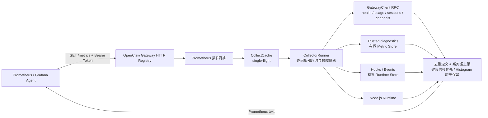
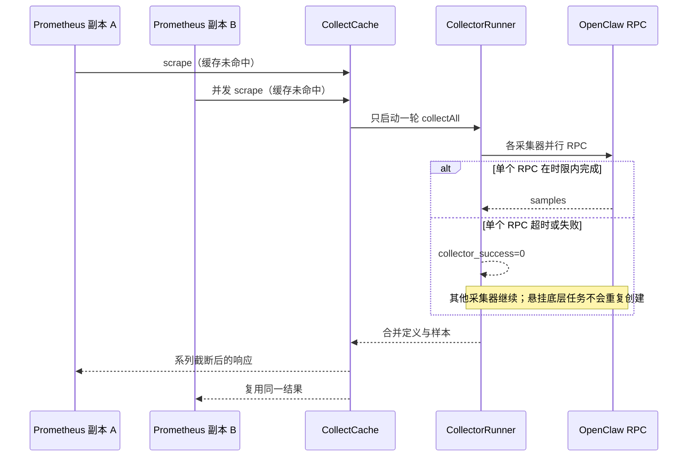

<div align="center">

# OpenClaw Prometheus

**OpenClaw 插件：基于官方插件 SDK 的 Prometheus 指标与 JSON 诊断端点**


</div>

[简体中文](./README.zh-CN.md) | [English](./README.md)

## 简介

`@partme.ai/openclaw-prometheus` 是面向 [OpenClaw](https://github.com/openclaw/openclaw) 的**非渠道**插件，**完整替代** bundled [`diagnostics-prometheus`](https://github.com/openclaw/openclaw/tree/main/extensions/diagnostics-prometheus)，并在此基础上扩展 RPC 用量、hooks、SLI 与企业运维端点。

指标来源分为两层：

1. **Internal diagnostics（与官方 exporter 一致）** — 订阅 Gateway trusted diagnostic 事件（`model.usage`、`run.completed`、`tool.execution.*`、消息投递、harness、talk、session recovery、queue lane、memory 等），输出 `openclaw_model_tokens_total`、`openclaw_run_duration_seconds` 等标准指标。
2. **PartMe 扩展** — RPC（`usage.cost` / `sessions.*` / `channels.status` 等）、Plugin hooks、runtime events、SLI 与 exporter 元指标。

> 启用本插件后请**禁用** bundled `diagnostics-prometheus`，避免重复订阅与重复指标。

## 核心能力

- **diagnostics-prometheus 平替**：`src/diagnostics/metric-store.ts` 与官方实现同构（series cap、低基数 label、histogram bucket）。
- **纯插件架构**：只使用官方 SDK 暴露的稳定能力，不需要修改 OpenClaw 核心。
- **多层指标面**：diagnostics 事件、RPC 快照、hooks/events workload、exporter 自身指标。
- **端点**：`{path}`（默认 `/metrics`）暴露 Prometheus；`{path}/per-object`、`{path}/detailed?family=`、`{path}/health`、`{path}/debug` 提供 JSON。所有路由均为精确匹配且仅接受 GET。
- **快照刷新**：`snapshotIntervalMs` 控制 model auth 与 channel activity 的探测周期。
- **采集缓存**：`collectIntervalMs` 在多次抓取间复用上一次成功结果，减轻抓取成本；设为 `0` 则每次抓取全量采集。
- **抓取保护**：并发缓存 miss 合并为一次采集；`collectorTimeoutMs` 限制单采集器等待时间，`maxScrapeSeries` 限制单次响应系列数。
- **基数与隐私**：diagnostics/runtime 分别实施系列上限；不导出自由文本渠道显示名，JSON 端点返回错误前统一脱敏并截断。
- **元指标**：`openclaw_exporter_build_info`、`openclaw_metrics_last_scrape_duration_seconds`。
- **可选抓取鉴权**：推荐使用环境变量 `OPENCLAW_PROMETHEUS_BEARER_TOKEN`；仅本地调试可在配置中写 `scrapeAuth.bearerToken`。
- **企业级运维取向**（命名与分层方式参考 [RabbitMQ Prometheus 文档](https://www.rabbitmq.com/docs/prometheus) 中的实践：专用路径、聚合与按实体 JSON、TLS 由 Gateway/反向代理终止、控制高基数标签使用等）。

### 生命周期

- 通过 `package.json` / `openclaw.plugin.json` 随 Gateway discovery 加载。
- `register()` 注入 `api.runtime` 与 `api.config`，注册 hooks / events 监听和 exporter 路由。
- 路由直接挂载到 Gateway；插件不另行监听端口。TLS 与网络访问策略由 Gateway 或前置代理负责。

### 运行架构



插件只注册 Gateway 路由，不额外开放监听端口。外部 TLS、网络 ACL 和 Token 轮换应由
Gateway 或反向代理统一管理；插件内部负责请求鉴权、采集隔离、低基数和响应上限。

### 并发抓取与失败隔离



`collectorTimeoutMs` 限制的是每个 scrape 的等待时间。当前 OpenClaw GatewayClient 没有
暴露可传递的 `AbortSignal`，因此超时后不能强制取消已发出的 RPC；插件会复用该悬挂任务，
避免后续抓取不断创建重复调用。`maxScrapeSeries` 最终兜底所有来源，截断量由
`openclaw_metrics_scrape_series_dropped` 暴露。

过载截断会优先保留 exporter 存活、collector 成功/失败与 scrape 耗时，并以同一标签组为
单位保留或丢弃 histogram 的 bucket/sum/count，避免输出无法解释的残缺分布。Provider
鉴权快照同样使用 single-flight：并发 `/health` 与定时刷新只执行一次真实探测；插件停止或
热重载后，旧代际迟到的探测结果会被丢弃，不会写入新 RuntimeStore。

## 端点说明

| 路径                          | 格式            | 说明                                              |
| ----------------------------- | --------------- | ------------------------------------------------- |
| `GET {path}`                  | Prometheus text | 标准抓取                                          |
| `GET {path}/per-object`       | JSON            | 按对象分组                                        |
| `GET {path}/detailed?family=` | JSON            | 按指标名称前缀过滤                                |
| `GET {path}/health`           | JSON            | exporter 健康与最近 snapshot 状态                 |
| `GET {path}/debug?component=` | JSON            | exporter 诊断（`all/collectors/registry/config`） |

默认 `{path}` 为 `/metrics`。

## 指标族（前缀）

| 前缀                                                                                                                                        | 数据来源                                                                        |
| ------------------------------------------------------------------------------------------------------------------------------------------- | ------------------------------------------------------------------------------- |
| `openclaw_model_tokens_*` / `openclaw_gen_ai_client_token_usage` / `openclaw_run_*` / `openclaw_tool_execution_*` / `openclaw_message_*` 等 | **Internal diagnostics**（官方 diagnostics-prometheus 同套）                    |
| `openclaw_usage_*`                                                                                                                          | Gateway RPC `usage.cost` / `sessions.usage`（窗口聚合 gauge）                   |
| `openclaw_metrics_*`                                                                                                                        | exporter 自己的 route / scrape 指标                                             |
| `openclaw_model_auth_*`                                                                                                                     | `api.runtime.modelAuth`                                                         |
| `openclaw_channel_*`                                                                                                                        | message hooks + `api.runtime.channel.activity.get(...)`                         |
| `openclaw_agent_*`                                                                                                                          | trusted internal diagnostics + runtime agent events                             |
| `openclaw_tool_*`                                                                                                                           | `before_tool_call` / `after_tool_call`                                          |
| `openclaw_messages_*`                                                                                                                       | `message_received` / `message_sent`                                             |
| `openclaw_session_transcript_*`                                                                                                             | `api.runtime.events.onSessionTranscriptUpdate(...)`                             |
| `openclaw_runtime_*`                                                                                                                        | runtime namespace 可用性 + state/snapshot age                                   |
| `openclaw_nodejs_*`                                                                                                                         | 本进程（`includeRuntime`）                                                      |
| `openclaw_ready`                                                                                                                            | 仅 `gateway_start` / `gateway_stop` 更新；表示 Gateway 生命周期内 exporter 就绪 |
| `openclaw_plugin_loaded`                                                                                                                    | 插件模块已注册（与 Gateway 是否 start 无关）                                    |

## 快速开始

### 前置条件

- OpenClaw `>= 2026.7.1`
- Node.js `22+`

### 安装

```bash
openclaw plugins install @partme.ai/openclaw-prometheus
```

### 最小配置（`openclaw.json`）

插件不读取对话内容，也不需要 `hooks.allowConversationAccess`。模型 token、运行耗时与结果均来自 trusted internal diagnostics：

```json
{
  "plugins": {
    "entries": {
      "prometheus": {
        "enabled": true,
        "config": {
          "path": "/metrics",
          "collectIntervalMs": 15000,
          "snapshotIntervalMs": 30000,
          "workloadWindowMs": 300000,
          "collectorTimeoutMs": 10000,
          "maxScrapeSeries": 10000,
          "includeRuntime": true,
          "monitoredProviders": ["openai", "anthropic", "gemini"],
          "scrapeAuth": {
            "enabled": false
          }
        }
      }
    }
  }
}
```

### Prometheus 抓取（Bearer）

在 Gateway 环境设置 `OPENCLAW_PROMETHEUS_BEARER_TOKEN`，配置中 `scrapeAuth.enabled: true`，Prometheus 使用 `bearer_token_file` 指向同一密钥文件。
启用鉴权但启动时没有解析到 Token 会直接拒绝插件配置，不会等到首次抓取才返回 503。
运行时还会拒绝 Schema 外字段和错误类型，避免拼错配置后静默采用默认值。

### 命令行探测

```bash
pnpm run test:client -- http://127.0.0.1:18789/metrics
OPENCLAW_PROMETHEUS_BEARER_TOKEN=secret pnpm run test:client -- http://127.0.0.1:18789/metrics
```

## Grafana 看板

从 [`doc/prometheus/grafana`](../../doc/prometheus/grafana/) 导入仪表盘。Prometheus 负责指标，Loki 负责日志历史，接入说明见 [Grafana 指南](../../doc/prometheus/grafana/OpenClaw-Prometheus-Grafana-README.md)。

## 开发与测试

```bash
pnpm install
pnpm run build
pnpm test

# 从构建、打包、隔离安装到真实 OpenClaw 2026.7.1 HTTP 路由的完整门禁
OPENCLAW_E2E_HOST_GATEWAY=1 node scripts/e2e/run-e2e.mjs --plugins prometheus --skip-browser
```

统一 E2E 使用一次性隔离 profile，验证匿名/错误 Bearer 返回 401、正确 Token 抓取、
`openclaw_up`、2026.7.1 build info、健康/RPC 状态、POST 405、exact 路由和 25 路并发抓取。

## 发版注意

同步更新 **`package.json` / `openclaw.plugin.json` 的 `version`** 与 [`src/shared/version.ts`](src/shared/version.ts) 中的 **`PLUGIN_VERSION`**。

## 相关插件

| 插件                                                                    | 说明            |
| ----------------------------------------------------------------------- | --------------- |
| [openclaw-oauth2](https://github.com/partme-ai/openclaw-oauth2)         | OAuth2 认证     |
| [openclaw-mqtt](https://github.com/partme-ai/openclaw-mqtt)             | MQTT 协议接入   |
| [openclaw-stomp](https://github.com/partme-ai/openclaw-stomp)           | STOMP 服务端    |
| [openclaw-web-mqtt](https://github.com/partme-ai/openclaw-web-mqtt)     | WebSocket MQTT  |
| [openclaw-web-stomp](https://github.com/partme-ai/openclaw-web-stomp)   | WebSocket STOMP |
| [openclaw-tracing](https://github.com/partme-ai/openclaw-tracing)       | 链路追踪        |
| [openclaw-prometheus](https://github.com/partme-ai/openclaw-prometheus) | Prometheus 指标 |
| [openclaw-nacos](https://github.com/partme-ai/openclaw-nacos)           | Nacos 注册/配置 |

## 许可证

MIT
