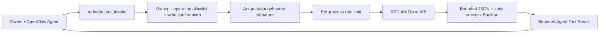

# @partme.ai/openclaw-rednode

Allowlisted RED Ark Open API capability for OpenClaw 2026.7.1. It is not a messaging, content-publishing, or browser-automation channel.

The client follows the official Ark contract: JSON requests, `timestamp` / `app-key` / `sign` headers, and MD5 of the API path plus sorted query/header parameters plus app-secret. Production uses `https://ark.xiaohongshu.com`; the explicitly selected sandbox uses `http://flssandbox.xiaohongshu.com`.

Only idempotent GET calls retry network failures and the officially documented HTTP 500/502 responses, using bounded exponential backoff with jitter. POST and PUT execute once because Ark does not expose a server idempotency key. HTTP success still requires a JSON object with a Boolean `success` field. Unknown fields, non-object roots, control characters, non-finite path/query numbers, and non-boolean security switches fail closed. A non-official remote origin requires explicit `allowCustomApiBaseUrl=true` acknowledgement, and upstream responses and Agent Tool Results have separate byte limits.

Configure `appKey`, `appSecret`, and one or more `{ name, method, apiPath }` operations under `plugins.entries.rednode.config`. Credentials can instead use `XHS_APP_KEY` and `XHS_APP_SECRET`. The plugin registers only `rednode_ark_invoke`; POST and PUT calls require `confirm: true`. This is an Ark merchant API tool, not a messaging/Webhook channel or an OAuth client.

Run the installed-artifact contract with `node scripts/e2e/run-e2e.mjs --plugins rednode --skip-browser`. It packs and installs the plugin into an isolated OpenClaw 2026.7.1 profile, performs a real Agent Tool round trip, independently verifies the Ark MD5 signature, forces one safe GET retry, and checks that the Tool Result returns to the model transcript.

See [README.zh-CN.md](./README.zh-CN.md) and the official [request signing example](https://school.xiaohongshu.com/en/open/quick-start/sign.html).
