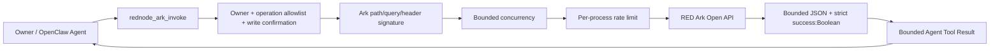

# @partme.ai/openclaw-rednode

<!-- README_STANDARD_START -->

> Standard reading order: positioning → architecture → flow → boundaries → installation → configuration → operations → deep dive.
> This block favors text diagrams that render reliably on npm; when applicable, deeper Mermaid diagrams remain in the repository's `doc/` design material.

[English](./README.md) | [简体中文](./README.zh-CN.md)

## 1. Component positioning

Provides explicitly registered RedNote merchant API tools. Component type: **Capability tool**.

| Item | Value |
|---|---|
| npm package | `@partme.ai/openclaw-rednode` |
| Version | `2026.7.1` |
| Plugin ID | `rednode` |
| Channel ID | — |
| OpenClaw | `>=2026.7.1` |
| Source | `extensions/rednode` |

## 2. At a glance

```text
[Agent RedNote Ark operation]
          │
          ▼
┌──────────────────────────────────────────────────────────────┐
│ Inside OpenClaw Gateway: rednode
│ 1. Validate operation allowlist, confirmation, and rate
│ 2. Sign and call Ark Open API
│ 3. Bound responses and redact Tool Results
└──────────────────────────────────────────────────────────────┘
          │
          ▼
[Controlled Ark API results]
```

## 3. Architecture and core flow

The component keeps protocol and platform differences inside its own boundary and exposes stable plugin, channel, hook, tool, or service contracts to OpenClaw.

```text
Agent RedNote Ark operation
  │
  ▼
Validate operation allowlist, confirmation, and rate
  │
  ▼
Sign and call Ark Open API
  │
  ▼
Bound responses and redact Tool Results
  │
  ▼
Controlled Ark API results

Failure path: Any failed stage: record a diagnosable error, then retry, reject, or degrade per component policy
```

## 4. Capabilities and boundaries

| Area | Contract |
|---|---|
| Owns | Provides explicitly registered RedNote merchant API tools |
| Does not own | It is not a scraper, messaging channel, or moderation substitute |
| Input | Agent RedNote Ark operation |
| Output | Controlled Ark API results |
| Failure rule | Failures remain observable; authentication, boundary validation, and persistence failures must not be reported as success |

## 5. Quick start

```bash
openclaw plugins install "@partme.ai/openclaw-rednode@2026.7.1"
```

Start with least-privilege configuration, then launch the Gateway. Validate connectivity, authorization, and recovery in an isolated profile before production use.

## 6. Configuration entry points

| Layer | Path |
|---|---|
| Plugin configuration | `plugins.entries.rednode.config` |
| Channel configuration | Not applicable |
| Configuration schema | `extensions/rednode/openclaw.plugin.json` |

Field definitions, environment variables, and complete examples remain in the preserved detailed reference below.

## 7. Operations, security, and troubleshooting

- Confirm the OpenClaw version, package version, manifest ID, and configuration key first.
- Keep credentials in environment variables or SecretRef values, never in logs, source control, or plaintext examples.
- Diagnose by layer: Gateway logs, plugin health, then the external dependency.
- Back up state before upgrades; for cursors, queues, or indexes, verify restart recovery and duplicate-delivery semantics.

## 8. Verification and deep dives

```bash
pnpm --filter "@partme.ai/openclaw-rednode" typecheck
pnpm --filter "@partme.ai/openclaw-rednode" test
pnpm --filter "@partme.ai/openclaw-rednode" build
```

- [Plugin architecture overview](../../doc/OpenClaw-Plugins-Architecture.md)
- [Unified plugin structure standard](../../doc/OpenClaw-Plugins-Structure-Standard.md)

## 9. Preserved detailed reference

The original configuration tables, protocol details, examples, and troubleshooting material continue below.

<!-- README_STANDARD_END -->


Allowlisted RED Ark Open API capability for OpenClaw 2026.7.1. It is not a messaging, content-publishing, or browser-automation channel.

The client follows the official Ark contract: JSON requests, `timestamp` / `app-key` / `sign` headers, and MD5 of the API path plus sorted query/header parameters plus app-secret. Production uses `https://ark.xiaohongshu.com`; the explicitly selected sandbox uses `http://flssandbox.xiaohongshu.com`.

The text diagram remains useful in terminals, code review, and raw Markdown; the Mermaid diagram below is retained for rendered component relationships.

```text
┌───────────────────────────────────────────────────────────────────┐
│                  OpenClaw Gateway 2026.7.1                       │
├───────────────────────────────────────────────────────────────────┤
│ Owner / Agent                                                     │
│      │ operation + path/query/body                                │
│      ▼                                                            │
│ rednode_ark_invoke                                                │
│      │ ownerOnly → operation allowlist → write confirmation       │
│      ▼                                                            │
│ RednodeClient                                                     │
│      │ input bounds → concurrency gate → rate limit → signature  │
│      │ manual redirect policy keeps auth headers on trusted host │
│      │ GET bounded retry; POST/PUT exactly once                   │
│      ▼                                                            │
│ response bound → success:Boolean → redaction → Tool result bound  │
└─────────────────────────────┬─────────────────────────────────────┘
                              ▼
                     RED Ark Open API
```



Only idempotent GET calls retry network failures and the officially documented HTTP 500/502 responses, using bounded exponential backoff with jitter. POST and PUT execute once because Ark does not expose a server idempotency key. HTTP success still requires a JSON object with a Boolean `success` field. Unknown fields, non-object roots, control characters, non-finite path/query numbers, and non-boolean security switches fail closed. A non-official remote origin requires explicit `allowCustomApiBaseUrl=true` acknowledgement, and upstream responses and Agent Tool Results have separate byte limits. Fetch redirects are manual so signed authentication headers are never automatically forwarded to a 3xx target. Both the client boundary and final Tool boundary redact URL userinfo, Bearer/auth/sign fields, and the configured AppKey/AppSecret.

Configure `appKey`, `appSecret`, and one or more `{ name, method, apiPath }` operations under `plugins.entries.rednode.config`. Credentials can instead use `XHS_APP_KEY` and `XHS_APP_SECRET`. `maxConcurrentRequests` defaults to 8 and fails fast at capacity; `maxRequestsPerMinute` remains a per-process attempt limit. `RednodeClient.status()` exposes sanitized counters only for its own execution process; it is deliberately not presented as Gateway-global state because OpenClaw CLI Agents may execute tools in separate processes. Production-wide metrics and quotas require a shared metrics or egress-rate-limit backend. POST and PUT calls require `confirm: true`. Confirmation is only a technical accidental-invocation guard, not platform moderation, business approval, compliance review, or human authorization. This is an Ark merchant API tool, not a messaging/Webhook channel or an OAuth client.

Run the installed-artifact contract with `node scripts/e2e/run-e2e.mjs --plugins rednode --skip-browser`. It packs and installs the plugin into an isolated OpenClaw 2026.7.1 profile, performs a real Agent Tool round trip, independently verifies the Ark MD5 signature, forces one safe GET retry, and checks that the Tool Result returns to the model transcript.

See [README.zh-CN.md](./README.zh-CN.md) and the official [request signing example](https://school.xiaohongshu.com/en/open/quick-start/sign.html).
