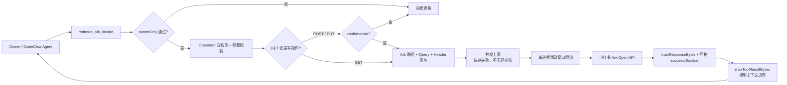
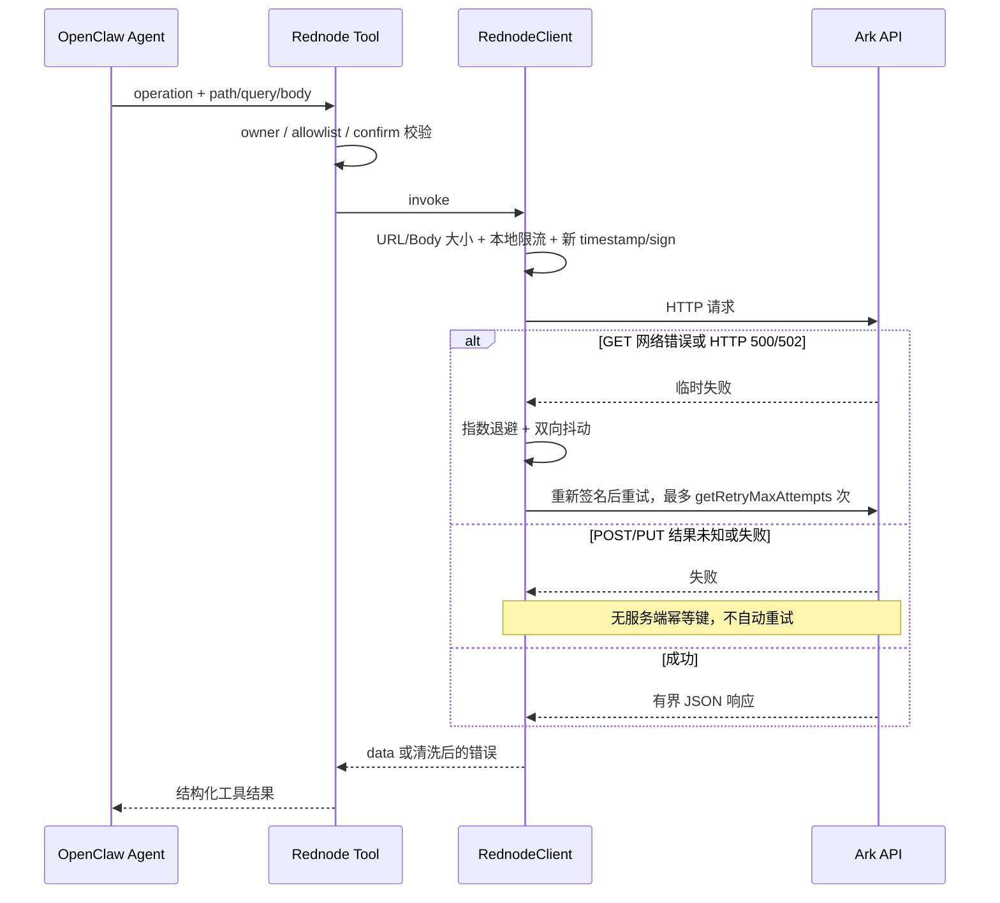
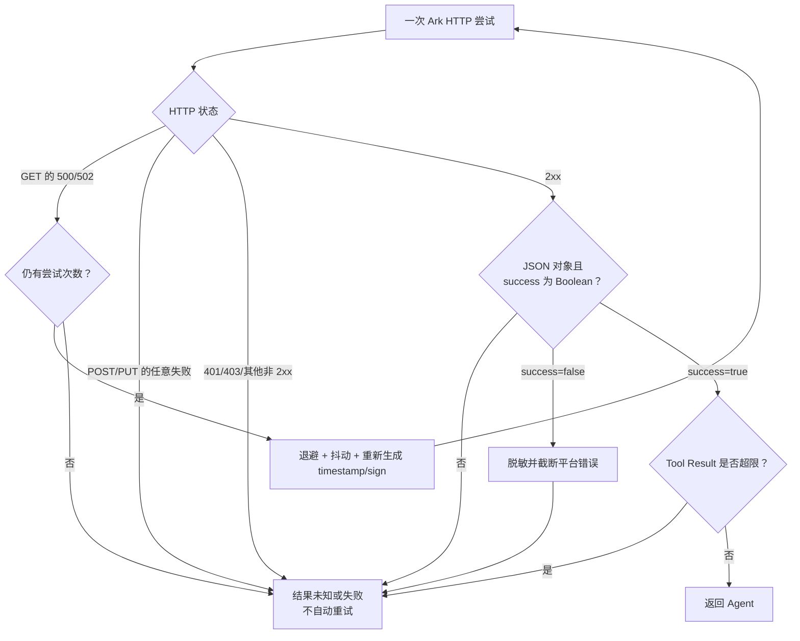

# @partme.ai/openclaw-rednode

OpenClaw 2026.7.1 的小红书 Ark Open API capability。它不是小红书私信/内容发布渠道，也不使用浏览器自动化；只调用商家 Ark 开放平台中显式配置的 API 白名单。

## 能力边界

- 本插件是 **Agent Tool**，不是 `ChannelPlugin`，不接收私信或 Webhook。
- Ark 使用静态 `app-key` / `app-secret` 请求签名，不存在本插件需要维护的 OAuth Token 刷新流程。
- 不内置猜测的订单、商品或内容接口；每个 operation 必须由管理员从官方 Ark 文档复制并加入白名单。
- `POST` / `PUT` 属于真实业务写操作，只执行一次；`confirm=true` 是第二道显式门槛，但不能替代组织级审批。

## 运行架构

下面的字符图用于在终端、代码评审和 Markdown 原文中快速看清安全边界；后续 Mermaid 图继续表达可渲染的组件关系，两者都保留。

```text
┌────────────────────────────────────────────────────────────────────┐
│                    OpenClaw Gateway 2026.7.1                       │
├────────────────────────────────────────────────────────────────────┤
│  Owner / Agent                                                     │
│       │ operation + path_params + query + body                     │
│       ▼                                                            │
│  rednode_ark_invoke                                                │
│       │ ownerOnly → operation 白名单 → POST/PUT confirm=true       │
│       ▼                                                            │
│  RednodeClient                                                     │
│       │ 路径/参数/请求大小 → 并发闸门 → 本地限流 → 签名          │
│       │ 禁止 3xx 跟随；认证 Header 只发往配置可信 Origin         │
│       │ GET: 网络/500/502 有界重试；POST/PUT: 始终只执行一次        │
│       ▼                                                            │
│  响应流上限 → success:Boolean → 双层错误脱敏 → Tool Result 上限    │
└──────────────────────────────┬─────────────────────────────────────┘
                               │ HTTPS（生产）/ 官方沙箱 HTTP
                               ▼
                  ┌────────────────────────────┐
                  │ 小红书 Ark Open API        │
                  │ production / sandbox       │
                  └────────────────────────────┘
```



凭据只进入 `app-key` Header 和本地 MD5 签名计算，不写入 URL 或错误信息。客户端强制 `redirect: manual`，因此带有 `app-key`、`timestamp`、`sign` 的请求不会被 Fetch 自动转发到 3xx 目标。客户端和 Tool 最终出口都会遮蔽 URL 用户信息、Bearer、认证字段、签名字段以及真实 AppKey/AppSecret。默认只允许当前环境对应的官方 Host；如部署可信 HTTPS 代理，必须显式设置 `allowCustomApiBaseUrl=true`。

## 真实协议

- 生产网关：`https://ark.xiaohongshu.com`
- 官方沙箱：`http://flssandbox.xiaohongshu.com`
- `timestamp`、`app-key`、`sign` 放在 Header，Body 使用 JSON。
- 签名：API 路径 + 按名称排序的 query/Header 参数 + app-secret，再计算 MD5。
- 支持官方文档使用的 GET、POST、PUT；写操作必须传 `confirm: true`。
- `confirm=true` 只是防止 Agent 偶然触发写请求的技术门槛，不代表小红书平台审核、内容合规、业务审批或人工复核；上下架、发货等高风险操作仍须由上层审批工作流控制。
- 官方响应约定包含 200、401、403、500/502。插件只对 GET 的网络异常和 500/502 做有界重试；401/403 以及所有 POST/PUT 都不会自动重试。
- HTTP 200 也必须包含 Boolean 类型的 `success`；缺失或字符串形式会作为畸形信封失败，不能产生假成功。

## 请求与重试时序



## 响应与重试决策



## 配置

```json
{
  "plugins": {
    "entries": {
      "rednode": {
        "enabled": true,
        "config": {
          "enabled": true,
          "appKey": "你的 app-key",
          "appSecret": "你的 app-secret",
          "environment": "production",
          "getRetryMaxAttempts": 3,
          "retryInitialDelayMs": 250,
          "retryMaxDelayMs": 2000,
          "retryJitterRatio": 0.2,
          "maxResponseBytes": 2097152,
          "maxToolResultBytes": 262144,
          "operations": [
            {
              "name": "item_list",
              "method": "GET",
              "apiPath": "/ark/open_api/v1/items"
            },
            {
              "name": "item_availability",
              "method": "PUT",
              "apiPath": "/ark/open_api/v1/item/{item_id}/availability"
            }
          ]
        }
      }
    }
  }
}
```

### 关键配置

| 字段                    |    默认值 | 说明                                                |
| ----------------------- | --------: | --------------------------------------------------- |
| `ownerOnly`             |    `true` | 只允许命令 Owner 调用工具                           |
| `maxRequestsPerMinute`  |      `60` | 单 Gateway 进程的真实 HTTP 尝试上限，GET 重试也计数 |
| `maxConcurrentRequests` |       `8` | 同时执行的 Ark 调用上限；达到上限立即失败，不无界排队 |
| `requestTimeoutMs`      |   `30000` | 每次 HTTP 尝试的超时                                |
| `maxRequestBytes`       |   `65536` | 请求 URL 或 JSON Body 的独立大小上限                |
| `maxResponseBytes`      | `2097152` | 流式读取响应时的硬上限                              |
| `maxToolResultBytes`    |  `262144` | 进入模型上下文与会话存储的 Tool Result 上限         |
| `getRetryMaxAttempts`   |       `3` | GET 总尝试次数，范围 1～5                           |
| `retryInitialDelayMs`   |     `250` | GET 首次重试基础延迟                                |
| `retryMaxDelayMs`       |    `2000` | 指数退避上限                                        |
| `retryJitterRatio`      |     `0.2` | 双向抖动比例，避免多实例同步重试                    |
| `allowCustomApiBaseUrl` |   `false` | 是否明确允许把 Ark 凭据发往可信自定义 HTTPS Origin  |

也可通过 `XHS_APP_KEY`、`XHS_APP_SECRET` 注入凭据。插件默认关闭、默认 owner-only，不接受 Agent 自由输入 URL。

插件只注册 `rednode_ark_invoke`。查询参数放 `query`，路径占位参数放 `path_params`，JSON 请求体放 `body`。本地限流仅针对单进程，多 Gateway 需在上游集中限流。

`RednodeClient.status()` 提供同一执行进程内的低敏计数，适合嵌入式诊断和测试，但插件不把它伪装成 Gateway 全局状态接口：OpenClaw CLI Agent 可能在独立进程执行 Tool，Gateway 内存无法代表其他进程。生产多进程/多 Gateway 指标必须接入共享指标后端；全局配额应由可信出口代理或集中限流服务控制。

配置解析会拒绝非对象根配置、顶层和 operation 中的未知字段，并严格校验 `enabled`、`ownerOnly`、`allowCustomApiBaseUrl` 的布尔类型，避免字符串形式的安全开关被静默解释成默认值。凭据和参数拒绝控制字符，路径/查询拒绝 `NaN`、无穷数等非有限值。远程自定义 Origin 默认拒绝；回环地址仅用于本地契约测试。响应超过上限时会立即取消流，避免继续下载无用数据占用连接和内存。

本插件不维护商品发布工作流、内容审核状态机或 Webhook 回调重放；这些能力必须基于已审批的具体 Ark API 另行建模，不能由通用 Tool 猜测。Ark 当前协议使用静态签名凭据，因此也不存在 OAuth Token 续期逻辑。

## 安装态 E2E

```bash
node scripts/e2e/run-e2e.mjs --plugins rednode --skip-browser
pnpm --dir extensions/rednode test:coverage
```

该场景会构建正式产物、打包 tarball 并安装到独立 OpenClaw 2026.7.1 profile。真实 Agent 发起一次 `rednode_ark_invoke`，本地 Ark 夹具不复用插件代码而独立重算 MD5；第一次返回 HTTP 502，随后验证 GET 重新签名后只重试一次、白名单路径和 Query 正确，且商品 Tool Result 回到第二轮模型上下文。

本地通过不代表真实小红书环境验收：上线前仍需使用官方沙箱/应用凭据验证授权范围、401/403、平台限流以及目标 operation 的真实响应结构。

上线前必须先申请小红书沙箱，只从官方 Ark 文档复制 API 路径、方法和参数；先验证只读接口，再开放发货、上下架等写操作。

官方文档：[快速开始](https://school.xiaohongshu.com/en/open/quick-start/summary.html)、[系统参数](https://school.xiaohongshu.com/en/open/quick-start/system-parameter.html)、[签名示例](https://school.xiaohongshu.com/en/open/quick-start/sign.html)、[响应格式](https://school.xiaohongshu.com/en/open/quick-start/response-format.html)、[商品列表](https://school.xiaohongshu.com/en/open/product/item-list.html)。
