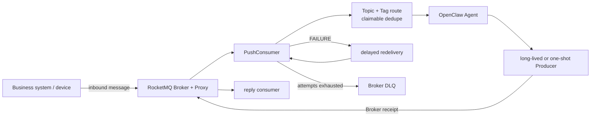
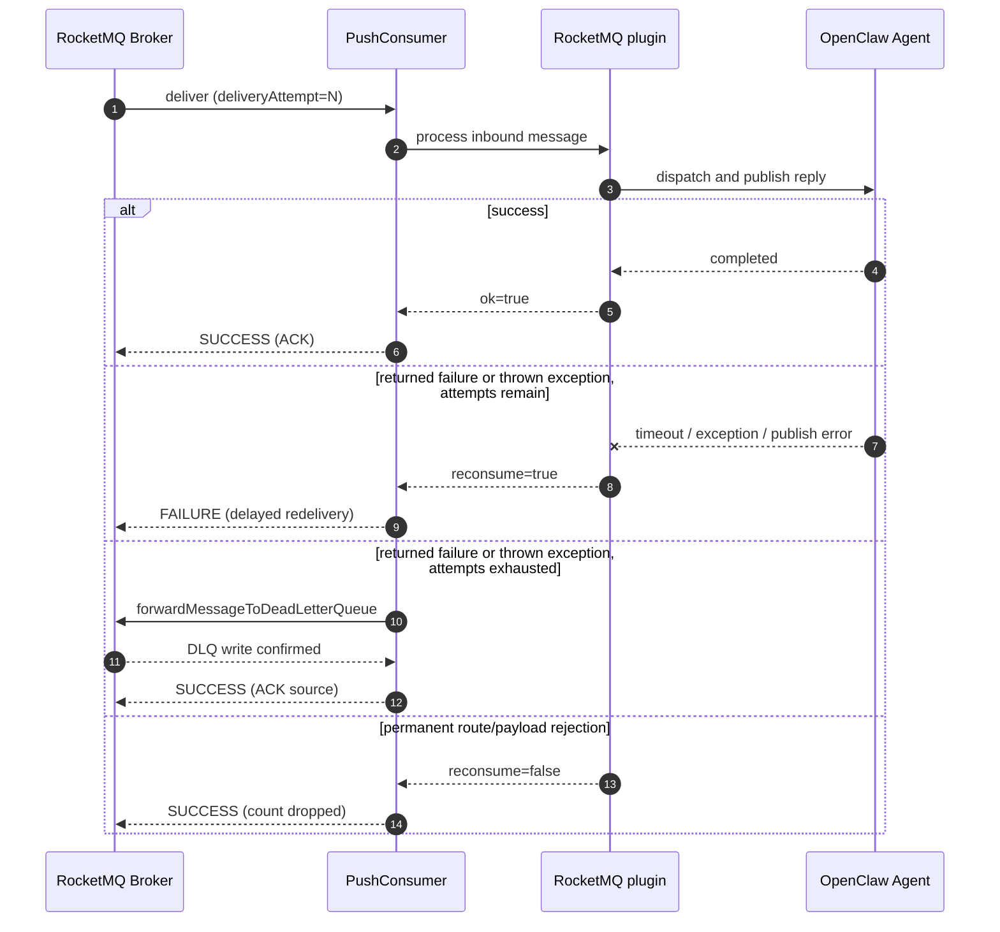

# OpenClaw RocketMQ

> RocketMQ Channel Plugin for OpenClaw — producer and push-consumer integration with topic+tag bindings, 3 dispatch modes, and authenticated health endpoints.

[](https://www.npmjs.com/package/@partme.ai/openclaw-rocketmq)
[](https://nodejs.org)
[](LICENSE)

[English](./README.md) | [简体中文](./README.zh-CN.md)

---

## Overview

`@partme.ai/openclaw-rocketmq` bridges external RocketMQ messages into OpenClaw agents and publishes agent replies back to RocketMQ. It uses `rocketmq-client-nodejs` for Producer and PushConsumer, with a full OpenClaw channel plugin lifecycle.

The character diagram gives a quick view of message ownership and shutdown ordering; the Mermaid diagram below keeps the complete renderable relationship:

```text
Business system ──publish──▶ RocketMQ Broker / Proxy
                                  │ PushConsumer (Broker owns redelivery)
                                  ▼
                         Topic+Tag route → idempotency claim
                                  │
                                  ▼
                           OpenClaw Agent Turn
                                  │ successful reply
                                  ▼
                        long-lived Producer ──▶ reply Topic
                                  │
                                  └─ success: SUCCESS / ACK
                                     transient: FAILURE / redelivery
                                     exhausted: Broker DLQ, then ACK source

stop: reject new delivery → close Consumer → drain admitted turns → close Producer
```



## Features

- **Producer + PushConsumer** — Full RocketMQ production and consumption lifecycle
- **Topic+Tag Bindings** — Explicit `topic + tag -> agentId` routing rules
- **3 Dispatch Modes** — `embedded-agent` (default) / `subagent` / `reply-pipeline`
- **Payload Strategies** — `jsonTextOrPlain` (default) / `jsonOnly` / `plainText`
- **Fallback Topics** — Broker-safe standard pattern: `openclaw--agent--<agentId>--in[--<peerId>]`
- **Reply Topic Routing** — Agent replies published to configured `replyTopic` / `replyTag`
- **Health Endpoints** — `/rocketmq/health`, `/rocketmq/stats`, `/rocketmq/status`
- **Session Mapping** — Tracks producer-consumer-conversation session mappings
- **Claimable idempotency** — Message IDs are committed only after successful Agent dispatch and reply publication
- **Setup Wizard** — Interactive setup via OpenClaw setup wizard

## Quick Start

### Installation

```bash
openclaw plugins install @partme.ai/openclaw-rocketmq
```

Requires `@partme.ai/openclaw-message-sdk >= 2026.7.1` and OpenClaw >= 2026.7.1.

### Minimal Configuration

```json
{
  "channels": {
    "rocketmq": {
      "endpoints": "127.0.0.1:8081",
      "namespace": "",
      "topicPrefix": "openclaw",
      "producer": {
        "groupId": "openclaw-rocketmq-producer"
      },
      "consumer": {
        "groupId": "openclaw-rocketmq-consumer",
        "subscriptions": [{ "topic": "device-status", "filterExpression": "*" }]
      },
      "topicBindings": [
        {
          "topic": "device-status",
          "tag": "iot",
          "agentId": "iot-agent",
          "accountId": "default",
          "replyTopic": "device-command",
          "replyTag": "command"
        }
      ],
      "dispatch": {
        "mode": "embedded-agent",
        "timeoutMs": 120000,
        "reply": { "enabled": true }
      }
    }
  }
}
```

## Configuration Reference

```jsonc
{
  "channels": {
    "rocketmq": {
      "endpoints": "127.0.0.1:8081", // RocketMQ proxy/namesrv endpoint
      "namespace": "", // RocketMQ namespace
      "topicPrefix": "openclaw", // Topic prefix for fallback topics
      "sessionCredentials": {
        // Optional: ACL credentials
        "accessKey": "",
        "accessSecret": "",
        "securityToken": "",
      },
      "producer": {
        "groupId": "openclaw-rocketmq-producer", // Deprecated compatibility label
        "requestTimeout": 5000, // Request timeout in ms
        "maxAttempts": 3, // SDK producer send attempts
        "maxMessageSizeInBytes": 4194304, // Maximum outbound payload size
      },
      "consumer": {
        "groupId": "openclaw-rocketmq-consumer", // Consumer group ID
        "subscriptions": [
          // Topics to subscribe
          { "topic": "my-topic", "filterExpression": "*" },
        ],
        "maxCacheMessageCount": 1024,
        "maxCacheMessageSizeInBytes": 67108864,
        "longPollingTimeout": 30000,
        "requestTimeout": 3000,
        "reconsumeOnError": true, // Re-consume on dispatch error
        "retry": {
          "maxAttempts": 17,
          "initialDelayMs": 1000,
          "maxDelayMs": 60000,
          "multiplier": 2,
        },
      },
      "topicBindings": [
        // Topic-to-agent routing rules
        {
          "topic": "device-status",
          "tag": "iot",
          "agentId": "iot-agent",
          "accountId": "default",
          "peerId": "device-1", // Optional: peer identifier
          "replyTopic": "device-command", // Optional: reply topic
          "replyTag": "command", // Optional: reply tag
        },
      ],
      "payload": {
        "mode": "jsonTextOrPlain", // "jsonTextOrPlain" | "jsonOnly" | "plainText"
      },
      "dispatch": {
        "mode": "embedded-agent", // "embedded-agent" | "subagent" | "reply-pipeline"
        "timeoutMs": 120000, // Agent processing timeout
        "reply": { "enabled": true }, // Enable reply publishing
      },
      "idempotency": {
        // Claim/commit/release dedup
        "enabled": true,
        "ttlMs": 600000,
        "maxEntries": 10000,
      },
      "connection": {
        "startupAttempts": 6,
        "retryDelayMs": 5000,
        "retryMaxDelayMs": 60000,
        "retryJitterRatio": 0.2,
        "shutdownTimeoutMs": 10000,
      },
    },
  },
}
```

### Configuration Fields

| Field                            | Type    | Default                        | Description                                                                                                            |
| -------------------------------- | ------- | ------------------------------ | ---------------------------------------------------------------------------------------------------------------------- |
| `endpoints`                      | string  | `"127.0.0.1:8081"`             | RocketMQ proxy/namesrv endpoint                                                                                        |
| `namespace`                      | string  | `""`                           | RocketMQ namespace                                                                                                     |
| `topicPrefix`                    | string  | `"openclaw"`                   | Topic prefix for fallback message routing                                                                              |
| `producer.groupId`               | string  | `"openclaw-rocketmq-producer"` | Deprecated compatibility label; the RocketMQ 5 Node Producer does not use a producer group                             |
| `producer.requestTimeout`        | number  | `5000`                         | Producer request timeout (ms)                                                                                          |
| `producer.maxAttempts`           | number  | `3`                            | Producer send attempts handled by the SDK                                                                              |
| `producer.maxMessageSizeInBytes` | integer | `4194304`                      | Maximum UTF-8 payload size per outbound message                                                                        |
| `consumer.groupId`               | string  | `"openclaw-rocketmq-consumer"` | Consumer group ID                                                                                                      |
| `consumer.reconsumeOnError`      | boolean | `true`                         | Re-consume message on dispatch error                                                                                   |
| `consumer.retry`                 | object  | exponential, 17 attempts       | Client-side retry delay and exhaustion threshold; exhausted non-FIFO messages are forwarded through the Broker DLQ API |
| `payload.mode`                   | string  | `"jsonTextOrPlain"`            | Payload parsing mode                                                                                                   |
| `dispatch.mode`                  | string  | `"embedded-agent"`             | Agent dispatch mode                                                                                                    |
| `dispatch.timeoutMs`             | number  | `120000`                       | Agent processing timeout (ms)                                                                                          |
| `idempotency.enabled`            | boolean | `true`                         | Claim message ID before dispatch and commit only after success                                                         |
| `connection.startupAttempts`     | number  | `6`                            | Producer/consumer startup attempts                                                                                     |
| `connection.retryDelayMs`        | number  | `5000`                         | Delay between startup attempts                                                                                         |
| `connection.retryMaxDelayMs`     | number  | `60000`                        | Maximum exponential startup backoff                                                                                    |
| `connection.retryJitterRatio`    | number  | `0.2`                          | Backoff jitter ratio from 0 to 1                                                                                       |
| `connection.shutdownTimeoutMs`   | number  | `10000`                        | Maximum wait per Producer/Consumer shutdown before Gateway continues stopping                                          |

### Dispatch Modes

| Mode             | Description                                                             |
| ---------------- | ----------------------------------------------------------------------- |
| `embedded-agent` | Messages are routed to an agent embedded within the current process     |
| `subagent`       | Messages are routed to a separate subagent instance                     |
| `reply-pipeline` | Messages are processed through a reply pipeline (request/reply pattern) |

### Payload Modes

| Mode              | Description                                    |
| ----------------- | ---------------------------------------------- |
| `jsonTextOrPlain` | Prefer JSON `text` field, fallback to raw text |
| `jsonOnly`        | Parse payload as JSON only                     |
| `plainText`       | Treat entire payload as plain text             |

## Message Model

### Inbound (RocketMQ -> Agent)

- **Explicit binding first**: Matched against `topicBindings[].topic + topicBindings[].tag`
- **Standard fallback**: `{topicPrefix}--agent--<agentId>--in[--<peerId>]`
- **Payload parsing**: `jsonTextOrPlain` — reads `text` field from JSON, or uses raw text

### Outbound (Agent -> RocketMQ)

- **Session binding**: Uses `replyTopic` / `replyTag` from active session
- **Standard fallback**: `{topicPrefix}--agent--<agentId>--out[--<peerId>]`
- **Consumption**: PushConsumer with `ConsumeResult.SUCCESS` / `FAILURE` acknowledgment

### Failure, retry, and dead-letter state machine



## Health Endpoints

Available when the plugin registers in "full" mode:

| Endpoint               | Description                                                |
| ---------------------- | ---------------------------------------------------------- |
| `GET /rocketmq/health` | Basic health check (200 = healthy, 503 = unhealthy)        |
| `GET /rocketmq/stats`  | Connection stats and session statistics                    |
| `GET /rocketmq/status` | Full status including config snapshot and session mappings |

## Transport Layer Notes

- Uses `PushConsumer` — message acknowledgment via `ConsumeResult.SUCCESS` / `FAILURE`
- Topic and consumer-group resources use RocketMQ-safe names (`[a-zA-Z0-9_-]`); dots and `/` are rejected before startup. The standard route reserves `--` as its segment delimiter.
- Retries are handled by RocketMQ broker/consumer group mechanism
- Dispatch or reply publication failures return `ConsumeResult.FAILURE`; the configured client retry delay avoids the Node SDK's unsupported Broker customized-backoff gap, and exhausted messages are forwarded through the Broker DLQ API
- Thrown handler exceptions and explicit `reconsume=true` results share the same max-attempt/DLQ state machine; exceptions cannot bypass poison-message exhaustion handling
- Unroutable messages are acknowledged as permanent drops; runtime and dispatch failures request redelivery
- Normal outbound delivery without a session context fails before publishing instead of returning a placeholder success message ID
- Producer and Consumer shutdown calls are time-bounded by `connection.shutdownTimeoutMs`; shutdown rejects new deliveries, closes the Consumer, drains admitted turns within the Agent dispatch budget, then closes the reply Producer
- SDK, proxy, and Agent errors are credential-redacted before entering logs or health state; inbound logs record payload byte length, not message content
- Idempotency is process-local and does not provide cross-node exactly-once semantics
- No manual retry queue management needed (unlike RabbitMQ)
- Request/reply RPC requires an explicit `replyTopic` + `replyTag` binding (RocketMQ does not natively support direct-reply-to like RabbitMQ)

## Development

```bash
# Install dependencies
pnpm install

# Build (tsup -> dist/)
pnpm build

# Type check
pnpm typecheck

# Run tests
pnpm test

# Watch mode
pnpm dev
```

## License

Licensed under the [MIT License](LICENSE).

## About openclaw-plugins

This plugin is part of [openclaw-plugins](https://github.com/partme-ai/openclaw-plugins) — an enterprise OpenClaw plugin collection developed and maintained by the **PartMe.AI team**, featuring 30+ plugins across IM channels, message queues, AI capabilities, and infrastructure.

Each plugin is published independently on npm under the `@partme.ai` scope:

```bash
openclaw plugins install @partme.ai/openclaw-rocketmq
```

**PartMe.AI** specializes in AI customer service and enterprise AI agent infrastructure, providing end-to-end solutions from WeChat Work/DingTalk/Feishu/QQ channel integration to RAG knowledge bases, multi-layer memory, and production monitoring.

> Contact: partmeai@gmail.com | [GitHub](https://github.com/partme-ai/openclaw-plugins)
