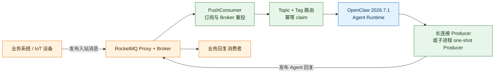
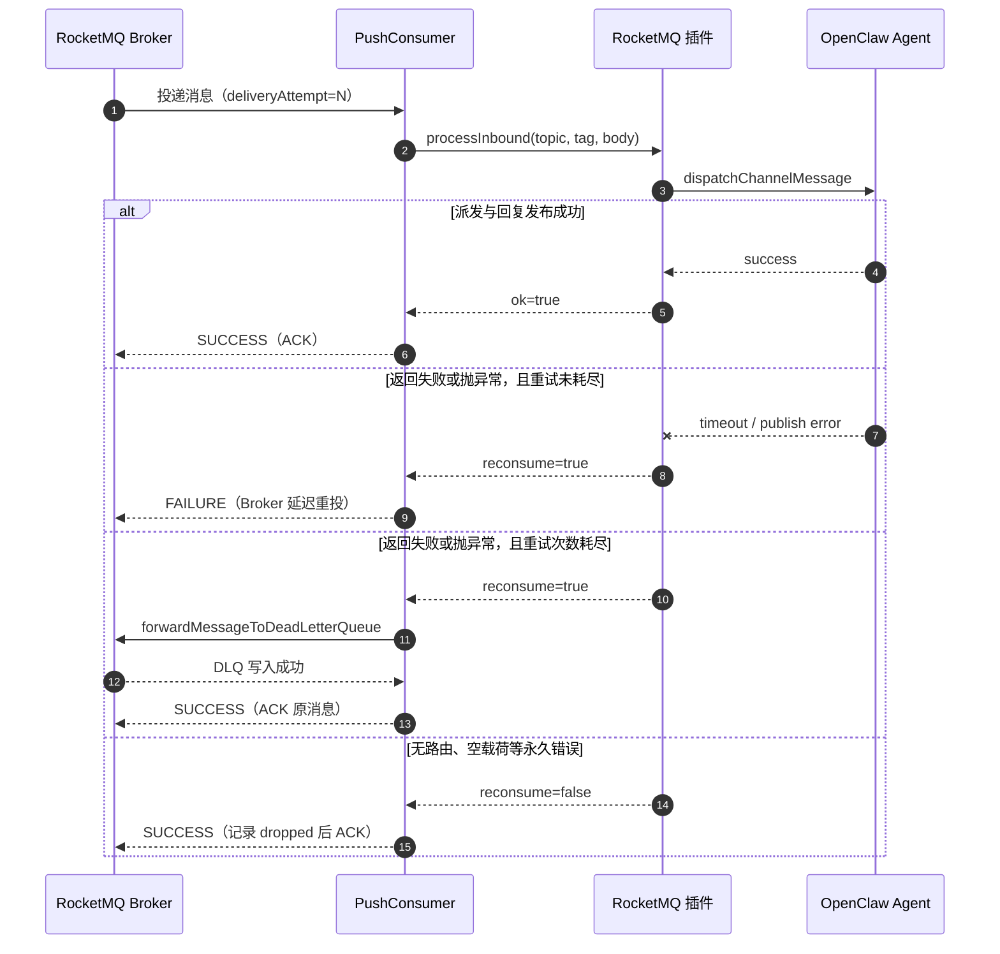

# OpenClaw RocketMQ

**OpenClaw 插件 — RocketMQ 消息队列通道，支持 Producer + PushConsumer、Topic+Tag 绑定、3 种分发模式和认证健康检查**

[](https://www.npmjs.com/package/@partme.ai/openclaw-rocketmq)
[](https://nodejs.org)
[](LICENSE)

[English](./README.md) | [简体中文](./README.zh-CN.md)

---

## 概述

`@partme.ai/openclaw-rocketmq` 将外部 RocketMQ 消息桥接到 OpenClaw Agent，并将 Agent 回复重新发布到 RocketMQ。它使用 `rocketmq-client-nodejs` 实现 Producer 和 PushConsumer，遵循完整的 OpenClaw channel 插件生命周期。



## 特性

- **Producer + PushConsumer** — 完整的 RocketMQ 生产和消费生命周期
- **Topic+Tag 绑定** — 显式的 `topic + tag -> agentId` 路由规则
- **3 种分发模式** — `embedded-agent`（默认）/ `subagent` / `reply-pipeline`
- **载荷解析策略** — `jsonTextOrPlain`（默认）/ `jsonOnly` / `plainText`
- **回退主题** — Broker 合法标准模式：`openclaw--agent--<agentId>--in[--<peerId>]`
- **回复主题路由** — Agent 回复发布到配置的 `replyTopic` / `replyTag`
- **健康端点** — `/rocketmq/health`、`/rocketmq/stats`、`/rocketmq/status`
- **会话映射** — 追踪 producer-consumer-conversation 会话映射关系
- **可回滚幂等** — 仅在 Agent 派发与回复发布成功后提交 message ID
- **设置向导** — 通过 OpenClaw setup wizard 进行交互式配置

## 快速开始

### 安装

```bash
openclaw plugins install @partme.ai/openclaw-rocketmq
```

最低依赖：`@partme.ai/openclaw-message-sdk >= 2026.7.1`、OpenClaw >= 2026.7.1。

### message-sdk 复用

| message-sdk 模块                                             | rocketmq 挂载点              | 用途                                     |
| ------------------------------------------------------------ | ---------------------------- | ---------------------------------------- |
| `bridge`（`normalizeWireIngress`、`dispatchChannelMessage`） | `src/inbound.ts`             | PushConsumer 入站 + 三 mode 派发         |
| `dedup` + `util/getGlobalSingleton`                          | `src/shared/wire-helpers.ts` | 可配置幂等、`mapRocketmqWirePayloadMode` |
| `config/resolveChannelAgentReplyTimeoutMs`                   | `src/config/resolvers.ts`    | embedded/subagent 派发超时               |
| `pipeline/serializeForTransport`                             | `src/outbound.ts`            | 直连出站 `legacyJsonText` 序列化         |

### 最小配置

```json
{
  "channels": {
    "rocketmq": {
      "endpoints": "127.0.0.1:8081",
      "namespace": "",
      "topicPrefix": "openclaw",
      "producer": {
        "groupId": "openclaw-rocketmq-producer"
      },
      "consumer": {
        "groupId": "openclaw-rocketmq-consumer",
        "subscriptions": [{ "topic": "device-status", "filterExpression": "*" }]
      },
      "topicBindings": [
        {
          "topic": "device-status",
          "tag": "iot",
          "agentId": "iot-agent",
          "accountId": "default",
          "replyTopic": "device-command",
          "replyTag": "command"
        }
      ],
      "dispatch": {
        "mode": "embedded-agent",
        "timeoutMs": 120000,
        "reply": { "enabled": true }
      }
    }
  }
}
```

## 配置参考

```jsonc
{
  "channels": {
    "rocketmq": {
      "endpoints": "127.0.0.1:8081", // RocketMQ proxy/namesrv 端点
      "namespace": "", // RocketMQ 命名空间
      "topicPrefix": "openclaw", // 回退主题的前缀
      "sessionCredentials": {
        // 可选：ACL 凭证
        "accessKey": "",
        "accessSecret": "",
        "securityToken": "",
      },
      "producer": {
        "groupId": "openclaw-rocketmq-producer", // 兼容保留字段（Node Producer 不使用）
        "requestTimeout": 5000, // 请求超时（毫秒）
        "maxAttempts": 3, // SDK Producer 发送尝试次数
        "maxMessageSizeInBytes": 4194304, // 单条出站消息上限（默认 4 MiB）
      },
      "consumer": {
        "groupId": "openclaw-rocketmq-consumer", // Consumer 组 ID
        "subscriptions": [
          // 订阅的主题列表
          { "topic": "my-topic", "filterExpression": "*" },
        ],
        "maxCacheMessageCount": 1024,
        "maxCacheMessageSizeInBytes": 67108864,
        "longPollingTimeout": 30000,
        "requestTimeout": 3000,
        "reconsumeOnError": true, // 分发失败时重新消费
        "retry": {
          "maxAttempts": 17,
          "initialDelayMs": 1000,
          "maxDelayMs": 60000,
          "multiplier": 2,
        },
      },
      "topicBindings": [
        // Topic 到 Agent 的路由规则
        {
          "topic": "device-status",
          "tag": "iot",
          "agentId": "iot-agent",
          "accountId": "default",
          "peerId": "device-1", // 可选：对端标识
          "replyTopic": "device-command", // 可选：回复主题
          "replyTag": "command", // 可选：回复标签
        },
      ],
      "payload": {
        "mode": "jsonTextOrPlain", // "jsonTextOrPlain" | "jsonOnly" | "plainText"
      },
      "dispatch": {
        "mode": "embedded-agent", // "embedded-agent" | "subagent" | "reply-pipeline"
        "timeoutMs": 120000, // Agent 处理超时
        "reply": { "enabled": true }, // 启用回复消息发布
      },
      "idempotency": {
        // claim/commit/release 幂等
        "enabled": true,
        "ttlMs": 600000,
        "maxEntries": 10000,
      },
      "connection": {
        "startupAttempts": 6,
        "retryDelayMs": 5000, // 首次重试基础延迟
        "retryMaxDelayMs": 60000, // 指数退避上限
        "retryJitterRatio": 0.2, // 抖动比例，打散多实例同步重连
        "shutdownTimeoutMs": 10000, // 每个客户端的优雅退出预算
      },
    },
  },
}
```

### 配置字段

| 字段                             | 类型    | 默认值                         | 描述                                                                 |
| -------------------------------- | ------- | ------------------------------ | -------------------------------------------------------------------- |
| `endpoints`                      | string  | `"127.0.0.1:8081"`             | RocketMQ proxy/namesrv 端点                                          |
| `namespace`                      | string  | `""`                           | RocketMQ 命名空间                                                    |
| `topicPrefix`                    | string  | `"openclaw"`                   | 回退消息路由的主题前缀                                               |
| `producer.groupId`               | string  | `"openclaw-rocketmq-producer"` | 兼容保留字段；RocketMQ 5 Node Producer 不使用 Producer Group         |
| `producer.requestTimeout`        | number  | `5000`                         | Producer 请求超时（毫秒）                                            |
| `producer.maxAttempts`           | number  | `3`                            | SDK Producer 发送尝试次数                                            |
| `producer.maxMessageSizeInBytes` | integer | `4194304`                      | 单条出站 UTF-8 消息上限，超限时在连接 Broker 前失败                  |
| `consumer.groupId`               | string  | `"openclaw-rocketmq-consumer"` | Consumer 组 ID                                                       |
| `consumer.reconsumeOnError`      | boolean | `true`                         | 分发错误时重新消费消息                                               |
| `consumer.retry`                 | object  | 指数退避，17 次                | 客户端重投延迟和耗尽阈值；非 FIFO 消息耗尽后通过 Broker DLQ API 转发 |
| `payload.mode`                   | string  | `"jsonTextOrPlain"`            | 载荷解析模式                                                         |
| `dispatch.mode`                  | string  | `"embedded-agent"`             | Agent 分发模式                                                       |
| `dispatch.timeoutMs`             | number  | `120000`                       | Agent 处理超时（毫秒）                                               |
| `idempotency.enabled`            | boolean | `true`                         | 派发前 claim，成功后才 commit message ID                             |
| `connection.startupAttempts`     | number  | `6`                            | Producer/Consumer 启动尝试次数                                       |
| `connection.retryDelayMs`        | number  | `5000`                         | 启动尝试间隔                                                         |
| `connection.retryMaxDelayMs`     | number  | `60000`                        | 启动指数退避的最大延迟                                               |
| `connection.retryJitterRatio`    | number  | `0.2`                          | 退避抖动比例（0～1）                                                 |
| `connection.shutdownTimeoutMs`   | number  | `10000`                        | Producer/Consumer 单次优雅退出预算；超时后 Gateway 继续停止          |

### 分发模式

| 模式             | 描述                                  |
| ---------------- | ------------------------------------- |
| `embedded-agent` | 消息路由到当前进程内的嵌入 Agent      |
| `subagent`       | 消息路由到独立的子 Agent 实例         |
| `reply-pipeline` | 消息通过回复管道处理（请求/响应模式） |

### 载荷模式

| 模式              | 描述                                           |
| ----------------- | ---------------------------------------------- |
| `jsonTextOrPlain` | 优先解析 JSON 中的 `text` 字段，回退到原始文本 |
| `jsonOnly`        | 仅解析 JSON 格式载荷                           |
| `plainText`       | 将整个载荷视为纯文本                           |

## 消息模型

### 入站（RocketMQ -> Agent）

- **显式绑定优先**：根据 `topicBindings[].topic + topicBindings[].tag` 匹配
- **标准回退**：`{topicPrefix}--agent--<agentId>--in[--<peerId>]`
- **载荷解析**：`jsonTextOrPlain` — 优先读取 JSON 的 `text` 字段，否则使用原始文本

### 出站（Agent -> RocketMQ）

- **会话绑定**：使用活跃会话中的 `replyTopic` / `replyTag`
- **标准回退**：`{topicPrefix}--agent--<agentId>--out[--<peerId>]`
- **消费确认**：PushConsumer 通过 `ConsumeResult.SUCCESS` / `FAILURE` 确认

### 失败、重投与死信边界



这里的 `messagesAcked` 表示向 Broker 返回 `SUCCESS`，`messagesNacked` 与
`messagesRequeued` 表示向 Broker 返回 `FAILURE` 并请求重投；转入 DLQ 成功后才会 ACK
原消息。这样指标、Broker 行为和业务丢弃原因三者保持一致。

处理器“返回失败”和“直接抛异常”会进入同一状态机，因此异常不会绕过 `maxAttempts`
而形成永久重投的非 FIFO 毒消息。普通出站如果缺少会话上下文也会直接失败，不会再返回
`no-session-context` 之类的占位成功结果。

## 健康端点

插件以 "full" 模式注册时可用：

| 端点                   | 描述                                   |
| ---------------------- | -------------------------------------- |
| `GET /rocketmq/health` | 基本健康检查（200 = 正常，503 = 异常） |
| `GET /rocketmq/stats`  | 连接统计和会话统计                     |
| `GET /rocketmq/status` | 完整状态，包括配置快照和会话映射       |

## 传输层说明

- 使用 `PushConsumer` — 消息确认通过 `ConsumeResult.SUCCESS` / `FAILURE` 完成
- 重试由 RocketMQ broker/consumer group 机制接管，无需手动维护重试队列
- Agent 派发或回复发布失败返回 `ConsumeResult.FAILURE`；配置化客户端退避规避 Node SDK 不支持 Broker customized-backoff 的缺口，耗尽后通过 Broker DLQ API 转发
- Agent 处理器抛异常和显式 `reconsume=true` 共用最大尝试/DLQ 状态机，异常不会绕过毒消息耗尽处理
- Producer/Consumer 启动使用“指数退避 + 上限 + 抖动”；停止账号时 AbortSignal 会立即打断等待
- Producer/Consumer 停机受 `connection.shutdownTimeoutMs` 约束；SDK 卡住会记录错误，但不能无限阻塞 Gateway 退出
- 用户显式填写的非法数值、枚举或半套 ACL 凭证不会被默认值悄悄覆盖，而是在启动前集中报错
- 无法路由属于永久丢弃并确认；Runtime 未就绪或派发失败会请求 Broker 重投
- 普通出站缺少 session context 时明确失败，不再用占位 messageId 伪装 Broker 已确认
- 幂等状态仅在当前进程内有效，不等于跨节点 exactly-once
- Request/reply RPC 需要显式配置 `replyTopic` + `replyTag` 绑定（RocketMQ 不像 RabbitMQ 那样原生支持 direct-reply-to）

## 开发

```bash
# 安装依赖
pnpm install

# 构建（tsup -> dist/）
pnpm build

# 类型检查
pnpm typecheck

# 运行测试
pnpm test

# 监听模式
pnpm dev
```

## 许可证

基于 [MIT License](LICENSE) 开源。

## 关于 openclaw-plugins

本项目是 [openclaw-plugins](https://github.com/partme-ai/openclaw-plugins) monorepo 的一员 — 由 **PartMe.AI 团队** 研发与二次开发的 OpenClaw 企业级插件集合，包含 30+ 独立插件，覆盖 IM 渠道、消息队列、AI 能力、基础设施四大领域。

每个插件独立发布到 npm（`@partme.ai` scope），可单独安装：

```bash
openclaw plugins install @partme.ai/openclaw-rocketmq
```

**PartMe.AI** 专注于 AI 智能客服与企业级 AI Agent 基础设施，提供从企微/钉钉/飞书/QQ 渠道接入，到 RAG 知识库、多级记忆、监控运维的全栈解决方案。

> 联系我们：partmeai@gmail.com | [GitHub](https://github.com/partme-ai/openclaw-plugins)
