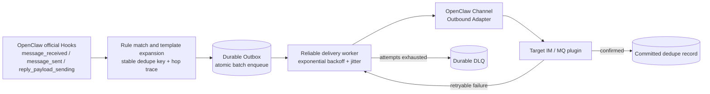

# OpenClaw Router

> Production-oriented cross-channel routing with a durable outbox, retry/DLQ, persisted deduplication, audit, and loop protection.

[](https://www.npmjs.com/package/@partme.ai/openclaw-router)
[](https://nodejs.org)
[](LICENSE)

[简体中文](./README.zh-CN.md) | [English](./README.md)

---

## Overview

`@partme.ai/openclaw-router` listens to OpenClaw's `message_received`, `message_sent`, and `reply_payload_sending` hooks and routes messages according to validated rules. All actions for one event are atomically persisted before background delivery through OpenClaw's public channel outbound adapter API, retried with exponential backoff, and moved to a DLQ after exhaustion.

**Pure configuration-driven** — no channel plugin code modification needed. All routing rules are defined in JSON config.

## Runtime Architecture

The character diagram separates event acceptance from reliable delivery for quick operational reading. The Mermaid diagram below preserves the same relationship in a renderable form.

```text
OpenClaw Hooks
message_received / message_sent / reply_payload_sending
        │
        ▼
┌──────────────────────────────────────────────────────────────┐
│ openclaw-router                                              │
│                                                              │
│ rule match ──▶ template ──▶ hop guard ──▶ stable dedupe key   │
│                                            │                 │
│                                            ▼                 │
│                              ┌────────────────────────┐      │
│                              │ durable Outbox         │      │
│                              │ atomic batch + fsync   │      │
│                              └───────────┬────────────┘      │
│                                          ▼                   │
│                              bounded-concurrency worker       │
│                         ┌────────────────┴──────────────┐     │
│                         ▼                               ▼     │
│              confirmed: commit dedupe         failure: retry │
│                                                         │    │
│                                                         ▼    │
│                                                    durable DLQ│
└──────────────────────────────────────────┬───────────────────┘
                                           ▼
                              Channel Outbound Adapter
                                           │
                                           ▼
                                  target IM / MQ / Gotify
```



The Outbox is the delivery source of truth. A pending task is removed and its dedupe key committed only after the target adapter confirms success. Adapter errors are redacted before they enter logs, status, audit records, or the persisted DLQ.

## Features

- **Durable outbox** — Pending deliveries survive Gateway restarts
- **Reliable delivery** — Awaited publish, exponential backoff with jitter, bounded attempts, and persisted DLQ
- **Persisted deduplication** — Commit-after-success keys survive restarts; events without an identity are never globally collapsed
- **Loop protection** — Route-hop trace and configurable maximum hop count
- **Rule Engine** — Wildcard matching for `channels`, `topic`, and `accountId`
- **Template Topics** — Dynamic topic strings with `{{channel}}`, `{{direction}}`, `{{account}}` variables
- **IM to MQ Forwarding** — Forward user messages and agent replies to message queue channels
- **MQ to IM Replying** — Route agent replies back to specific IM channels and accounts
- **Audit Logging** — Bounded persisted audit trail plus optional console logging
- **Operations API** — Authenticated status, DLQ inspection, and DLQ replay routes
- **Pure Configuration** — No code changes needed in channel plugins

## Quick Start

### Installation

```bash
openclaw plugins install @partme.ai/openclaw-router
```

### Minimal Configuration

```json
{
  "plugins": {
    "entries": {
      "router": {
        "enabled": true,
        "config": {
          "rules": [
            {
              "id": "wecom-to-mqtt",
              "match": { "channels": ["wecom"], "direction": "both" },
              "actions": [
                { "type": "forward", "target": "mqtt", "topic": "openclaw/audit/wecom" }
              ]
            }
          ]
        }
      }
    }
  }
}
```

## Configuration Reference

```jsonc
{
  "plugins": {
    "entries": {
      "router": {
        "enabled": true,
        "config": {
          "rules": [
            {
              "id": "wecom-inbound-to-rabbitmq",
              "match": {
                "channels": ["wecom"],            // Channel source filter
                "direction": "inbound",           // "inbound" | "outbound" | "both"
                "topic": "support",               // Topic filter (optional)
                "accountId": "account_001"        // Account filter (optional)
              },
              "actions": [
                {
                  "type": "forward",             // Forward to MQ channel
                  "target": "rabbitmq",
                  "topic": "openclaw/router/{{channel}}/{{direction}}"  // Template topic
                }
              ]
            },
            {
              "id": "agent-reply-to-wecom",
              "match": {
                "channels": ["mqtt"],
                "direction": "outbound"
              },
              "actions": [
                {
                  "type": "reply-via",           // Reply to IM channel
                  "target": "wecom",
                  "accountId": "default"
                }
              ]
            }
          ],
          "audit": {
            "enabled": true,
            "logToConsole": true,
            "maxEntries": 5000
          },
          "delivery": {
            "maxAttempts": 5,
            "initialDelayMs": 500,
            "maxDelayMs": 30000,
            "backoffMultiplier": 2,
            "jitter": 0.2,
            "dedupeTtlMs": 86400000,
            "maxDeliveredKeys": 50000,
            "maxDeadLetters": 10000,
            "maxPendingTasks": 10000,
            "maxPayloadBytes": 1048576,
            "maxHops": 8
          }
        }
      }
    }
  }
}
```

### Rule Match Fields

| Field | Type | Description |
|-------|------|-------------|
| `channels` | string[] | Filter by source channel IDs. `*` and `?` wildcards are supported. Empty/absent means any channel. |
| `direction` | "inbound" \| "outbound" \| "both" | Message direction. `inbound` = user message, `outbound` = agent reply. |
| `topic` | string | Filter by event topic; supports `*` and `?`. |
| `accountId` | string | Filter by account ID; supports `*` and `?`. |

### Action Types

| Action | Type | Description |
|--------|------|-------------|
| Forward | `"forward"` | Forward a copy of the message to a target MQ channel. Topics support template variables `{{channel}}`, `{{direction}}`, `{{account}}`. |
| Reply-via | `"reply-via"` | Reply to a message through the specified IM channel. Requires `target` and optionally `accountId` and `to`. |

### Template Variables for Topics

| Variable | Description |
|----------|-------------|
| `{{channel}}` | Source channel ID (e.g., `wecom`) |
| `{{direction}}` | Message direction (`inbound` / `outbound`) |
| `{{account}}` | Agent account ID (or `default`) |

Default topics:
- Inbound: `openclaw/router/{channel}/inbound`
- Outbound: `openclaw/router/{channel}/outbound`

### Audit Configuration

| Field | Type | Default | Description |
|-------|------|---------|-------------|
| `audit.enabled` | boolean | `true` | Enable the bounded persisted audit trail |
| `audit.logToConsole` | boolean | `false` | Log routing actions to console |
| `audit.maxEntries` | integer | `5000` | Maximum persisted audit entries |

### Reliable delivery

| Field | Default | Description |
|-------|---------|-------------|
| `delivery.maxAttempts` | `5` | Total publish attempts before DLQ |
| `delivery.initialDelayMs` | `500` | Initial retry delay |
| `delivery.maxDelayMs` | `30000` | Retry delay ceiling |
| `delivery.backoffMultiplier` | `2` | Exponential backoff multiplier |
| `delivery.jitter` | `0.2` | Random delay spread from `0` to `1` |
| `delivery.dedupeTtlMs` | `86400000` | Successful-delivery dedupe retention |
| `delivery.maxDeliveredKeys` | `50000` | Bounded successful-key count |
| `delivery.maxDeadLetters` | `10000` | Bounded DLQ size |
| `delivery.maxPendingTasks` | `10000` | Pending capacity; new batches are rejected instead of exhausting disk |
| `delivery.maxPayloadBytes` | `1048576` | Maximum serialized payload size per delivery |
| `delivery.maxHops` | `8` | Route-loop hop ceiling |
| `delivery.publishTimeoutMs` | `15000` | Per-attempt Gateway send timeout |
| `delivery.concurrency` | `4` | Bounded delivery concurrency |
| `delivery.lockHeartbeatMs` | `5000` | Active-writer lease heartbeat |
| `delivery.lockTimeoutMs` | `30000` | Stale remote-writer lease timeout |
| `delivery.stateDir` | `<OpenClaw state>/router` | Optional state directory override |

Operational routes use OpenClaw plugin authentication and exact matching:

- `GET /router/status`
- `GET /router/health`
- `GET /router/audit?limit=100`
- `GET /router/dlq?limit=100`
- `POST /router/dlq/replay?limit=100`

## Architecture

```
                    ┌─────────────────────────────────────┐
                    │           OpenClaw Runtime          │
                    │                                      │
  User ──► IM Channel ──► Agent ──► message/reply hooks     │
                    │         │                            │
                    │         ▼                            │
                    │    ┌──────────┐                      │
                    │    │  Router  │                      │
                    │    │ (Rules)  │                      │
                    │    └────┬─────┘                      │
                    │         │                            │
                    │    ┌────┴─────┐                      │
                    │    │    |     │                      │
                    │    ▼    ▼     ▼                      │
                    │  MQ_A  MQ_B  Reply-Via              │
                    └─────────────────────────────────────┘
```

## Use Cases

- **Audit Trail**: Forward all WeCom conversations to a RabbitMQ/MQTT audit queue
- **Multi-Channel Broadcast**: Send agent replies to multiple messaging channels simultaneously
- **External Processing**: Route messages to external systems for NLP, sentiment analysis, or data enrichment
- **Cross-Channel Reply**: Receive an MQTT message, have the agent process it, then reply via WeCom

## Scoping Notes

- Knowledge base (RAG) and long-term memory auto-injection are handled by the OpenClaw core framework and the `openclaw-memory` plugin respectively. The router does not participate.
- The router requires target channels to be installed and configured separately.
- Template variables in topic strings are replaced at runtime with actual values from the event context.
- The file-backed state enforces one active writer with a cross-process lease; a second Router using the same state directory fails startup. Keep exactly one active Router globally. Active-active multi-Gateway routing requires strict upstream partitioning or an external transactional store/leader; separate state directories alone do not prevent duplicate routing.
- A lock created by another hostname is never auto-stolen. After verifying that the remote Router is stopped, an operator must remove a genuinely orphaned `.writer.lock` manually.
- Delivery is intentionally at-least-once: a process crash or timeout after the target accepts a message but before the success marker is persisted can cause redelivery. Timeout abort is best-effort because not every adapter honors `AbortSignal`; `/router/status` counts these as `unknownOutcomes`. Router passes its stable delivery ID as the outbound adapter `deliveryQueueId`; downstream channel/broker adapters should preserve equivalent idempotency when available. Direct broker topics use the explicit `openclaw-direct-topic:v1:` target contract, so ordinary OpenClaw durable replies carrying a `deliveryQueueId` still use their session mapper, reply topic and ACL path. If state rename succeeds but directory fsync fails, Router keeps the delivery committed, sets `durabilityUncertain=true`, and reports unhealthy until restart rather than enqueueing a duplicate retry.

## Development

```bash
# Install dependencies
pnpm install

# Build
pnpm build

# Run tests
pnpm test

# Watch mode
pnpm dev

# Type check
pnpm typecheck
```

## License

Licensed under the [MIT License](LICENSE).

## About openclaw-plugins

This plugin is part of [openclaw-plugins](https://github.com/partme-ai/openclaw-plugins) — an enterprise OpenClaw plugin collection developed and maintained by the **PartMe.AI team**, featuring 30+ plugins across IM channels, message queues, AI capabilities, and infrastructure.

Each plugin is published independently on npm under the `@partme.ai` scope:

```bash
openclaw plugins install @partme.ai/openclaw-router
```

**PartMe.AI** specializes in AI customer service and enterprise AI agent infrastructure, providing end-to-end solutions from WeChat Work/DingTalk/Feishu/QQ channel integration to RAG knowledge bases, multi-layer memory, and production monitoring.

> Contact: partmeai@gmail.com | [GitHub](https://github.com/partme-ai/openclaw-plugins)
