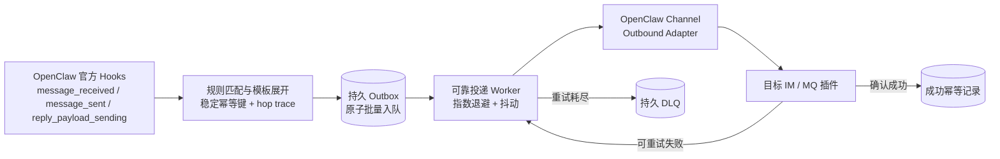

# OpenClaw Router

**OpenClaw 插件 — 持久 Outbox、可靠重试/DLQ、持久幂等、审计与循环保护**

[](https://www.npmjs.com/package/@partme.ai/openclaw-router)
[](https://nodejs.org)
[](LICENSE)

[简体中文](./README.zh-CN.md) | [English](./README.md)

---

## 概述

`@partme.ai/openclaw-router` 通过 `message_received`、`message_sent`、`reply_payload_sending` Hooks 按规则多路分发消息。同一事件的全部动作先原子写入持久 Outbox，再由后台通过 OpenClaw 对第三方插件公开的 channel outbound adapter API 投递；失败按指数退避重试，耗尽后进入持久 DLQ。

**纯配置驱动** — 无需修改任何渠道插件代码。所有路由规则通过 JSON 配置定义。

## 运行架构



Outbox 是投递事实的唯一来源：只有目标 adapter 确认成功后才删除 pending 并提交幂等记录；因此 Gateway 崩溃重启不会把“已入队”误当成“已送达”。

## 特性

- **Plugin Hooks** — `message_received`（入站）、`message_sent`（出站转发）、`reply_payload_sending`（跨渠道 reply-via）
- **持久 Outbox** — Gateway 重启后继续处理未完成投递
- **可靠投递** — 等待实际发布结果、指数退避与抖动、有界重试和持久 DLQ
- **成功后提交幂等** — 幂等键跨重启保留；没有消息身份的事件不会错误合并
- **循环保护** — 路由 hop trace 与可配置最大跳数
- **规则引擎** — `channels`、`topic`、`accountId` 支持 `*` / `?` 通配符
- **模板主题** — 支持 `{{channel}}`、`{{direction}}`、`{{account}}` 动态变量
- **IM 到 MQ 转发** — 将用户消息和 Agent 回复转发到 MQ 渠道
- **MQ 到 IM 回复** — 将 Agent 回复路由回指定 IM 渠道和账号
- **审计日志** — 有界持久审计记录与可选控制台日志
- **运维 API** — 认证的状态、DLQ 查询和 DLQ 重放接口
- **纯配置驱动** — 无需修改渠道插件代码
- **轻量级** — 零外部依赖，基于 typed plugin hooks

## 快速开始

### 安装

```bash
openclaw plugins install @partme.ai/openclaw-router
```

### 最小配置

```json
{
  "plugins": {
    "entries": {
      "router": {
        "enabled": true,
        "config": {
          "rules": [
            {
              "id": "wecom-to-mqtt",
              "match": { "channels": ["wecom"], "direction": "both" },
              "actions": [
                { "type": "forward", "target": "mqtt", "topic": "openclaw/audit/wecom" }
              ]
            }
          ]
        }
      }
    }
  }
}
```

## 配置参考

```jsonc
{
  "plugins": {
    "entries": {
      "router": {
        "enabled": true,
        "config": {
          "rules": [
            {
              "id": "wecom-inbound-to-rabbitmq",
              "match": {
                "channels": ["wecom"],            // 来源渠道过滤
                "direction": "inbound",           // "inbound" | "outbound" | "both"
                "topic": "support",               // 主题过滤（可选）
                "accountId": "account_001"        // 账号过滤（可选）
              },
              "actions": [
                {
                  "type": "forward",             // 转发到 MQ 渠道
                  "target": "rabbitmq",
                  "topic": "openclaw/router/{{channel}}/{{direction}}"  // 模板主题
                }
              ]
            },
            {
              "id": "agent-reply-to-wecom",
              "match": {
                "channels": ["mqtt"],
                "direction": "outbound"
              },
              "actions": [
                {
                  "type": "reply-via",           // 回复到 IM 渠道
                  "target": "wecom",
                  "accountId": "default"
                }
              ]
            }
          ],
          "audit": {
            "enabled": true,
            "logToConsole": true,
            "maxEntries": 5000
          },
          "delivery": {
            "maxAttempts": 5,
            "initialDelayMs": 500,
            "maxDelayMs": 30000,
            "backoffMultiplier": 2,
            "jitter": 0.2,
            "dedupeTtlMs": 86400000,
            "maxDeliveredKeys": 50000,
            "maxDeadLetters": 10000,
            "maxPendingTasks": 10000,
            "maxPayloadBytes": 1048576,
            "maxHops": 8
          }
        }
      }
    }
  }
}
```

### 规则匹配字段

| 字段 | 类型 | 描述 |
|-------|------|-------------|
| `channels` | string[] | 按来源渠道 ID 过滤，支持 `*` / `?`；为空/缺失表示匹配所有渠道。 |
| `direction` | "inbound" \| "outbound" \| "both" | 消息方向。`inbound` = 用户消息，`outbound` = Agent 回复。 |
| `topic` | string | 按事件主题过滤，支持 `*` / `?`。 |
| `accountId` | string | 按账号 ID 过滤，支持 `*` / `?`。 |

### 动作类型

| 动作 | 类型值 | 描述 |
|--------|------|-------------|
| 转发 | `"forward"` | 将消息副本转发到目标 MQ 渠道。主题支持模板变量 `{{channel}}`、`{{direction}}`、`{{account}}`。 |
| 回回复 | `"reply-via"` | 通过指定 IM 渠道回复消息。需要 `target` 参数，可选 `accountId` 和 `to`。 |

### 主题模板变量

| 变量 | 描述 |
|----------|-------------|
| `{{channel}}` | 来源渠道 ID（如 `wecom`） |
| `{{direction}}` | 消息方向（`inbound` / `outbound`） |
| `{{account}}` | Agent 账号 ID（或 `default`） |

默认主题：
- 入站：`openclaw/router/{channel}/inbound`
- 出站：`openclaw/router/{channel}/outbound`

### 审计配置

| 字段 | 类型 | 默认值 | 描述 |
|-------|------|---------|-------------|
| `audit.enabled` | boolean | `true` | 启用有界持久审计记录 |
| `audit.logToConsole` | boolean | `false` | 将路由动作记录到控制台 |
| `audit.maxEntries` | integer | `5000` | 最大持久审计条目数 |

### 可靠投递配置

| 字段 | 默认值 | 描述 |
|------|--------|------|
| `delivery.maxAttempts` | `5` | 进入 DLQ 前的总投递次数 |
| `delivery.initialDelayMs` | `500` | 初始重试延迟 |
| `delivery.maxDelayMs` | `30000` | 最大重试延迟 |
| `delivery.backoffMultiplier` | `2` | 指数退避倍数 |
| `delivery.jitter` | `0.2` | `0` 到 `1` 的随机抖动比例 |
| `delivery.dedupeTtlMs` | `86400000` | 成功投递幂等键保留时间 |
| `delivery.maxDeliveredKeys` | `50000` | 成功幂等键容量上限 |
| `delivery.maxDeadLetters` | `10000` | DLQ 容量上限 |
| `delivery.maxPendingTasks` | `10000` | Pending 容量；达到上限时拒绝新批次，避免磁盘耗尽 |
| `delivery.maxPayloadBytes` | `1048576` | 单个投递负载序列化后的最大字节数 |
| `delivery.maxHops` | `8` | 路由循环最大跳数 |
| `delivery.publishTimeoutMs` | `15000` | 单次 Gateway 投递超时 |
| `delivery.concurrency` | `4` | 有界投递并发数 |
| `delivery.lockHeartbeatMs` | `5000` | 活跃写实例租约心跳间隔 |
| `delivery.lockTimeoutMs` | `30000` | 远端失效写租约超时 |
| `delivery.stateDir` | `<OpenClaw state>/router` | 可选状态目录 |

运维接口均使用 OpenClaw 插件鉴权并精确匹配：

- `GET /router/status`
- `GET /router/health`
- `GET /router/audit?limit=100`
- `GET /router/dlq?limit=100`
- `POST /router/dlq/replay?limit=100`

## 架构

```
                    ┌─────────────────────────────────────┐
                    │          OpenClaw 运行时             │
                    │                                      │
  用户 ──► IM 渠道 ──► Agent ──► 消息/回复 Hooks           │
                    │         │                            │
                    │         ▼                            │
                    │    ┌──────────┐                      │
                    │    │  Router  │                      │
                    │    │ (规则)    │                      │
                    │    └────┬─────┘                      │
                    │         │                            │
                    │    ┌────┴─────┐                      │
                    │    │    |     │                      │
                    │    ▼    ▼     ▼                      │
                    │  MQ_A  MQ_B  回复到渠道              │
                    └─────────────────────────────────────┘
```

## 使用场景

- **审计追踪**：将所有企微对话转发到 RabbitMQ/MQTT 审计队列
- **多渠道广播**：将 Agent 回复同时发送到多个消息渠道
- **外部处理**：将消息路由到外部系统进行 NLP、情感分析或数据增强
- **跨渠道回复**：收到 MQTT 消息，由 Agent 处理后通过企微回复

## 注意事项

- 知识库（RAG）和长期记忆的自动注入由 OpenClaw 核心框架和 `openclaw-memory` 插件分别处理，router 不参与。
- Router 需要目标 MQ 渠道（mqtt、rabbitmq、redis-stream 等）已安装并配置。
- 主题模板变量在运行时根据实际事件上下文替换。
- 文件状态目录通过跨进程租约强制单写；第二个 Router 使用相同目录时会启动失败。全局应只运行一个 active Router；多 Gateway 主动-主动必须严格分区，或使用外部事务存储/Leader，单纯分开状态目录不能阻止重复路由。
- 不会自动抢占其他 hostname 创建的锁。确认远端 Router 已停止后，运维人员才可手动删除真正遗留的 `.writer.lock`。
- 投递语义是 at-least-once：目标已接收、成功标记尚未落盘，或投递超时但目标稍后成功时，恢复/重试可能再次投递。超时取消是 best-effort，并非所有 adapter 都遵循 `AbortSignal`；`/router/status` 会计入 `unknownOutcomes`。Router 会把稳定投递 ID 传入 outbound adapter 的 `deliveryQueueId`，下游渠道或 Broker 支持时也应保持等价幂等语义。Broker 直达 Topic 使用显式的 `openclaw-direct-topic:v1:` target 契约，因此普通 OpenClaw durable reply 即使也携带 `deliveryQueueId`，仍会走 session mapper、replyTopic 和 ACL。若状态 rename 已成功但目录 fsync 失败，Router 保持该任务已投递、不生成重复重试，并设置 `durabilityUncertain=true`、保持 health 失败直至重启。

## 开发

```bash
# 安装依赖
pnpm install

# 构建
pnpm build

# 运行测试
pnpm test

# 监听模式
pnpm dev

# 类型检查
pnpm typecheck
```

## 许可证

基于 [MIT License](LICENSE) 开源。

## 关于 openclaw-plugins

本项目是 [openclaw-plugins](https://github.com/partme-ai/openclaw-plugins) monorepo 的一员 — 由 **PartMe.AI 团队** 研发与二次开发的 OpenClaw 企业级插件集合，包含 30+ 独立插件，覆盖 IM 渠道、消息队列、AI 能力、基础设施四大领域。

每个插件独立发布到 npm（`@partme.ai` scope），可单独安装：

```bash
openclaw plugins install @partme.ai/openclaw-router
```

**PartMe.AI** 专注于 AI 智能客服与企业级 AI Agent 基础设施，提供从企微/钉钉/飞书/QQ 渠道接入，到 RAG 知识库、多级记忆、监控运维的全栈解决方案。

> 联系我们：partmeai@gmail.com | [GitHub](https://github.com/partme-ai/openclaw-plugins)
