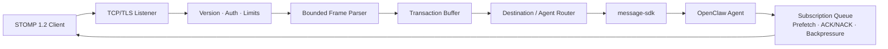

# OpenClaw STOMP TCP

<!-- README_STANDARD_START -->

> Standard reading order: positioning → architecture → flow → boundaries → installation → configuration → operations → deep dive.
> This block favors text diagrams that render reliably on npm; when applicable, deeper Mermaid diagrams remain in the repository's `doc/` design material.

[English](./README.md) | [简体中文](./README.zh-CN.md)

## 1. Component positioning

Provides native TCP STOMP, topic bindings, and cumulative acknowledgement. Component type: **STOMP/TCP wire channel**.

| Item | Value |
|---|---|
| npm package | `@partme.ai/openclaw-stomp` |
| Version | `2026.7.1` |
| Plugin ID | `stomp` |
| Channel ID | `stomp-tcp` |
| OpenClaw | `>=2026.7.1` |
| Source | `extensions/stomp` |

## 2. At a glance

```text
[Native STOMP clients and brokers]
          │
          ▼
┌──────────────────────────────────────────────────────────────┐
│ Inside OpenClaw Gateway: stomp
│ 1. Negotiate connection, subscriptions, and ACK mode
│ 2. Parse frames, bind sessions, and run the Agent
│ 3. Send frames and handle ACK/NACK
└──────────────────────────────────────────────────────────────┘
          │
          ▼
[STOMP frames and delivery state]
```

## 3. Architecture and core flow

The component keeps protocol and platform differences inside its own boundary and exposes stable plugin, channel, hook, tool, or service contracts to OpenClaw.

```text
Native STOMP clients and brokers
  │
  ▼
Negotiate connection, subscriptions, and ACK mode
  │
  ▼
Parse frames, bind sessions, and run the Agent
  │
  ▼
Send frames and handle ACK/NACK
  │
  ▼
STOMP frames and delivery state

Failure path: Any failed stage: record a diagnosable error, then retry, reject, or degrade per component policy
```

## 4. Capabilities and boundaries

| Area | Contract |
|---|---|
| Owns | Provides native TCP STOMP, topic bindings, and cumulative acknowledgement |
| Does not own | Does not provide a full general-purpose broker or JMS implementation |
| Input | Native STOMP clients and brokers |
| Output | STOMP frames and delivery state |
| Failure rule | Failures remain observable; authentication, boundary validation, and persistence failures must not be reported as success |

## 5. Quick start

```bash
openclaw plugins install "@partme.ai/openclaw-stomp@2026.7.1"
```

Start with least-privilege configuration, then launch the Gateway. Validate connectivity, authorization, and recovery in an isolated profile before production use.

## 6. Configuration entry points

| Layer | Path |
|---|---|
| Plugin configuration | `plugins.entries.stomp.config` |
| Channel configuration | `channels["stomp-tcp"]` |
| Configuration schema | `extensions/stomp/openclaw.plugin.json` |

Field definitions, environment variables, and complete examples remain in the preserved detailed reference below.

## 7. Operations, security, and troubleshooting

- Confirm the OpenClaw version, package version, manifest ID, and configuration key first.
- Keep credentials in environment variables or SecretRef values, never in logs, source control, or plaintext examples.
- Diagnose by layer: Gateway logs, plugin health, then the external dependency.
- Back up state before upgrades; for cursors, queues, or indexes, verify restart recovery and duplicate-delivery semantics.

## 8. Verification and deep dives

```bash
pnpm --filter "@partme.ai/openclaw-stomp" typecheck
pnpm --filter "@partme.ai/openclaw-stomp" test
pnpm --filter "@partme.ai/openclaw-stomp" build
```

- [Plugin architecture overview](../../doc/OpenClaw-Plugins-Architecture.md)
- [Unified plugin structure standard](../../doc/OpenClaw-Plugins-Structure-Standard.md)

## 9. Preserved detailed reference

The original configuration tables, protocol details, examples, and troubleshooting material continue below.

<!-- README_STANDARD_END -->


Authenticated STOMP 1.2 over native TCP/TLS for OpenClaw 2026.7.1. This embedded channel accepts bounded STOMP connections, routes `SEND` frames to configured Agents, and returns Agent replies through connection-scoped topics.

[中文说明](README.zh-CN.md)

## Scope

- STOMP 1.2 `CONNECT`, `SEND`, `SUBSCRIBE`, `UNSUBSCRIBE`, `ACK`, `NACK`, `BEGIN`, `COMMIT`, `ABORT`, and `DISCONNECT`
- Plain TCP on loopback and TLS 1.2+ for remote listeners
- Login/passcode authentication using environment-backed, SHA-256, or SHA-512 credentials
- Negotiated heartbeats, CONNECT timeout, message rate limits, frame and socket-buffer limits
- Connection, subscription, inbound queue, prefetch, ACK, durable-state, and per-subscription queue bounds
- Correct cumulative `client` ACK and individual `client-individual` ACK behavior
- Bounded connection-local transactions for ordered SEND/ACK/NACK commit and abort
- Optional process-memory durable subscriptions and NACK requeue
- Claim/commit/release inbound idempotency; a `message-id` is committed only after the Agent turn and reply delivery succeed
- Agent allowlists, explicit topic bindings, and connection-scoped reply subscriptions by default
- OpenClaw Gateway lifecycle integration and a credential-redacted `/stomp-tcp/status` endpoint

This is an embedded OpenClaw channel, not a durable broker. Durable subscriptions and transaction buffers are process memory only and are lost on Gateway restart. Transactions delay and order connection-local actions, but cannot roll back Agent or external-system side effects. The plugin does not provide persistent storage, dead-letter queues, broker clustering, distributed atomicity, or exactly-once delivery.

## Architecture

The character diagram highlights the TCP/TLS trust boundary, transaction buffer, and bounded ACK queue. The Mermaid diagram below preserves the full renderable relationship.

```text
Backend service / device / edge gateway
        │  STOMP 1.2 TCP/TLS
        ▼
┌──────────────────────────────────────────────────────────────┐
│ openclaw-stomp                                               │
│                                                              │
│ Listener ──▶ CONNECT auth ──▶ frame parser ──▶ rate/capacity │
│                                               │              │
│                          ┌────────────────────┴─────────┐    │
│                          ▼                              ▼    │
│                BEGIN / transaction buffer         direct SEND│
│                          │                              │    │
│                   COMMIT / ABORT                        │    │
│                          └──────────────┬───────────────┘    │
│                                         ▼                    │
│                         Topic binding + Agent allowlist       │
│                                         │                    │
│                              message-sdk → Agent              │
│                                         │                    │
│                                         ▼                    │
│                  subscription queue + prefetch + ACK/NACK     │
└─────────────────────────────────────────┬────────────────────┘
                                          ▼
                              MESSAGE / RECEIPT / ERROR
```



Internal Agent/Runtime failures from both direct `SEND` and transactional `COMMIT` are never returned verbatim. Clients receive the stable `Agent dispatch failed` error while a redacted reason is retained in Gateway logs and channel status.

## Configuration

The default plaintext listener is restricted to `127.0.0.1:61613`. Authentication is required and startup fails until a valid user is configured.

```json
{
  "channels": {
    "stomp-tcp": {
      "enabled": true,
      "host": "127.0.0.1",
      "port": 61613,
      "tlsPort": 61614,
      "defaultAgentId": "main",
      "allowedAgentIds": ["support"],
      "auth": {
        "required": true,
        "users": [
          {
            "login": "service-a",
            "passwordEnv": "OPENCLAW_STOMP_TCP_PASSWORD"
          }
        ]
      },
      "heartbeat": {
        "serverMs": 10000,
        "clientMs": 10000
      },
      "limits": {
        "maxConnections": 500,
        "maxFrameSize": 262144,
        "maxBufferedBytes": 1048576,
        "maxSubscriptionsPerConnection": 100,
        "maxQueueDepthPerSubscription": 1000,
        "maxPendingMessages": 32,
        "messagesPerMinute": 120,
        "connectTimeoutMs": 10000,
        "shutdownTimeoutMs": 10000,
        "maxDurableSubscriptions": 1000
      },
      "defaultAckMode": "auto",
      "prefetchCount": 100,
      "allowSharedTopics": false,
      "allowDurableSubscriptions": false
    }
  }
}
```

For a remote TLS-only listener, disable plaintext with `port: 0`:

```json
{
  "host": "127.0.0.1",
  "port": 0,
  "tlsPort": 61614,
  "tls": {
    "enabled": true,
    "host": "0.0.0.0",
    "keyFile": "/etc/openclaw/tls/stomp.key",
    "certFile": "/etc/openclaw/tls/stomp.crt",
    "caFile": "/etc/openclaw/tls/ca.crt",
    "minVersion": "TLSv1.2",
    "requestCert": false,
    "rejectUnauthorized": false
  }
}
```

Set both client-certificate flags to `true` to require mTLS. `rejectUnauthorized: true` without `requestCert: true` is rejected. Avoid inline `password`; use `passwordEnv` or a precomputed `passwordHash`.

## Routing and session isolation

Standard destinations:

| Operation | Destination | Meaning |
|---|---|---|
| Send | `/queue/agent` | Route to `defaultAgentId` |
| Send | `/queue/agent.support` | Route to allowlisted Agent `support` |
| Subscribe | `/topic/session.stomp-tcp:SESSION_ID@support` | Receive this connection's `support` replies |

The `CONNECTED` frame provides `session:SESSION_ID`. With the default `allowSharedTopics: false`, the server rejects every subscription outside that connection's session topics.

Custom enterprise destinations require an explicit binding:

```json
{
  "subscribeTopics": ["devices/*/in"],
  "topicBindings": [
    {
      "topicPattern": "devices/*/in",
      "agentId": "iot-agent",
      "accountId": "default",
      "replyTopic": "/topic/devices/reply"
    }
  ],
  "allowSharedTopics": true
}
```

`subscribeTopics` is an optional inbound destination allowlist. A custom `replyTopic` is shared, so clients can subscribe to it only when `allowSharedTopics` is explicitly enabled.

## Protocol flow

```text
CONNECT
accept-version:1.2
heart-beat:10000,10000
login:service-a
passcode:<runtime-secret>

\0

SEND
destination:/queue/agent.support
receipt:request-1
content-type:application/json

{"text":"Hello"}\0
```

For a non-transactional `SEND`, `RECEIPT` is emitted only after the OpenClaw Agent turn completes and at least one active or in-process durable subscription accepts the reply. A transactional SEND receipt confirms bounded buffering; the COMMIT receipt is the final success signal. A missing reply subscriber produces `ERROR` instead of a false COMMIT receipt. For `ack:client`, ACK is cumulative through the referenced delivery. For `ack:client-individual`, only that delivery is acknowledged.

Both the public outbound helper and the Channel adapter throw when no active or in-process durable subscription accepts a delivery. A non-durable slow consumer disconnected by the socket-buffer ceiling is not reported as accepted; a durable delivery counts only because it remains in the bounded process queue. Acceptance is not application-level consumption by the remote client.

Durable subscriptions require both `allowDurableSubscriptions: true` and `durable:true` (or `persistent:true`) on `SUBSCRIBE`. Enabling them also requires login authentication so unrelated anonymous clients cannot share the same owner. They survive a TCP reconnect only inside the same Gateway process and authenticated login; they do not survive a process restart.

Transaction-scoped `SEND`, `ACK`, and `NACK` commands are buffered until `COMMIT`; `ABORT` discards them. `maxPendingMessages` is a hard total across every open transaction on the connection, rather than a separate allowance per transaction. A COMMIT receipt is returned only after all buffered actions complete. The boundary is connection-local and is not a distributed rollback mechanism for Agent side effects.

```text
Authenticated user ── SUBSCRIBE(durable, id=orders) ──▶ process durable queue
       │                                                        │
       │◀── MESSAGE (not ACKed) ─────────────────────────────────┤
       │ disconnect                                             │ requeue pending
       ▼                                                        ▼
offline publish ───────────────────────────────────────▶ bounded queue
       └── reconnect with same login + id + destination ───────▶ redelivery, then offline messages
```

The character view shows where reconnect-safe deliveries live; the ACK/NACK state diagram in the Chinese guide provides the corresponding state transitions.

## Shutdown drain

```text
Gateway AbortSignal
       │
       ▼
accepting=false ──▶ stop heartbeat / listener admission
                              │
                              ▼
             retain connections/subscriptions; drain queues
                              │
                  ┌───────────┴────────────────┐
                  ▼                            ▼
       Agent reply remains deliverable   shutdownTimeoutMs
                  └──────▶ close sockets / clear durable state
```

```mermaid
sequenceDiagram
  participant G as OpenClaw Gateway
  participant S as STOMP TCP Server
  participant Q as Per-connection queue
  participant A as Agent Runtime
  G->>S: AbortSignal / stopAccount
  S->>S: accepting=false; stop heartbeat and listener admission
  S->>Q: await accepted frames
  Q->>A: finish in-flight Agent turn
  A-->>Q: success / failure + reply
  Q->>S: deliver through retained subscription
  Q-->>S: drained
  S--xS: close TCP/TLS sockets
  S-->>G: cleanup complete
  Note over S,Q: warn and exit within shutdownTimeoutMs on timeout
```

Only work already accepted into the serial frame queue is drained. Existing subscriptions remain available during that drain so an in-flight Agent turn can still deliver its reply. Uncommitted transaction actions are discarded with the connection. Hard termination can still leave an unknown outcome, so side-effecting callers must retain business idempotency keys.

## Operations

- Expose only TLS to remote networks and apply ingress/firewall controls.
- Restrict `allowedAgentIds` and custom `topicBindings` to required Agents.
- Keep shared topics and durable subscriptions disabled unless the business case requires them.
- Monitor the authenticated `/stomp-tcp/status` endpoint for queues, pending ACKs, dropped messages, and listener state.
- Load-test slow consumers, queue bounds, heartbeat timeouts, and reconnect storms with production-sized payloads.

## Development

```bash
pnpm --filter @partme.ai/openclaw-stomp typecheck
pnpm --filter @partme.ai/openclaw-stomp test
pnpm --filter @partme.ai/openclaw-stomp build
```

License: MIT.
