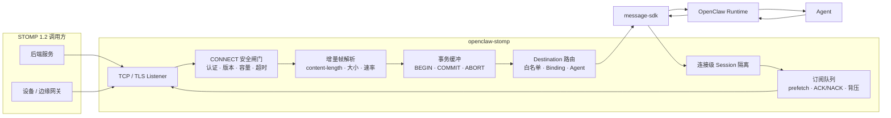
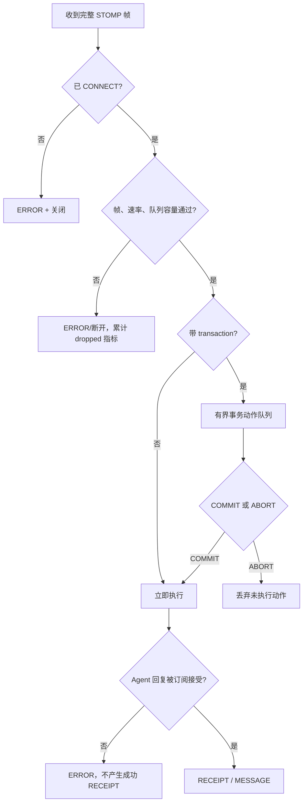
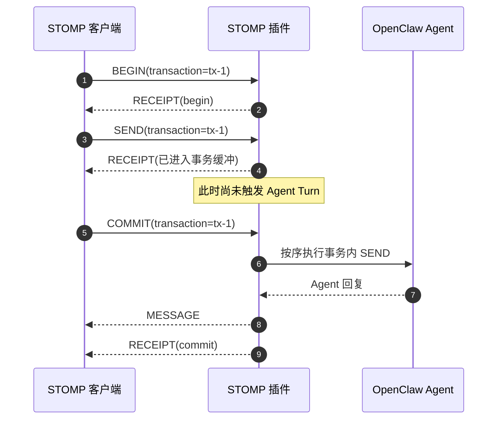
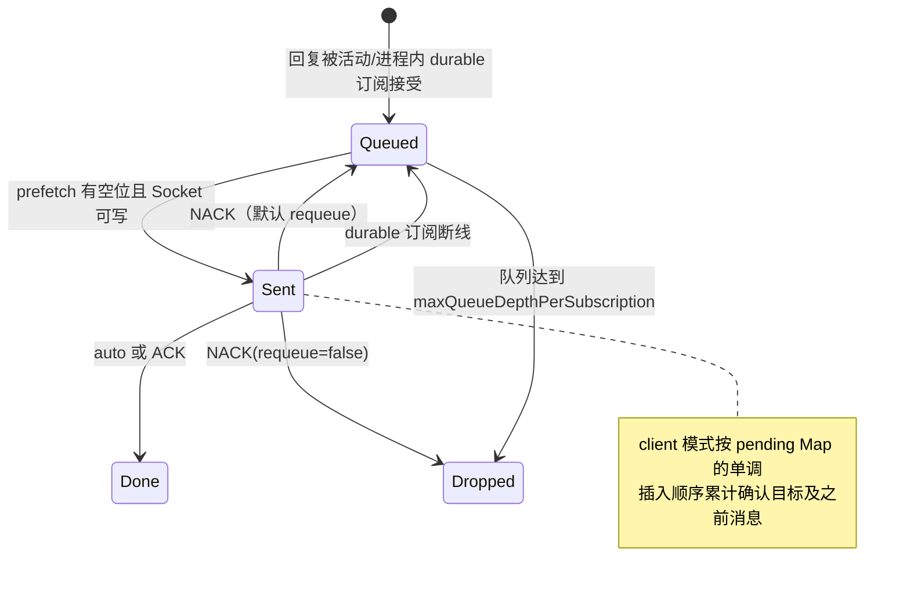
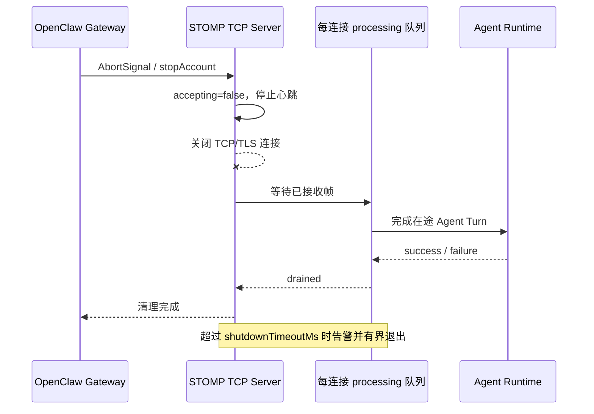

# OpenClaw STOMP TCP

面向 OpenClaw 2026.7.1 的原生 TCP/TLS STOMP 1.2 渠道。插件接收有界的 STOMP 连接，将 `SEND` 帧路由到已配置的 Agent，并通过连接级主题返回 Agent 回复。

[English](README.md)

## 能力边界

- 支持 STOMP 1.2 的 `CONNECT`、`SEND`、`SUBSCRIBE`、`UNSUBSCRIBE`、`ACK`、`NACK`、`BEGIN`、`COMMIT`、`ABORT`、`DISCONNECT`
- 明文 TCP 仅允许回环地址；远程监听使用 TLS 1.2+
- login/passcode 认证，凭证支持环境变量、SHA-256 或 SHA-512 哈希
- 心跳协商、CONNECT 超时、消息限速、帧大小与 Socket 缓冲上限
- 连接数、订阅数、入站队列、prefetch、ACK、持久订阅状态和单订阅队列均有上限
- 正确实现 `client` 累计确认与 `client-individual` 单条确认
- 支持连接级事务缓冲：事务内 SEND/ACK/NACK 只在 COMMIT 时按序执行，ABORT 直接丢弃
- 可选的进程内持久订阅和 NACK 重入队
- 入站幂等采用 claim/commit/release，仅在 Agent 与回复投递成功后提交；失败允许同一 `message-id` 重试
- 默认启用 Agent 白名单、显式 Topic 绑定和连接级回复主题隔离
- 接入 OpenClaw Gateway 生命周期，提供凭证脱敏的 `/stomp-tcp/status`

本插件是内嵌 OpenClaw 渠道，不是持久化 Broker。“持久订阅”和事务缓冲仅保存在当前进程内，Gateway 重启后丢失；不提供磁盘持久化、死信队列、Broker 集群、跨 Agent 原子回滚或 exactly-once。需要这些能力时应使用 RabbitMQ 等专业消息代理。

## 架构总览

字符图先展示 TCP/TLS 信任边界、事务缓冲和 ACK 队列；下方 Mermaid 保留完整可渲染关系：

```text
后端服务 / 设备 / 边缘网关
        │  STOMP 1.2 TCP/TLS
        ▼
┌──────────────────────────────────────────────────────────────┐
│ openclaw-stomp                                               │
│                                                              │
│ Listener ──▶ CONNECT 认证 ──▶ 增量帧解析 ──▶ 速率/容量闸门   │
│                                              │               │
│                           ┌──────────────────┴──────────┐    │
│                           ▼                             ▼    │
│                BEGIN / 事务动作缓冲            直接 SEND     │
│                           │                             │    │
│                    COMMIT / ABORT                       │    │
│                           └──────────────┬──────────────┘    │
│                                          ▼                   │
│                         Topic Binding + Agent 白名单          │
│                                          │                   │
│                              message-sdk → Agent              │
│                                          │                   │
│                                          ▼                   │
│                    订阅队列 + prefetch + ACK/NACK + 背压      │
└──────────────────────────────────────────┬───────────────────┘
                                           ▼
                               MESSAGE / RECEIPT / ERROR
```



普通 `SEND` 和事务 `COMMIT` 中的 Agent/Runtime 内部异常不会原样返回客户端：协议只暴露稳定的 `Agent dispatch failed`，脱敏原因进入 Gateway 日志与 Channel 状态，避免 TLS 地址、Authorization、passcode 或 Token 泄露。

### 有界资源与故障边界

```text
完整 STOMP 帧
      │
      ▼
CONNECT / 认证 / 速率 / 帧大小
      ├── 失败 ──────────────▶ ERROR / 断开
      ▼
是否携带 transaction?
      ├── 否 ────────────────▶ 立即执行 Agent Turn
      ▼ 是
连接级事务动作总量硬上限（不是每事务各自一份上限）
      │
      ├── COMMIT ────────────▶ 按序执行 Agent Turn
      └── ABORT ─────────────▶ 丢弃未执行动作
```



## 配置

默认明文监听为 `127.0.0.1:61613`。认证默认强制开启，未配置有效用户时拒绝启动。

```json
{
  "channels": {
    "stomp-tcp": {
      "enabled": true,
      "host": "127.0.0.1",
      "port": 61613,
      "tlsPort": 61614,
      "defaultAgentId": "main",
      "allowedAgentIds": ["support"],
      "auth": {
        "required": true,
        "users": [
          {
            "login": "service-a",
            "passwordEnv": "OPENCLAW_STOMP_TCP_PASSWORD"
          }
        ]
      },
      "heartbeat": {
        "serverMs": 10000,
        "clientMs": 10000
      },
      "limits": {
        "maxConnections": 500,
        "maxFrameSize": 262144,
        "maxBufferedBytes": 1048576,
        "maxSubscriptionsPerConnection": 100,
        "maxQueueDepthPerSubscription": 1000,
        "maxPendingMessages": 32,
        "messagesPerMinute": 120,
        "connectTimeoutMs": 10000,
        "shutdownTimeoutMs": 10000,
        "maxDurableSubscriptions": 1000
      },
      "defaultAckMode": "auto",
      "prefetchCount": 100,
      "allowSharedTopics": false,
      "allowDurableSubscriptions": false
    }
  }
}
```

远程环境应使用纯 TLS 监听，并通过 `port: 0` 关闭明文端口：

```json
{
  "host": "127.0.0.1",
  "port": 0,
  "tlsPort": 61614,
  "tls": {
    "enabled": true,
    "host": "0.0.0.0",
    "keyFile": "/etc/openclaw/tls/stomp.key",
    "certFile": "/etc/openclaw/tls/stomp.crt",
    "caFile": "/etc/openclaw/tls/ca.crt",
    "minVersion": "TLSv1.2",
    "requestCert": false,
    "rejectUnauthorized": false
  }
}
```

将两个客户端证书开关同时设为 `true` 即可强制 mTLS。`rejectUnauthorized: true` 但未开启 `requestCert` 会被拒绝。生产环境不要直接写 `password`，应使用 `passwordEnv` 或预计算的 `passwordHash`。

## 路由与会话隔离

标准 Destination：

| 操作 | Destination | 含义 |
|---|---|---|
| 发送 | `/queue/agent` | 路由到 `defaultAgentId` |
| 发送 | `/queue/agent.support` | 路由到白名单 Agent `support` |
| 订阅 | `/topic/session.stomp-tcp:SESSION_ID@support` | 接收本连接的 `support` 回复 |

`CONNECTED` 帧会返回 `session:SESSION_ID`。默认 `allowSharedTopics: false`，服务端会拒绝当前连接会话主题之外的所有订阅。

企业自定义 Destination 需要显式绑定：

```json
{
  "subscribeTopics": ["devices/*/in"],
  "topicBindings": [
    {
      "topicPattern": "devices/*/in",
      "agentId": "iot-agent",
      "accountId": "default",
      "replyTopic": "/topic/devices/reply"
    }
  ],
  "allowSharedTopics": true
}
```

`subscribeTopics` 是可选的入站 Destination 白名单。自定义 `replyTopic` 属于共享主题，因此只有显式开启 `allowSharedTopics` 后客户端才能订阅。

## 协议流程

```text
CONNECT
accept-version:1.2
heart-beat:10000,10000
login:service-a
passcode:<runtime-secret>

\0

SEND
destination:/queue/agent.support
receipt:request-1
content-type:application/json

{"text":"你好"}\0
```

非事务 `SEND` 的 `RECEIPT` 只会在 OpenClaw Agent 处理完成且回复被至少一个活动或进程内持久订阅接受后返回。事务内 `SEND` 的 RECEIPT 表示动作已安全进入有界事务缓冲，最终成功以 COMMIT 的 RECEIPT 为准。没有订阅者时返回 `ERROR`，不会伪造成功 COMMIT。`ack:client` 会累计确认到指定消息，`ack:client-individual` 只确认指定消息。`NACK` 默认重入队；设置 `requeue:false` 可丢弃。

### 事务时序

```text
BEGIN(tx-1) ──▶ SEND(tx-1) ──▶ 有界动作缓冲 ──▶ COMMIT(tx-1)
                      │                                  │
                      │ 此时不触发 Agent                 ▼
                      │                         按序执行 Agent Turn
                      │                                  │
                      └──────── ABORT 时丢弃 ◀───────────┘
```



事务范围只覆盖当前 TCP 连接内的动作排序和延迟执行。Agent 或外部系统已经产生的副作用无法做分布式回滚；COMMIT 中途失败时服务端返回 `ERROR`，并禁止重复 COMMIT 造成已执行动作再次运行。

持久订阅需要同时配置 `allowDurableSubscriptions: true`，并在 `SUBSCRIBE` 帧中携带 `durable:true` 或 `persistent:true`。启用持久订阅时强制要求 login/passcode 认证，避免所有匿名客户端共享 `anonymous` 所有者；它只在同一 Gateway 进程和认证 login 下跨 TCP 重连保留，不能跨进程重启。

### ACK、NACK 与重连状态



`publishOutboundMessage` 和正式 Channel Adapter 都要求至少一个活动或进程内 durable 订阅接受消息；零订阅时抛错，让 Router/调用方决定重试或 DLQ，不会返回伪成功。这里的“接受”表示进入有界队列或写入 Socket，不代表远端业务已经消费；需要端到端消费确认应使用专业 Broker。

### Gateway 停机排空

```text
AbortSignal
    │
    ▼
accepting=false ──▶ 停止心跳 ──▶ 关闭 TCP/TLS 连接
                                      │
                                      ▼
                         等待已入队 processing Promise
                                      │
                      ┌───────────────┴────────────────┐
                      ▼                                ▼
                    drained                  shutdownTimeoutMs
                      └────────▶ 清理 durable / Listener / Runtime
```



排空只等待已经进入协议串行队列的工作；尚未 COMMIT 的事务动作会随连接关闭丢弃。强杀仍可能产生结果未知窗口，因此有副作用的客户端必须提供业务幂等键。

## 生产运维

- 远程网络只暴露 TLS，并配置入口层和防火墙访问控制。
- 将 `allowedAgentIds` 与 `topicBindings` 收紧到业务必需范围。
- 没有明确需求时保持共享主题和持久订阅关闭。
- 监控需要认证的 `/stomp-tcp/status`，观察队列、待 ACK、丢弃计数和监听状态。
- 使用生产级消息大小压测慢消费者、队列上限、心跳超时和重连风暴。

## 开发验证

```bash
pnpm --filter @partme.ai/openclaw-stomp typecheck
pnpm --filter @partme.ai/openclaw-stomp test
pnpm --filter @partme.ai/openclaw-stomp build
```

2026-07-17 本地门禁：11 个测试文件、53 个测试通过，typecheck 通过；覆盖 TCP/TLS、累计 ACK、NACK 重投、事务动作总量、durable 身份隔离、官方 ESM 脱敏、停机排空和零订阅失败语义。最终 build、覆盖率、tarball 与 OpenClaw 2026.7.1 E2E 见生产优化计划。

许可证：MIT。
