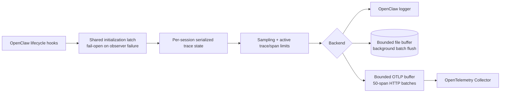

# OpenClaw Tracing

Production-oriented message and tool tracing for OpenClaw 2026.7.1.

[简体中文](./README.zh-CN.md) | [English](./README.md)

## Scope

`@partme.ai/openclaw-tracing` observes the official `message_received`,
`before_tool_call`, `after_tool_call`, `reply_payload_sending`, `agent_end`, and `session_end` hooks. It
creates an OpenTelemetry-compatible root span for each sampled message and a
child span for each tool call.

The plugin supports three real export paths:

- `log`: one compact JSON object per completed span through the OpenClaw logger.
- `file`: bounded JSONL buffering, serialized flush, daily files, and retention cleanup.
- `otlp`: OTLP/HTTP JSON with bounded buffering, serialized batches, request timeout, and retry.

SkyWalking is not advertised as a native backend. Send OTLP to an OpenTelemetry
Collector and route it to SkyWalking when that integration is required.

## Architecture



## Install and configure

```bash
openclaw plugins install @partme.ai/openclaw-tracing
```

The manifest ID is `tracing`. Canonical plugin configuration belongs under
`plugins.entries.tracing.config`. OpenClaw 2026.7.1 also requires
`plugins.entries.tracing.hooks.allowConversationAccess=true` so the protected
`agent_end` fallback can close traces for custom channel dispatchers:

```json
{
  "plugins": {
    "entries": {
      "tracing": {
        "enabled": true,
        "hooks": {
          "allowConversationAccess": true
        },
        "config": {
          "enabled": true,
          "backend": "otlp",
          "otlpEndpoint": "http://otel-collector:4318/v1/traces",
          "otlpHeaders": {
            "Authorization": "Bearer <token>"
          },
          "sampleRate": 0.25,
          "maxSpansPerTrace": 100,
          "maxActiveTraces": 10000,
          "maxBufferedSpans": 10000,
          "flushIntervalMs": 5000,
          "exportTimeoutMs": 10000,
          "exportRetryAttempts": 3,
          "shutdownTimeoutMs": 15000,
          "captureMessageBody": false
        }
      }
    }
  }
}
```

`otlpEndpoint` accepts either the Collector base URL or a full `/v1/traces`
URL. Configuration is validated again at runtime; invalid values fail startup.

| Field | Default | Notes |
|---|---:|---|
| `enabled` | `false` | Enables trace capture; the plugin entry must also be enabled |
| `backend` | `log` | `log`, `file`, or `otlp` |
| `sampleRate` | `1` | Deterministic value from `0` through `1` |
| `maxSpansPerTrace` | `100` | Includes the root span |
| `maxActiveTraces` | `10000` | Concurrent active-trace limit; new traces are skipped and reported at capacity |
| `maxBufferedSpans` | `10000` | Oldest spans are dropped on overflow and health becomes degraded |
| `flushIntervalMs` | `5000` | File and OTLP flush interval |
| `traceDir` | `./traces` | File backend directory |
| `traceRetentionDays` | `7` | File backend retention |
| `otlpEndpoint` | `http://localhost:4318/v1/traces` | OTLP/HTTP trace endpoint |
| `otlpHeaders` | `{}` | Collector authentication headers; values are never exposed by logs or status APIs |
| `exportTimeoutMs` | `10000` | Per OTLP request timeout |
| `exportRetryAttempts` | `3` | Attempts per OTLP flush |
| `shutdownTimeoutMs` | `15000` | Total deadline for closing traces and the selected backend |
| `captureMessageBody` | `false` | Opt-in; stores at most 500 characters and may contain sensitive data |

## Operations API

All routes use OpenClaw plugin authentication, reject non-GET methods, and send
`Cache-Control: no-store`:

- `GET /tracing/status`
- `GET /tracing/traces?limit=50` (`1..200`)
- `GET /tracing/trace?traceId=<32-hex-character-id>`

`/tracing/status` returns HTTP 503 when the selected backend reports a current
export or capacity failure. Its `backendStatus` includes buffered, dropped,
last-export, and last-error diagnostics.

## Reliability and privacy boundaries

- Active traces and recent query data are bounded in process memory.
- Concurrent startup hooks share one initialization promise. Initialization failures are logged and
  fail open, so the observer cannot reject the message or tool path.
- File and OTLP hooks only append to bounded memory. Disk writes, 50-span HTTP batches, and retries
  run in serialized background flushes instead of blocking threshold-crossing business requests.
- State changes are serialized per session, and tool bindings use `traceId + toolCallId` to prevent
  collisions between concurrent runs.
- Missing tool completion, early session end, superseding messages, and a
  30-minute active-trace TTL close orphan spans instead of leaking them.
- Standard OpenClaw outbound channels close the root span on the final-reply
  hook. Custom channel dispatchers that bypass that hook close it on
  `agent_end`; OpenClaw therefore requires the explicit
  `allowConversationAccess` trust setting shown above. The plugin uses only
  run/session outcome metadata from that hook and does not persist its message history.
- File and OTLP buffers are process-local. They do not provide a durable outbox
  or exactly-once export. A process crash can lose buffered spans; OTLP timeout
  outcomes can be ambiguous.
- `captureMessageBody` is disabled by default. Enabling it requires a data
  classification, access-control, and retention review.
- `otlpHeaders` may contain credentials. Values are not returned by the plugin, but the OpenClaw
  configuration file still requires least-privilege filesystem protection.
- The HTTP query cache contains only the 200 most recently completed traces and
  is cleared on gateway shutdown.

## Verification

```bash
pnpm test
pnpm typecheck
pnpm build
npm pack --dry-run
```

The package and manifest version are `2026.7.1`; OpenClaw `>=2026.7.1` is a
required peer dependency.
