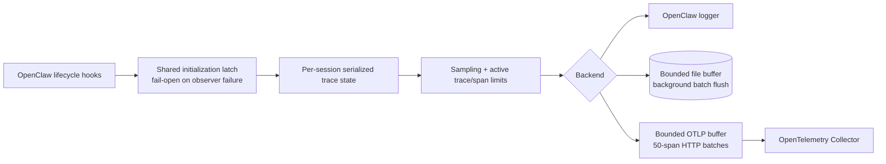

# OpenClaw Tracing

<!-- README_STANDARD_START -->

> Standard reading order: positioning → architecture → flow → boundaries → installation → configuration → operations → deep dive.
> This block favors text diagrams that render reliably on npm; when applicable, deeper Mermaid diagrams remain in the repository's `doc/` design material.

[English](./README.md) | [简体中文](./README.zh-CN.md)

## 1. Component positioning

Provides end-to-end Agent correlation and pluggable export. Component type: **Distributed tracing infrastructure**.

| Item | Value |
|---|---|
| npm package | `@partme.ai/openclaw-tracing` |
| Version | `2026.7.1` |
| Plugin ID | `tracing` |
| Channel ID | — |
| OpenClaw | `>=2026.7.1` |
| Source | `extensions/tracing` |

## 2. At a glance

```text
[Message, tool, Agent, and session hooks]
          │
          ▼
┌──────────────────────────────────────────────────────────────┐
│ Inside OpenClaw Gateway: tracing
│ 1. Create trace/span correlation with capacity bounds
│ 2. Record stages, errors, and latency
│ 3. Export to OTLP, file, or log backends
└──────────────────────────────────────────────────────────────┘
          │
          ▼
[Correlated tracing data]
```

## 3. Architecture and core flow

The component keeps protocol and platform differences inside its own boundary and exposes stable plugin, channel, hook, tool, or service contracts to OpenClaw.

```text
Message, tool, Agent, and session hooks
  │
  ▼
Create trace/span correlation with capacity bounds
  │
  ▼
Record stages, errors, and latency
  │
  ▼
Export to OTLP, file, or log backends
  │
  ▼
Correlated tracing data

Failure path: Any failed stage: record a diagnosable error, then retry, reject, or degrade per component policy
```

## 4. Capabilities and boundaries

| Area | Contract |
|---|---|
| Owns | Provides end-to-end Agent correlation and pluggable export |
| Does not own | Does not replace collectors, sampling governance, or alerting |
| Input | Message, tool, Agent, and session hooks |
| Output | Correlated tracing data |
| Failure rule | Failures remain observable; authentication, boundary validation, and persistence failures must not be reported as success |

## 5. Quick start

```bash
openclaw plugins install "@partme.ai/openclaw-tracing@2026.7.1"
```

Start with least-privilege configuration, then launch the Gateway. Validate connectivity, authorization, and recovery in an isolated profile before production use.

## 6. Configuration entry points

| Layer | Path |
|---|---|
| Plugin configuration | `plugins.entries.tracing.config` |
| Channel configuration | Not applicable |
| Configuration schema | `extensions/tracing/openclaw.plugin.json` |

Field definitions, environment variables, and complete examples remain in the preserved detailed reference below.

## 7. Operations, security, and troubleshooting

- Confirm the OpenClaw version, package version, manifest ID, and configuration key first.
- Keep credentials in environment variables or SecretRef values, never in logs, source control, or plaintext examples.
- Diagnose by layer: Gateway logs, plugin health, then the external dependency.
- Back up state before upgrades; for cursors, queues, or indexes, verify restart recovery and duplicate-delivery semantics.

## 8. Verification and deep dives

```bash
pnpm --filter "@partme.ai/openclaw-tracing" typecheck
pnpm --filter "@partme.ai/openclaw-tracing" test
pnpm --filter "@partme.ai/openclaw-tracing" build
```

- [Plugin architecture overview](../../doc/OpenClaw-Plugins-Architecture.md)
- [Unified plugin structure standard](../../doc/OpenClaw-Plugins-Structure-Standard.md)

## 9. Preserved detailed reference

The original configuration tables, protocol details, examples, and troubleshooting material continue below.

<!-- README_STANDARD_END -->


Production-oriented message and tool tracing for OpenClaw 2026.7.1.

[简体中文](./README.zh-CN.md) | [English](./README.md)

## Scope

`@partme.ai/openclaw-tracing` observes the official `message_received`,
`before_tool_call`, `after_tool_call`, `reply_payload_sending`, `agent_end`, and `session_end` hooks. It
creates an OpenTelemetry-compatible root span for each sampled message and a
child span for each tool call.

Delivery start, final settlement, retry, Router DLQ depth, and memory recall facts from the public OpenClaw diagnostics bus produce `delivery.*` and `memory.recall` spans. The versioned envelope accepts fixed event kinds and bounded attributes only; run/message/delivery identifiers are SHA-256 pseudonyms and message bodies or credentials are not copied. A delivery start and its settlement share the same pseudonymous delivery ID. Duplicate registrations targeting the same OTLP endpoint/header scope or file directory export a diagnostic fact once; distinct sinks each export it. Log backends use backend object identity. A process-wide ticket tracks each host diagnostic sequence until its listeners finish; it permits at most 1024 active events and 128 sinks per event, and expires after 30 seconds. At capacity or after expiry, the span is dropped. A claim happens before asynchronous export, so a failed exporter may lose that fact rather than make another registration retry it; these spans remain best-effort observations. On OpenClaw 2026.9.6, the installed-host MQTT probe found no active host trace scope at SDK delivery, so Agent root and delivery spans do not share a trace ID; this Agent-to-delivery link remains incomplete. On Gateway stop, tracing invalidates the old generation immediately and flushes already accepted spans within its shutdown timeout. Queued diagnostics that have not reached the subscriber are reported as potentially incomplete. `diagnostics.enabled=false` suppresses these spans.

The public diagnostics bus does not authenticate which enabled plugin emitted a valid `log.record` envelope. Schema checks bound fields, cardinality, and sensitive data; they cannot prove event origin. Install only trusted plugins and do not treat these spans as authoritative delivery ACK or audit evidence.

The plugin supports three real export paths:

- `log`: one compact JSON object per completed span through the OpenClaw logger.
- `file`: bounded JSONL buffering, serialized flush, daily files, and retention cleanup.
- `otlp`: OTLP/HTTP JSON with bounded buffering, serialized batches, request timeout, and retry.

SkyWalking is not advertised as a native backend. Send OTLP to an OpenTelemetry
Collector and route it to SkyWalking when that integration is required.

## Architecture

```text
message_received ─▶ root span ─────────────────────────────┐
                        │                                  │
before_tool_call ─▶ child span ─▶ after_tool_call          │
                        │                                  │
final reply / agent_end / session_end ─▶ close trace ◀────┘
                                             │
                                             ▼
                    redact secrets + correlate IDs by HMAC
                                             │
                    ┌────────────────────────┼───────────────────┐
                    ▼                        ▼                   ▼
              OpenClaw Log          bounded JSONL        bounded OTLP
                                                               │
                                                               ▼
                                                    OpenTelemetry Collector
```


```mermaid
flowchart LR
    H["OpenClaw lifecycle hooks"] --> I["Shared initialization latch<br/>fail-open on observer failure"]
    I --> T["Per-session serialized trace state"]
    T --> G["Sampling + active trace/span limits"]
    G --> B{"Backend"}
    B --> L["OpenClaw logger"]
    B --> F[("Bounded file buffer<br/>background batch flush")]
    B --> O["Bounded OTLP buffer<br/>50-span HTTP batches"]
    O --> C["OpenTelemetry Collector"]
```

## Install and configure

```bash
openclaw plugins install @partme.ai/openclaw-tracing
```

The manifest ID is `tracing`. Canonical plugin configuration belongs under
`plugins.entries.tracing.config`. OpenClaw 2026.7.1 also requires
`plugins.entries.tracing.hooks.allowConversationAccess=true` so the protected
`agent_end` fallback can close traces for custom channel dispatchers:

```json
{
  "plugins": {
    "entries": {
      "tracing": {
        "enabled": true,
        "hooks": {
          "allowConversationAccess": true
        },
        "config": {
          "enabled": true,
          "backend": "otlp",
          "otlpEndpoint": "http://otel-collector:4318/v1/traces",
          "otlpHeaders": {
            "Authorization": "Bearer <token>"
          },
          "sampleRate": 0.25,
          "maxSpansPerTrace": 100,
          "maxActiveTraces": 1000,
          "maxBufferedSpans": 10000,
          "flushIntervalMs": 5000,
          "exportTimeoutMs": 10000,
          "exportRetryAttempts": 3,
          "shutdownTimeoutMs": 15000,
          "captureMessageBody": false
        }
      }
    }
  }
}
```

`otlpEndpoint` accepts either the Collector base URL or a full `/v1/traces`
URL. Configuration is validated again at runtime; invalid values fail startup.

| Field | Default | Notes |
|---|---:|---|
| `enabled` | `false` | Enables trace capture; the plugin entry must also be enabled |
| `backend` | `log` | `log`, `file`, or `otlp` |
| `sampleRate` | `1` | Deterministic value from `0` through `1` |
| `maxSpansPerTrace` | `100` | Includes the root span |
| `maxActiveTraces` | `1000` | Concurrent active-trace limit; multiplied by `maxSpansPerTrace` must not exceed 100000 |
| `maxBufferedSpans` | `10000` | Oldest spans are dropped on overflow and health becomes degraded |
| `flushIntervalMs` | `5000` | File and OTLP flush interval |
| `traceDir` | `./traces` | File backend directory; relative paths resolve inside the OpenClaw state directory |
| `traceRetentionDays` | `7` | File backend and shared query journal retention |
| `otlpEndpoint` | `http://localhost:4318/v1/traces` | OTLP/HTTP trace endpoint |
| `otlpHeaders` | `{}` | Collector authentication headers; values are never exposed by logs or status APIs |
| `exportTimeoutMs` | `10000` | Per OTLP request timeout |
| `exportRetryAttempts` | `3` | Attempts per OTLP flush |
| `shutdownTimeoutMs` | `15000` | Total deadline for closing traces and the selected backend |
| `captureMessageBody` | `false` | Opt-in; stores at most 500 characters and may contain sensitive data |

## Operations API

All routes use OpenClaw Gateway authentication (`auth: "gateway"`), reject non-GET methods, and send
`Cache-Control: no-store`:

Configure Gateway authentication before exposing these endpoints. With `gateway.auth.mode: "none"`, the Gateway has no identity to authenticate and these routes must be treated as unauthenticated. Gateway authorization also governs browser grants. Platform webhooks keep their independent signature verification.

The plugin registers a Control UI status tab backed by `GET /tracing/status`. Its server-issued read Cookie is scoped to that exact route; trace-list and detail requests require normal Gateway authorization.

Each registration owns its backend, cleanup timer, Hook queue, and active TraceStore. Diagnostic events carry a host process sequence number; a bounded process-wide ticket keeps same-sink claims until all listeners for that event finish or its 30-second deadline passes. A registration without a live backend leaves the event for another subscriber. Stopping an older registration leaves a newer one active. The completed-trace SQLite journal remains shared by registrations within the same OpenClaw state profile so Gateway routes can query spans written by a separate Hook runtime.

- `GET /tracing/status`
- `GET /tracing/traces?limit=50` (`1..200`)
- `GET /tracing/trace?traceId=<32-hex-character-id>`

The authenticated query routes read completed spans from
`<OpenClaw state directory>/plugins/tracing/journal/journal.sqlite`. Hook runtimes and Gateway HTTP routes can
load in separate module realms; this private journal makes the same trace ID
queryable across those runtimes and after a Gateway restart. It retains at most
200 traces and 100 completed spans per trace, with an 8 KiB limit per span.
Excess spans are omitted from the query journal and reported as an observer
error; the configured log/file/OTLP export still runs. SQLite transactions
atomically publish spans across processes and roll back incomplete writes after
a crash. The database has mode `0600` under a `0700` directory. Read routes
filter expired traces without taking a writer lock; subsequent writes remove
expired rows physically.

`/tracing/status` returns HTTP 503 when the selected backend reports a current
export or capacity failure. Its `backendStatus` includes buffered, dropped,
last-export, and last-error diagnostics. `exportHealth` describes only the
Gateway runtime's backend instance; Hook runtimes can be isolated and need
their own logs/Collector checks. `queryHealth` checks only shared journal
readability; its `completeness: "unverified"` does not claim every completed
Span was retained. Journal read failure returns 503 without exposing filesystem
details. A journal write failure remains in the writer runtime's backend
diagnostics and log even if a later Span succeeds.

## Reliability and privacy boundaries

- Active traces are bounded in process memory; completed query data uses the bounded shared journal.
- Concurrent startup hooks share one initialization promise. Initialization failures are logged and
  fail open, so the observer cannot reject the message or tool path.
- File and OTLP export buffers use bounded memory and background flushes for
  external delivery. Completed spans also synchronously write the small local
  query journal; monitor local disk latency because it adds observer overhead
  to completion hooks. Journal errors are logged without rejecting Agent work.
- OTLP retries only network failures, 408/429, and 5xx responses. Permanent 4xx failures stop the
  current attempt immediately. A `partialSuccess` response is not resent as a whole batch because
  doing so would duplicate spans the Collector already accepted; rejected spans are counted as dropped.
- Collector success-response bodies are stream-limited to 64 KiB. The active-memory configuration
  also enforces `maxActiveTraces * maxSpansPerTrace <= 100000`.
- State changes are serialized per session, and tool bindings use `traceId + toolCallId` to prevent
  collisions between concurrent runs.
- Missing tool completion, early session end, superseding messages, and a
  30-minute active-trace TTL close orphan spans instead of leaking them.
- Standard OpenClaw outbound channels close the root span on the final-reply
  hook. Custom channel dispatchers that bypass that hook close it on
  `agent_end`; OpenClaw therefore requires the explicit
  `allowConversationAccess` trust setting shown above. The plugin uses only
  run/session outcome metadata from that hook and does not persist its message history.
- File and OTLP buffers are process-local. They do not provide a durable outbox
  or exactly-once export. A process crash can lose buffered spans; OTLP timeout
  outcomes can be ambiguous.
- `captureMessageBody` is disabled by default. Enabling it requires a data
  classification, access-control, and retention review.
- OpenClaw 2026.7.1 `security-runtime` is statically imported in the ESM bundle. Span names,
  attributes, backend errors, and query results share the same credential/control-character/length
  boundary before they reach memory, files, logs, or OTLP.
- `otlpHeaders` may contain credentials. Values are not returned by the plugin, but the OpenClaw
  configuration file still requires least-privilege filesystem protection.
- Gateway authentication protects HTTP access to the journal; filesystem users
  who can read the Gateway process's files must be trusted with redacted span
  data. The journal uses OpenClaw's profile state directory rather than the
  process working directory, so separate profiles cannot query each other's
  traces. Relative `traceDir` paths are likewise resolved under that state
  directory; paths that escape it are rejected. Restart does not clear retained
  query data.

## Verification

```bash
pnpm test
pnpm typecheck
pnpm build
npm pack --dry-run
```

The package and manifest version are `2026.7.1`; OpenClaw `>=2026.7.1` and
Node.js `>=22` are required.
