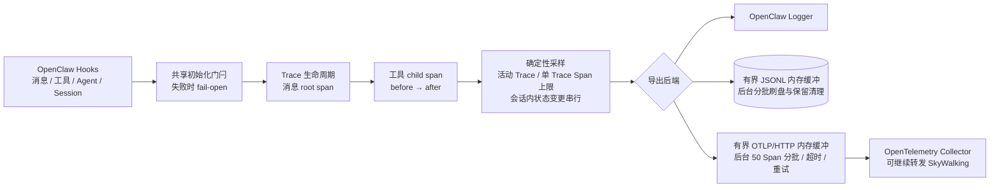
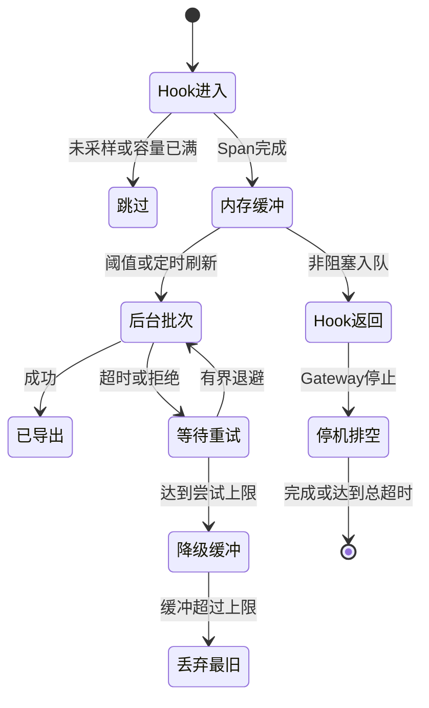

# OpenClaw Tracing

面向 OpenClaw 2026.7.1 的生产型消息与工具调用追踪插件。

[简体中文](./README.zh-CN.md) | [English](./README.md)

## 能力边界

`@partme.ai/openclaw-tracing` 监听官方 `message_received`、
`before_tool_call`、`after_tool_call`、`reply_payload_sending`、`agent_end` 和 `session_end` Hook。每个被采样的
消息生成一个 root span，每次工具调用生成一个 child span。

当前只声明三种真实可用后端：

- `log`：通过 OpenClaw logger 输出每个已完成 span 的紧凑 JSON。
- `file`：有界 JSONL 缓冲、串行刷盘、按日文件和自动保留期清理。
- `otlp`：OTLP/HTTP JSON，有界缓冲、串行批次、请求超时和重试。

插件不再声明原生 SkyWalking 后端。需要 SkyWalking 时，应将 OTLP 发送到
OpenTelemetry Collector，再由 Collector 转发到 SkyWalking。

## 追踪架构



## 安装与配置

```bash
openclaw plugins install @partme.ai/openclaw-tracing
```

清单 ID 是 `tracing`，插件参数路径为 `plugins.entries.tracing.config`。OpenClaw 2026.7.1
还要求设置 `plugins.entries.tracing.hooks.allowConversationAccess=true`，使受保护的
`agent_end` 兜底 Hook 能为自定义 Channel dispatcher 正确关闭 trace：

```json
{
  "plugins": {
    "entries": {
      "tracing": {
        "enabled": true,
        "hooks": {
          "allowConversationAccess": true
        },
        "config": {
          "enabled": true,
          "backend": "otlp",
          "otlpEndpoint": "http://otel-collector:4318/v1/traces",
          "otlpHeaders": {
            "Authorization": "Bearer <token>"
          },
          "sampleRate": 0.25,
          "maxSpansPerTrace": 100,
          "maxActiveTraces": 10000,
          "maxBufferedSpans": 10000,
          "flushIntervalMs": 5000,
          "exportTimeoutMs": 10000,
          "exportRetryAttempts": 3,
          "shutdownTimeoutMs": 15000,
          "captureMessageBody": false
        }
      }
    }
  }
}
```

`otlpEndpoint` 可填写 Collector 基址或完整 `/v1/traces` URL。Schema 之外还会在
运行时再次校验；非法值会让启动明确失败。

| 配置 | 默认值 | 说明 |
|---|---:|---|
| `enabled` | `false` | 开启采集；插件 entry 本身也必须启用 |
| `backend` | `log` | `log`、`file` 或 `otlp` |
| `sampleRate` | `1` | `0..1` 的确定性采样率 |
| `maxSpansPerTrace` | `100` | 包含 root span |
| `maxActiveTraces` | `10000` | 同时活动的 Trace 总上限；达到上限后跳过新 Trace 并告警 |
| `maxBufferedSpans` | `10000` | 溢出时丢弃最旧 span，并将健康状态置为 degraded |
| `flushIntervalMs` | `5000` | File/OTLP 刷新间隔 |
| `traceDir` | `./traces` | File 后端目录 |
| `traceRetentionDays` | `7` | File 后端文件保留天数 |
| `otlpEndpoint` | `http://localhost:4318/v1/traces` | OTLP/HTTP trace 地址 |
| `otlpHeaders` | `{}` | Collector 鉴权头；值不在日志、状态或查询接口中回显 |
| `exportTimeoutMs` | `10000` | 单次 OTLP 请求超时 |
| `exportRetryAttempts` | `3` | 每批 OTLP 最大尝试次数 |
| `shutdownTimeoutMs` | `15000` | 结束活动 Trace 并关闭后端的总等待上限 |
| `captureMessageBody` | `false` | 显式开启后最多保存 500 字符，可能包含敏感数据 |

## 运维接口

全部路由使用 OpenClaw 插件鉴权、只允许 GET，并返回 `Cache-Control: no-store`：

- `GET /tracing/status`
- `GET /tracing/traces?limit=50`，范围 `1..200`
- `GET /tracing/trace?traceId=<32位十六进制ID>`

后端发生当前导出或容量故障时，`/tracing/status` 返回 HTTP 503；
`backendStatus` 包含缓冲量、累计丢弃量、最近导出时间和最近错误。

## 可靠性与隐私边界

- 活跃 trace 与最近查询缓存均有容量边界。
- `gateway_start` 与首批 Hook 共享同一个初始化 Promise；初始化失败只记录观测故障，Hook
  fail-open，不阻断消息和工具调用。
- File/OTLP 的 Hook 路径只进入有界内存缓冲；刷盘、HTTP 批次和重试在后台串行执行，
  不会让临界批次的业务请求等待 Collector 或磁盘。
- 同一会话的 Trace 状态变更串行；工具绑定使用 `traceId + toolCallId`，避免并发会话复用
  toolCallId 时串线。
- 工具回调缺失、会话提前结束、新消息覆盖旧 trace，以及活跃 trace 超过 30 分钟时，
  都会关闭 orphan span，不再只删除映射造成内存泄漏。
- OpenClaw 标准出站渠道在 final reply Hook 关闭 root span；绕过该 Hook 的自定义 Channel
  dispatcher 在 `agent_end` 关闭，因此必须显式授予上面的 `allowConversationAccess` 信任。
  插件只使用该 Hook 的 run/session 结果元数据，不持久化其中的消息历史。
- File/OTLP 缓冲位于进程内，不是持久 Outbox，也不提供 exactly-once。进程崩溃可能
  丢失尚未刷出的 span，OTLP 请求超时也可能产生结果未知窗口。
- `captureMessageBody` 默认关闭；开启前必须完成数据分级、访问控制和保留期评审。
- `otlpHeaders` 可能包含鉴权秘密；插件不会回显，但配置文件本身仍必须使用最小权限保护。
- HTTP 查询只保留最近完成的 200 个 trace，Gateway 关闭时清空。



## 验证

```bash
pnpm test
pnpm typecheck
pnpm build
npm pack --dry-run
```

包与清单版本均为 `2026.7.1`，并要求 OpenClaw `>=2026.7.1`。
