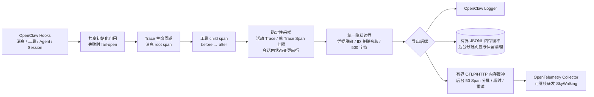
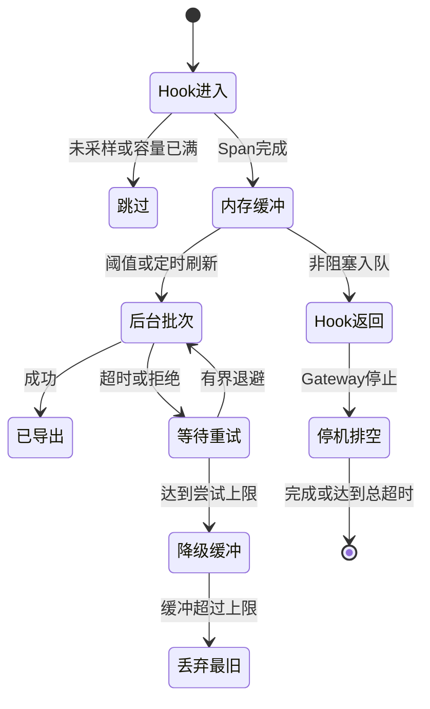
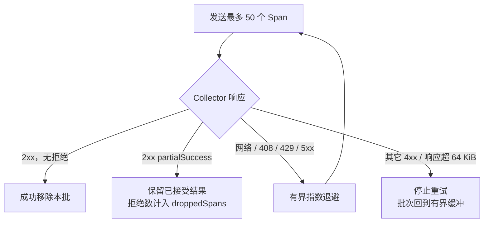

# OpenClaw Tracing

<!-- README_STANDARD_START -->

> 统一阅读顺序：组件定位 → 架构 → 流程 → 边界 → 安装 → 配置 → 运维 → 深入阅读。
> 本区块以 npm 可稳定渲染的 text 图为主；适用时，更深入的 Mermaid 图保留在仓库 `doc/` 设计资料中。

[简体中文](./README.zh-CN.md) | [English](./README.md)

## 1. 组件定位

提供 Agent 全链路关联和可插拔导出。组件类型：**分布式追踪基础设施**。

| 项目 | 内容 |
|---|---|
| npm 包 | `@partme.ai/openclaw-tracing` |
| 当前版本 | `2026.7.1` |
| 插件 ID | `tracing` |
| Channel ID | — |
| OpenClaw | `>=2026.7.1` |
| 源码目录 | `extensions/tracing` |

## 2. 一眼看懂

```text
[消息、Tool、Agent 与会话 Hook]
          │
          ▼
┌──────────────────────────────────────────────────────────────┐
│ OpenClaw Gateway 内: tracing
│ 1. 建立 Trace/Span 关联和容量边界
│ 2. 记录阶段、错误与耗时
│ 3. 导出到 OTLP、文件或日志后端
└──────────────────────────────────────────────────────────────┘
          │
          ▼
[可关联的链路追踪数据]
```

## 3. 架构与核心流程

该组件把“协议/平台差异”限制在自身边界内，对 OpenClaw 暴露稳定的插件、Channel、Hook、Tool 或 Service 契约。

```text
消息、Tool、Agent 与会话 Hook
  │
  ▼
建立 Trace/Span 关联和容量边界
  │
  ▼
记录阶段、错误与耗时
  │
  ▼
导出到 OTLP、文件或日志后端
  │
  ▼
可关联的链路追踪数据

异常路径: 任一步失败：记录可诊断错误并按组件策略重试、拒绝或降级
```

## 4. 能力与边界

| 能力 | 说明 |
|---|---|
| 负责 | 提供 Agent 全链路关联和可插拔导出 |
| 不负责 | 不替代 Collector、采样治理或告警系统 |
| 输入 | 消息、Tool、Agent 与会话 Hook |
| 输出 | 可关联的链路追踪数据 |
| 失败原则 | 默认失败应可观测；鉴权、边界校验和持久化失败不得伪装成功 |

## 5. 快速开始

```bash
openclaw plugins install "@partme.ai/openclaw-tracing@2026.7.1"
```

安装后先按最小权限配置，再启动 Gateway；生产环境应在隔离配置目录中完成连通性、权限和失败恢复验证。

## 6. 配置入口

| 配置层 | 路径 |
|---|---|
| 插件配置 | `plugins.entries.tracing.config` |
| Channel 配置 | 不适用 |
| 配置 Schema | `extensions/tracing/openclaw.plugin.json` |

配置字段、环境变量与完整示例继续保留在下方原有详细说明中。

## 7. 运维、安全与故障定位

- 先确认 OpenClaw 版本、插件版本、manifest ID 与配置键一致。
- 凭据使用环境变量或 SecretRef，不写入日志、仓库和示例明文。
- 通过 Gateway 日志、插件健康状态及外部依赖状态分层定位问题。
- 升级前备份状态数据；涉及游标、队列或索引时，必须验证重启恢复与重复投递语义。

## 8. 验证与深入阅读

```bash
pnpm --filter "@partme.ai/openclaw-tracing" typecheck
pnpm --filter "@partme.ai/openclaw-tracing" test
pnpm --filter "@partme.ai/openclaw-tracing" build
```

- [插件总体架构](../../doc/OpenClaw-Plugins-Architecture_CN.md)
- [统一插件结构规范](../../doc/OpenClaw-Plugins-Structure-Standard.md)

## 9. 原有详细说明

以下内容保留该组件原有的配置表、协议细节、示例和故障排查资料。

<!-- README_STANDARD_END -->


面向 OpenClaw 2026.7.1 的生产型消息与工具调用追踪插件。

[简体中文](./README.zh-CN.md) | [English](./README.md)

## 能力边界

`@partme.ai/openclaw-tracing` 监听官方 `message_received`、
`before_tool_call`、`after_tool_call`、`reply_payload_sending`、`agent_end` 和 `session_end` Hook。每个被采样的
消息生成一个 root span，每次工具调用生成一个 child span。

当前只声明三种真实可用后端：

- `log`：通过 OpenClaw logger 输出每个已完成 span 的紧凑 JSON。
- `file`：有界 JSONL 缓冲、串行刷盘、按日文件和自动保留期清理。
- `otlp`：OTLP/HTTP JSON，有界缓冲、串行批次、请求超时和重试。

插件不再声明原生 SkyWalking 后端。需要 SkyWalking 时，应将 OTLP 发送到
OpenTelemetry Collector，再由 Collector 转发到 SkyWalking。

## 追踪架构

```text
message_received ──▶ root span ─────────────────────────────┐
                         │                                  │
before_tool_call ──▶ child span ──▶ after_tool_call         │
                         │                                  │
reply final / agent_end / session_end ──▶ 结束 Trace ◀─────┘
                                              │
                                              ▼
                      属性脱敏 + 业务 ID 不可逆关联令牌
                                              │
                     ┌────────────────────────┼───────────────────────┐
                     ▼                        ▼                       ▼
                 OpenClaw Log          JSONL 有界缓冲          OTLP 有界缓冲
                                                               │
                                                               ▼
                                                     OpenTelemetry Collector
```



## 安装与配置

```bash
openclaw plugins install @partme.ai/openclaw-tracing
```

清单 ID 是 `tracing`，插件参数路径为 `plugins.entries.tracing.config`。OpenClaw 2026.7.1
还要求设置 `plugins.entries.tracing.hooks.allowConversationAccess=true`，使受保护的
`agent_end` 兜底 Hook 能为自定义 Channel dispatcher 正确关闭 trace：

```json
{
  "plugins": {
    "entries": {
      "tracing": {
        "enabled": true,
        "hooks": {
          "allowConversationAccess": true
        },
        "config": {
          "enabled": true,
          "backend": "otlp",
          "otlpEndpoint": "http://otel-collector:4318/v1/traces",
          "otlpHeaders": {
            "Authorization": "Bearer <token>"
          },
          "sampleRate": 0.25,
          "maxSpansPerTrace": 100,
          "maxActiveTraces": 1000,
          "maxBufferedSpans": 10000,
          "flushIntervalMs": 5000,
          "exportTimeoutMs": 10000,
          "exportRetryAttempts": 3,
          "shutdownTimeoutMs": 15000,
          "captureMessageBody": false
        }
      }
    }
  }
}
```

`otlpEndpoint` 可填写 Collector 基址或完整 `/v1/traces` URL。Schema 之外还会在
运行时再次校验；非法值会让启动明确失败。

| 配置 | 默认值 | 说明 |
|---|---:|---|
| `enabled` | `false` | 开启采集；插件 entry 本身也必须启用 |
| `backend` | `log` | `log`、`file` 或 `otlp` |
| `sampleRate` | `1` | `0..1` 的确定性采样率 |
| `maxSpansPerTrace` | `100` | 包含 root span |
| `maxActiveTraces` | `1000` | 同时活动的 Trace 总上限；与 `maxSpansPerTrace` 的乘积不得超过 100000 |
| `maxBufferedSpans` | `10000` | 溢出时丢弃最旧 span，并将健康状态置为 degraded |
| `flushIntervalMs` | `5000` | File/OTLP 刷新间隔 |
| `traceDir` | `./traces` | File 后端目录 |
| `traceRetentionDays` | `7` | File 后端文件保留天数 |
| `otlpEndpoint` | `http://localhost:4318/v1/traces` | OTLP/HTTP trace 地址 |
| `otlpHeaders` | `{}` | Collector 鉴权头；值不在日志、状态或查询接口中回显 |
| `exportTimeoutMs` | `10000` | 单次 OTLP 请求超时 |
| `exportRetryAttempts` | `3` | 每批 OTLP 最大尝试次数 |
| `shutdownTimeoutMs` | `15000` | 结束活动 Trace 并关闭后端的总等待上限 |
| `captureMessageBody` | `false` | 显式开启后最多保存 500 字符，可能包含敏感数据 |

## 运维接口

全部路由使用 OpenClaw 插件鉴权、只允许 GET，并返回 `Cache-Control: no-store`：

- `GET /tracing/status`
- `GET /tracing/traces?limit=50`，范围 `1..200`
- `GET /tracing/trace?traceId=<32位十六进制ID>`

后端发生当前导出或容量故障时，`/tracing/status` 返回 HTTP 503；
`backendStatus` 包含缓冲量、累计丢弃量、最近导出时间和最近错误。

## 可靠性与隐私边界

- 活跃 trace 与最近查询缓存均有容量边界。
- `gateway_start` 与首批 Hook 共享同一个初始化 Promise；初始化失败只记录观测故障，Hook
  fail-open，不阻断消息和工具调用。
- File/OTLP 的 Hook 路径只进入有界内存缓冲；刷盘、HTTP 批次和重试在后台串行执行，
  不会让临界批次的业务请求等待 Collector 或磁盘。
- OTLP 只重试网络错误、408/429 和 5xx；400/401 等永久错误立即停止本批尝试。
  `partialSuccess` 不能整批重发，否则会复制 Collector 已接受的 Span；插件将拒绝数计入
  `droppedSpans`。Collector 成功响应按真实流量限制为 64 KiB，不使用无界 `response.text()`。
- 活动内存配置额外校验 `maxActiveTraces * maxSpansPerTrace <= 100000`，避免两个分别合法的
  大值组合成不可控的 Span 上限。
- 同一会话的 Trace 状态变更串行；工具绑定使用 `traceId + toolCallId`，避免并发会话复用
  toolCallId 时串线。
- 工具回调缺失、会话提前结束、新消息覆盖旧 trace，以及活跃 trace 超过 30 分钟时，
  都会关闭 orphan span，不再只删除映射造成内存泄漏。
- OpenClaw 标准出站渠道在 final reply Hook 关闭 root span；绕过该 Hook 的自定义 Channel
  dispatcher 在 `agent_end` 关闭，因此必须显式授予上面的 `allowConversationAccess` 信任。
  插件只使用该 Hook 的 run/session 结果元数据，不持久化其中的消息历史。
- File/OTLP 缓冲位于进程内，不是持久 Outbox，也不提供 exactly-once。进程崩溃可能
  丢失尚未刷出的 span，OTLP 请求超时也可能产生结果未知窗口。
- `captureMessageBody` 默认关闭；开启前必须完成数据分级、访问控制和保留期评审。
- Span 写入 TraceStore 前统一执行安全处理：ESM 包静态导入 OpenClaw 2026.7.1
  `security-runtime`，Bearer、Basic、Bot、`sk-*`、key/token/password 等凭据使用 SDK 与插件
  规则联合脱敏；Span 名称与属性都清理控制字符且字符串最多 500 字符；session/run/message/tool-call 标识替换为
  Gateway 单次生命周期内稳定、跨重启不可关联的 HMAC 令牌。状态查询、Log、File 与 OTLP 因而
  共享同一安全边界，不依赖每个后端重复实现。
- `otlpHeaders` 可能包含鉴权秘密；插件不会回显，但配置文件本身仍必须使用最小权限保护。
- HTTP 查询只保留最近完成的 200 个 trace，Gateway 关闭时清空。



### OTLP 响应决策

```text
发送 ≤ 50 Span
      │
      ├─ 2xx 无拒绝 ─────────────▶ 成功移除本批
      ├─ 2xx partialSuccess ─────▶ 不整批重发；拒绝数计入 dropped
      ├─ 网络/408/429/5xx ───────▶ 有界退避重试
      └─ 其它 4xx / 响应 >64KiB ─▶ 立即失败并保留缓冲
```



## 验证

```bash
pnpm test
pnpm typecheck
pnpm build
npm pack --dry-run
```

包与清单版本均为 `2026.7.1`，并要求 OpenClaw `>=2026.7.1`、Node.js `>=22`。
