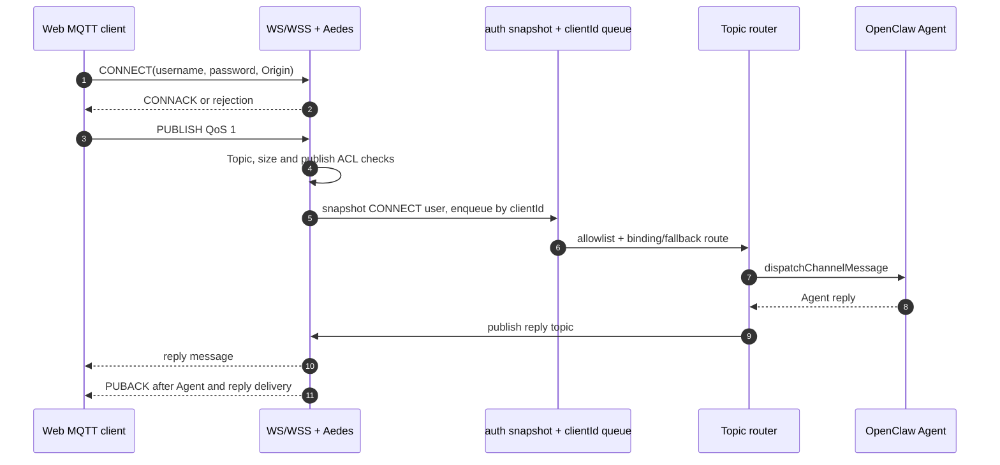
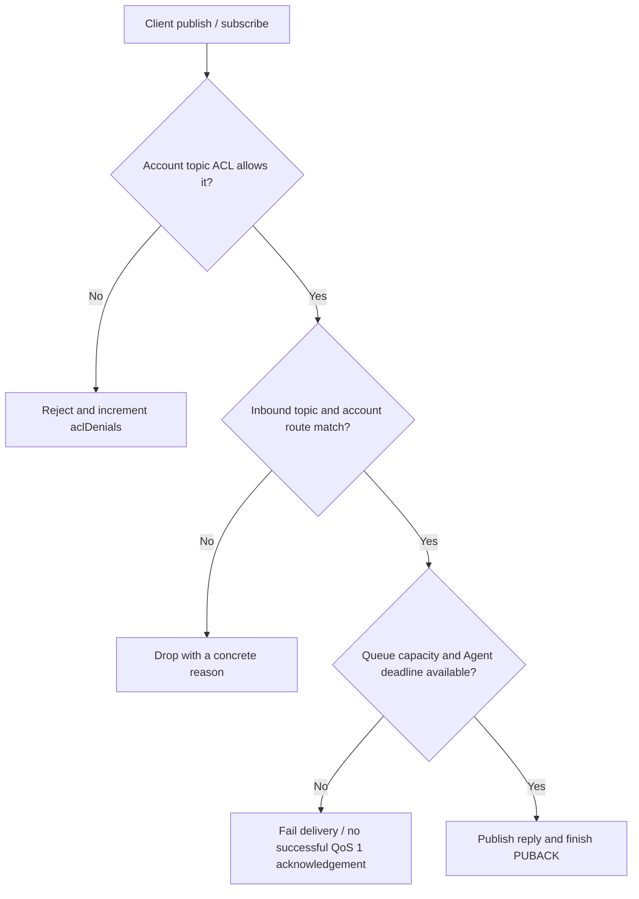

<div align="center">

# OpenClaw Web MQTT

**OpenClaw channel plugin — enterprise MQTT over WebSocket with topic governance and agent binding**


</div>

[English](./README.md) | [简体中文](./README.zh-CN.md)

## Introduction

`@partme.ai/openclaw-web-mqtt` is an OpenClaw **channel plugin** built on the latest channel SDK entrypoints:

- `defineChannelPluginEntry` for full runtime registration
- `defineSetupPluginEntry` for setup-only loading
- runtime store pattern for safe runtime injection

It provides a hardened embedded MQTT-over-WebSocket broker for browser and web applications, and routes inbound messages into OpenClaw agent replies.

## Architecture

```text
┌──────────────────────────── OpenClaw Gateway ────────────────────────────┐
│  openclaw-web-mqtt                                                      │
│                                                                         │
│  Browser ── exact Origin allowlist ─┐                                   │
│                                    ▼                                   │
│  Native MQTT client ───────────▶ WS / WSS ──▶ Aedes 1.x Broker         │
│                                    │          auth / Topic ACL / limits │
│                                    │                   │               │
│                                    │                   ▼               │
│                                    │    auth snapshot + clientId FIFO  │
│                                    │                   │               │
│                                    │                   ▼               │
│                                    └── reply ◀ message-sdk ◀▶ Agent    │
│                                                                         │
│  stop: reject new work → terminate sockets → drain Agent work → close  │
└─────────────────────────────────────────────────────────────────────────┘
```

The character diagram gives a quick view in terminals and source review. The Mermaid diagram below preserves the same architecture as a rendered, maintainable component graph.

```mermaid
flowchart LR
    Browser["Browser / Web application"]
    Device["Node.js / non-browser MQTT client"]
    Origin["Exact Origin allowlist"]
    WSS["WS/WSS + frame and idle limits"]
    Aedes["Aedes MQTT Broker\nauth + publish/subscribe ACL"]
    Identity["Connection auth snapshot\nimmune to clientId takeover"]
    Queue["Per-clientId queue\nFIFO per client / parallel across clients"]
    Route["Topic allowlist and routing\nBinding first / standard fallback"]
    SDK["message-sdk\nparse / dedupe / OpenClaw dispatch"]
    Agent["OpenClaw Agent"]
    Reply["replyTopic / default out topic"]

    Browser --> Origin --> WSS
    Device --> WSS
    WSS --> Aedes --> Identity --> Queue --> Route --> SDK --> Agent
    Agent --> SDK --> Reply --> Aedes --> WSS
```



The embedded broker belongs to one OpenClaw Gateway process; it is not a persistent, horizontally scalable MQTT cluster. Use external MQTT infrastructure when you need cross-Gateway session recovery, durable subscriptions, or broker clustering.

## Core capabilities

- **Multi-topic subscription governance**: `subscribeTopics` allowlist with MQTT wildcards (`+`, `#`)
- **Topic-agent binding**: explicit `topicPattern -> agentId` routing with optional `replyTopic`
- **Standard fallback route**: `<topicPrefix>agent/<agentId>/in` -> `<topicPrefix>agent/<agentId>/out`
- **Enterprise controls**:
  - auth and per-user topic allowlist
  - TLS/WSS support
  - max payload and websocket frame limits
  - idle timeout and connection governance
  - route metrics and drop reason visibility

## Message flow

```text
Browser       WS/WSS+Aedes       identity + queue     Router        Agent
   │ CONNECT       │                   │                 │             │
   ├──────────────▶│ auth + ACL        │                 │             │
   │ PUBLISH QoS1  │                   │                 │             │
   ├──────────────▶├── snapshot/FIFO ─▶├── route ──────▶├── turn ────▶│
   │               │                   │                 │◀── reply ───┤
   │◀── reply ─────┤◀──────────────────┴─────────────────┤             │
   │◀── PUBACK ────┤  only after Agent turn and reply delivery         │
```



## Quick start

### Prerequisites

- OpenClaw `>= 2026.7.1`
- Node.js `>=22.22.3 <23`, `>=24.15.0 <25`, or `>=25.9.0`

### Install

```bash
openclaw plugins install @partme.ai/openclaw-web-mqtt
```

Requires `@partme.ai/openclaw-message-sdk >= 2026.7.1`.

### Minimal config (`openclaw.json`)

```json
{
  "channels": {
    "mqtt-ws": {
      "port": 15675,
      "path": "/ws",
      "host": "127.0.0.1",
      "topicPrefix": "openclaw/",
      "subscribeTopics": [
        "openclaw/agent/+/in",
        "devices/+/in"
      ],
      "topicBindings": [
        {
          "topicPattern": "devices/+/in",
          "agentId": "iot-agent",
          "replyTopic": "devices/reply"
        }
      ],
      "payload": { "mode": "jsonTextOrPlain" },
      "auth": {
        "required": true,
        "allowAnonymous": false,
        "users": [
          {
            "username": "mqtt_user",
            "password": "change_me",
            "publishAllow": ["openclaw/agent/+/in", "devices/+/in"],
            "subscribeAllow": ["openclaw/agent/+/out", "devices/reply"]
          }
        ]
      },
      "tls": {
        "enabled": false
      },
      "ws": {
        "compress": false,
        "idleTimeoutMs": 60000,
        "maxFrameSize": 262144,
        "allowedOrigins": ["https://console.example.com"]
      },
      "limits": {
        "maxPayloadBytes": 262144,
        "maxSubscriptionsPerClient": 200,
        "maxPendingMessagesPerClient": 32,
        "inboundTaskTimeoutMs": 120000
      }
    }
  }
}
```

## Enterprise hardening checklist

| Area | Behavior |
|---|---|
| **Delivery** | QoS 0 has no protocol acknowledgement; QoS 1 PUBACK waits for the Agent turn and reply delivery |
| **Inbound** | Per-`clientId` serialized dispatch with hard pending-depth and task-time limits |
| **Outbound** | Awaited broker publish; missing session, ACL denial, or no active subscriber fails the delivery |
| **Isolation** | Server-originated publishes do not re-enter inbound processing; ACL plus topic allowlists apply |
| **Takeover identity** | The authenticated user is snapshotted per physical connection and message, so a reused `clientId` cannot relabel old queued work or delayed replies |

### Two authorization boundaries

```text
Client action
     │
     ▼
Aedes publish/subscribe ACL ── denied ──▶ reject + aclDenials
     │ allowed
     ▼
OpenClaw topic/account ACL ─── denied ──▶ drop with safe reason
     │ allowed
     ▼
Bounded queue + Agent deadline ─ failed ─▶ no successful QoS1 ACK
     │ completed
     ▼
Reply publish + PUBACK
```



Aedes enforces protocol-level publish/subscribe ACLs first. OpenClaw inbound and outbound processing then binds the authenticated identity to the account route again. With authentication enabled, a missing identity fails closed.

Application-level deduplication requires an explicit `idempotencyKey` or `messageId` in the JSON payload. MQTT packet identifiers are legally reusable and are not treated as cross-turn idempotency keys; repeated plain-text payloads remain separate valid messages.

- Bind plain WS to loopback only; non-loopback startup requires both `tls.enabled=true` and `auth.required=true`
- Use dedicated users and preferably `passwordHash` instead of plaintext passwords
- Set `ws.allowedOrigins` for every browser application; an unlisted browser Origin is rejected
- Non-browser MQTT clients normally omit `Origin`; any request that sends it must exactly match a canonical `http/https` allowlist entry
- Set strict `publishAllow` / `subscribeAllow`
- Anonymous access requires an explicit `anonymous` user with a fail-closed ACL
- Tune `maxPayloadBytes`, `maxFrameSize`, `idleTimeoutMs`, `maxPendingMessagesPerClient`, and `inboundTaskTimeoutMs` by traffic profile
- Use reverse proxy policy and network ACL for perimeter controls

Local protocol and installation gates do not replace browser/device acceptance in the target environment. Before production approval, verify the real certificate chain, reverse proxy upgrade forwarding, Origin policy, reconnect behavior, and expected concurrent browser load.

## Status and observability

`GET /mqtt-ws/status` (plugin-auth route) exposes:

- connection count
- rejected connection, authentication failure, and ACL denial counters
- accepted/dropped inbound counters
- current active and queued inbound task counts
- binding-vs-standard route counters
- outbound publish counters
- last error summary
- sanitized active config snapshot

## Testing

### Unit tests

```bash
npm test
```

### Integration test client

```bash
npm run test:client
```

Default test endpoint:

- `MQTT_BROKER_URL=ws://127.0.0.1:15675/ws`

Supported env vars:

- `MQTT_BROKER_URL`
- `MQTT_CLIENT_ID`
- `MQTT_TEST_TIMEOUT_MS`
- `MQTT_TEST_SUBSCRIBE_TOPICS`
- `MQTT_TEST_PUBLISH_CASES`
- `MQTT_TEST_TOPIC_JSON`
- `MQTT_TEST_TOPIC_PLAIN`
- `MQTT_TEST_REPLY_TOPIC`

## CI and release

| Workflow | Trigger | Purpose |
| --- | --- | --- |
| `.github/workflows/ci.yml` | Push / PR | install, typecheck, build, test, upload artifact |
| `.github/workflows/release.yml` | tag `v*` / manual | build, test, publish npm (skip existing version) |

## RabbitMQ Web MQTT baseline

This plugin references RabbitMQ Web MQTT production practices:

- default websocket endpoint convention `15675/ws`
- explicit plugin enabling and secure user setup
- WSS/TLS deployment recommendations
- websocket tuning (frame size / timeout / compression)

Reference: [RabbitMQ Web MQTT](https://www.rabbitmq.com/docs/web-mqtt)

## OpenClaw documentation

### Plugins

- [Tools - Plugins](https://docs.openclaw.ai/tools/plugin)
- [Community plugins](https://docs.openclaw.ai/plugins/community)
- [Bundles](https://docs.openclaw.ai/plugins/bundles)
- [Voice call](https://docs.openclaw.ai/plugins/voice-call)

### Building plugins

- [Building plugins](https://docs.openclaw.ai/plugins/building-plugins)
- [SDK - Channel plugins](https://docs.openclaw.ai/plugins/sdk-channel-plugins)
- [SDK - Provider plugins](https://docs.openclaw.ai/plugins/sdk-provider-plugins)
- [SDK - Migration](https://docs.openclaw.ai/plugins/sdk-migration)

### SDK reference

- [SDK overview](https://docs.openclaw.ai/plugins/sdk-overview)
- [SDK entry points](https://docs.openclaw.ai/plugins/sdk-entrypoints)
- [SDK runtime](https://docs.openclaw.ai/plugins/sdk-runtime)
- [SDK setup](https://docs.openclaw.ai/plugins/sdk-setup)
- [SDK testing](https://docs.openclaw.ai/plugins/sdk-testing)
- [Manifest](https://docs.openclaw.ai/plugins/manifest)
- [Architecture](https://docs.openclaw.ai/plugins/architecture)

## License

MIT

## Message Format Guide

Web MQTT uses the shared OpenClaw queue wire contract for inbound parsing and reply serialization. See [OpenClaw Queue Message Format Guide](../../doc/OpenClaw-Queue-Message-Format-Guide.en.md) for standard `MessageEnvelope` payloads, non-standard normalization, `payload.outboundFormat`, and cross-language SDK adapter guidance.
