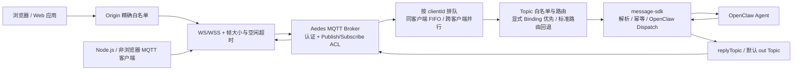
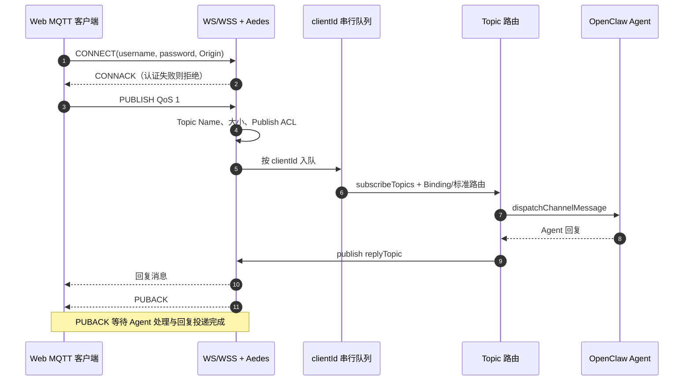
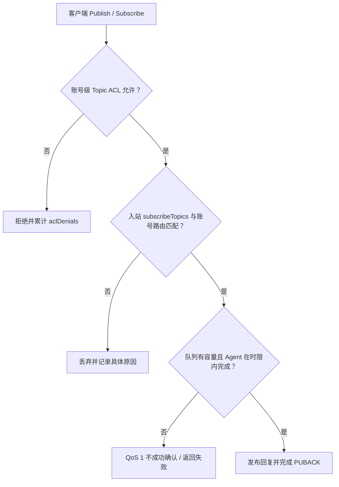

<div align="center">

# OpenClaw Web MQTT

**OpenClaw 渠道插件：企业级 MQTT over WebSocket，支持 topic 治理与 agent 绑定**


</div>

[简体中文](./README.zh-CN.md) | [English](./README.md)

## 简介

`@partme.ai/openclaw-web-mqtt` 是基于 OpenClaw 最新 channel SDK 的渠道插件：

- 使用 `defineChannelPluginEntry` 进行完整注册
- 使用 `defineSetupPluginEntry` 支持 setup-only 轻量加载
- 使用 runtime store 管理 runtime 注入与读取

插件提供内嵌强化版 MQTT over WebSocket broker，面向浏览器与 Web 应用接入，并将入站消息路由给 OpenClaw Agent。

## 架构总览

```text
┌──────────────────────────── OpenClaw Gateway ────────────────────────────┐
│  openclaw-web-mqtt                                                      │
│                                                                         │
│  Browser ──Origin 白名单──┐                                             │
│                           ▼                                             │
│  Native Client ───────▶ WS / WSS ──▶ Aedes 1.x Broker                  │
│                           │              │ 认证 / Topic ACL / 帧上限      │
│                           │              ▼                              │
│                           │     clientId 有界 FIFO 队列                  │
│                           │              │                              │
│                           │              ▼                              │
│                           │     Topic 路由 + account ACL                 │
│                           │              │                              │
│                           │              ▼                              │
│                           └── reply ◀ message-sdk ◀▶ OpenClaw Agent     │
│                                                                         │
│  stop：拒绝新任务 → terminate WebSocket → 排空 Agent 任务 → 关闭服务    │
└─────────────────────────────────────────────────────────────────────────┘
```

字符图用于快速识别浏览器安全边界和停机顺序；下面的 Mermaid 保留可渲染、可维护的同一架构视图。



这里内嵌的是**单个 OpenClaw Gateway 进程内的接入 broker**，不是可水平扩展的持久化 MQTT 集群。它适合浏览器实时接入和 Agent 消息桥接；需要跨 Gateway 会话恢复、持久订阅或 broker 集群时，应使用外部 MQTT 基础设施及对应插件。

## 核心能力

- **多 topic 订阅治理**：`subscribeTopics` 白名单，支持 `+/#` 通配符
- **topic-agent 显式绑定**：`topicPattern -> agentId`，支持绑定 `replyTopic`
- **标准路由回退**：`<topicPrefix>agent/<agentId>/in` -> `<topicPrefix>agent/<agentId>/out`
- **企业级增强**：
  - 鉴权与用户级 topic 访问控制
  - TLS/WSS 支持
  - 消息大小与 WebSocket 帧大小限制
  - 空闲超时与连接治理
  - 路由命中与丢弃原因统计

## 消息处理流程

```text
浏览器         WS/WSS+Aedes       clientId 队列       Topic 路由      Agent
  │ CONNECT         │                   │                 │             │
  ├────────────────▶│ 认证 + ACL        │                 │             │
  │ PUBLISH QoS1    │                   │                 │             │
  ├────────────────▶├── 有界 FIFO ────▶├── 路由 ───────▶├── Turn ────▶│
  │                 │                   │                 │◀── 回复 ────┤
  │◀── 回复消息 ────┤◀──────────────────┴─────────────────┤             │
  │◀── PUBACK ──────┤  仅在 Agent Turn 与回复投递完成后确认             │
```

字符时序图先展示“确认点在哪里”；下面的 Mermaid 继续保留参与者、校验顺序和可渲染的完整时序。



显式 `topicBindings` 的优先级高于标准路由；未命中绑定时才按 `<topicPrefix>agent/<agentId>/in` 推导 Agent 与默认 out Topic。服务端直接调用 `publishToTopic` 属于插件内部可信出口，不接受来自客户端的通配 Topic Name。

## 快速开始

### 前置条件

- OpenClaw `>= 2026.7.1`
- Node.js `>=22.22.3 <23`、`>=24.15.0 <25` 或 `>=25.9.0`

### 安装

```bash
openclaw plugins install @partme.ai/openclaw-web-mqtt
```

最低依赖：`@partme.ai/openclaw-message-sdk >= 2026.7.1`。

### message-sdk 复用

MQTT over WebSocket 传输与 ACL 留在本插件；下列能力通过 **薄封装** 委托 message-sdk：

| message-sdk 模块 | web-mqtt 挂载点 | 用途 |
|------------------|-----------------|------|
| `ingress/wire-ingress`（`normalizeWireIngress`） | `inbound.ts` | 入站 payload 解析 + 幂等短路 |
| `dedup`（`createIdempotencyCache` + `getGlobalSingleton`） | `shared/wire-helpers.ts` | 入站 messageId / 指纹去重 |
| `bridge`（`dispatchChannelMessage`、`resolveChannelDispatchIdentity`） | `inbound.ts` | Wire 路径 OpenClaw reply 管线 |
| `pipeline/serialize-payload` | `inbound.ts` reply.deliver | 出站 wire 序列化（envelope / legacyJsonText / plainText） |
| `config/resolveChannelAgentReplyTimeoutMs` | `config/resolvers.ts` | Agent 回复超时 |
| `config/resolveChannelMediaMaxBytes` | `config/resolvers.ts` | 媒体/载荷上限解析 |

### 最小配置（`openclaw.json`）

```json
{
  "channels": {
    "mqtt-ws": {
      "port": 15675,
      "path": "/ws",
      "host": "127.0.0.1",
      "topicPrefix": "openclaw/",
      "subscribeTopics": [
        "openclaw/agent/+/in",
        "devices/+/in"
      ],
      "topicBindings": [
        {
          "topicPattern": "devices/+/in",
          "agentId": "iot-agent",
          "replyTopic": "devices/reply"
        }
      ],
      "payload": { "mode": "jsonTextOrPlain" },
      "auth": {
        "required": true,
        "allowAnonymous": false,
        "users": [
          {
            "username": "mqtt_user",
            "password": "change_me",
            "publishAllow": ["openclaw/agent/+/in", "devices/+/in"],
            "subscribeAllow": ["openclaw/agent/+/out", "devices/reply"]
          }
        ]
      },
      "tls": {
        "enabled": false
      },
      "ws": {
        "compress": false,
        "idleTimeoutMs": 60000,
        "maxFrameSize": 262144,
        "allowedOrigins": ["https://console.example.com"]
      },
      "limits": {
        "maxPayloadBytes": 262144,
        "maxSubscriptionsPerClient": 200,
        "maxPendingMessagesPerClient": 32,
        "inboundTaskTimeoutMs": 120000
      }
    }
  }
}
```

## 企业级加固建议

> 可靠性矩阵与生产配置：[队列可靠性指南](../../doc/OpenClaw-Queue-Reliability-Guide.md)

| 项 | 行为 |
|----|------|
| **分级** | QoS0 无协议确认；QoS1 PUBACK 等待 Agent 与回复投递完成 |
| **入站** | per-`clientId` 串行 dispatch；pending 数量与任务时长均有硬上限 |
| **出站** | `publishToTopic` await；无活跃订阅者、ACL 拒绝或缺会话均失败 |
| **隔离** | server publish 不触发入站；ACL + topic 白名单 |

### 两层授权边界

```text
客户端动作
    │
    ▼
Aedes Publish/Subscribe ACL ── 拒绝 ──▶ 拒绝请求 + aclDenials
    │ 允许
    ▼
OpenClaw Topic/账号 ACL ─────── 拒绝 ──▶ 丢弃并记录脱敏原因
    │ 允许
    ▼
有界队列 + Agent 时限 ───────── 失败 ──▶ QoS1 不返回成功确认
    │ 完成
    ▼
回复发布 + PUBACK
```



第一层由 Aedes 在协议入口执行 `publishAllow` / `subscribeAllow`；第二层在 OpenClaw 入站和出站处理时再次绑定已认证身份与账号路由。认证开启后若身份映射缺失，插件按 fail-closed 拒绝，不会退化为匿名放行。

应用级幂等需在 JSON payload 中提供 `idempotencyKey` 或 `messageId`。MQTT packet id 会被客户端合法复用，插件不会把它当作跨 Agent Turn 的幂等键；纯文本相同内容也会按两条合法消息处理。

- 明文 WS 只能绑定 loopback；监听非 loopback 地址必须同时启用 `tls.enabled=true` 与 `auth.required=true`
- 使用独立 MQTT 用户，生产配置优先使用 `passwordHash`，避免明文密码
- 浏览器应用必须加入 `ws.allowedOrigins` 精确白名单，未列出的 Origin 会被拒绝
- 非浏览器 MQTT 客户端通常不发送 `Origin`，可直接连接；只要请求携带 `Origin`，就必须精确命中 `http/https` 白名单
- 严格配置 `publishAllow` / `subscribeAllow`
- 匿名访问必须显式配置 `anonymous` 用户及 fail-closed ACL
- 按流量调优 `maxPayloadBytes`、`maxFrameSize`、`idleTimeoutMs`、`maxPendingMessagesPerClient` 与 `inboundTaskTimeoutMs`
- 配合反向代理与网络 ACL 做边界隔离

本地协议测试与安装门禁不能替代目标环境验收。生产签字前仍需验证真实证书链、反向代理 Upgrade 转发、Origin 策略、断线重连以及预期浏览器并发负载。

## 状态与可观测性

`GET /mqtt-ws/status`（插件鉴权路由）输出：

- 当前连接数
- 连接拒绝、认证失败与 ACL 拒绝计数
- 入站接受/丢弃计数
- 当前执行中与排队中的入站任务数
- binding 与标准回退路由命中计数
- 出站发布计数
- 最近错误摘要
- 脱敏后的生效配置快照

## 测试

### 单元测试

```bash
npm test
```

### 集成测试端

```bash
npm run test:client
```

默认测试端点：

- `MQTT_BROKER_URL=ws://127.0.0.1:15675/ws`

支持环境变量：

- `MQTT_BROKER_URL`
- `MQTT_CLIENT_ID`
- `MQTT_TEST_TIMEOUT_MS`
- `MQTT_TEST_SUBSCRIBE_TOPICS`
- `MQTT_TEST_PUBLISH_CASES`
- `MQTT_TEST_TOPIC_JSON`
- `MQTT_TEST_TOPIC_PLAIN`
- `MQTT_TEST_REPLY_TOPIC`

## CI 与发版

| 工作流 | 触发方式 | 作用 |
| --- | --- | --- |
| `.github/workflows/ci.yml` | Push / PR | 安装、类型检查、构建、测试、上传产物 |
| `.github/workflows/release.yml` | `v*` tag / 手动触发 | 构建、测试并发布 npm（已存在版本自动跳过） |

## RabbitMQ Web-MQTT 兼容基线

本插件参考 RabbitMQ Web-MQTT 官方生产实践：

- 默认 websocket 端点约定 `15675/ws`
- 明确插件启用与独立用户策略
- WSS/TLS 生产部署建议
- websocket 帧大小/超时/压缩调优建议

参考文档：[RabbitMQ Web MQTT](https://www.rabbitmq.com/docs/web-mqtt)

## OpenClaw 官方文档

### Plugins

- [Tools - Plugins](https://docs.openclaw.ai/tools/plugin)
- [Community plugins](https://docs.openclaw.ai/plugins/community)
- [Bundles](https://docs.openclaw.ai/plugins/bundles)
- [Voice call](https://docs.openclaw.ai/plugins/voice-call)

### Building plugins

- [Building plugins](https://docs.openclaw.ai/plugins/building-plugins)
- [SDK - Channel plugins](https://docs.openclaw.ai/plugins/sdk-channel-plugins)
- [SDK - Provider plugins](https://docs.openclaw.ai/plugins/sdk-provider-plugins)
- [SDK - Migration](https://docs.openclaw.ai/plugins/sdk-migration)

### SDK reference

- [SDK overview](https://docs.openclaw.ai/plugins/sdk-overview)
- [SDK entry points](https://docs.openclaw.ai/plugins/sdk-entrypoints)
- [SDK runtime](https://docs.openclaw.ai/plugins/sdk-runtime)
- [SDK setup](https://docs.openclaw.ai/plugins/sdk-setup)
- [SDK testing](https://docs.openclaw.ai/plugins/sdk-testing)
- [Manifest](https://docs.openclaw.ai/plugins/manifest)
- [Architecture](https://docs.openclaw.ai/plugins/architecture)

## 许可证

MIT

## 消息格式指南

Web MQTT 使用共享的 OpenClaw 队列 wire 契约完成入站解析与回复序列化。标准 `MessageEnvelope`、非标准消息归一化、`payload.outboundFormat` 与多语言 SDK 适配说明见 [OpenClaw 队列消息格式指南](../../doc/OpenClaw-Queue-Message-Format-Guide.md)。
