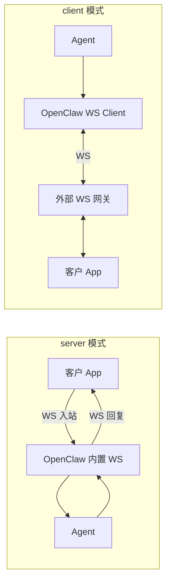

# @partme.ai/openclaw-web-socket

OpenClaw **WebSocket** channel plugin — uses [`ws`](https://github.com/websockets/ws) as **client** and/or **server**.

## 运行模式

[`ws`](https://github.com/websockets/ws) 同时提供：

- **`WebSocket`** — Node.js 作为客户端连外部 `ws://` / `wss://`
- **`WebSocketServer`** — 内嵌 WebSocket 服务，等待外部连接

本插件通过 `channels.web-socket.mode` 选择：

| mode | 说明 |
|------|------|
| `server` | **服务端模式**（默认）：Gateway 内置 WS，客户方连进来，智能体经同一 socket 回复 |
| `client` | **客户端模式**：OpenClaw 作为 WS 客户端连到**外部** WS 服务，在外部网关里与终端用户通信 |
| `both` | **双模式**：同时启动内置服务 + 连外部 WS（例如本地调试 + 生产桥接） |


```mermaid
flowchart LR
  subgraph server_mode [server 模式]
    C1[客户 App] -->|WS 入站| S1[OpenClaw 内置 WS]
    S1 --> A1[Agent]
    A1 --> S1
    S1 -->|WS 回复| C1
  end

  subgraph client_mode [client 模式]
    A2[Agent] --> OC[OpenClaw WS Client]
    OC <-->|WS| EXT[外部 WS 网关]
    EXT <--> C2[客户 App]
  end
```

## Features

- Embedded `WebSocketServer`（`server` / `both`）
- Outbound `WebSocket` client with reconnect（`client` / `both`）
- Inbound via `@partme.ai/openclaw-message-sdk`
- Session ↔ connection mapping
- HTTP upgrade 阶段的 Bearer token 鉴权（server 入站 / client 出站）
- Origin 白名单、每连接速率限制、异步入站队列与出站背压保护
- WebSocket ping/pong 心跳、连接超时、指数退避重连与可等待停机
- HTTP status: `GET /web-socket/status`

## Client protocol

**Connect (server mode)** → server sends:

```json
{ "type": "connected", "connectionId": "<uuid>" }
```

**Send message:**

```json
{
  "type": "message",
  "text": "Hello",
  "agentId": "optional",
  "messageId": "optional",
  "peerId": "optional-user-id"
}
```

`peerId` / `userId` / `from` 用于 **client 模式**下外部网关在同一连接上区分多个终端用户。

Plain text (non-JSON) is also accepted as the message body.

## Configuration (`channels.web-socket`)

### 服务端模式（默认）

```json
{
  "channels": {
    "web-socket": {
      "mode": "server",
      "wsPort": 18789,
      "path": "/openclaw/ws",
      "defaultAgentId": "your-agent-id",
      "auth": { "enabled": false }
    }
  }
}
```

### 客户端模式（连外部 WS）

```json
{
  "channels": {
    "web-socket": {
      "mode": "client",
      "url": "wss://your-gateway.example.com/ws/openclaw",
      "clientToken": "shared-secret",
      "clientId": "openclaw-bridge",
      "defaultAgentId": "your-agent-id",
      "client": {
        "reconnect": { "enabled": true, "initialDelayMs": 1000, "maxDelayMs": 30000 }
      }
    }
  }
}
```

### 双模式

```json
{
  "channels": {
    "web-socket": {
      "mode": "both",
      "url": "wss://prod-gateway/ws",
      "wsPort": 18789,
      "path": "/openclaw/ws",
      "defaultAgentId": "your-agent-id"
    }
  }
}
```

| Key | Default | Description |
|-----|---------|-------------|
| `mode` | `server` | `client` / `server` / `both` |
| `url` | — | 外部 WS 地址（client/both 必填） |
| `wsPort` | `18789` | 内置服务端口（server/both） |
| `path` | `/openclaw/ws` | 内置服务路径 |
| `defaultAgentId` | — | 默认 Agent |
| `allowFrameAgentId` | `false` | 是否信任客户端帧中的 `agentId`；生产默认关闭 |
| `clientId` | `openclaw-client` | client 模式下的 peer 前缀 |
| `host` | `127.0.0.1` | 内置服务监听地址；默认不暴露到网络 |
| `clientToken` | — | 连外部 WS 的 `Authorization: Bearer` token |
| `auth.*` | — | 内置服务入站认证；`allowQueryToken` 默认关闭 |
| `allowedOrigins` | `[]` | 浏览器 Origin 精确白名单；不发送 Origin 的原生客户端不受影响 |
| `allowInsecureRemote` | `false` | 显式允许远程明文监听；生产应优先使用 TLS 反向代理 |
| `limits.maxBufferedBytes` | `1048576` | 慢客户端的最大待发送字节数 |
| `limits.maxPendingMessages` | `32` | 每连接最大待处理入站消息数 |
| `limits.messagesPerMinute` | `120` | 每连接每分钟消息上限 |
| `limits.heartbeatIntervalMs` | `30000` | ping 周期 |
| `limits.heartbeatTimeoutMs` | `10000` | pong 超时 |

## 生产部署约束

- 默认仅监听 `127.0.0.1`。推荐由 Nginx、Envoy 或云网关在同机终止 TLS，再转发到本插件，外部只暴露 `wss://`。
- 非 loopback 明文监听必须同时配置 token 并显式设置 `allowInsecureRemote: true`；这是风险确认开关，不会把明文连接变安全。
- 远程客户端默认只接受 `wss://`。确需远程 `ws://` 时，在 `client.allowInsecureRemote` 中显式确认。
- token 默认只从 `Authorization: Bearer` 读取。`auth.allowQueryToken` 仅用于无法设置 header 的旧客户端，因为 URL 可能进入代理和访问日志。
- `/web-socket/status` 由 OpenClaw 插件认证保护，并对 token 和自定义 client headers 脱敏。

## Build

```bash
cd extensions/web-socket
pnpm install
pnpm build
pnpm test
```

## Related

- `extensions/mqtt` — embedded MQTT broker
- `extensions/web-mqtt` — MQTT over WebSocket
- `extensions/web-stomp` — STOMP over WebSocket
