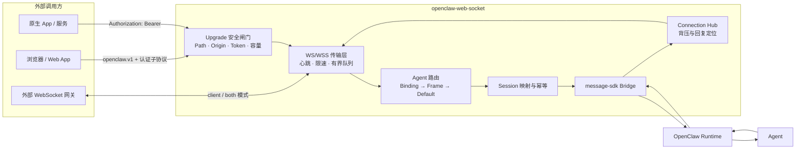
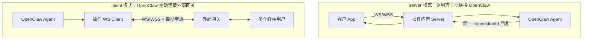
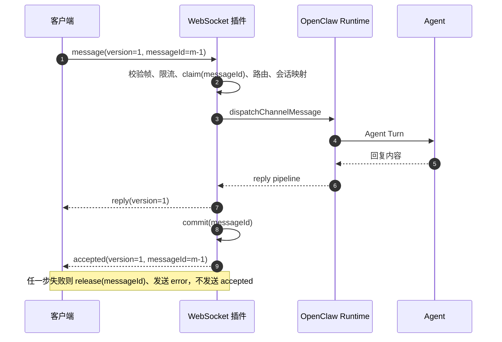
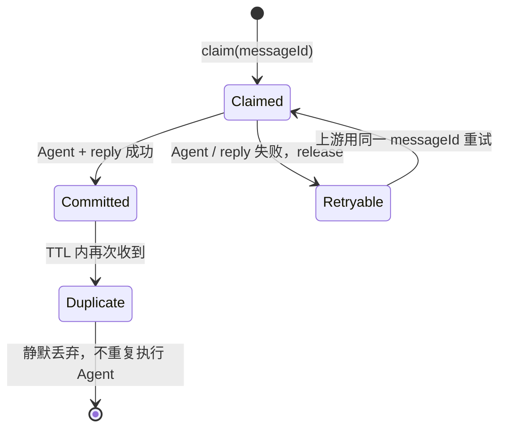
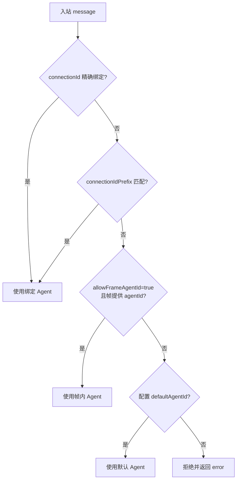

# @partme.ai/openclaw-web-socket

OpenClaw 2026.7.1+ 的生产型 WebSocket 渠道插件。它不是一个简单的 Socket 转发器，而是把外部长连接转换为 OpenClaw 的标准消息、Agent 会话与回复管线，并负责鉴权、限流、心跳、背压和断线治理。

## 它解决什么问题

- `server`：Web、App 或设备连接 OpenClaw 内置 WebSocket，同一连接接收 Agent 回复。
- `client`：OpenClaw 主动连接外部 `wss://` 网关，由外部网关承载终端连接。
- `both`：同时启用两条链路，适合生产桥接与本地运维入口并存。
- 使用 `defaultAgentId`、连接绑定或受控的帧内 `agentId` 将消息路由到 Agent。
- 把 `connectionId / peerId` 映射为 OpenClaw session，支持断线后的会话延续策略。

## 总体架构

先用字符图快速看清运行边界；下方 Mermaid 保留组件关系和可渲染版本，两者表达同一套架构：

```text
┌──────────────────────────────────────────────────────────────────────────┐
│                          OpenClaw Gateway                                │
├──────────────────────────────────────────────────────────────────────────┤
│  openclaw-web-socket                                                    │
│                                                                          │
│  ┌──────────────────────────┐       ┌───────────────────────────────┐    │
│  │ Server 模式              │       │ Client 模式                   │    │
│  │ • Path / Origin 校验     │       │ • 主动连接外部 WS/WSS        │    │
│  │ • Bearer / 子协议鉴权    │       │ • Bearer / 自定义 Header     │    │
│  │ • 连接数 / 速率限制      │       │ • 指数退避 + 随机抖动重连    │    │
│  └────────────┬─────────────┘       └──────────────┬────────────────┘    │
│               └────────────────┬───────────────────┘                     │
│                                ▼                                         │
│  ┌────────────────────────────────────────────────────────────────────┐  │
│  │ 有界串行入站队列 → Agent 路由 → Session 映射 → message-sdk Bridge │  │
│  │ messageId 两阶段幂等 │ Ping/Pong │ 背压 │ 停机排空 │ 错误脱敏      │  │
│  └──────────────────────────────┬─────────────────────────────────────┘  │
│                                 ▼                                        │
│                    OpenClaw Runtime → Agent                              │
└──────────────────────────────────────────────────────────────────────────┘
           ▲                                      ▲
           │ WS/WSS                               │ WS/WSS
   浏览器 / App / 设备                      外部 WebSocket 网关
```



### 两种运行方向



## 消息时序与成功语义

`accepted` 不是“Socket 已收到字节”，而是“Agent 处理和回复投递链路已经完成”。处理失败、连接消失或慢消费者触发背压时不会产生假成功。

```text
调用方          WS 传输层         单连接有界队列       OpenClaw       Agent
  │ message(m-1)    │                  │                  │             │
  ├────────────────▶├── 入队 ────────▶├── dispatch ─────▶├── Turn ────▶│
  │                 │                  │                  │◀── 回复 ────┤
  │◀── reply ───────┤◀─────────────────┴──────────────────┤             │
  │◀── accepted ────┤  仅在 Agent 与回复投递均完成后发送                 │
  │                 │  失败：release(m-1) + error，不发送 accepted       │
```

字符时序图突出成功确认点；下面的 Mermaid 保留 server/client 共用的完整参与者与处理顺序。



`messageId` 使用两阶段去重，不会在刚收到字节时就标成完成：



## 帧协议 v1

连接成功后服务端首先发送：

```json
{ "version": "1", "type": "connected", "connectionId": "<uuid>" }
```

客户端发送消息：

```json
{
  "version": "1",
  "type": "message",
  "text": "你好",
  "messageId": "msg-1",
  "peerId": "user-1"
}
```

服务端可能返回：

| 帧 | 含义 |
|---|---|
| `connected` | 握手完成，公布协议版本和连接 ID |
| `reply` | Agent 回复；包含正文及可选 sessionKey/messageId |
| `accepted` | 该消息的 Agent 处理与回复投递已完成 |
| `pong` | 应用层 ping 的响应；传输层还会使用标准 WS ping/pong |
| `error` | 帧、路由、处理或投递失败 |

为兼容 0.1.x，未声明 `version` 的 JSON 帧和纯文本帧仍可接收；一旦显式声明版本，就必须为 `"1"`。新客户端应始终发送版本。

## 浏览器安全鉴权

浏览器原生 `WebSocket` 不能设置 `Authorization` Header。插件默认允许使用子协议携带 token，URL 中不会出现凭据：

```js
const token = "replace-with-a-long-random-token";
const encoded = btoa(token)
  .replaceAll("+", "-")
  .replaceAll("/", "_")
  .replaceAll("=", "");

const socket = new WebSocket(
  "wss://gateway.example.com/openclaw/ws",
  ["openclaw.v1", `openclaw.auth.${encoded}`],
);
```

服务端只协商并回显 `openclaw.v1`，不会把认证子协议当作应用协议返回。原生 Node/App 客户端优先使用 `Authorization: Bearer <token>`。`auth.allowQueryToken` 默认关闭，因为 URL 可能进入代理、历史记录与访问日志。

## 最小生产配置（插件直接终止 WSS）

```json
{
  "channels": {
    "web-socket": {
      "mode": "server",
      "host": "0.0.0.0",
      "wsPort": 18789,
      "path": "/openclaw/ws",
      "defaultAgentId": "main",
      "allowedOrigins": ["https://app.example.com"],
      "auth": {
        "enabled": true,
        "tokens": ["replace-with-a-long-random-token"],
        "allowProtocolToken": true,
        "allowQueryToken": false
      },
      "tls": {
        "enabled": true,
        "keyFile": "/etc/openclaw/tls/server.key",
        "certFile": "/etc/openclaw/tls/server.crt",
        "minVersion": "TLSv1.2"
      }
    }
  }
}
```

也可以只监听 `127.0.0.1`，由 Nginx、Envoy 或云网关终止 TLS。非 loopback 的明文监听必须同时启用 token 并显式设置 `allowInsecureRemote: true`；该开关只是风险确认，不会加密传输。

## 客户端模式

```json
{
  "channels": {
    "web-socket": {
      "mode": "client",
      "defaultAgentId": "main",
      "client": {
        "url": "wss://upstream.example.com/openclaw",
        "token": "replace-with-upstream-token",
        "clientId": "openclaw-bridge-1",
        "connectTimeoutMs": 10000,
        "reconnect": {
          "enabled": true,
          "initialDelayMs": 1000,
          "maxDelayMs": 30000,
          "jitterRatio": 0.2
        }
      }
    }
  }
}
```

重连采用带随机抖动的指数退避，避免多实例同时恢复时形成惊群。远程明文 `ws://` 默认拒绝，生产应使用 `wss://`。

## 路由优先级

```text
入站 message
    │
    ├─ connectionId 精确/前缀绑定 ─────▶ 配置绑定 Agent
    │
    ├─ allowFrameAgentId=true ─────────▶ 帧内 Agent
    │
    ├─ defaultAgentId 已配置 ──────────▶ 默认 Agent
    │
    └─ 均未命中 ───────────────────────▶ error / 不进入 Agent
```



生产环境通常保持 `allowFrameAgentId: false`，防止调用方绕过服务端路由策略选择任意 Agent。

## 资源与故障治理

- `maxConnections`：Upgrade 前拒绝超容量连接。
- `maxPayloadBytes`：由 `ws` 在解析阶段限制单帧大小。
- `maxPendingMessages`：每条连接独立的有界串行队列，保证消息顺序并避免无限堆积。
- `messagesPerMinute`：server/client 两种方向都执行连接级时间窗限流。
- `maxBufferedBytes`：慢消费者超过发送缓存上限时关闭连接，避免拖垮 Gateway。
- `heartbeatIntervalMs / heartbeatTimeoutMs`：标准 WS Ping/Pong 检测半开连接。
- `messageId`：对入站消息做幂等去重。
- 停机时先拒绝新帧、关闭 Server/Client，再等待已接纳的 Agent 任务排空，最后清理连接与会话映射。
- 日志与 Gateway `lastError` 在落盘或暴露前统一遮蔽 URL 凭据、Bearer Token 和认证 Header。
- 状态与日志中的 Client URL 只保留 scheme、host、port 和 path，移除 userinfo、query 与 fragment。
- 帧内 `agentId`、`messageId`、`peerId` 最长 256 字符，并在进入路由、Session 和幂等状态前拒绝控制字符。
- `server` 与 `client` 两种模式都只在 Agent 和回复投递完成后发送 `accepted`，外部网关可使用同一提交语义。
- client 握手完成前对端关闭也会明确失败，不会让 Gateway 启动或停机 Promise 悬空。
- 公共 Outbound Adapter 遇到离线连接、上下文缺失或背压失败时抛错，使 Router Outbox 能重试/DLQ；不会用占位 `messageId` 冒充成功。

## 验证

```bash
cd extensions/web-socket
pnpm typecheck
pnpm test
pnpm build
```

2026-07-17 本地门禁：6 个测试文件、31 个测试通过，typecheck/build 通过。新增门禁覆盖处理失败后同一 `messageId` 可重试、client 模式入站限流，以及离线出站必须向上层报告失败。

英文及完整字段索引见 [README.md](./README.md)。
