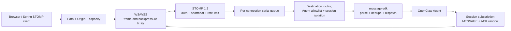
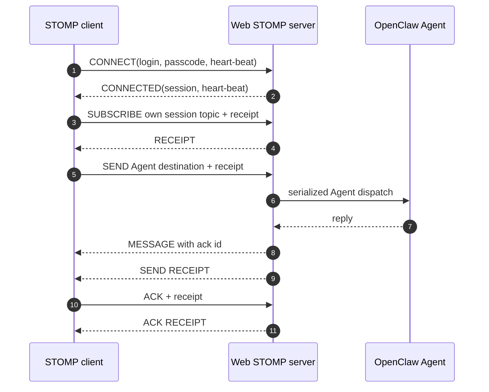
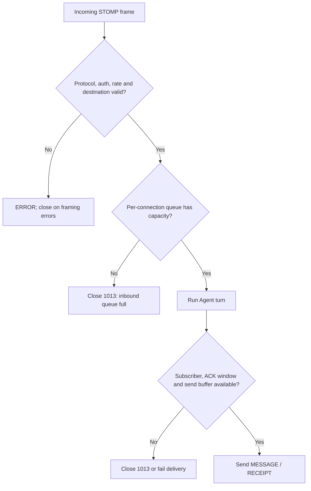

# OpenClaw Web STOMP

STOMP 1.2 over WebSocket/WSS for OpenClaw 2026.7.1. The plugin accepts authenticated browser or service connections, routes `SEND` frames to an allowlisted Agent, and exposes that connection's Agent replies as `MESSAGE` frames.

[中文说明](README.zh-CN.md)

## Architecture



This is an in-process STOMP access layer for one OpenClaw Gateway. Each connection owns its session id, serial frame queue, subscriptions, and ACK window; disconnect and shutdown remove all of them.

## Scope

- STOMP 1.2 `CONNECT`, `SEND`, `SUBSCRIBE`, `UNSUBSCRIBE`, `ACK`, `NACK`, and `DISCONNECT`
- WebSocket and TLS-backed WSS listeners
- Login/passcode authentication with environment-variable or SHA-256/SHA-512 credentials
- Negotiated STOMP heartbeats, connection and subscription limits, rate limiting, frame-size limits, and outbound backpressure
- Exact Origin allowlists for browser deployments
- Connection-scoped reply topics by default, preventing one client from subscribing to another client's session
- OpenClaw gateway lifecycle integration and a redacted `/stomp/status` endpoint

This is an OpenClaw channel adapter, not a durable message broker. Subscriptions and pending acknowledgements live in memory. `NACK` clears pending state; it does not redeliver or route to a dead-letter queue. With `content-length`, a UTF-8 body may contain NUL; without it, the first NUL terminates the frame. Use RabbitMQ or another broker when durable queues, replay, transactions, or broker clustering are required.

`client` cumulative ACK ordering uses a monotonic delivery sequence, not millisecond timestamps, so acknowledging one message cannot accidentally acknowledge a later message emitted in the same millisecond.

## Configuration

The safe default binds `127.0.0.1:15674`, requires authentication, and refuses to start until at least one credential is configured. A non-loopback listener must use WSS.

```json
{
  "channels": {
    "stomp": {
      "enabled": true,
      "host": "127.0.0.1",
      "wsPort": 15674,
      "path": "/ws",
      "defaultAgentId": "main",
      "allowedAgentIds": ["support"],
      "auth": {
        "required": true,
        "users": [
          {
            "login": "browser",
            "passwordEnv": "OPENCLAW_STOMP_PASSWORD"
          }
        ]
      },
      "heartbeat": {
        "serverMs": 10000,
        "clientMs": 10000
      },
      "limits": {
        "maxConnections": 500,
        "maxFrameSize": 262144,
        "maxBufferedBytes": 1048576,
        "maxSubscriptionsPerConnection": 100,
        "maxPendingMessages": 32,
        "maxPendingAcks": 100,
        "messagesPerMinute": 120,
        "connectTimeoutMs": 10000
      },
      "ws": {
        "allowedOrigins": ["https://console.example.com"]
      },
      "tls": {
        "enabled": false,
        "minVersion": "TLSv1.2"
      }
    }
  }
}
```

For a directly exposed listener, set a non-loopback `host` and configure TLS:

```json
{
  "host": "0.0.0.0",
  "tls": {
    "enabled": true,
    "keyFile": "/etc/openclaw/tls/stomp.key",
    "certFile": "/etc/openclaw/tls/stomp.crt",
    "caFile": "/etc/openclaw/tls/ca.crt",
    "minVersion": "TLSv1.2"
  }
}
```

Plaintext is intentionally limited to loopback. If TLS terminates at a reverse proxy, keep the plugin on loopback and proxy WSS to it. Avoid inline `password`; use `passwordEnv` or `passwordHash`. `allowedOrigins` accepts exact canonical HTTP(S) origins only; wildcard, path, query, and fragment values fail startup validation.

## Destination flow



After a successful `CONNECT`, the `CONNECTED` frame contains a generated `session` header. For session `SESSION_ID`:

| Operation | Destination | Meaning |
|---|---|---|
| Send | `/queue/agent` | Send to `defaultAgentId` |
| Send | `/queue/agent.support` | Send to allowlisted Agent `support` |
| Subscribe | `/topic/session.stomp:SESSION_ID@support` | Receive this connection's `support` replies |

With the default `allowSharedTopics: false`, subscriptions outside the current connection's `stomp:SESSION_ID@...` session are rejected. Set `allowSharedTopics: true` only for explicitly trusted clients that need shared topics.

```javascript
import { Client } from "@stomp/stompjs";

const client = new Client({
  brokerURL: "wss://gateway.example.com/ws",
  connectHeaders: {
    login: "browser",
    passcode: "<injected-at-runtime>",
  },
  heartbeatIncoming: 10_000,
  heartbeatOutgoing: 10_000,
  onConnect(frame) {
    const sessionId = frame.headers.session;
    const destination = `/topic/session.stomp:${sessionId}@support`;

    client.subscribe(destination, (message) => {
      console.log(JSON.parse(message.body));
    }, { id: "support-replies", ack: "auto" });

    client.publish({
      destination: "/queue/agent.support",
      headers: { receipt: "request-1" },
      body: JSON.stringify({ text: "Hello" }),
    });
  },
});

client.activate();
```

Do not hardcode the browser credential shown as a placeholder; inject a short-lived or deployment-scoped credential through your application's secure bootstrap path.

A `RECEIPT` for `SEND` is emitted only after OpenClaw accepts the inbound dispatch. For `client` or `client-individual` subscriptions, acknowledge the `ack` header from the `MESSAGE` frame.

## Failure and backpressure



## Operations

- Restrict `allowedAgentIds`; an unlisted Agent cannot be addressed by a client.
- Keep Origin restrictions enabled for browsers and enforce network policy at the ingress layer.
- Monitor `/stomp/status`; it exposes connections, subscriptions, queued frames, pending ACKs, rejections, auth failures, protocol errors, drops, and redacted configuration.
- Configure realistic frame, queue, ACK, and connection limits before load testing.
- Restarting the gateway drops all WebSocket sessions, subscriptions, and pending ACK state.

## Development

```bash
pnpm --filter @partme.ai/openclaw-web-stomp typecheck
pnpm --filter @partme.ai/openclaw-web-stomp test
pnpm --filter @partme.ai/openclaw-web-stomp build
```

License: MIT.
