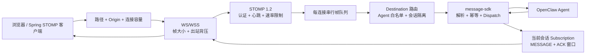
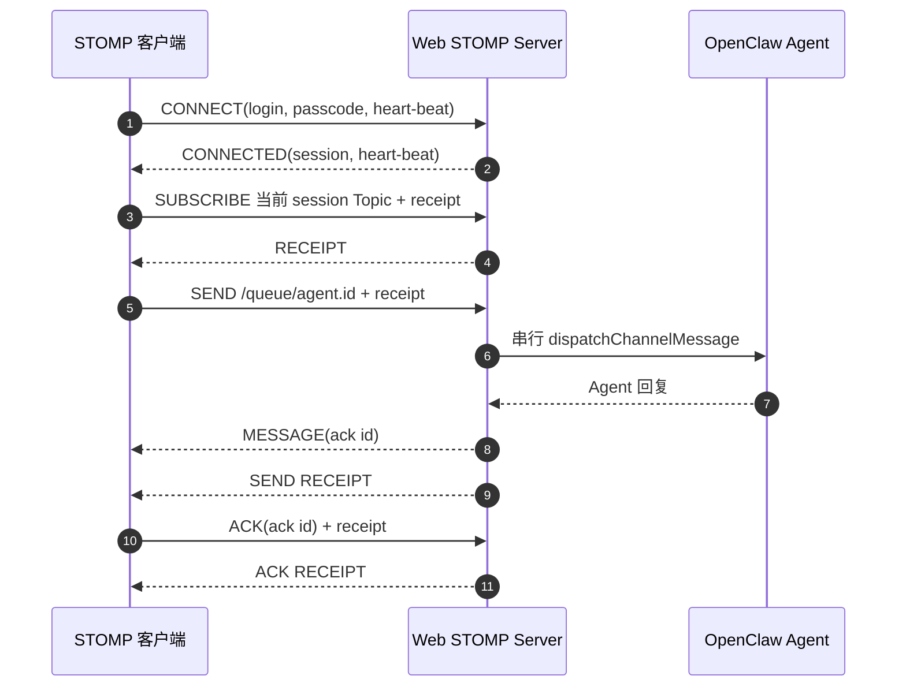
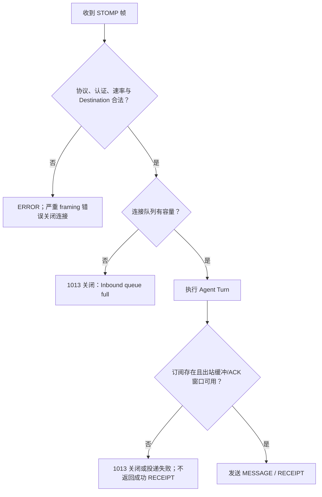
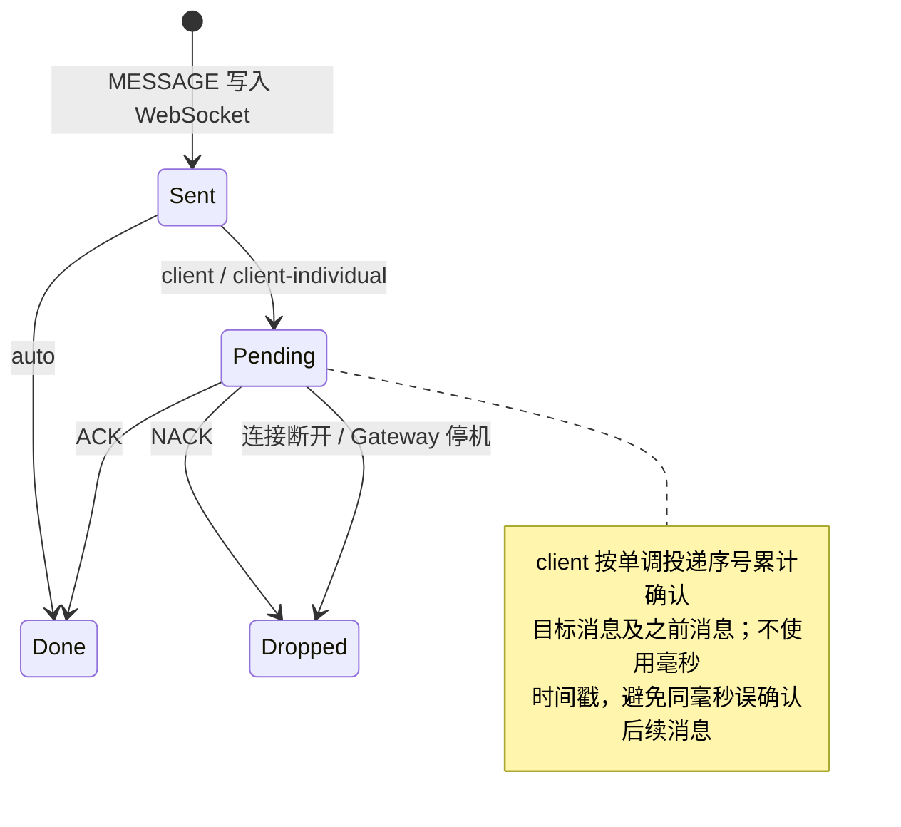
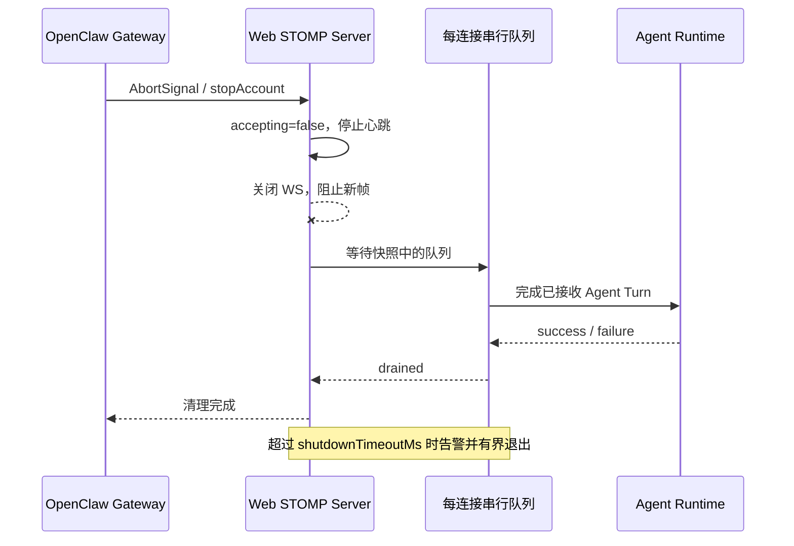

# OpenClaw Web STOMP

面向 OpenClaw 2026.7.1 的 STOMP 1.2 over WebSocket/WSS 渠道插件。它接收经过认证的浏览器或服务端连接，将 `SEND` 帧路由到白名单内的 Agent，并通过 `MESSAGE` 帧返回该连接对应的 Agent 回复。

[English](README.md)

## 架构总览

字符图先突出浏览器边界、每连接隔离和 ACK 窗口；下方 Mermaid 保留完整可渲染的组件关系：

```text
浏览器 / Spring STOMP Client
        │  WS/WSS Upgrade
        ▼
┌──────────────────────────────────────────────────────────────┐
│ openclaw-web-stomp                                           │
│                                                              │
│ 路径 + Origin + 容量 ──▶ CONNECT 认证 ──▶ 心跳 / 速率限制    │
│                                              │               │
│                                              ▼               │
│                                每连接串行帧队列               │
│                                              │               │
│                    ┌─────────────────────────┴──────────┐    │
│                    ▼                                    ▼    │
│       SEND /queue/agent.{id}              SUBSCRIBE 当前会话 │
│                    │                                    │    │
│                    ▼                                    │    │
│       message-sdk → OpenClaw Agent                      │    │
│                    │                                    │    │
│                    └──────── Agent Reply ───────────────┘    │
│                                         │                    │
│                                         ▼                    │
│                         MESSAGE + 有界 pending ACK 窗口       │
└─────────────────────────────────────────┬────────────────────┘
                                          ▼
                                    ACK / NACK / RECEIPT
```



插件在单个 OpenClaw Gateway 进程内提供轻量 STOMP 接入层。每条 WebSocket 连接拥有独立会话 ID、串行帧队列、订阅集合和 ACK 窗口；连接断开或 Gateway 关闭时全部清理，不会把旧订阅泄漏给重连后的新会话。

Agent/Runtime 内部异常不会原样返回客户端：外部只收到稳定的 `Agent dispatch failed`，脱敏后的原因进入 Gateway 日志与 Channel 状态，避免 URL 凭据、Authorization 或 Token 泄露到 STOMP `ERROR` 帧。

## 能力边界

- 支持 STOMP 1.2 的 `CONNECT`、`SEND`、`SUBSCRIBE`、`UNSUBSCRIBE`、`ACK`、`NACK`、`DISCONNECT`
- 支持 WebSocket 和启用 TLS 的 WSS
- 支持 login/passcode 认证，凭证可来自环境变量或 SHA-256/SHA-512 哈希
- 支持 STOMP 心跳协商、连接/订阅限制、消息速率限制、帧大小限制和出站背压
- 支持浏览器 Origin 精确白名单
- 默认只允许订阅当前连接自己的回复主题，防止跨连接窃听
- 接入 OpenClaw Gateway 生命周期，并提供脱敏的 `/stomp/status` 状态接口

本插件是 OpenClaw 渠道适配器，不是持久化消息代理。订阅和待确认消息仅保存在内存中；`NACK` 只清理待确认状态，不会重投，也没有死信队列。若业务需要持久化队列、回放、事务或 Broker 集群，应使用 RabbitMQ 等专业消息代理。

声明 `content-length` 时，STOMP 1.2 body 可以包含 NUL，插件会按 UTF-8 字节长度寻找真正的帧终止符；未声明时第一个 NUL 表示帧结束。非法 header、未定义转义或错位帧边界会发送 `ERROR` 并关闭连接，避免后续帧在错误边界上继续执行。

## 配置

安全默认值为监听 `127.0.0.1:15674` 并强制认证；未配置任何用户凭证时会拒绝启动。非回环地址必须启用 WSS。

```json
{
  "channels": {
    "stomp": {
      "enabled": true,
      "host": "127.0.0.1",
      "wsPort": 15674,
      "path": "/ws",
      "defaultAgentId": "main",
      "allowedAgentIds": ["support"],
      "auth": {
        "required": true,
        "users": [
          {
            "login": "browser",
            "passwordEnv": "OPENCLAW_STOMP_PASSWORD"
          }
        ]
      },
      "heartbeat": {
        "serverMs": 10000,
        "clientMs": 10000
      },
      "limits": {
        "maxConnections": 500,
        "maxFrameSize": 262144,
        "maxBufferedBytes": 1048576,
        "maxSubscriptionsPerConnection": 100,
        "maxPendingMessages": 32,
        "maxPendingAcks": 100,
        "messagesPerMinute": 120,
        "connectTimeoutMs": 10000,
        "shutdownTimeoutMs": 10000
      },
      "ws": {
        "allowedOrigins": ["https://console.example.com"]
      },
      "tls": {
        "enabled": false,
        "minVersion": "TLSv1.2"
      }
    }
  }
}
```

若监听器直接对外暴露，需要设置非回环 `host` 并配置 TLS：

```json
{
  "host": "0.0.0.0",
  "tls": {
    "enabled": true,
    "keyFile": "/etc/openclaw/tls/stomp.key",
    "certFile": "/etc/openclaw/tls/stomp.crt",
    "caFile": "/etc/openclaw/tls/ca.crt",
    "minVersion": "TLSv1.2"
  }
}
```

明文连接被有意限制在回环地址。若由反向代理终止 TLS，应让插件继续监听回环地址，再由代理转发 WSS。生产环境不要在配置中直接写 `password`，优先使用 `passwordEnv` 或 `passwordHash`。`allowedOrigins` 只接受规范化的 `http/https` Origin，不接受 `*`、路径、查询参数或片段；非浏览器客户端未发送 Origin 时不受浏览器白名单影响。

## Destination 流程



`CONNECT` 成功后，服务端返回的 `CONNECTED` 帧包含动态生成的 `session` 头。假设其值为 `SESSION_ID`：

| 操作 | Destination | 含义 |
|---|---|---|
| 发送 | `/queue/agent` | 发送给 `defaultAgentId` |
| 发送 | `/queue/agent.support` | 发送给白名单 Agent `support` |
| 订阅 | `/topic/session.stomp:SESSION_ID@support` | 接收本连接的 `support` 回复 |

默认 `allowSharedTopics: false`，任何不属于当前连接 `stomp:SESSION_ID@...` 会话的订阅都会被拒绝。只有完全可信且确实需要共享主题的客户端才应显式开启 `allowSharedTopics`。

```javascript
import { Client } from "@stomp/stompjs";

const client = new Client({
  brokerURL: "wss://gateway.example.com/ws",
  connectHeaders: {
    login: "browser",
    passcode: "<injected-at-runtime>",
  },
  heartbeatIncoming: 10_000,
  heartbeatOutgoing: 10_000,
  onConnect(frame) {
    const sessionId = frame.headers.session;
    const destination = `/topic/session.stomp:${sessionId}@support`;

    client.subscribe(destination, (message) => {
      console.log(JSON.parse(message.body));
    }, { id: "support-replies", ack: "auto" });

    client.publish({
      destination: "/queue/agent.support",
      headers: { receipt: "request-1" },
      body: JSON.stringify({ text: "你好" }),
    });
  },
});

client.activate();
```

示例中的浏览器凭证只是占位符，不能硬编码到前端产物；应通过应用的安全启动流程注入短期或部署范围凭证。

`SEND` 的 `RECEIPT` 只会在 OpenClaw 成功接收入站派发后返回。使用 `client` 或 `client-individual` 确认模式时，应确认 `MESSAGE` 帧中的 `ack` 头。

## 失败与背压语义

字符图强调“Agent 已生成回复”并不等于“客户端已收到”：插件必须等到 `ws.send` 回调成功，才把本次 reply 计为已投递。

```text
Agent 回复 wire
      │
      ▼
查找当前 session Subscription
      │
      ├── 无订阅 / ACK 窗口已满 ───────▶ 投递失败
      │
      ▼
登记 pending ACK（非 auto）
      │
      ▼
检查 bufferedAmount + 帧字节数
      │
      ├── 超限 ──▶ 1013 关闭 + 撤销 pending ACK
      │
      ▼
等待 ws.send callback
      │
      ├── error ─▶ terminate + 撤销 pending ACK
      │
      ▼
确认投递成功 ──▶ Agent reply pipeline 完成
```



`auto` 模式在 MESSAGE 写入 WebSocket 后不保留确认状态；`client-individual` 逐条确认；`client` 会累计确认同一订阅中目标消息及之前的消息。达到 `maxPendingAcks` 或 `maxBufferedBytes` 时连接会以 1013 关闭，从源头限制慢消费者占用内存。



`NACK` 的 `Dropped` 是本插件的明确边界：只释放内存 ACK 状态，不自动重投。需要重投/DLQ 时应使用真正的 Broker。

## 停机排空

```text
Gateway AbortSignal
       │
       ▼
停止接受新帧 ──▶ 停止心跳 ──▶ 关闭所有 WebSocket
                                      │
                                      ▼
                         等待已入队 Agent Turn 完成
                                      │
                     ┌────────────────┴───────────────┐
                     ▼                                ▼
              全部完成                         shutdownTimeoutMs
                     │                                │
                     └──────────▶ 清理订阅 / ACK / Listener
```



停机不会在已接收的 `SEND` 仍处于 Agent 管道时立刻清空 Runtime 引用。`shutdownTimeoutMs` 是排空上限；超时会写入脱敏告警，结果可能未知，业务侧仍应使用幂等键处理极端强杀窗口。

## 生产运维

- 收紧 `allowedAgentIds`；客户端无法访问不在名单中的 Agent。
- 浏览器场景必须配置 Origin 白名单，并在入口层增加网络访问控制。
- 监控 `/stomp/status`；接口提供连接/订阅/待处理帧/待 ACK 数量，以及连接拒绝、认证失败、协议错误和入出站丢弃计数，并返回脱敏配置。
- 压测前按真实负载设置帧、队列、待确认消息和连接上限。
- Gateway 重启会断开全部 WebSocket 会话，并清空订阅和待确认状态。

## 开发验证

```bash
pnpm --filter @partme.ai/openclaw-web-stomp typecheck
pnpm --filter @partme.ai/openclaw-web-stomp test
pnpm --filter @partme.ai/openclaw-web-stomp build
```

2026-07-17 本地门禁：13 个测试文件、77 个测试通过，typecheck 通过；覆盖同一毫秒多条投递的累计 ACK 顺序、官方 ESM 脱敏、WebSocket 写出确认和停机排空回归。最终 build、覆盖率、tarball 与 OpenClaw 2026.7.1 E2E 结果见生产优化计划。

许可证：MIT。
