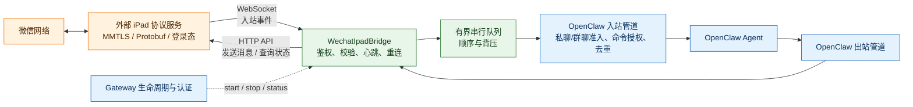
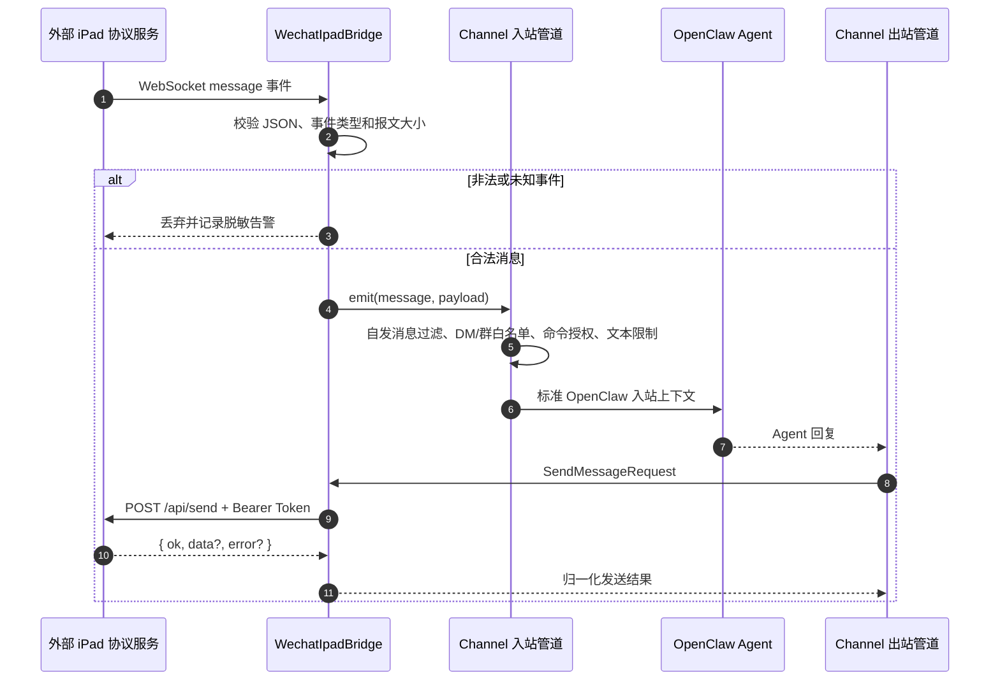
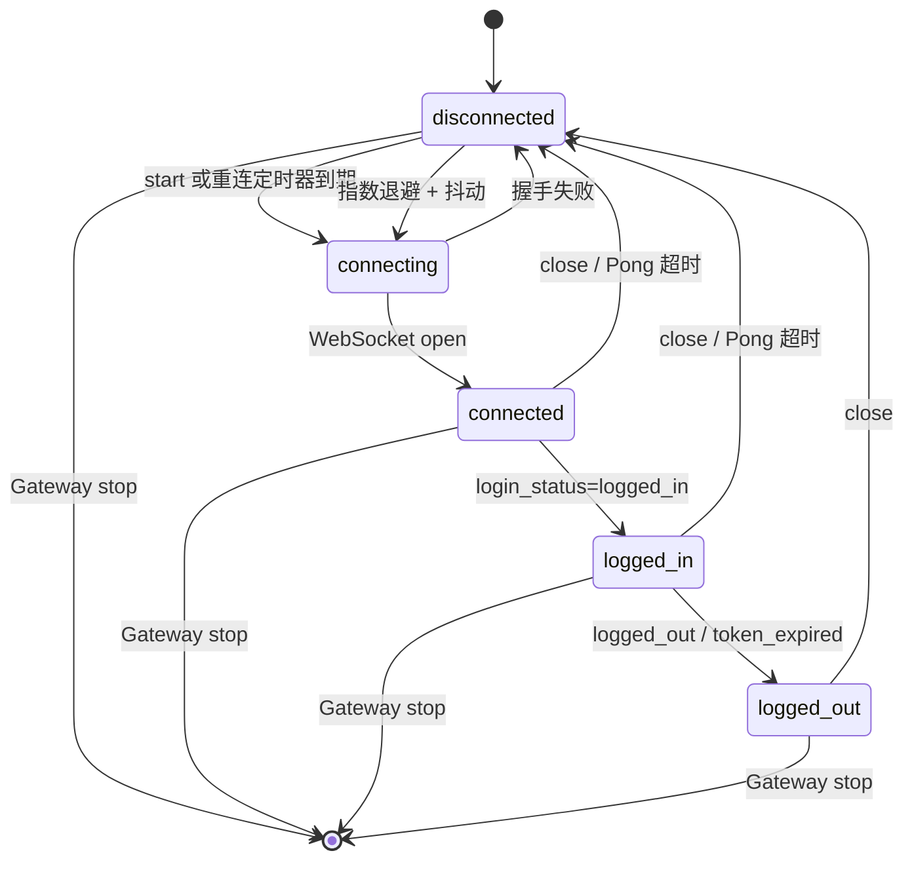
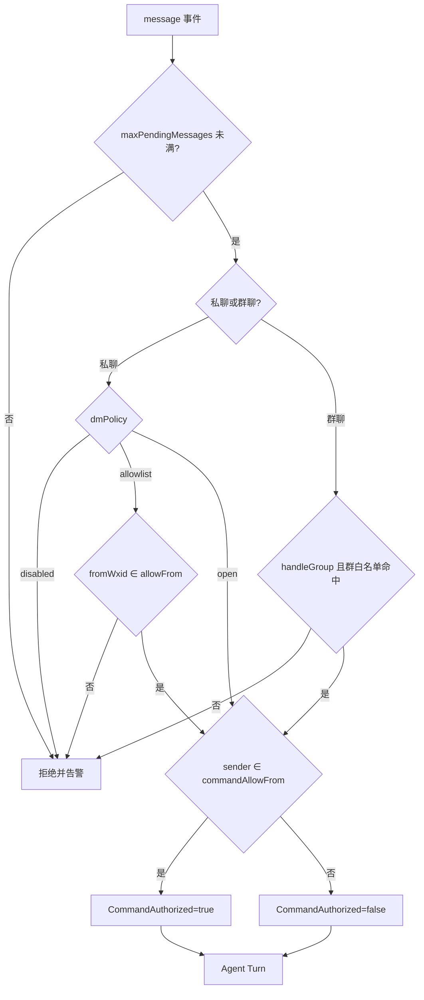
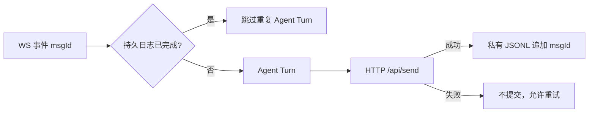

# OpenClaw WeChat iPad 外部桥接插件

`@partme.ai/wechat-ipad` 是 OpenClaw 2026.7.1 的可选 Channel 插件。它只适配一个由使用方自行部署和维护的外部服务：WebSocket 接收入站事件，HTTP API 发送消息；本插件不包含、不提供微信 iPad 底层协议实现。

> 重要：这不是微信官方接口。插件默认关闭，只有同时设置 `enabled=true` 和 `acknowledgeUnofficialProtocolRisk=true` 才会连接。请自行评估账号限制、服务条款、隐私与运维风险；正式客服优先使用企业微信官方能力。当前仓库已完成本地协议回环和 OpenClaw 契约测试，但在你的外部桥接服务及隔离微信账号上完成验收前，不能视为生产就绪。

## 架构与职责边界



边界必须明确：外部服务负责微信底层协议、登录态与设备风险；本插件负责 OpenClaw 适配、输入校验、连接治理和消息路由；OpenClaw Runtime 负责 Agent 调度、会话和回复生成。插件不应该读取或实现外部服务内部的协议细节。

### 入站消息时序



### 连接状态与自愈



首次连接失败是否中止 Gateway 启动由 `required` 决定；运行期间的意外断线不会阻塞进程，而是进入有上限的指数退避重连。主动停止会先设置停止标记并清理定时器，避免 `close` 回调再次拉起连接。

## 安全边界

- 远程服务强制使用 `wss://` 和 `https://`；仅回环地址允许 `ws://`、`http://`。
- 远程服务必须提供 Token；WebSocket 与 HTTP API 默认必须同主机，拆分部署需显式确认 `allowSplitBridgeHosts=true`。
- Token 使用 WebSocket/HTTP `Authorization: Bearer ...`，不会进入 URL、状态输出或日志。
- 配置可使用 `auth.token`，也可通过 `WECHAT_IPAD_BRIDGE_TOKEN` 注入。
- 状态端点为精确匹配并强制 OpenClaw Gateway 认证，只返回脱敏连接状态。
- 群消息默认关闭；开启后必须配置 `groupWhitelist`，除非再次显式设置 `allowAllGroups=true`。
- 私聊默认 `dmPolicy=allowlist` 且启用时必须提供 `allowFrom`；`commandAllowFrom` 单独决定 `CommandAuthorized`，普通会话权限不会自动升级为管理命令权限。
- 入站 Agent Turn 使用有界单消费者队列，保持消息顺序，并以 `maxPendingMessages` 限制桥接洪泛产生的等待任务。
- 具备连接、请求、事件、响应和文本大小限制；断线采用指数退避与抖动重连。
- Gateway 生命周期会启动和停止连接，不注册全局进程信号处理器。

## 配置

推荐将配置放在 `channels.wechat-ipad`：

```json
{
  "channels": {
    "wechat-ipad": {
      "enabled": true,
      "acknowledgeUnofficialProtocolRisk": true,
      "required": true,
      "allowSplitBridgeHosts": false,
      "serviceUrl": "wss://bridge.example.com/events",
      "apiUrl": "https://bridge.example.com",
      "auth": {
        "token": "<BRIDGE_TOKEN>"
      },
      "reconnect": {
        "enabled": true,
        "initialDelayMs": 1000,
        "maxDelayMs": 30000,
        "maxRetries": 30,
        "jitterRatio": 0.2
      },
      "network": {
        "connectTimeoutMs": 10000,
        "requestTimeoutMs": 10000,
        "maxResponseBytes": 1048576,
        "maxEventBytes": 1048576,
        "heartbeatIntervalMs": 30000,
        "pongTimeoutMs": 10000
      },
      "message": {
        "dmPolicy": "allowlist",
        "allowFrom": ["<OWNER_WXID>"],
        "commandAllowFrom": ["<OWNER_WXID>"],
        "handleGroup": true,
        "groupWhitelist": ["<GROUP_WXID>"],
        "allowAllGroups": false,
        "ignoreSelf": true,
        "maxTextChars": 20000,
        "maxPendingMessages": 256
      }
    }
  }
}
```

本机开发可使用默认的 `ws://127.0.0.1:5555` 和 `http://127.0.0.1:5556`。`required=true` 表示首次连接失败将使插件服务启动失败；设为 `false` 时会降级并在后台重连。`maxRetries=0` 表示不限制重连次数。升级旧配置时必须补充 `message.allowFrom`，或者显式选择 `dmPolicy=disabled/open`；这是为修复旧版“任意 wxid 都能进入 Agent 且被标记为命令已授权”的安全缺口而加入的非静默迁移要求。

### 入站授权决策



## 外部桥接服务契约

WebSocket 握手需接受 Bearer Token，并推送 JSON：

```json
{
  "type": "message",
  "data": {
    "msgId": "m-1",
    "fromWxid": "wxid_sender",
    "toWxid": "wxid_self_or_group",
    "msgType": 1,
    "content": "hello",
    "createTime": 1784198400,
    "isGroup": false,
    "isSelf": false
  },
  "timestamp": 1784198400000
}
```

支持的事件类型为 `message`、`login_status`、`contact_update`、`group_member_update`、`friend_request`、`qr_code`、`heartbeat`、`ready`、`error`。未知类型和无效 JSON 会被拒绝。

HTTP API：

- `POST /api/send`：请求 `{ "toWxid": "...", "msgType": "text", "content": "..." }`
- `GET /api/status`：桥接服务健康/登录状态
- 响应必须是 `{ "ok": boolean, "data"?: ..., "error"?: string }`

插件自身仅暴露 `GET /wechat-ipad/status`，需要 OpenClaw Gateway 认证；已删除会泄露 wxid 的会话列表端点。

桥接器由 OpenClaw 2026.7.1 的 `gateway.startAccount` 管理。`connected` 只表示 Socket 可达；只有收到合法 `login_status=logged_in` 后账户探针才驱动 `/readyz` 为业务就绪。热重载清理使用桥接实例所有权比较，旧生命周期不能清除新连接或新实例的去重状态。成功消息 ID 使用 0700 目录、0600 JSONL 文件持久化；只有 Agent 回复投递成功后才提交，重启重放会跳过，失败处理仍可重试。



## 验收清单

```bash
openclaw plugins install @partme.ai/wechat-ipad
openclaw plugins doctor
openclaw channels status --probe
```

上线前还必须在隔离账号与真实桥接服务上验证：登录/掉线/Token 失效、私聊收发、白名单群、重复事件、超大消息、桥接重启、Gateway 重启、长时间心跳和限流告警。外部服务的 API 必须与上述契约一致。

开发检查：

```bash
pnpm --filter @partme.ai/wechat-ipad typecheck
pnpm --filter @partme.ai/wechat-ipad test
pnpm --filter @partme.ai/wechat-ipad build
node scripts/e2e/run-e2e.mjs --plugins wechat-ipad
```

## 许可证

MIT
