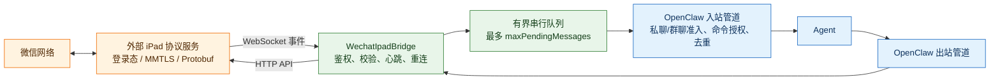
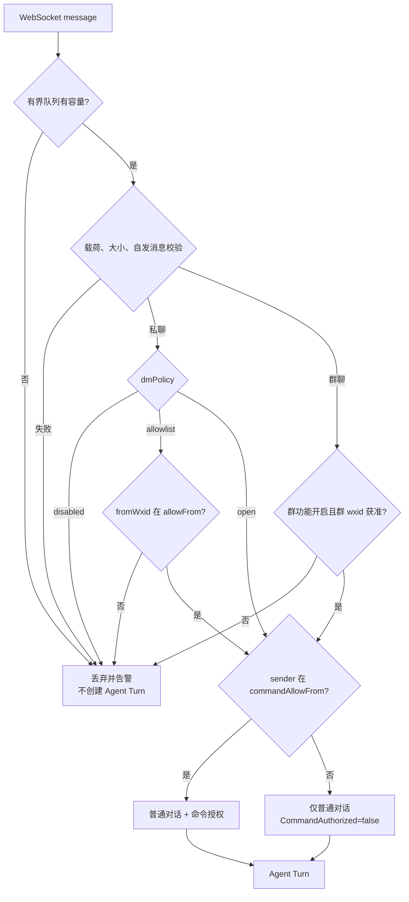
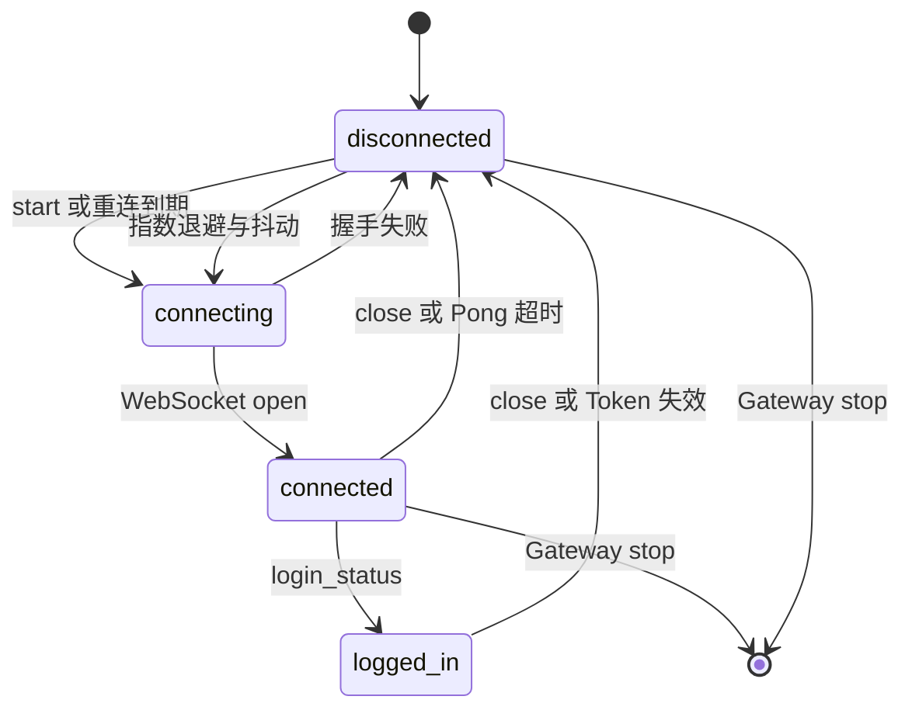
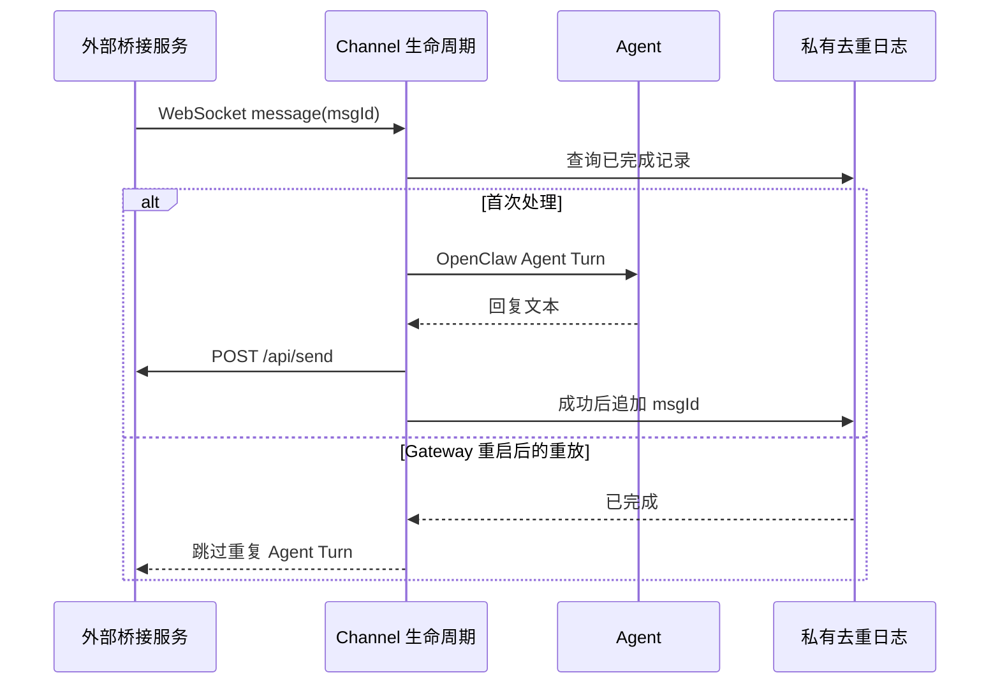

# OpenClaw WeChat iPad 中文说明

`@partme.ai/wechat-ipad` 是 OpenClaw 2026.7.1 的可选 Channel 插件，用于连接使用方自行部署的外部 iPad 协议服务。插件通过 WebSocket 接收入站事件，通过 HTTP API 发送消息；它不包含微信底层协议实现。

> 这不是微信官方接口。只有同时设置 `enabled=true` 与 `acknowledgeUnofficialProtocolRisk=true` 才会建立连接。上线前必须使用隔离账号评估账号、合规、隐私和服务稳定性风险。

更完整的配置和协议字段见 [README.md](./README.md)。

## 架构与职责边界

字符图用于在终端、源码评审和 Markdown 原文中快速理解完整链路；后面的 Mermaid 图继续用于渲染组件关系，两种图示都保留。

```text
┌──────────────────────────┐       ┌────────────────────────────────────┐
│ 外部 iPad 协议服务       │       │ OpenClaw Gateway 2026.7.1         │
│ MMTLS / Protobuf / 登录态│       │                                    │
│                          │──WS──▶│ WechatIpadBridge                   │
│                          │       │ 鉴权/校验/心跳/重连/响应与错误边界 │
│                          │◀HTTP──│        │                           │
└────────────┬─────────────┘       │        ▼                           │
             │                     │ 有界串行队列 → 准入/命令/持久去重  │
             ▼                     │        │                           │
          微信网络                 │        ▼                           │
                                   │      Agent → 出站管道              │
                                   └────────────────────────────────────┘
```



- 外部服务负责微信底层协议、设备登录态和账号风险。
- 本插件负责 OpenClaw 适配、输入校验、连接治理和消息路由。
- OpenClaw Runtime 负责权限、会话、Agent 调度和回复生成。

## 最小配置

```json
{
  "channels": {
    "wechat-ipad": {
      "enabled": true,
      "acknowledgeUnofficialProtocolRisk": true,
      "required": true,
      "serviceUrl": "wss://bridge.example.com/events",
      "apiUrl": "https://bridge.example.com",
      "auth": { "token": "<BRIDGE_TOKEN>" },
      "message": {
        "dmPolicy": "allowlist",
        "allowFrom": ["<OWNER_WXID>"],
        "commandAllowFrom": ["<OWNER_WXID>"],
        "handleGroup": true,
        "groupWhitelist": ["<GROUP_WXID>"],
        "ignoreSelf": true,
        "maxPendingMessages": 256
      }
    }
  }
}
```

生产地址强制使用 `wss://` 和 `https://`，并且必须配置 Token；本机回环测试才允许明文协议和无 Token。WebSocket 与 HTTP API 默认必须属于同一主机，确需拆分时要显式设置 `allowSplitBridgeHosts=true`，避免把同一 Bearer Token 误发给错误主机。Token 不写入 URL、日志或状态响应；网络异常与 HTTP 业务错误都会统一遮蔽 URL 用户信息、Bearer/Authorization/token 字段和真实配置值。

## 入站授权与背压



私聊默认使用 `allowlist`，启用插件时白名单不能为空；也可显式设为 `disabled` 或高风险的 `open`。`commandAllowFrom` 与普通对话白名单完全分离：能聊天不代表能执行 OpenClaw 管理命令。所有消息进入 Agent 前先经过单消费者有界队列，保持接收顺序，并把等待任务限制在 `maxPendingMessages` 内。

## 连接与失败语义



`required=true` 时首次连接失败会中止插件启动；运行中断线进入有界重连。主动停止会先清理心跳和重连定时器，避免关闭回调再次拉起连接。连接由 OpenClaw 2026.7.1 标准 `gateway.startAccount` 生命周期托管；Socket `connected` 只表示传输可达，只有外部服务上报 `login_status=logged_in` 时 `probeAccount` 才通过并驱动 `/readyz` 业务就绪。

成功完成 Agent 调度与回复投递后，消息 ID 才写入状态目录中的有界 JSONL 日志；目录权限为 0700、文件权限为 0600，压缩通过同目录临时文件原子替换。Agent 失败时不提交记录，允许桥接服务重试；Gateway 重启后重放相同 `msgId` 不会再次调用模型或发送回复。



## 验证

```bash
openclaw plugins doctor
openclaw channels status --probe
pnpm --filter @partme.ai/wechat-ipad typecheck
pnpm --filter @partme.ai/wechat-ipad test
pnpm --filter @partme.ai/wechat-ipad build
node scripts/e2e/run-e2e.mjs --plugins wechat-ipad
```

本地安装态 E2E 已覆盖正式 tarball 安装、WS 入站、Agent Turn、Bearer HTTP 回复和 Gateway 重启去重。环境验收仍至少覆盖：真实登录、掉线、Token 失效、私聊、白名单群、超大报文、桥接服务重启和长时间运行。
