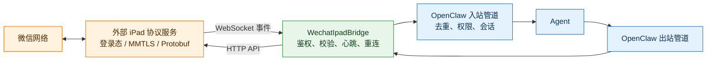
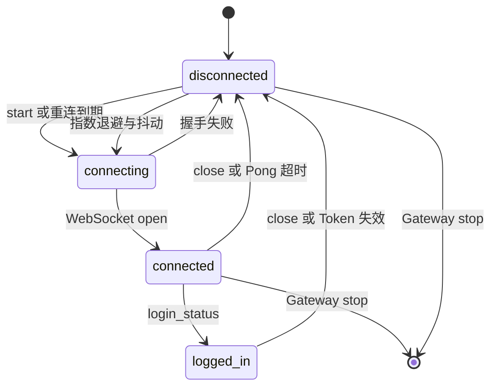

# OpenClaw WeChat iPad 中文说明

`@partme.ai/wechat-ipad` 是 OpenClaw 2026.7.1 的可选 Channel 插件，用于连接使用方自行部署的外部 iPad 协议服务。插件通过 WebSocket 接收入站事件，通过 HTTP API 发送消息；它不包含微信底层协议实现。

> 这不是微信官方接口。只有同时设置 `enabled=true` 与 `acknowledgeUnofficialProtocolRisk=true` 才会建立连接。上线前必须使用隔离账号评估账号、合规、隐私和服务稳定性风险。

更完整的配置和协议字段见 [README.md](./README.md)。

## 架构与职责边界



- 外部服务负责微信底层协议、设备登录态和账号风险。
- 本插件负责 OpenClaw 适配、输入校验、连接治理和消息路由。
- OpenClaw Runtime 负责权限、会话、Agent 调度和回复生成。

## 最小配置

```json
{
  "channels": {
    "wechat-ipad": {
      "enabled": true,
      "acknowledgeUnofficialProtocolRisk": true,
      "required": true,
      "serviceUrl": "wss://bridge.example.com/events",
      "apiUrl": "https://bridge.example.com",
      "auth": { "token": "<BRIDGE_TOKEN>" },
      "message": {
        "handleGroup": true,
        "groupWhitelist": ["<GROUP_WXID>"],
        "ignoreSelf": true
      }
    }
  }
}
```

生产地址强制使用 `wss://` 和 `https://`；本机回环测试才允许明文协议。Token 通过 Bearer Header 传输，不写入 URL、日志或状态响应。

## 连接与失败语义



`required=true` 时首次连接失败会中止插件启动；运行中断线进入有界重连。主动停止会先清理心跳和重连定时器，避免关闭回调再次拉起连接。

## 验证

```bash
openclaw plugins doctor
openclaw channels status --probe
pnpm --filter @partme.ai/wechat-ipad typecheck
pnpm --filter @partme.ai/wechat-ipad test
pnpm --filter @partme.ai/wechat-ipad build
```

环境验收至少覆盖：登录、掉线、Token 失效、私聊、白名单群、重复事件、超大报文、桥接服务重启和 Gateway 重启。
