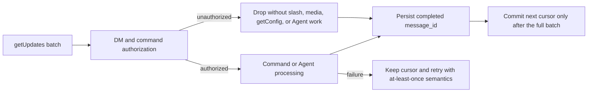

<div align="center">

# OpenClaw WeChat

**OpenClaw personal WeChat channel plugin with QR login, multi-account support, and text/media messaging**


[简体中文](./README.md) | [English](./README.en.md)

</div>

`@partme.ai/weixin` connects personal WeChat accounts to OpenClaw. It signs in through QR authorization, stores login credentials locally, supports multiple online accounts, and routes direct messages to OpenClaw Agents.

## Compatibility

| Plugin Version | OpenClaw Version | Status |
|----------------|------------------|--------|
| 2026.7.1 | `>=2026.7.1` | Current baseline |

The plugin checks the host version at startup and refuses to load when the running OpenClaw version is outside the supported range.

## Install and Update

Install:

```bash
openclaw plugins install "@partme.ai/weixin"
openclaw config set plugins.entries.openclaw-weixin.enabled true
openclaw gateway restart
```

Update:

```bash
openclaw plugins update @partme.ai/weixin
```

## Quick Start

```bash
openclaw --version
openclaw plugins install "@partme.ai/weixin"
openclaw config set plugins.entries.openclaw-weixin.enabled true
openclaw channels login --channel openclaw-weixin
openclaw gateway restart
openclaw channels status --probe
```

The terminal shows a QR code. Scan it with WeChat and confirm authorization. The plugin saves credentials locally after login.

> Both the plugin ID and channel ID are `openclaw-weixin`; `extensions/wechat` is only the historical workspace directory name.

## Multi-Account Sessions

Run the login command again to add another account:

```bash
openclaw channels login --channel openclaw-weixin
```

For multiple personal WeChat accounts, isolate direct-message context by account, channel, and peer:

```bash
openclaw config set session.dmScope per-account-channel-peer
openclaw gateway restart
```

## Backend API Overview

The plugin communicates with the backend gateway through HTTP JSON APIs. All endpoints use `POST` with JSON request and response bodies.

| Endpoint | Path | Purpose |
|----------|------|---------|
| `getUpdates` | `getupdates` | Long-poll for new messages |
| `sendMessage` | `sendmessage` | Send text, image, video, or file messages |
| `getUploadUrl` | `getuploadurl` | Get CDN upload parameters |
| `getConfig` | `getconfig` | Get account config such as typing ticket |
| `sendTyping` | `sendtyping` | Send or cancel typing status |

Text send example:

```json
{
  "msg": {
    "to_user_id": "<TARGET_USER_ID>",
    "context_token": "<CONVERSATION_CONTEXT_TOKEN>",
    "item_list": [
      {
        "type": 1,
        "text_item": {
          "text": "Hello from OpenClaw."
        }
      }
    ]
  }
}
```

Media messages use CDN parameters and AES-128-ECB encryption. See `src/api/types.ts` and `src/api/api.ts` for implementation details.

## Inbound transaction boundary



`allowFrom` is an optional static allowlist merged with the QR pairing store. Runtime caches and private context-token state are bounded, and log output redacts identifiers, sessions, content previews, paths, and URL details.

## Verification and Development

```bash
openclaw channels list
openclaw channels status --probe
openclaw plugins doctor
openclaw gateway restart

cd extensions/wechat
pnpm build
pnpm typecheck
pnpm test
```

## Troubleshooting

| Symptom | Fix |
|---------|-----|
| `requires OpenClaw >=2026.7.1` | Upgrade OpenClaw before enabling this plugin |
| Channel is OK but not connected | Ensure `plugins.entries.openclaw-weixin.enabled` is `true`, then restart Gateway |
| Multiple accounts share context | Set `session.dmScope` to `per-account-channel-peer` |
| Login session expired | Run `openclaw channels login --channel openclaw-weixin` again |

## Uninstall

```bash
openclaw plugins uninstall @partme.ai/weixin
```

## License

See `LICENSE`.
