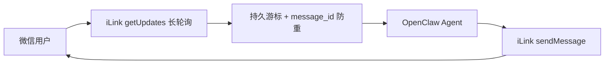
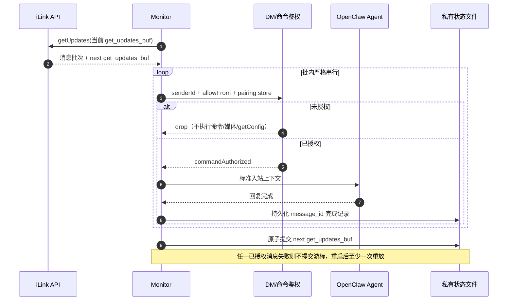

<div align="center">

# OpenClaw WeChat

**OpenClaw 微信个人号渠道插件：扫码登录、多账号在线、文本与媒体消息收发**


[简体中文](./README.md) | [English](./README.en.md)

</div>

<!-- README_STANDARD_START -->

> 统一阅读顺序：组件定位 → 架构 → 流程 → 边界 → 安装 → 配置 → 运维 → 深入阅读。
> 本区块以 npm 可稳定渲染的 text 图为主；适用时，更深入的 Mermaid 图保留在仓库 `doc/` 设计资料中。

[简体中文](./README.md) | [English](./README.en.md)

## 1. 组件定位

提供扫码登录、长轮询、媒体和多账号会话。组件类型：**微信 IM Channel**。

| 项目 | 内容 |
|---|---|
| npm 包 | `@partme.ai/weixin` |
| 当前版本 | `2026.7.1` |
| 插件 ID | `wechat` |
| Channel ID | `openclaw-weixin` |
| OpenClaw | `>=2026.7.1` |
| 源码目录 | `extensions/wechat` |

## 2. 一眼看懂

```text
[微信 iLink 长轮询消息]
          │
          ▼
┌──────────────────────────────────────────────────────────────┐
│ OpenClaw Gateway 内: wechat
│ 1. 账号解析、配对/白名单与游标恢复
│ 2. 下载受控媒体并运行 Agent
│ 3. 通过 iLink API 发送回复并提交游标
└──────────────────────────────────────────────────────────────┘
          │
          ▼
[微信消息与本地账号状态]
```

## 3. 架构与核心流程

该组件把“协议/平台差异”限制在自身边界内，对 OpenClaw 暴露稳定的插件、Channel、Hook、Tool 或 Service 契约。

```text
微信 iLink 长轮询消息
  │
  ▼
账号解析、配对/白名单与游标恢复
  │
  ▼
下载受控媒体并运行 Agent
  │
  ▼
通过 iLink API 发送回复并提交游标
  │
  ▼
微信消息与本地账号状态

异常路径: 任一步失败：记录可诊断错误并按组件策略重试、拒绝或降级
```

## 4. 能力与边界

| 能力 | 说明 |
|---|---|
| 负责 | 提供扫码登录、长轮询、媒体和多账号会话 |
| 不负责 | 不应把插件 ID `wechat` 与 Channel ID `openclaw-weixin` 混用 |
| 输入 | 微信 iLink 长轮询消息 |
| 输出 | 微信消息与本地账号状态 |
| 失败原则 | 默认失败应可观测；鉴权、边界校验和持久化失败不得伪装成功 |

## 5. 快速开始

```bash
openclaw plugins install "@partme.ai/weixin@2026.7.1"
```

安装后先按最小权限配置，再启动 Gateway；生产环境应在隔离配置目录中完成连通性、权限和失败恢复验证。

## 6. 配置入口

| 配置层 | 路径 |
|---|---|
| 插件配置 | `plugins.entries.wechat.config` |
| Channel 配置 | `channels["openclaw-weixin"]` |
| 配置 Schema | `extensions/wechat/openclaw.plugin.json` |

配置字段、环境变量与完整示例继续保留在下方原有详细说明中。

## 7. 运维、安全与故障定位

- 先确认 OpenClaw 版本、插件版本、manifest ID 与配置键一致。
- 凭据使用环境变量或 SecretRef，不写入日志、仓库和示例明文。
- 通过 Gateway 日志、插件健康状态及外部依赖状态分层定位问题。
- 升级前备份状态数据；涉及游标、队列或索引时，必须验证重启恢复与重复投递语义。

## 8. 验证与深入阅读

```bash
pnpm --filter "@partme.ai/weixin" typecheck
pnpm --filter "@partme.ai/weixin" test
pnpm --filter "@partme.ai/weixin" build
```

- [插件总体架构](../../doc/OpenClaw-Plugins-Architecture_CN.md)
- [统一插件结构规范](../../doc/OpenClaw-Plugins-Structure-Standard.md)

## 9. 原有详细说明

以下内容保留该组件原有的配置表、协议细节、示例和故障排查资料。

<!-- README_STANDARD_END -->


`@partme.ai/weixin` 用于把个人微信账号接入 OpenClaw。插件通过扫码完成登录授权，登录凭据保存在本地，可同时维护多个微信账号，并把私聊消息转成 OpenClaw Agent 可处理的会话。

> 说明：本插件面向需要个人微信通道的中国用户。生产客服、企业合规和主动外呼场景优先评估企业微信官方能力，例如 `@partme.ai/wecom` 或 `@partme.ai/wecom-kf`。

## 兼容性

| 插件版本 | OpenClaw 版本 | 状态     |
| -------- | ------------- | -------- |
| 2026.7.1 | `>=2026.7.1`  | 当前基线 |

插件启动时会检查宿主版本。如果运行的 OpenClaw 版本不满足要求，插件会拒绝加载。

## 核心能力

- **扫码登录**：通过 `openclaw channels login` 在终端展示二维码。
- **多账号在线**：每次扫码可新增一个账号条目。
- **会话隔离**：推荐使用 `session.dmScope=per-account-channel-peer`，避免多个微信号共享私聊上下文。
- **消息收发**：支持文本、图片、语音、视频、文件等消息结构，媒体经 CDN 与 AES-128-ECB 参数传输。
- **后端 API 对接**：提供 `getupdates`、`sendmessage`、`getuploadurl`、`getconfig`、`sendtyping` 等 HTTP JSON 协议说明，便于二次开发或替换后端。

## 安装与更新

安装：

```bash
openclaw plugins install "@partme.ai/weixin"
openclaw config set plugins.entries.wechat.enabled true
openclaw gateway restart
```

更新：

```bash
openclaw plugins update @partme.ai/weixin
```

## 快速开始

1. 检查 OpenClaw 版本：

```bash
openclaw --version
```

2. 安装并启用插件：

```bash
openclaw plugins install "@partme.ai/weixin"
openclaw config set plugins.entries.wechat.enabled true
```

3. 扫码登录：

```bash
openclaw channels login --channel openclaw-weixin
```

终端会显示二维码。用手机微信扫码并确认授权，成功后登录凭据会自动保存到本地。

> 插件 ID 是 `wechat`，Channel ID 是 `openclaw-weixin`；配置时不要混用两者。

4. 重启并检查：

```bash
openclaw gateway restart
openclaw channels status --probe
openclaw channels list
```

5. 给已登录微信号发送一条私聊消息，确认 Agent 正常回复。

## 多账号与会话隔离

继续执行登录命令即可添加更多微信账号：

```bash
openclaw channels login --channel openclaw-weixin
```

多个微信号同时在线时，建议把私聊上下文按「账号 + 渠道 + 对端」隔离：

```bash
openclaw config set session.dmScope per-account-channel-peer
openclaw gateway restart
```

## 后端 API 协议概览

本插件通过 HTTP JSON API 与后端网关通信。所有接口均为 `POST`，请求和响应均为 JSON。

字符图用于在终端和 Markdown 原文中快速查看事务边界；下面已有的 Mermaid 架构图与时序图继续保留。

```text
微信用户
   │
   ▼
iLink API ◀── getUpdates + 持久游标 ── Monitor
   ▲                                     │
   │                                     ▼
   │                           鉴权 → 持久 message_id 去重
   │                                     │
   │                                     ▼
   └── sendMessage / CDN ◀── 出站管道 ◀── Agent

成功：整批完成后原子提交游标；失败：保留游标并至少一次重放
```



入站处理遵循“先鉴权、后副作用、整批提交”的事务边界。`allowFrom` 会与扫码配对文件合并；空白名单不会被解释为允许所有人。



可选静态白名单配置如下；扫码登录用户仍会通过配对存储自动授权：

```json
{
  "channels": {
    "openclaw-weixin": {
      "allowFrom": ["<WEIXIN_USER_ID>"]
    }
  }
}
```

通用请求头：

| Header              | 说明                       |
| ------------------- | -------------------------- |
| `Content-Type`      | `application/json`         |
| `AuthorizationType` | 固定值 `ilink_bot_token`   |
| `Authorization`     | `Bearer <TOKEN>`           |
| `X-WECHAT-UIN`      | 随机 uint32 的 base64 编码 |

接口列表：

| 接口           | 路径           | 用途                             |
| -------------- | -------------- | -------------------------------- |
| `getUpdates`   | `getupdates`   | 长轮询获取新消息                 |
| `sendMessage`  | `sendmessage`  | 发送文本、图片、视频或文件       |
| `getUploadUrl` | `getuploadurl` | 获取 CDN 上传预签名参数          |
| `getConfig`    | `getconfig`    | 获取账号配置，例如 typing ticket |
| `sendTyping`   | `sendtyping`   | 发送或取消输入状态               |

文本发送示例：

```json
{
  "msg": {
    "to_user_id": "<TARGET_USER_ID>",
    "context_token": "<CONVERSATION_CONTEXT_TOKEN>",
    "item_list": [
      {
        "type": 1,
        "text_item": {
          "text": "你好，我是 OpenClaw Agent。"
        }
      }
    ]
  }
}
```

媒体上传流程：

1. 计算原文件明文大小、MD5 和 AES-128-ECB 加密后的密文大小。
2. 图片/视频需要额外计算缩略图参数。
3. 调用 `getuploadurl` 获取 `upload_param` 和可选的 `thumb_upload_param`。
4. 校验上传地址与配置的 CDN 同源且路径固定为 `/upload`，再用禁止重定向、30 秒超时的 POST 上传密文；4xx 不重试，网络/5xx 最多重试 3 次。
5. 用返回的 `encrypt_query_param` 和 `aes_key` 构造媒体消息并调用 `sendmessage`。

本地媒体必须位于 OpenClaw 默认受管目录或账号级 `mediaLocalRoots`；Path Guard 会拒绝目录穿越、符号链接逃逸、特殊文件和超过 100 MiB 的文件。HTTPS 远程媒体通过 OpenClaw SSRF Guard 下载，校验 DNS、目标 IP 和每次重定向；插件创建的临时文件在成功或失败后都会回收。

多账号可以分别配置 `routeTag`，该值会进入当前账号所有 iLink API 请求的 `SKRouteTag`，不会复用进程首次读取的顶层值：

```json
{
  "channels": {
    "openclaw-weixin": {
      "accounts": {
        "your-account-id": {
          "routeTag": "shard-a",
          "mediaLocalRoots": ["/data/openclaw/weixin-media"]
        }
      }
    }
  }
}
```

完整类型定义见 `src/api/types.ts`，API 调用实现见 `src/api/api.ts`。

## 常用验证命令

```bash
openclaw channels list
openclaw channels status --probe
openclaw plugins doctor
openclaw gateway restart
```

本地测试：

```bash
cd extensions/wechat
pnpm build
pnpm typecheck
pnpm test
```

安装态协议回归：

```bash
node scripts/e2e/run-e2e.mjs --plugins wechat --skip-browser
```

API/CDN 凭据目标默认锁定官方地址；自定义可信 HTTPS 代理需要分别开启 `allowCustomApiBaseUrl` 或 `allowCustomCdnBaseUrl`。QR 返回的 IDC 跳转不接受自定义信任，只允许 `weixin.qq.com` 域名。Token、上下文 Token 与长轮询游标采用私有权限和原子写入。

运行日志只保留账号的不可逆短指纹；二维码、Token 和用户标识不展示前缀，并在最终写入出口再次清除 Bearer/Authorization、用户 ID、会话键、正文预览、文件路径和 URL 细节。`context_token` 与 `getConfig` 缓存均为有界存储，避免长期运行时由变化的发送者标识造成内存或状态文件无限增长。

## 常见问题

### 报错 `requires OpenClaw >=2026.7.1`

当前 OpenClaw 版本过旧。先检查版本：

```bash
openclaw --version
```

本版本只验证 OpenClaw 2026.7.1 及以上；请先升级宿主再启用插件。

### 通道显示 OK 但没有连接

确认插件已启用并重启 Gateway：

```bash
openclaw config set plugins.entries.wechat.enabled true
openclaw gateway restart
openclaw channels status --probe
```

### 多个微信号回复串上下文

配置会话隔离：

```bash
openclaw config set session.dmScope per-account-channel-peer
openclaw gateway restart
```

### 扫码后登录失效

重新扫码登录：

```bash
openclaw channels login --channel openclaw-weixin
openclaw gateway restart
```

## 卸载

```bash
openclaw plugins uninstall @partme.ai/weixin
```

## 许可证

See `LICENSE`.
