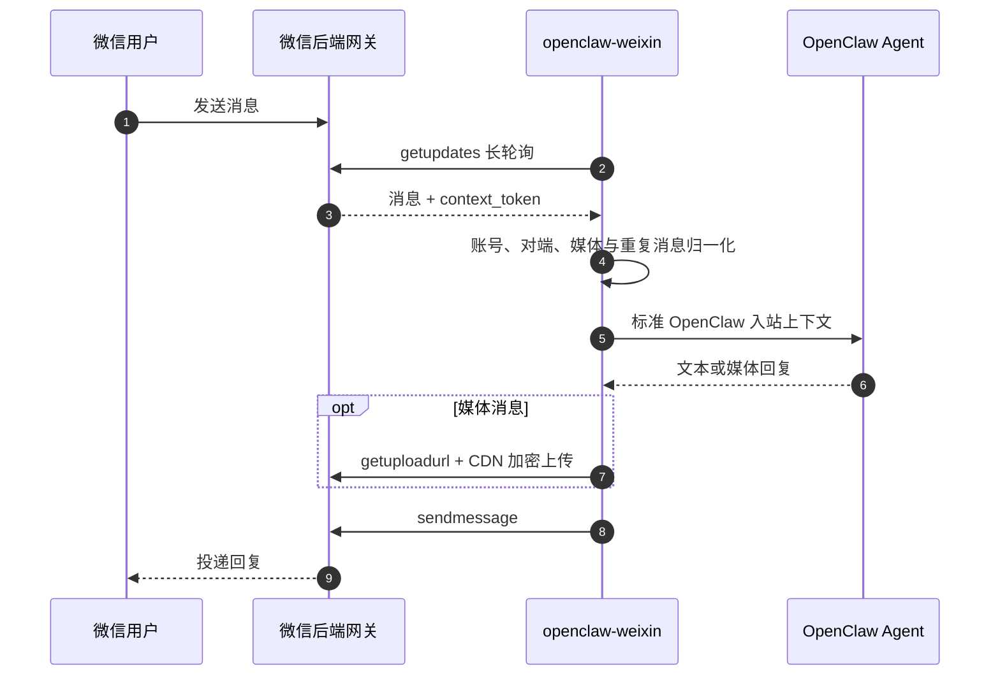
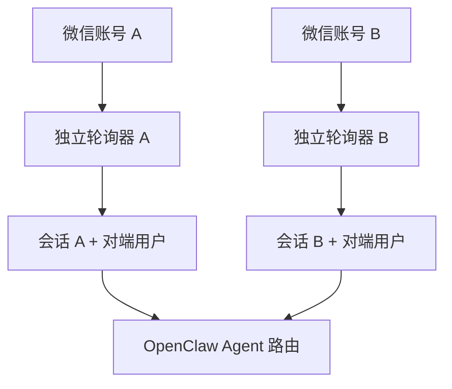

# OpenClaw 微信个人号插件中文说明

`@partme.ai/weixin` 把个人微信账号接入 OpenClaw 2026.7.1，支持扫码登录、多账号在线、私聊上下文隔离，以及文本和媒体消息收发。

插件 ID 与 Channel ID 都是 `openclaw-weixin`；仓库目录 `extensions/wechat` 只是历史命名。完整命令和后端协议字段见 [README.md](./README.md)。

> 个人微信通道存在平台与账号风险。生产客服、企业合规和主动外呼场景应优先评估企业微信官方插件 `@partme.ai/wecom` 或 `@partme.ai/wecom-kf`。

## 消息链路



## 核心能力

- 执行 `openclaw channels login` 后在终端展示二维码并持久化登录凭据。
- 同一 Gateway 可维护多个微信账号，每个账号独立轮询和发送。
- 支持文本、图片、语音、视频、文件等消息结构。
- 通过 `getupdates`、`sendmessage`、`getuploadurl`、`getconfig`、`sendtyping` 与后端网关交互。
- 推荐使用 `session.dmScope=per-account-channel-peer`，防止多个微信号共享私聊上下文。

## 安装与登录

```bash
openclaw plugins install "@partme.ai/weixin"
openclaw config set plugins.entries.openclaw-weixin.enabled true
openclaw config set session.dmScope per-account-channel-peer
openclaw channels login --channel openclaw-weixin
openclaw gateway restart
openclaw channels status --probe
```

再次执行登录命令可以添加账号。登录凭据属于敏感数据，应限制文件权限并纳入密钥备份与吊销流程。

## 多账号隔离



账号 ID、Channel ID 和对端 ID 共同参与会话键。不要为了复用上下文而去掉账号维度，否则不同微信号收到的私聊可能串线。

## 生产边界与验证

- 后端 API、扫码登录和 CDN 上传均属于真实环境依赖，本地单元测试不能替代账号验收。
- 媒体下载和上传必须限制大小、类型、超时和临时文件生命周期。
- 长轮询需要验证断网恢复、凭据失效、重复消息和 Gateway 重启后的恢复行为。

```bash
openclaw plugins doctor
openclaw channels status --probe
pnpm --filter @partme.ai/weixin typecheck
pnpm --filter @partme.ai/weixin test
pnpm --filter @partme.ai/weixin build
```
