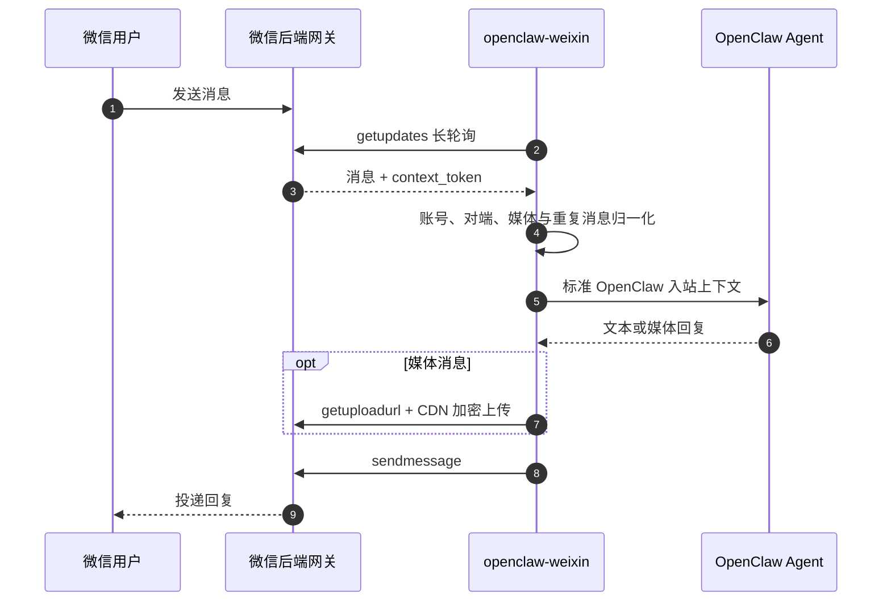
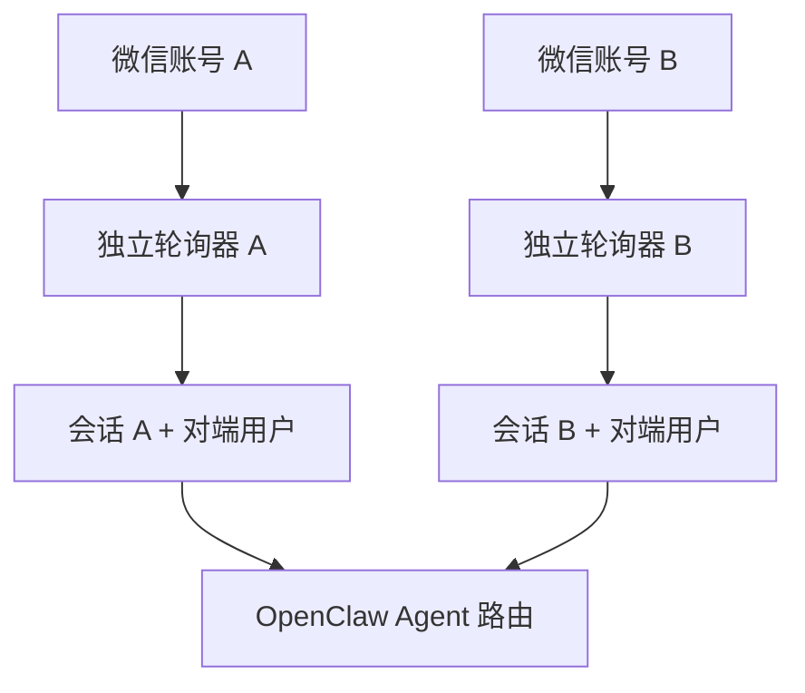
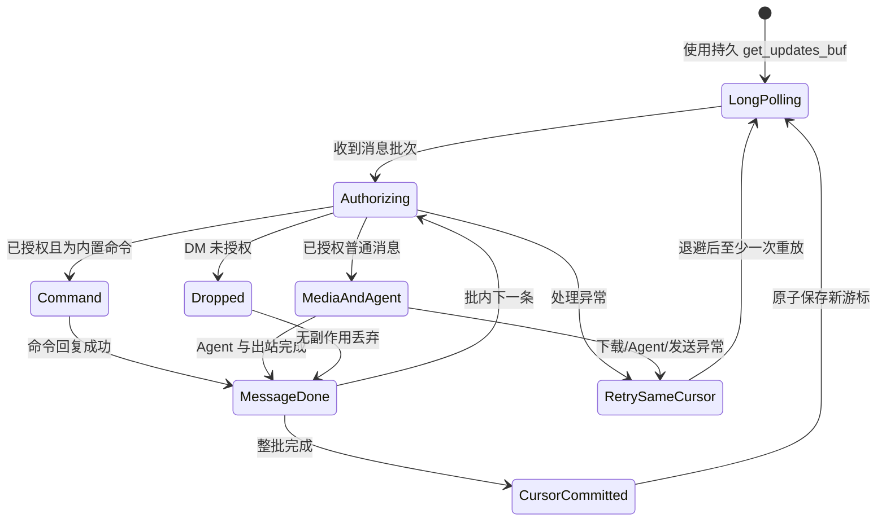
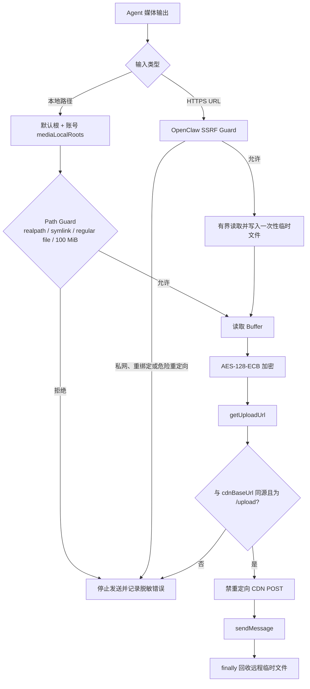
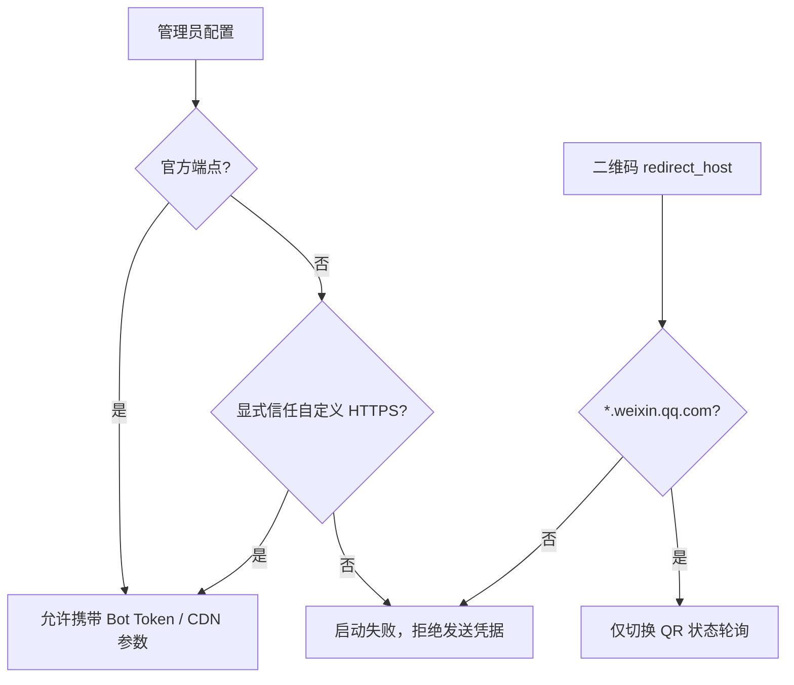

# OpenClaw 微信个人号插件中文说明

`@partme.ai/weixin` 把个人微信账号接入 OpenClaw 2026.7.1，支持扫码登录、多账号在线、私聊上下文隔离，以及文本和媒体消息收发。

插件 ID 与 Channel ID 都是 `openclaw-weixin`；仓库目录 `extensions/wechat` 只是历史命名。完整命令和后端协议字段见 [README.md](./README.md)。

> 个人微信通道存在平台与账号风险。生产客服、企业合规和主动外呼场景应优先评估企业微信官方插件 `@partme.ai/wecom` 或 `@partme.ai/wecom-kf`。

## 消息链路

字符图用于终端、源码评审和 Markdown 原文快速阅读；后面的 Mermaid 时序图继续保留，用于展示可渲染的交互细节。

```text
微信用户
   │ 消息
   ▼
iLink API ◀── getUpdates(持久游标) ── openclaw-weixin Monitor
   ▲                                      │
   │                                      ▼
   │                         DM/命令鉴权 → message_id 去重
   │                                      │
   │                                      ▼
   │                                OpenClaw Agent
   │                                      │
   └── sendMessage / CDN 媒体上传 ◀── 出站回复管道

批内任一已授权消息失败：不提交 get_updates_buf，退避后至少一次重放
```



## 核心能力

- 执行 `openclaw channels login` 后在终端展示二维码并持久化登录凭据。
- 同一 Gateway 可维护多个微信账号，每个账号独立轮询和发送。
- 支持文本、图片、语音、视频、文件等消息结构。
- 通过 `getupdates`、`sendmessage`、`getuploadurl`、`getconfig`、`sendtyping` 与后端网关交互。
- 推荐使用 `session.dmScope=per-account-channel-peer`，防止多个微信号共享私聊上下文。

## 安装与登录

```bash
openclaw plugins install "@partme.ai/weixin"
openclaw config set plugins.entries.wechat.enabled true
openclaw config set session.dmScope per-account-channel-peer
openclaw channels login --channel openclaw-weixin
openclaw gateway restart
openclaw channels status --probe
```

再次执行登录命令可以添加账号。登录凭据属于敏感数据，应限制文件权限并纳入密钥备份与吊销流程。

## 多账号隔离



账号 ID、Channel ID 和对端 ID 共同参与会话键。不要为了复用上下文而去掉账号维度，否则不同微信号收到的私聊可能串线。

## 入站事务与失败语义



- 鉴权发生在 Slash 命令、媒体下载、`getConfig`、会话写入和 Agent 调用之前。
- 服务端返回空字符串也代表合法的游标重置，必须原子落盘。
- 运行时未就绪属于批次失败，不能静默跳过并推进游标。
- `allowFrom` 可作为静态白名单，并与扫码配对文件、旧账号绑定用户合并；空数组不会放行所有发送者。

## 生产边界与验证

- 后端 API、扫码登录和 CDN 上传均属于真实环境依赖，本地单元测试不能替代账号验收。
- 远程媒体通过 OpenClaw SSRF Guard 下载：DNS 解析、连接目标和重定向都会校验，响应流最多读取 100 MiB；上传/发送结束后，无论成功失败都会删除插件创建的临时文件。
- 本地媒体默认只能读取 OpenClaw 的 media、workspace、canvas、sandbox 等受管目录；额外目录必须显式写入当前账号的 `mediaLocalRoots`，Path Guard 会拒绝目录穿越、符号链接逃逸、特殊文件和超过 100 MiB 的文件。
- `getUploadUrl` 返回的 `upload_full_url` 必须与已配置 `cdnBaseUrl` 同源且路径固定为 `/upload`；上传禁用 HTTP 重定向，单次 30 秒，4xx 不重试，网络/5xx 最多重试 3 次并指数退避。
- 长轮询需要验证断网恢复、凭据失效、重复消息和 Gateway 重启后的恢复行为。
- 默认只允许官方 iLink API 与 CDN 地址。自定义 HTTPS 代理必须分别显式设置 `allowCustomApiBaseUrl=true` / `allowCustomCdnBaseUrl=true`；二维码响应中的 `redirect_host` 不读取这些开关，只接受腾讯控制的 `weixin.qq.com` 域名，防止远端响应把 Bot Token 引向任意主机。
- Bot Token、`context_token` 和 `get_updates_buf` 使用 0700 目录、0600 文件和同目录原子替换；API 请求无论成功失败都会清除超时定时器。
- `context_token` 和 typing 配置缓存有固定容量上限；账号日志使用不可逆指纹，二维码、Token 和用户标识不再暴露任何前缀；日志出口统一清除 Bearer/Authorization、用户 ID、会话键、正文、文件路径和 URL 细节。

### 媒体安全链路

字符图保留“输入从哪里来、在哪一层被拦截、何时清理”的整体视角；紧随其后的 Mermaid 展开判断分支，二者不可相互替代。

```text
Agent / message tool / MEDIA:
              │
       ┌──────┴────────┐
       │               │
       ▼               ▼
   本地文件路径       HTTPS 远程 URL
       │               │
       ▼               ▼
mediaLocalRoots    OpenClaw SSRF Guard
 + realpath        DNS / IP / redirect / timeout
 + fs-safe              │
 + 100 MiB              ▼
       │           有界流读取 → 一次性临时文件
       └──────┬────────┘
              ▼
       AES-128-ECB 加密
              │
              ▼
 getUploadUrl → 同源 upload URL 校验
              │
              ▼
 CDN POST（30s、4xx 不重试、5xx/网络最多 3 次）
              │
              ▼
 sendMessage ── finally 删除远程临时文件
```



账号级配置示例：

```json
{
  "channels": {
    "openclaw-weixin": {
      "accounts": {
        "your-account-id": {
          "routeTag": "shard-a",
          "mediaLocalRoots": ["/data/openclaw/weixin-media"]
        }
      }
    }
  }
}
```

`routeTag` 会随当前账号进入 `getUpdates`、`getConfig`、`sendTyping`、`getUploadUrl` 和 `sendMessage` 的 `SKRouteTag` 请求头；多账号不能共用首次启动时缓存的顶层值。



### 安装态 E2E

```bash
node scripts/e2e/run-e2e.mjs --plugins wechat --skip-browser
```

该测试从正式 tarball 安装开始，用 disposable iLink 夹具完成 `getUpdates → 配对鉴权 → Agent Turn → sendMessage`，核对 Bearer Token、收件人、`context_token` 与回复正文；随后重启 Gateway 并重放同一 `message_id`，确认持久去重会推进游标但不会再次调用模型或发送回复。

```bash
openclaw plugins doctor
openclaw channels status --probe
pnpm --filter @partme.ai/weixin typecheck
pnpm --filter @partme.ai/weixin test
pnpm --filter @partme.ai/weixin build
```
