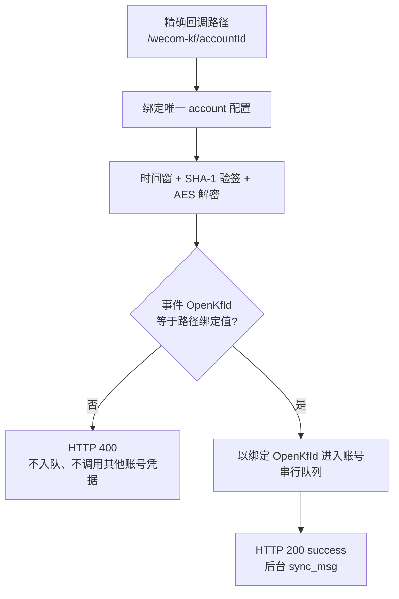
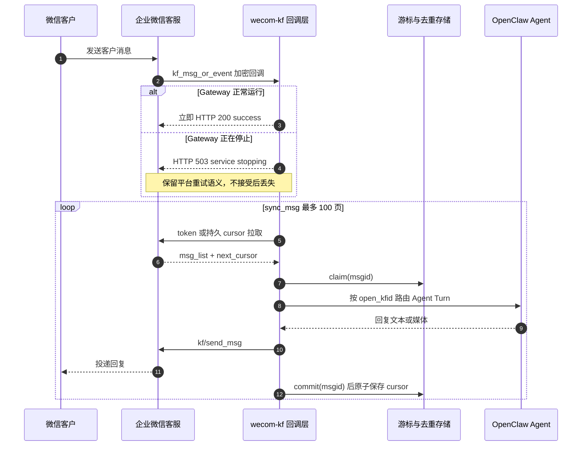
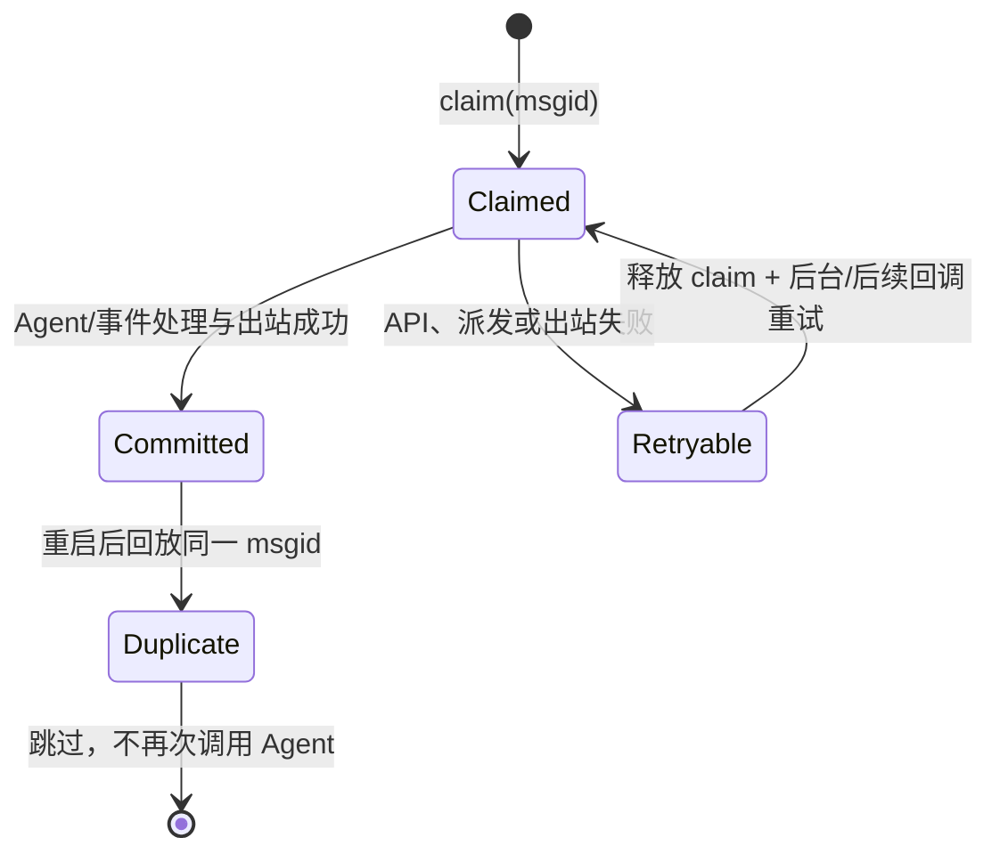

<div align="center">

# OpenClaw WeCom KF

**企业微信微信客服渠道插件：AI 接待、转人工、客服账号路由与事件消息**


[简体中文](./README.md) | [English](./README.en.md)

</div>

`@partme.ai/wecom-kf` 将企业微信「微信客服」接入 OpenClaw，让 AI Agent 作为客服坐席自动接待来自公众号、小程序、视频号等入口的客户咨询，并在需要时转接人工客服。

**范围声明**：本插件专注微信客服 KF API，包括回调、`sync_msg`、`send_msg`、事件消息、接待人员列表、客服账号列表、客服链接和会话分配。不包含客户联系 Bot/Agent、客服账号增删改、知识库管理、客户统计等运营后台功能。

## 典型场景

- 售前咨询：不同 `open_kfid` 绑定不同销售或售前 Agent。
- 技术支持：客户消息进入 Agent，必要时调用转人工 Control Tool。
- 售后服务：按客服账号、客户、48 小时窗口隔离上下文。
- 多入口客服：公众号、小程序、视频号等入口共享微信客服能力，按 `open_kfid` 区分路由。
- AI + 人工协同：AI 先处理，满足关键词、意图或失败条件后转人工。

## 核心能力

- **KF-only 架构**：与 `wecom` 的 Bot/Agent 双模式分离，只处理企业微信微信客服 API。
- **Hybrid 回调 + 拉取**：企业微信回调 `kf_msg_or_event` 后，插件调用 `kf/sync_msg` 拉取消息。
- **多账号路由**：每个 `open_kfid` 可映射到不同 OpenClaw Agent。
- **Control Tools**：`wecom_kf_list_servicers`、`wecom_kf_list_accounts`、`wecom_kf_get_account_link`、`wecom_kf_transfer_session`，控制面结果不进入 LLM transcript。
- **转人工**：支持查询接待人员、自动选席、转接人工、进入排队或结束会话。
- **事件消息**：欢迎语、排队/结束语、满意度评价等事件响应。
- **会话隔离**：推荐 `per-account-channel-peer`，匹配客户 × 客服账号的独立会话。
- **媒体与语音**：复用 message-sdk 的媒体路径白名单、出站媒体解析和可选 ASR 能力。

## 安装与更新

```bash
openclaw plugins install @partme.ai/wecom-kf
openclaw plugins update @partme.ai/wecom-kf
```

本地开发：

```bash
cd extensions/wecom-kf
pnpm install
pnpm build
```

## 快速开始

### 1. 准备企业微信后台

1. 登录企业微信管理后台。
2. 创建或选择一个自建应用，记录 `corpId`、`corpSecret`。
3. 进入 **客户联系 → 微信客服 → API 与回调**，将该自建应用加入「微信客服 - 可调用接口的应用」。
4. 为该应用授权至少一个客服账号。
5. 在自建应用「接收消息服务器配置」中填写回调：
   - URL：`https://<YOUR_GATEWAY_HOST>/wecom/kefu`
   - Token：与 `channels.wecom-kf.token` 一致
   - EncodingAESKey：与 `channels.wecom-kf.encodingAESKey` 一致

正常运行时服务器需要在 5 秒内返回 HTTP 200，否则企业微信会重试。Gateway 停机阶段会返回 503 拒绝新任务，并等待已确认的后台同步队列排空。

### 2. 写入最小配置

```bash
openclaw config set channels.wecom-kf.corpId "<YOUR_CORP_ID>"
openclaw config set channels.wecom-kf.corpSecret "<YOUR_CORP_SECRET>"
openclaw config set channels.wecom-kf.token "<YOUR_CALLBACK_TOKEN>"
openclaw config set channels.wecom-kf.encodingAESKey "<YOUR_43_CHAR_ENCODING_AES_KEY>"
openclaw config set session.dmScope per-account-channel-peer
openclaw gateway restart
openclaw channels status --probe
```

最小 JSON：

```json
{
  "channels": {
    "wecom-kf": {
      "corpId": "<YOUR_CORP_ID>",
      "corpSecret": "<YOUR_CORP_SECRET>",
      "token": "<YOUR_CALLBACK_TOKEN>",
      "encodingAESKey": "<YOUR_43_CHAR_ENCODING_AES_KEY>"
    }
  },
  "session": {
    "dmScope": "per-account-channel-peer",
    "resetByChannel": {
      "wecom-kf": {
        "mode": "idle",
        "idleMinutes": 2880
      }
    }
  }
}
```

### 3. 绑定客服账号到 Agent

```json
{
  "bindings": [
    {
      "channel": "wecom-kf",
      "peer": "kf_presale_001",
      "agent": "presale-agent"
    },
    {
      "channel": "wecom-kf",
      "peer": "kf_support_001",
      "agent": "support-agent"
    }
  ]
}
```

`peer` 通常使用客服账号 `open_kfid`。如果未配置绑定，插件会按默认路由策略投递到默认 Agent。

## 完整配置示例

```json
{
  "channels": {
    "wecom-kf": {
      "corpId": "<YOUR_CORP_ID>",
      "corpSecret": "<YOUR_CORP_SECRET>",
      "token": "<YOUR_CALLBACK_TOKEN>",
      "encodingAESKey": "<YOUR_43_CHAR_ENCODING_AES_KEY>",
      "session": {
        "dmScope": "per-account-channel-peer",
        "idleResetMinutes": 2880
      },
      "eventMessages": {
        "welcome": {
          "enabled": true,
          "msgtype": "text",
          "content": {
            "content": "您好，我是 AI 智能客服，请问有什么可以帮您？"
          }
        },
        "ending": {
          "enabled": true,
          "msgtype": "text",
          "content": {
            "content": "感谢您的咨询，祝您生活愉快！"
          }
        },
        "satisfaction": {
          "enabled": true,
          "head_content": "请对本次服务进行评价",
          "options": [
            { "id": "1", "content": "满意" },
            { "id": "2", "content": "一般" },
            { "id": "3", "content": "不满意" }
          ]
        }
      },
      "humanTransfer": {
        "enabled": true,
        "keywords": ["转人工", "人工客服", "人工"],
        "waitTimeout": 300
      },
      "accounts": {
        "kf_presale_001": {
          "openKfId": "kf_presale_001",
          "agentId": "presale-agent",
          "eventMessages": {
            "welcome": {
              "enabled": true,
              "msgtype": "text",
              "content": {
                "content": "您好，我是售前 AI 顾问，请问您想了解哪款产品？"
              }
            }
          }
        }
      }
    }
  }
}
```

多账号必须使用账号独立回调 URL。未设置 `accounts.<accountId>.webhookPath` 时，默认 URL 为
`/wecom-kf/<accountId>`；每个 URL 会在解密前选择该账号的 `token` 与 `encodingAESKey`。两个账号不能复用同一路径。

所有密钥均使用占位符，不要提交真实 `corpSecret`、`token` 或 `encodingAESKey`。

## 消息与转人工流程

字符图保留给终端、源码注释和 Markdown 原文阅读；下面已有的 Mermaid 时序图与状态图继续保留，不互相替代。

多账号部署时，URL 路径决定唯一账号。`OpenKfId` 解密后只做一致性校验，不再用于切换凭据：

```text
POST /wecom-kf/sales                    POST /wecom-kf/support
          │                                       │
          ▼                                       ▼
绑定 accounts.sales                       绑定 accounts.support
token / AES key / corpId                  token / AES key / corpId
          │                                       │
          └──────────────┬────────────────────────┘
                         ▼
              时间窗 → 验签 → AES 解密
                         │
                         ▼
             解密事件 OpenKfId == 路径绑定值？
                    ┌────┴────┐
                  否│         │是
                    ▼         ▼
             400，不快速 ACK   账号串行队列 → 200 success

禁止：用 sales 路径的签名携带 support 的 OpenKfId，再切换到 support 的 corpSecret
```



```text
微信客户
   │
   ▼
企业微信客服 ── 加密回调 ──▶ 验签/解密/快速 ACK
   ▲                              │
   │                              ▼
   │                       账号串行 sync_msg
   │                       cursor + msgid claim
   │                              │
   │                              ▼
   └── send_msg / transfer ◀── Agent / 系统事件

失败：release msgid，不推进当前页 cursor；停机：新回调返回 503，旧队列 drain
```



`msgid` 只有在 Agent/事件处理成功后才提交去重；失败会释放占用并保留当前页游标，后续回调可重试。
后台 `sync_msg` 失败以及账号映射、Runtime、`open_kfid`、`corpSecret` 尚未就绪，都会在同一账号串行队列中执行有界指数退避；全部尝试失败才记录错误，等待平台下一次回调继续。
同一客服账号的回调按顺序拉取，状态目录为 `0700`，游标与去重文件采用原子替换并以 `0600` 权限保存。首次启动不会自动跳过历史消息；
企业微信 `sync_msg` 仍只覆盖平台允许拉取的时间窗口。

`send_msg` 在请求前按 `open_kfid + external_userid` 原子预占回复额度，API 失败或网络异常时回滚；这可防止多个并发 Agent 回复同时通过检查而突破 5 条限制。Token 缓存使用 `corpId + corpSecret + apiBaseUrl` 的 SHA-256 指纹隔离，凭据轮换和私有化网关切换不会继续命中旧缓存。



转人工流程：

1. Agent 判断需要转人工。
2. 调用 `wecom_kf_list_servicers` 查询在线接待人员。
3. 调用 `wecom_kf_transfer_session` 变更会话状态到人工接待或排队。
4. 插件可根据 `msg_code` 发送排队、结束或满意度事件消息。

## API 覆盖与限制

| 能力 | 企业微信 API | 说明 |
|------|--------------|------|
| 回调接收 | `/wecom/kefu` | 接收消息/事件通知 |
| 同步消息 | `kf/sync_msg` | 拉取 3 天内消息 |
| 发送消息 | `kf/send_msg` | 客户最后消息后 48 小时内，最多 5 条 |
| 事件消息 | `kf/send_msg_on_event` | 欢迎、排队、结束、满意度等 |
| 会话状态 | `kf/service_state/get` | 查询当前会话状态 |
| 转接会话 | `kf/service_state/trans` | 转人工、排队、结束会话 |
| 账号列表 | `kf/account/list` | 发现客服账号 |
| 接待人员 | `kf/servicer/list` | 查询人工客服可用性 |
| 客服链接 | `kf/add_contact_way` | 获取客服账号链接 |

关键限制：

| 限制 | 值 |
|------|----|
| 客户回复窗口 | 48 小时 |
| 单条客户消息回复条数 | 最多 5 条 |
| `sync_msg` 可拉取时间 | 3 天内 |
| access token 有效期 | 以接口 `expires_in` 为准（默认按 7200 秒处理并提前刷新） |
| welcome_code 有效期 | 约 20 秒 |

## 常用命令

```bash
# 状态
openclaw channels list
openclaw channels status --probe
openclaw plugins doctor

# 重启
openclaw gateway restart

# 会话隔离
openclaw config set session.dmScope per-account-channel-peer

# 本地测试
cd extensions/wecom-kf
pnpm test
pnpm typecheck

# OpenClaw 2026.7.1 安装态协议闭环（本机 AES/OpenAPI 夹具）
OPENCLAW_E2E_HOST_GATEWAY=1 node scripts/e2e/run-e2e.mjs --plugins wecom-kf --skip-browser
```

会话中可用命令：

| 命令 | 说明 |
|------|------|
| `/kf-status` | 返回客服账号连接状态与在线接待人员数量 |

## Agent 模板与技能

插件提供可选 Agent 工作区模板与技能资产：

- `agents/`：客服智能体模板，可按售前、支持、售后场景复制到 Agent workspace。
- `skills/transfer-to-human/`：转人工技能示例，需要时复制或软链到 Agent workspace。

这些资产不会由插件 manifest 自动加载，避免把运营模板与核心运行时耦合。

## 测试与开发

```bash
cd extensions/wecom-kf
pnpm build
pnpm dev
pnpm typecheck
pnpm test
pnpm test:coverage
```

当前自动化证据：34 个测试文件、160 个测试通过；安装态 E2E 已覆盖 tarball 安装、企业微信格式 AES 回调、
`gettoken`、`sync_msg`、真实 Agent Turn、`send_msg`，以及 Gateway 重启后的 cursor 恢复和 `msgid` 持久防重。
本地 OpenAPI 夹具允许 `http://localhost` / `127.0.0.1`；非 loopback 地址仍强制 HTTPS。

真实联调建议：

1. 企业微信后台保存回调 URL，确认 GET 验签通过。
2. 从微信客服入口发送一条文本消息。
3. Gateway 日志应出现回调、`sync_msg`、路由和 `send_msg`。
4. 测试转人工关键词，例如「转人工」。
5. 测试欢迎语、结束语、满意度评价配置。

## 常见问题

| 现象 | 常见原因 | 处理方式 |
|------|----------|----------|
| 回调没有触发 | 未把应用加入「微信客服 - 可调用接口的应用」或未授权客服账号 | 按快速开始第 1 步重新检查 |
| 保存回调失败 | URL 不可公网访问、Token/AESKey 不一致、GET 验签失败 | 检查 Gateway 域名、TLS、`token`、`encodingAESKey` |
| 能收到回调但无消息 | `sync_msg` token/open_kfid/cursor 异常 | 查看 Gateway 日志和 cursor 状态 |
| 客户没有收到回复 | 超过 48 小时窗口、超过 5 条限制、`send_msg` 报错 | 检查 API 错误码并重新触发会话 |
| 转人工失败 `95014/95015` | 接待人员未激活或不在接待中 | 先用 `wecom_kf_list_servicers` 查询可用接待人员 |
| 接待人员接口 `60030` | 应用可见范围不包含接待人员 | 在企业微信后台调整应用可见范围 |
| Agent 上下文串线 | 未按账号/客户隔离会话 | 设置 `session.dmScope=per-account-channel-peer` |

## 详细文档

- [主架构](../../doc/wecom-kf/OpenClaw-WeCom-KF-Master-Architecture.md)：KF-only 边界、运行时数据流、模块拆分。
- [Tools 架构](../../doc/wecom-kf/OpenClaw-WeCom-KF-Tools-Architecture.md)：Control Tools、转人工、会话隔离和审计策略。
- [Roadmap](../../doc/wecom-kf/OpenClaw-WeCom-KF-Roadmap.md)：阶段状态与验收命令。
- [Agent 模板说明](./agents/README.md)：客服 Agent workspace 资产。

## 与 wecom 插件的关系

| 维度 | `wecom` | `wecom-kf` |
|------|---------|------------|
| 主要场景 | 企业微信智能机器人、自建应用 Bot/Agent、主动推送 | 微信客服进线、AI 接待、转人工 |
| 回调路径 | `/plugins/wecom/bot/<accountId>`、`/plugins/wecom/agent/<accountId>` | `/wecom/kefu` |
| 客户来源 | 企业微信内部联系人、客户联系、群聊等 | 微信客服入口的外部客户 |
| 是否可共存 | 可 | 可，但建议使用不同自建应用和不同回调 URL |

## 许可证

MIT
