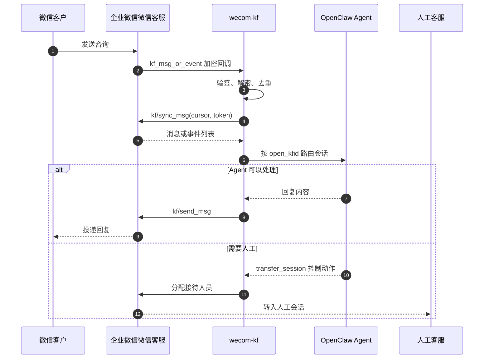
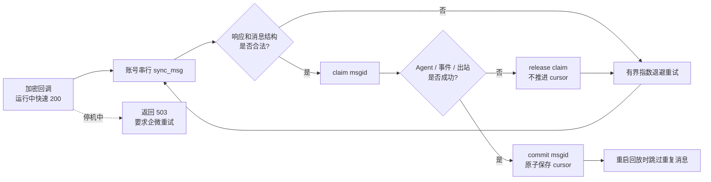
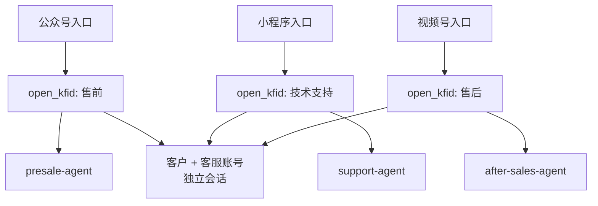

# OpenClaw 企业微信微信客服插件中文说明

`@partme.ai/wecom-kf` 将企业微信「微信客服」接入 OpenClaw 2026.7.1，让 Agent 处理来自公众号、小程序、视频号等入口的客户咨询，并在需要时转接人工客服。

本插件只实现微信客服 KF API，不包含普通 WeCom Bot/Agent、知识库管理或客服运营后台。完整配置和 Control Tools 说明见 [README.md](./README.md)。

## 核心消息链路



企业微信回调只是“有新消息”的通知，真实消息通过 `sync_msg` 拉取。游标必须在成功处理后持久推进，否则可能丢消息或重复消费。



状态目录会主动收紧为 `0700`，游标和 JSON 状态文件为 `0600`。即使目录由旧版本创建，下一次写入也会修复过宽权限。

## 路由与会话模型



推荐使用 `session.dmScope=per-account-channel-peer`，并按 `open_kfid` 绑定不同 Agent。48 小时服务窗口、排队、结束会话和人工接待状态由企业微信微信客服语义约束。

## 最小配置

```bash
openclaw plugins install @partme.ai/wecom-kf
openclaw config set channels.wecom-kf.corpId "<YOUR_CORP_ID>"
openclaw config set channels.wecom-kf.corpSecret "<YOUR_CORP_SECRET>"
openclaw config set channels.wecom-kf.token "<YOUR_CALLBACK_TOKEN>"
openclaw config set channels.wecom-kf.encodingAESKey "<YOUR_43_CHAR_ENCODING_AES_KEY>"
openclaw config set session.dmScope per-account-channel-peer
openclaw gateway restart
openclaw channels status --probe
```

回调地址为 `https://<GATEWAY_HOST>/wecom/kefu`。正常运行时快速返回 200，耗时处理在确认后按账号异步执行；Gateway 停机时先拒绝新回调并返回 503，再等待已经确认的同步队列排空，避免“企微认为已送达、进程却尚未处理”的消息丢失。

## 生产边界

- 回调必须验签、解密、限制请求体，并对消息 ID 和游标做幂等处理。
- `send_msg` 在调用 API 前按会话原子预占 48 小时窗口内的 5 条回复额度；失败时回滚，避免并发请求突破上限。
- access_token 缓存按 `corpId + corpSecret + apiBaseUrl` 的不可逆指纹隔离，凭据轮换或切换私有化网关后不会继续复用旧 token。
- 本地媒体读取必须经过白名单、真实路径、符号链接逃逸与大小限制检查。
- `corpSecret`、Token、EncodingAESKey 属于敏感配置，不应写入日志或状态接口。
- 转人工是控制面动作，工具结果不应混入用户可见的 LLM transcript。
- 必须验证游标恢复、企业微信重试、Gateway 重启和人工接管后的消息归属。

## 验证

```bash
openclaw plugins doctor
openclaw channels status --probe
pnpm --filter @partme.ai/wecom-kf typecheck
pnpm --filter @partme.ai/wecom-kf test
pnpm --filter @partme.ai/wecom-kf build

# 安装态协议闭环
OPENCLAW_E2E_HOST_GATEWAY=1 node scripts/e2e/run-e2e.mjs --plugins wecom-kf --skip-browser
```

环境验收至少覆盖：文本与媒体、重复回调、游标续拉、欢迎语、排队、结束会话、满意度事件、自动选席、转人工和 48 小时窗口。
