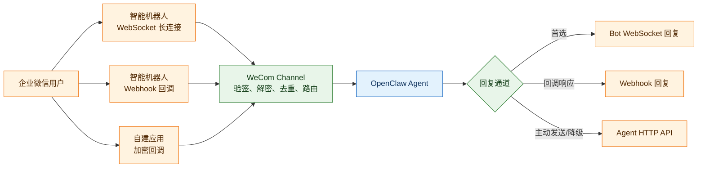

# OpenClaw 企业微信插件中文说明

`@partme.ai/wecom` 面向 OpenClaw 2026.7.1，统一支持企业微信智能机器人 WebSocket、智能机器人 Webhook 和自建应用 Agent 三种接入方式。Nacos 与 WeCom 已由使用方在环境中验证，但变更配置或升级后仍应重新执行回归。

完整配置、媒体、流式回复和运维命令见 [README.md](./README.md)。本页用于快速理解三种模式的职责和选型边界。

## 三种接入模式



| 模式 | 适合场景 | 入站 | 出站 |
|---|---|---|---|
| Bot WebSocket | 低延迟机器人、无需公网回调 | 长连接事件 | WebSocket 回复优先 |
| Bot Webhook | 企业微信回调机器人 | 验签/解密后的 HTTP 回调 | 回调协议回复 |
| Agent | 自建应用、主动通知、媒体能力 | 加密 HTTP 回调 | 企业微信 HTTP API |

微信客服 KF 不属于本插件范围，应使用独立的 `@partme.ai/wecom-kf`。

## 最小 WebSocket 配置

```bash
openclaw plugins install @partme.ai/wecom
openclaw config set channels.wecom.enabled true
openclaw config set channels.wecom.connectionMode websocket
openclaw config set channels.wecom.botId "<YOUR_BOT_ID>"
openclaw config set channels.wecom.secret "<YOUR_BOT_SECRET>"
openclaw gateway restart
openclaw channels status --probe
```

## 安全与路由边界

- Webhook 与 Agent 回调必须先验签再解密，并限制请求体、时间窗和重复事件。
- 私聊默认建议使用 pairing；群聊建议使用 allowlist，不应默认接受所有来源。
- 多账号配置应保证凭据、媒体目录、去重状态和回复路由相互隔离。
- Bot 回复和 Agent HTTP 降级必须保留明确优先级，避免同一消息被双重回复。
- 媒体本地路径必须落在 `mediaLocalRoots` 白名单内，并受大小和超时限制。

## 验证

```bash
openclaw channels list
openclaw channels status --probe
openclaw plugins doctor
openclaw message send --channel wecom --account default --target <USERID> --message "连通性测试"
pnpm --filter @partme.ai/wecom typecheck
pnpm --filter @partme.ai/wecom test
pnpm --filter @partme.ai/wecom build
```

生产回归应分别覆盖启用的接入模式：签名错误、密文错误、重复回调、断线重连、主动发送、媒体、群白名单、流式回复中断和 Gateway 重启。
