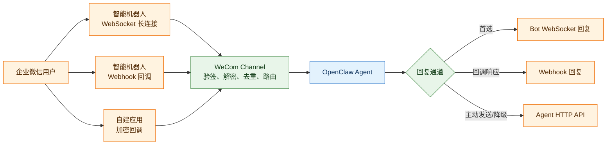
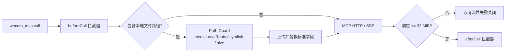
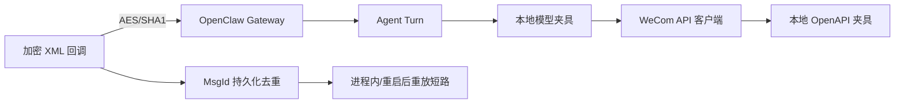

# OpenClaw 企业微信插件中文说明

<!-- README_STANDARD_START -->

> 统一阅读顺序：组件定位 → 架构 → 流程 → 边界 → 安装 → 配置 → 运维 → 深入阅读。
> 本区块以 npm 可稳定渲染的 text 图为主；适用时，更深入的 Mermaid 图保留在仓库 `doc/` 设计资料中。

[简体中文](./README.md) | [English](./README.en.md)

## 1. 组件定位

提供多形态企业微信接入、媒体和业务 Skills。组件类型：**企业微信 IM Channel**。

| 项目 | 内容 |
|---|---|
| npm 包 | `@partme.ai/wecom` |
| 当前版本 | `2026.7.1` |
| 插件 ID | `wecom` |
| Channel ID | `wecom` |
| OpenClaw | `>=2026.7.1` |
| 源码目录 | `extensions/wecom` |

## 2. 一眼看懂

```text
[企业微信 Bot、Agent 与 Webhook 事件]
          │
          ▼
┌──────────────────────────────────────────────────────────────┐
│ OpenClaw Gateway 内: wecom
│ 1. 验签解密、账号/租户策略与去重
│ 2. 组装 Transcript 并运行 Agent
│ 3. 通过企业微信 API 发送文本、媒体或流式结果
└──────────────────────────────────────────────────────────────┘
          │
          ▼
[企业微信消息、MCP/Skill 与运营状态]
```

## 3. 架构与核心流程

该组件把“协议/平台差异”限制在自身边界内，对 OpenClaw 暴露稳定的插件、Channel、Hook、Tool 或 Service 契约。

```text
企业微信 Bot、Agent 与 Webhook 事件
  │
  ▼
验签解密、账号/租户策略与去重
  │
  ▼
组装 Transcript 并运行 Agent
  │
  ▼
通过企业微信 API 发送文本、媒体或流式结果
  │
  ▼
企业微信消息、MCP/Skill 与运营状态

异常路径: 任一步失败：记录可诊断错误并按组件策略重试、拒绝或降级
```

## 4. 能力与边界

| 能力 | 说明 |
|---|---|
| 负责 | 提供多形态企业微信接入、媒体和业务 Skills |
| 不负责 | 不替代企业微信管理员授权、数据治理或知识插件 |
| 输入 | 企业微信 Bot、Agent 与 Webhook 事件 |
| 输出 | 企业微信消息、MCP/Skill 与运营状态 |
| 失败原则 | 默认失败应可观测；鉴权、边界校验和持久化失败不得伪装成功 |

## 5. 快速开始

```bash
openclaw plugins install "@partme.ai/wecom@2026.7.1"
```

安装后先按最小权限配置，再启动 Gateway；生产环境应在隔离配置目录中完成连通性、权限和失败恢复验证。

## 6. 配置入口

| 配置层 | 路径 |
|---|---|
| 插件配置 | `plugins.entries.wecom.config` |
| Channel 配置 | `channels["wecom"]` |
| 配置 Schema | `extensions/wecom/openclaw.plugin.json` |

配置字段、环境变量与完整示例继续保留在下方原有详细说明中。

## 7. 运维、安全与故障定位

- 先确认 OpenClaw 版本、插件版本、manifest ID 与配置键一致。
- 凭据使用环境变量或 SecretRef，不写入日志、仓库和示例明文。
- 通过 Gateway 日志、插件健康状态及外部依赖状态分层定位问题。
- 升级前备份状态数据；涉及游标、队列或索引时，必须验证重启恢复与重复投递语义。

## 8. 验证与深入阅读

```bash
pnpm --filter "@partme.ai/wecom" typecheck
pnpm --filter "@partme.ai/wecom" test
pnpm --filter "@partme.ai/wecom" build
```

- [wecom 深度设计文档](../../doc/wecom/)
- [统一插件结构规范](../../doc/OpenClaw-Plugins-Structure-Standard.md)

## 9. 原有详细说明

以下内容保留该组件原有的配置表、协议细节、示例和故障排查资料。

<!-- README_STANDARD_END -->


`@partme.ai/wecom` 面向 OpenClaw 2026.7.1，统一支持企业微信智能机器人 WebSocket、智能机器人 Webhook 和自建应用 Agent 三种接入方式。Nacos 与 WeCom 已由使用方在环境中验证，但变更配置或升级后仍应重新执行回归。

完整配置、媒体、流式回复和运维命令见 [README.md](./README.md)。本页用于快速理解三种模式的职责和选型边界。

## 三种接入模式

```text
企业微信用户
   │
   ├── Bot WebSocket ──┐
   ├── Bot Webhook ────┼──▶ 验签 / 解密 / 去重 / 访问策略
   └── Agent Webhook ──┘                │
                                        ▼
                              OpenClaw Agent Runtime
                                        │
                         ┌──────────────┼──────────────┐
                         ▼              ▼              ▼
                    Bot WS 回复    Webhook 回复    Agent HTTP API
```



| 模式 | 适合场景 | 入站 | 出站 |
|---|---|---|---|
| Bot WebSocket | 低延迟机器人、无需公网回调 | 长连接事件 | WebSocket 回复优先 |
| Bot Webhook | 企业微信回调机器人 | 验签/解密后的 HTTP 回调 | 回调协议回复 |
| Agent | 自建应用、主动通知、媒体能力 | 加密 HTTP 回调 | 企业微信 HTTP API |

微信客服 KF 不属于本插件范围，应使用独立的 `@partme.ai/wecom-kf`。

## 最小 WebSocket 配置

```bash
openclaw plugins install @partme.ai/wecom
openclaw config set channels.wecom.enabled true
openclaw config set channels.wecom.connectionMode websocket
openclaw config set channels.wecom.botId "<YOUR_BOT_ID>"
openclaw config set channels.wecom.secret "<YOUR_BOT_SECRET>"
openclaw gateway restart
openclaw channels status --probe
```

## 安全与路由边界

- Webhook 与 Agent 回调必须先验签再解密，并限制请求体、时间窗和重复事件。
- 私聊默认建议使用 pairing；群聊建议使用 allowlist，不应默认接受所有来源。
- 多账号配置应保证凭据、媒体目录、去重状态和回复路由相互隔离。
- Bot 回复和 Agent HTTP 降级必须保留明确优先级，避免同一消息被双重回复。
- 媒体本地路径必须落在 `mediaLocalRoots` 白名单内，并受大小和超时限制。
- `wecom_mcp` 的 JSON 与 SSE 响应统一限制为 32 MiB；即使服务端不提供 `Content-Length`，也会按流式实际字节计数并在越界时取消读取。
- 智能表格 `image_path` / `file_path` 不是任意文件读取能力：必须通过 Path Guard、默认根/stateDir/账号级 `mediaLocalRoots` 白名单和符号链接边界，单次最多 20 个文件、单文件 10 MiB、总计 20 MiB。
- MCP 文件参数与本地绝对路径默认不写控制台；只有显式开启 MCP debug 时输出有界诊断。

```text
wecom_mcp call
      │
      ▼
Interceptor beforeCall
      ├── 普通参数 ───────────────────────────────┐
      └── image_path / file_path                  │
              │                                   │
              ▼                                   │
        Path Guard + mediaLocalRoots              │
              │                                   │
              ▼                                   │
        有界读取与上传，替换为 image_url/file_id  │
              └───────────────────────────────────┤
                                                  ▼
                                  MCP HTTP / SSE（最大 32 MiB）
                                                  │
                                                  ▼
                                      Interceptor afterCall
```



## 验证

```bash
openclaw channels list
openclaw channels status --probe
openclaw plugins doctor
openclaw message send --channel wecom --account default --target <USERID> --message "连通性测试"
pnpm --filter @partme.ai/wecom typecheck
pnpm --filter @partme.ai/wecom test
pnpm --filter @partme.ai/wecom build
```

生产回归应分别覆盖启用的接入模式：签名错误、密文错误、重复回调、断线重连、主动发送、媒体、群白名单、流式回复中断和 Gateway 重启。

`agent.apiBaseUrl` 默认是 `https://qyapi.weixin.qq.com`。覆盖地址要求 HTTPS；只有
`localhost` / loopback 可以使用明文 HTTP，供本机协议夹具和完全离线 E2E 使用。

```text
加密 XML 回调 ──AES/SHA1──> OpenClaw Gateway ──Agent Turn──> 本地模型夹具
       │                                                   │
       └── MsgId 持久化去重 <── 进程内重放 / Gateway 重启 ──┘
                                                           │
                                                           ▼
                                      WeCom API 客户端 ──> 本地 OpenAPI 夹具
```


