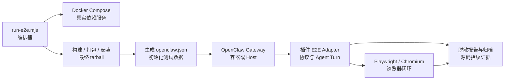

# OpenClaw Plugin E2E

Repeatable end-to-end workflow for validating **installed** OpenClaw plugins against real backing services and the OpenClaw gateway.

## Quick start

```bash
# From openclaw-plugins repo root
pnpm install

# Unit tests only (no Docker) — all extensions
pnpm test:unit

# Unit tests for a subset
pnpm test:unit -- --plugins mqtt,stomp,wecom

# Full queue/channel e2e (Docker + gateway)
pnpm test:e2e

# Host gateway (recommended on Mac)
OPENCLAW_E2E_HOST_GATEWAY=1 pnpm test:e2e

# Combined runner (defaults to unit-only; pass --e2e-only for Docker path)
pnpm test:plugins -- --unit-only --plugins gotify
pnpm test:plugins -- --e2e-only --plugins mqtt,rabbitmq --skip-browser
```

Reports:

- `scripts/e2e/e2e-report.json`：最近一次运行，供 CI 和人工快速读取。
- `scripts/e2e/reports/<timestamp>-<plugins>-<runId>.json`：逐次归档，连续执行隔离插件时不会覆盖前一份证据。

两类报告都执行凭据字段脱敏并保持 gitignored；正式发布证据应由 CI 将 `reports/` 作为构建产物上传，而不是提交运行态文件。

## Architecture

```
┌─────────────────┐     ┌──────────────────────────────────────┐
│  run-e2e.mjs    │────▶│ Docker Compose (backing services)     │
│  orchestrator   │     │ rabbitmq · gotify · rocketmq-*        │
└────────┬────────┘     └──────────────────────────────────────┘
         │
         ├─ build / pack / install plugins → ~/.openclaw-queue-e2e
         ├─ generate openclaw.json (config/plugins/*.mjs)
         ├─ bootstrap data (Gotify tokens, RocketMQ topic)
         │
         ├─ OpenClaw gateway
         │    ├─ container: docker-compose `openclaw` service
         │    └─ host fallback: OPENCLAW_E2E_HOST_GATEWAY=1
         │
         ├─ plugin adapters (plugins/*.mjs) — smoke + protocol checks
         └─ Playwright browser tests (web-mqtt / web-stomp via test-web/)
```

同一架构的 Mermaid 版本用于渲染和节点追踪；字符图用于终端、日志和快速扫读，两者都保留：



## Directory layout

| Path | Purpose |
|------|---------|
| `run-e2e.mjs` | Main orchestrator (`--plugins`, `--keep-services`, …) |
| `docker-compose.yml` | Backing services + optional `openclaw` gateway container |
| `docker/openclaw-entrypoint.sh` | Container gateway startup |
| `lib/` | Shared helpers: compose, install, config, gateway, report, registry |
| `config/plugins/` | Per-plugin OpenClaw config fragments |
| `datasets/` | Sample payloads (text/json) reused by adapters |
| `bootstrap/` | Service setup (Gotify tokens, RocketMQ topic) |
| `plugins/` | Per-plugin E2E test adapters |

## Test pyramid

| Layer | Command | Docker | Scope |
|-------|---------|--------|-------|
| **Unit** | `pnpm test:unit` | No | Vitest per extension — config, mappers, mocks |
| **Standard channel** | `cd extensions/gotify && pnpm test:standard` | Optional | Agent send/wait/reply via `testing/` runner |
| **E2E smoke** | `pnpm test:e2e` | Yes* | Install + gateway + protocol adapters |

\* Embedded channels (mqtt, stomp, web-*) and isolated WebSocket/mTLS/OAuth2 scenarios need the Gateway only; external brokers need compose services.

## Extension inventory

See `scripts/e2e/lib/registry.mjs` → `EXTENSION_INVENTORY` for the full matrix:

- **e2eAdapter: true** — has `scripts/e2e/plugins/<id>.mjs` (27 runtime plugins today; external/security/platform/capability scenarios are explicit and isolated)
- **e2eAdapter: false** — unit tests (+ optional `testing/` standard suite); no Docker e2e yet
- **dockerRequired: true** — rabbitmq, redis-stream, rocketmq, gotify, tracing (OpenTelemetry Collector)

RabbitMQ adapter 使用本地 OpenAI-compatible fixture 跑完整链路：等待 Channel 连接，
confirm 发布入站消息，执行真实 OpenClaw Agent Turn，从 reply queue 校验信封与 routing key，
最后确认 publisher confirm 与 deferred ACK 统计。该场景自动使用 host Gateway，以保证模型 fixture 可达。

Redis Stream adapter 同样执行真实 Agent Turn：向 consumer-group 入站 Stream `XADD`，
从指定 reply Stream 校验 wire envelope 与 reply route，并确认模型调用恰好一次、`XACK` 后 PEL 为空。

### Plugins with e2e adapters (Docker optional per category)

| Plugin | Docker services |
|--------|-----------------|
| mqtt, stomp, web-mqtt, web-stomp | None (embedded / browser)；STOMP 两种传输验证 Agent 回复与 ACK/RECEIPT；Web-MQTT 验证 QoS 1 deferred PUBACK、Agent 回复及 Chromium 闭环 |
| web-socket | None; run explicitly with `--plugins web-socket`; the runner selects the host Gateway for the embedded listener |
| mtls | None; run explicitly with `--plugins mtls` because it switches Gateway auth to trusted-proxy |
| oauth2 | None; run explicitly with `--plugins oauth2`; the runner selects the host Gateway for its local provider fixture |
| douyin | None; isolated signed Webhook challenge/401, real Agent Turn, in-process dedupe, and post-restart persistent dedupe |
| amap | None; isolated tarball Agent Tool call against a loopback AMap v5 fixture, including safe GET retry and result transcript |
| meituan | None; isolated tarball Agent Tool call against a loopback MTOp fixture, including independent SHA-1 verification and no POST retry |
| rednode | None; isolated tarball Agent Tool call against a loopback Ark fixture, including independent MD5 verification and one safe GET retry |
| wechat | None; isolated tarball iLink long-poll → Agent → context-token reply, plus persistent dedupe across Gateway restart |
| wechat-ipad | None; isolated external WS/HTTP bridge fixture → Agent → Bearer reply, plus persistent `msgId` dedupe across Gateway restart; no real WeChat protocol |
| wecom-kf | None; isolated enterprise-WeChat AES callback → `sync_msg` → Agent → `send_msg`, plus cursor recovery and persistent `msgid` dedupe across Gateway restart |
| bridge | None; run with `--plugins bridge,mqtt`; verifies installed tarballs, official inbound/outbound hooks, bounded delivery, two audit topics, and same-MQ loop protection |
| knowledge | None; run explicitly with `--plugins knowledge`; validates tarball API indexing/search, OpenAI-compatible embeddings, real Agent injection, and SQLite recovery after Gateway restart |
| memory, openmem | None; isolated Memory Host runs with a local model fixture; OpenMem additionally starts the workspace sidecar |
| prometheus | None; isolated authenticated scrape, health/RPC, exact-route, and concurrent single-flight checks |
| tracing | otel-collector; run with `--plugins tracing,mqtt`; the runner uses MQTT for a real Agent Turn and exports OTLP/HTTP spans |
| rabbitmq | rabbitmq |
| redis-stream | redis |
| rocketmq | rocketmq-namesrv, broker, init（合法入站/回复 Topic）, proxy；正式 tarball 完成 Producer → Agent → reply Topic → ACK，模型仅调用一次 |
| gotify | gotify；正式 tarball 完成 REST → WebSocket → Agent → retained reply，并验证成功后删除入站与模型单次调用 |

### Unit-only extension

`message-sdk` 是共享开发库，不是可独立加载的运行时插件；其发布门禁由 package exports、消费者契约、
OpenClaw 运行时契约和完整单元测试覆盖。其余 27 个运行时插件均有安装态 E2E adapter。

## Shared test utilities

`test-utils/` (`@partme.ai/openclaw-test-utils`):

- `createRuntimeEnv()` — mock plugin runtime env
- `createMockPluginApi()` — minimal PluginApi
- `channel-fixtures` — mqtt/gotify/stomp config fragments
- `plugin-manifest` — manifest smoke test helper
- `datasets` — re-export `scripts/e2e/datasets/*.json`

## Plugin categories (queue/channel focus)

| Category | Plugins | Backing service |
|----------|---------|-----------------|
| Embedded service | mqtt, stomp, web-mqtt, web-stomp, web-socket | OpenClaw gateway only |
| External broker | rabbitmq, redis-stream, rocketmq, gotify | Docker Compose |
| Security infrastructure | mtls, oauth2 | Isolated certificate or OAuth2 lifecycle + OpenClaw trusted-proxy |
| Webhook/platform | douyin, wechat, wechat-ipad | Signed webhook, iLink long-poll, or external bridge fixture + real Agent Turn |
| Capability | amap, meituan, rednode, knowledge | Local protocol fixture + real Tool/Hook Agent round trip |
| Cross-channel observation | bridge + mqtt | MQTT real Agent Turn + inbound/outbound audit topics |

Future categories (extensible via `lib/registry.mjs` + adapter registration):

- **Web/browser** — Playwright against plugin UI or `test-web/`
- **Webhook/platform** — douyin、wechat、wechat-ipad、wecom-kf、wecom 均有安装态 adapter；真实平台凭据与生产环境验收仍需独立执行

## OpenClaw in Docker vs host

There is **no official OpenClaw image** in this repo. The compose `openclaw` service uses `node:22-bookworm-slim`, mounts the repo + E2E state dir, and runs the CLI from `devDependencies.openclaw` (or `npm install -g` fallback).

**Mac / local dev:** use host gateway when bind mounts or CLI paths are simpler:

```bash
export OPENCLAW_E2E_HOST_GATEWAY=1
export OPENCLAW_BIN="$HOME/.openclaw/extensions/wecom/node_modules/.bin/openclaw"  # if needed
```

**Container gateway:** omit `OPENCLAW_E2E_HOST_GATEWAY`; orchestrator starts `openclaw` via compose after backing services.

Do **not** fake success — if the gateway never listens on `E2E_GATEWAY_PORT`, the run fails.

## Environment variables

| Variable | Default | Description |
|----------|---------|-------------|
| `OPENCLAW_E2E_HOST_GATEWAY` | unset | `1` = run gateway on host |
| `OPENCLAW_BIN` | repo or wecom install | OpenClaw CLI path |
| `OPENCLAW_E2E_STATE_DIR` | `~/.openclaw-queue-e2e` | Profile state |
| `E2E_GATEWAY_PORT` | `19789` | Gateway HTTP port |
| `OPENCLAW_E2E_SKIP_DOCKER` | unset | `1` = skip Docker entirely (broker tests fail unless services already running) |
| `E2E_STOMP_TCP_PORT` | `61613` | stomp-tcp channel port in config/tests |

## Adding a new plugin test adapter

1. Add entry to `lib/registry.mjs` (id, filter, dir, dockerServices, category).
2. Add `config/plugins/<id>.mjs` with `pluginEntry` + `channelEntry` builders.
3. Add `plugins/<id>.mjs` exporting `testXxx(ctx, results)`.
4. Register in `plugins/index.mjs` (`ADAPTERS` map).
5. Optional: dataset under `datasets/` and bootstrap under `bootstrap/`.
6. Run: `node scripts/e2e/run-e2e.mjs --plugins <id>`.

## Secrets & artifacts (gitignored)

See `.gitignore`: `.e2e-secrets.json`, `e2e-report.json`, `reports/`, gateway logs, browser logs.

## Legacy scripts

These remain as thin wrappers; prefer `run-e2e.mjs`:

- `install-plugins.mjs`
- `generate-openclaw-config.mjs`
- `test-installed-plugins.mjs`
- `setup-gotify-tokens.mjs`
- `bootstrap-rocketmq-topic.mjs`

See [TEST_PLAN.md](./TEST_PLAN.md) for layer-by-layer test design.
